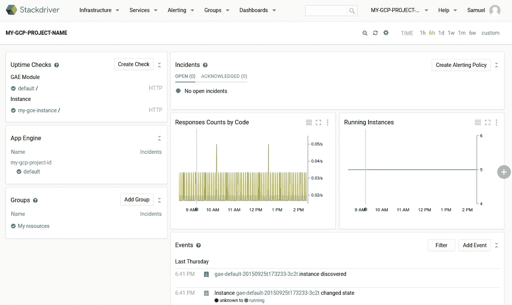

# 谷歌云平台的 a 到 Z 个人精选— M 用于监控

> 原文：<https://medium.com/google-cloud/a-to-z-of-google-cloud-platform-a-personal-selection-m-for-monitoring-385497b56e26?source=collection_archive---------5----------------------->

在本系列的上一篇文章中讨论了[日志](/google-cloud/a-to-z-of-google-cloud-platform-a-personal-selection-l-is-for-logging-230d459976f4#.u0ghfzshr)之后，监控似乎是 M 的自然选择，所以在这里你可以为你的快乐做一点监控。

典型的监控解决方案包括收集指标的方法、查看系统和应用程序状态的仪表板以及发送警报的方法。

首先，让我们简要地看一下自我管理的监控系统通常是什么样子的(我在这里保持它的高水平，因为这不是一个深入探讨自我管理的监控系统的帖子)。

**度量收集/监控框架**:类似于 [Nagios](https://www.nagios.org/) 、 [sensu](https://github.com/sensu/sensu) 、 [logstash](https://www.elastic.co/guide/en/logstash/current/introduction.html) 或 [zabbix](http://www.zabbix.com/) 的东西，用于实际整理所有事件(通常作为日志数据)。有成吨的选择，这些只是我写这篇文章时想到的第一个。

通常，您会在目标系统上安装一个代理或插件，允许来自应用程序和操作系统的事件被推/拉至中央服务器。

**警报:**因此，当您收到这些事件时，您需要对它们做些什么，以允许您对检测到的问题做出反应，甚至调用额外的资源等。关键是您将事件传递给收集器/框架，以便根据收到的数据采取行动。您需要有一种方法，让您的系统对超出您定义的容忍水平的事件做出反应，比如我需要更多资源或哦，糟糕，这是坏消息，请寻求帮助。寻求帮助你需要某种通知系统才能联系到真正的人。电子邮件、[page duty](https://www.pagerduty.com/)、 [hipchat](https://www.hipchat.com/) 、 [slack](https://slack.com/) 或者你知道的老式 IRC 都是向你的员工传达有问题的信息的例子，请他们看看。

图表，图表许多图表可以直观地看到事情是如何进行的，通常通过

**仪表板:**这需要与监控框架集成，例如像 [kibana](https://github.com/elastic/kibana) 这样的解决方案，它通过 elasticsearch 与 Logstash(麋鹿栈)集成。Zabbix 有它的[全球仪表盘](http://www.zabbix.com/global_dashboard.php)，sensu 有它的[企业仪表盘](https://sensuapp.org/docs/latest/enterprise-dashboard-overview)。与监控框架一样，有各种各样的仪表板解决方案可以放在上面。

这是许多活动部件，您必须将它们编织在一起，保持可用并进行管理。如果有操作人员来管理，这可能不是问题。

## 堆栈驱动程序监控

GCP 在 [Stackdriver](https://cloud.google.com/monitoring/docs) 中提供了全面管理的监控解决方案，可提供指标、仪表盘和警报。使用与 GCP 完全集成的&非常容易。

**指标收集/监控框架:**它支持许多 GCP 资源，包括:GAE、GCE、GKE、发布/订阅和云 SQL。此外，您可以查看您的安全规则和 GCS 资源。我特别喜欢这样一个事实，GCS 视图提供了一个关于桶的数量、每个桶中对象的数量以及桶中对象的总大小的单一视图(非常好)。

默认情况下，您从支持的服务中获取核心指标。

然而，如果您安装了可选插件，那么您可以从 GCE 获得额外的指标，并且您还可以从流行应用程序列表中收集指标，查看[文档](https://cloud.google.com/monitoring/agent/)以获得支持的应用程序列表。仅举几个支持 cassandra、kafka 的应用程序，当然还有曾经流行的 Mongodb。此处列出了可用指标的列表[。但是，如果您的特定包不受支持，或者您想从您的应用程序中监控细节，那么您可以创建](https://cloud.google.com/monitoring/support/available-metrics)[自定义指标](https://cloud.google.com/monitoring/custom-metrics/)，您需要使用一个 [API](https://cloud.google.com/monitoring/api/) 。这是一个全面的全托管解决方案。

在堆栈驱动程序监控堆栈的这一部分，我注意到了其他一些东西:

*   [正常运行时间检查](https://cloud.google.com/monitoring/get-started#create_an_uptime_check)允许您通过从世界各地向您的应用程序、服务或 URL 发送请求来检查您的互联网访问系统的健康状况。(与[警报策略](https://www.youtube.com/watch?v=KGlP6m0JbYw&feature=youtu.be)结合使用)
*   轻松集成您的应用程序日志，根据基于[日志的指标](https://cloud.google.com/logging/docs/view/logs_based_metrics)创建警报。
*   如果您使用代理，则以 1 分钟为间隔监视代理度量
*   如果您在 AWS 上有资产，那么您也可以使用堆栈驱动程序[来监控您的 AWS 资产](https://cloud.google.com/monitoring/get-started#monitor_an_aws_account)。这是一个跨越两种云的单一窗口，或者您可以使用 StackDriver 来监控 AWS 资产(我非常喜欢 GCP 采用的开放式方法)

**警报:**您可以创建一组规则来确定您的资源或组是否正常运行。这些是[警报策略](https://cloud.google.com/monitoring/get-started#gs-alerting)。规则是涉及度量阈值和正常运行时间检查的逻辑条件。如果满足警报策略条件，则会触发警报。这将导致事件出现在 Stackdriver monitoring 控制面板的 incidents 部分。

与自我管理解决方案一样，您可以轻松地将 Stackdriver 监控与一系列[通知解决方案](https://cloud.google.com/monitoring/support/notification-options)集成，如 slack、hipchat、pagerduty 等。我喜欢您可以配置它，直接向云监控移动应用程序发送警报，这样您就可以直接从应用程序查看事件，如果需要，您还可以直接从那里进行 ssh。

**仪表板:**您可以创建显示不同类型图表的仪表板。例如，您可以创建一个图表来显示一个或多个指标的时间序列数据，或者您可以聚合几个指标。除了图表之外，您还可以查看事件日志和事件列表

文档中的这张图片让您了解了典型仪表板的样子:

希望 Stackdriver 的短暂游览以及我在本系列的上一篇文章中讨论的关于[日志记录](/google-cloud/a-to-z-of-google-cloud-platform-a-personal-selection-l-is-for-logging-230d459976f4#.u0ghfzshr)功能的讨论能够让您对 GCP 可用的功能有所了解，这意味着您不必安装和维护自己的日志记录&监控系统。