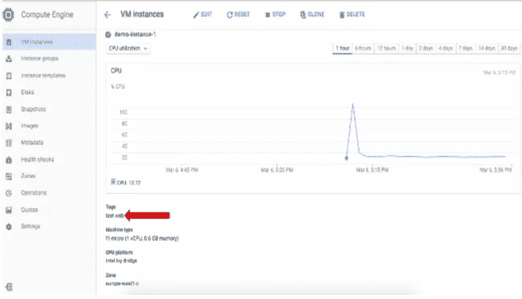
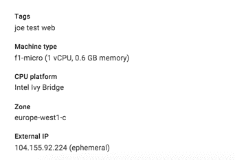

# 谷歌云平台的 a 到 Z 个人选择——N——命名的东西

> 原文：<https://medium.com/google-cloud/a-to-z-of-google-cloud-platform-a-personal-selection-n-naming-stuff-ff5618dcb247?source=collection_archive---------2----------------------->

好吧，我承认我想在这里谈论网络，但我意识到我已经在 [F](/google-cloud/a-to-z-of-google-cloud-platform-a-personal-selection-f-is-for-firewalls-3e45852630c9#.cl6sh42ta) (简单地说是防火墙&子网) [G](/google-cloud/a-to-z-of-google-cloud-platform-a-personal-selection-g-global-load-balancing-82e1b8550298#.aovvdii16) (全局负载平衡)和 [I](/google-cloud/a-to-z-of-google-cloud-platform-a-personal-selection-i-interconnect-9e2f37a77a8c#.kzfnqjqfo) (互连)下讨论了很多这个主题，所以我基本上是在清理这个系列中感觉不合适的东西。

因此，经过深思熟虑，尽管有深入研究神经网络的冲动，我还是坚持“命名东西”

虽然在这篇文章中，我不会谈论命名惯例，但我只是挑选了一些应该有助于你管理 GCP 资源的东西。

首先，不要给你的实例取好听的名字。他们应该被视为短暂的生命，你不应该想拥抱他们。有足够多的帖子在讨论这个问题(宠物和牲畜等等)，所以我不打算在这一点上纠缠。

但是用合理的名称命名某些类别的东西对于可用性和可管理性来说总是一个好主意，而且当设置防火墙规则时，它们也非常方便(我知道我不能远离网络！).数据库、表、列都很明显，所以我将继续。

像实例这样的东西是绝对应该的..只是不是个别的例子！

好的，那么在 GCP，你实际上如何将名称应用到一组事物或资源上，以便你知道那些实例或服务密钥是做什么用的…

先来看**标签**。

为了确定实例的功能、运行环境等，您可能希望在创建实例时添加一个或多个标记，使用-tags 标志作为 gcloud 命令的一部分。例如，以下 gcloud 命令会将标签 test 和 web 添加到实例中:

```
$ gcloud compute instances create demo-instance-1 — machine-type f1-micro — image debian-8 — tags test,web
```

还可以在从控制台创建实例或使用部署管理器时添加标记。创建实例后，您可以从控制台看到与实例相关联的标记



实例启动并运行后，您可以使用 add-tags 标志来添加额外的标记。通过控制台也很容易做到这一点，例如，如果我想将之前创建的实例分配给 Joe，我可以使用以下命令添加一个附加标记，让我知道 Joe 正在使用它:

```
$ gcloud compute instances add-tags demo-instance-1 — tags joe
```



您可以将标记添加到您的[实例模板](https://cloud.google.com/compute/docs/instance-templates#create_an_instance_template)中，这样任何作为自动缩放动作的一部分启动的实例都将被标记。

如果您一直在关注这个系列，您可能还记得我在 [f](/google-cloud/a-to-z-of-google-cloud-platform-a-personal-selection-f-is-for-firewalls-3e45852630c9#.svlpj1es7) 的文章中讨论过如何将标签用于子网和防火墙规则

好的，贴上**标签**。

你说标签和标记有什么区别？你可能会问！以下是医生对什么是[标签](https://cloud.google.com/resource-manager/docs/using-labels)的说法:

*标签实体是一个键:值对，可以附加到项目或虚拟机(VM)上。您过去定义的 VM 标签也将显示为无价值的标签。*

标签可以帮助您组织您的 Google 云平台资源，允许您使用标签对资源进行过滤和分组，例如，识别所有用于测试而非生产的资源。

通过使用资源管理器 api 或控制台来创建标签，可以在项目级别创建标签。

需要注意的关键是，如果您对实例( VM)使用[标签，网络和防火墙不会使用标签，但会识别作为实例标签添加的标签密钥。](https://cloud.google.com/compute/docs/instances/managing-instances#labels_tags)

但是如果说标签的键是作为标签添加到实例中的，那么从技术上来说，你可以使用一个没有值的标签作为标签。我玩了一下这个，长话短说，如果你需要管理防火墙规则，将规则缩小到特定的子网和标签，以帮助你根据你如何组织你的项目过滤项目。

合理命名 [**服务账户**](https://cloud.google.com/iam/docs/using-service-accounts#creating_a_service_account) 。如果你实现了最小特权原则，你知道你应该真正做到。在许多情况下，可以缩小服务帐户的范围，使其只能以所需的权限访问 GCP 资源。因此，指明服务帐户可以访问哪些权限和哪些资源的命名约定将非常有帮助，例如，当创建对您的云存储桶具有读取权限的服务帐户时，为其命名以反映其范围。


最后，我只想介绍一下 [**命名云存储对象**](https://cloud.google.com/storage/docs/naming) 。

*   在整个 Google 云存储名称空间中，每个存储桶都必须有一个唯一的名称
*   存储桶名称只能包含小写字母、数字、破折号(-)、下划线(_)和点(。).包含点的名称需要验证
*   存储桶名称必须以数字或字母开头和结尾
*   存储桶名称必须包含 3 到 63 个字符。包含点的名称最多可包含 222 个字符，但每个点分隔的部分不能超过 63 个字符
*   存储段名称不能用点分十进制表示法表示为 IP 地址(例如，192.168.5.4)
*   存储桶名称不能以“goog”前缀开头
*   存储桶名称不能包含“google”或接近“google”的拼写错误
*   如果创建带有自定义域的存储桶(如 ending。然后域名验证将是该过程的一部分
*   为了 DNS 合规性和未来的兼容性，您不应该使用下划线(_)或让句点与另一个句点或破折号相邻
*   对象命名
*   存储对象的平面命名空间
*   对象名可以包含长度小于 1024 字节的 Unicode 字符(UTF 8 编码)的任意组合
*   通过在对象名称中使用“/”，您可以使对象看起来好像存储在分层结构中。
*   自定义域支持—需要使用 CNAMES。如果使用 CNAME 别名重定向请求，请在 CNAME 记录的主机名部分使用 c.storage.googleapis.com