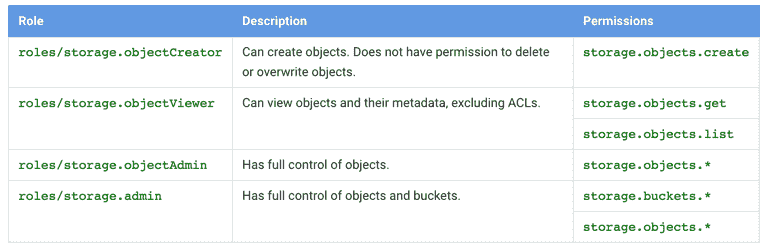

# 谷歌云平台的 a 到 Z 个人选择— O —对象商店

> 原文：<https://medium.com/google-cloud/a-to-z-of-google-cloud-platform-a-personal-selection-o-object-store-2f7cf508780d?source=collection_archive---------3----------------------->

有两个 GCP 的产品，我觉得是基本的基石，因此他们往往得到很少的关注，因为他们只是在那里做他们的规模。

所以在接下来的两篇文章中，我会给他们一点爱，并关注他们。从云存储开始。

云存储(GCS)是 GCP 的对象存储。它被用于如此多的用例，我真的无法给出一个简单的列表。用例范围从存储图片，GCPs awesome 数据产品处理大量数据的来源，作为备份目标，到托管静态网站(我在本系列的 [H](/google-cloud/a-to-z-of-google-cloud-platform-a-personal-selection-h-hosting-static-sites-1d0db2eb5d89#.h5jsivn75) 和 [J](/google-cloud/a-to-z-of-google-cloud-platform-a-personal-selection-j-is-for-jenkins-7a718d1f458#.s3eeear7i) 中介绍过)嗯，任何你能想到的东西，但请不要把它设计成数据库，所以请不要这样做！

文档中有大量关于使用 GCS 的信息，所以我不会像承诺的那样重复！不过，我会拿出一些我觉得你应该知道的东西，让你在几分钟内了解一些基本概念和如何使用 GCS。

## 物体识别/位置:

*   物体被放在称为桶的容器中
*   存储桶可以是多区域的，这意味着它们跨越一个区域内的多个区域位置。还可以在一个区域内的特定地理位置创建存储桶(基本上，它们的范围缩小到比多区域位置更窄的位置，比如美国东部 1 或美国中部 1，而不是美国多区域位置)
*   对象有两个部分:对象数据和对象元数据
*   关于地点的更多信息，请查看[文档](https://cloud.google.com/storage/docs/bucket-locations)

## 限制:

*   您可以在一个项目中创建的存储桶数量没有限制
*   您可以在一个存储桶中创建的对象数量没有限制
*   最大对象大小= 5 TB

## 名称空间考虑因素:

我在之前关于命名的文章中提到过这个问题，但是为了完整起见，如果你只对云存储感兴趣，并且发现自己在这里，我在这里重复了一遍。

*   激活云存储与项目相关联，但是项目名称或 ID 与存储在云存储上的对象的名称空间无关
*   在整个 Google 云存储名称空间中，每个存储桶都必须有一个唯一的名称
*   在整个 Google 云存储名称空间中，每个存储桶都必须有一个唯一的名称
*   存储桶名称只能包含小写字母、数字、破折号(-)、下划线(_)和点(。).包含点的名称需要验证
*   存储桶名称必须以数字或字母开头和结尾
*   存储桶名称必须包含 3 到 63 个字符。包含点的名称最多可包含 222 个字符，但每个点分隔的部分不能超过 63 个字符
*   存储段名称不能用点分十进制表示法表示为 IP 地址(例如，192.168.5.4)
*   存储桶名称不能以“goog”前缀开头
*   存储桶名称不能包含“google”或接近“google”的拼写错误
*   如果创建带有自定义域的存储桶(如 ending。然后域名验证将是该过程的一部分
*   为了 DNS 合规性和未来的兼容性，您不应该使用下划线(_)或让句点与另一个句点或破折号相邻
*   对象命名
*   存储对象的平面命名空间
*   对象名可以包含长度小于 1024 字节的 Unicode 字符(UTF 8 编码)的任意组合
*   通过在对象名称中使用“/”，您可以使对象看起来好像存储在分层结构中。
*   用于访问对象 storage.googleapis.com/yourbucket/yourobject 或 yourbucket.storage.googleapis.com/yourobject 的 URI
*   自定义域支持—需要使用 CNAMES。如果使用 CNAME 别名重定向请求，请在 CNAME 记录的主机名部分使用 c.storage.googleapis.com

## 传输数据:

除了将数据传输到 GCS 的标准方法( [gsutil](https://cloud.google.com/storage/docs/getting-started-gsutil) 和 api 调用)之外，我只想提到两个可能不太为人所知的方法

[云存储传输](https://cloud.google.com/storage/transfer/) —将数据从*数据源*传输到*数据宿*。您的*数据源*可以是 S3 存储桶、HTTP/HTTPS 位置或 GCS 存储桶。您的*数据接收器*(目的地)总是一个 GCS 桶。它使数据源和数据接收器之间的数据传输和同步变得更加容易，因为它允许您轻松地

*   安排一次性转账或定期转账。
*   使用基于文件创建日期、文件名过滤器和您希望导入数据的时间的高级过滤器，计划从数据源到数据接收器的定期同步。
*   转移源对象后将其删除。

[流式传输](https://cloud.google.com/storage/docs/streaming) — GCS 基于 HTTP 分块传输编码，使用 gsutil 工具或 boto 库支持流式传输。

## 存储类别:

云存储有三个[存储类](https://cloud.google.com/storage/docs/storage-classes)。[文档](https://cloud.google.com/storage/docs/storage-classes)有一个很好的表格，概括了两者的不同之处:

## [生命周期管理](https://cloud.google.com/storage/docs/lifecycle):

*   版本控制
*   对象删除策略
*   老化到近线

近线旨在用作归档和备份用例的“近线”存储，因此作为分层存储解决方案的一部分，从标准存储中淘汰过时对象是一种典型配置。

您可以使用存储传输服务创建一个作业，在对象上传到标准存储桶后，按照您指定的时间间隔将数据从标准存储桶传输到近线存储桶。您可以使用[控制台](https://cloud.google.com/storage/transfer/getting-started)或[编程设置](https://cloud.google.com/storage/transfer/create-transfer)

## 安全性:

*   通过访问控制列表[https://cloud.google.com/storage/docs/access-control](https://cloud.google.com/storage/docs/access-control)管理对对象和存储桶的访问
*   签名的 URL
*   自动服务器端加密，谷歌代表你管理加密密钥
*   客户端加密，您管理自己的加密密钥，并在将数据写入 GCS 之前对其进行加密。在这种情况下，你的数据被加密两次，一次用你的密钥，一次用谷歌的密钥
*   日志记录—访问(请求)和存储日志
*   GCS 还支持 [IAM](https://cloud.google.com/storage/docs/iam) ，它允许您控制每个用户在项目级别访问存储桶和对象的能力。我在这里真正喜欢的是，Google 通过将权限捆绑到常见用例的预定义角色(管理角色)中，使事情变得简单。文档中的表格显示了这种情况:

## [对象一致性](https://cloud.google.com/storage/docs/consistency):

*   所有写后读、更新后读和删除后读操作的强全局一致性(注意，如果缓存控制元数据未明确设置为禁用对象缓存，则可以覆盖删除后读)
*   列表操作最终是一致的

## 其他材料:

*   [与 AWS S3 的兼容性](https://cloud.google.com/storage/docs/interoperability) —这真的很好，如果您需要在 AWS S3 和 GCS 之间传输数据，或者需要在多个供应商之间实现多样化，这一点值得注意。该 API 是可互操作的，您只需要为提供者使用适当的密钥，并将 uri 端点改为指向 S3 或 GCS。
*   可恢复上传—适用于上传可能因网络故障而中断的大型对象。
*   您不能嵌套存储桶
*   要以编程方式访问，请使用 GCloud SDK。支持各种语言
*   与其他 GCP 产品紧密集成参见[此处](https://cloud.google.com/storage/docs/google-integration)
*   [对象更改通知](https://cloud.google.com/storage/docs/object-change-notification) —当新对象添加到存储桶、现有对象的内容或元数据被修改或者对象从存储桶中被删除时，发送通知事件。

希望这能让您对 GCS 的灵活性和强大功能有一个很好的了解，以及为什么我将它视为基础构件。

在我离开这篇文章之前，我想感谢我的同事 Karan @sdksb，他帮助我下定决心,“Object store”将是我进入 O。