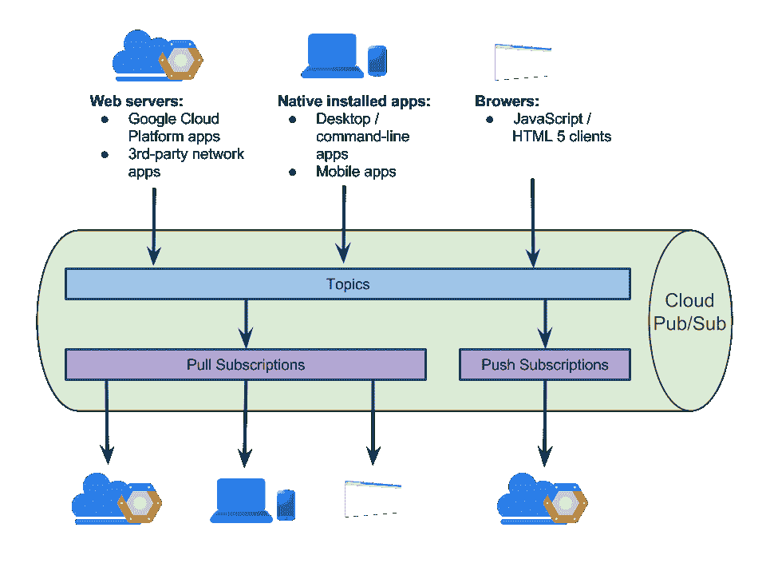
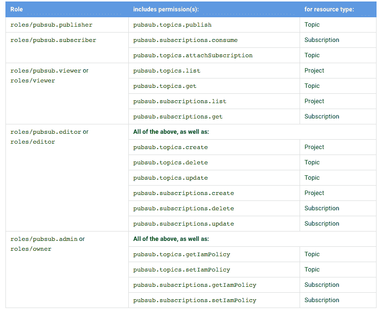

# 谷歌云平台的 a 到 Z 个人精选— P — Pub/Sub

> 原文：<https://medium.com/google-cloud/a-to-z-of-google-cloud-platform-a-personal-selection-p-pub-sub-130538dab6e5?source=collection_archive---------0----------------------->

在上一篇文章中，我谈到了 GCS，我认为它是在 GCP 上构建的任何云原生应用程序的第一个基本构建块。在这篇文章中，我将谈论我认为是第二个基础数据块云发布/订阅

[Pub/Sub](https://cloud.google.com/pubsub/overview) 是一个完全托管的服务，它提供了一种在应用程序之间实现多对多异步消息传递的方法。发布者应用/服务可以向“主题”发送消息，并且其他应用/服务可以订阅该主题以接收消息。通过解耦发送方和接收方，发布/订阅允许开发人员在独立编写的应用程序/服务之间进行通信。它允许创建更有弹性的、真正可伸缩的应用程序。它还提供了一种方法，允许您独立地升级应用程序的各个部分，而不会丢失通过互连整体传递的数据。

我喜欢文档中的这张图片，我觉得它相当简洁地说明了这一点。



它与许多 GCP 产品完全集成，可以作为源或汇。

要使用发布/订阅，您需要使用 oauth 2.0 对发布/订阅 API 进行授权，并设置范围。

下面是 python 示例中的几行代码，演示了如何进行设置:

```
def create_pubsub_client(http=None):credentials = oauth2client.GoogleCredentials.get_application_default()if credentials.create_scoped_required():*credentials = credentials.create_scoped(PUBSUB_SCOPES)**if not http:**http = httplib2.Http()**credentials.authorize(http)**return discovery.build(‘pubsub’, ‘v1’, http=http)*
```

然后，设置发布或订阅功能，从发布/订阅中推送或获取消息。下面是几行示例 python 代码来说明这一点。

```
*import base6**client = create_pubsub_client()**# You need to base64-encode your message.**message1 = base64.b64encode(‘Hello Cloud Pub/Sub!’)**message2 = base64.b64encode(‘We are on the same boat.’)**# Create a POST body for the Pub/Sub request**body = {**‘messages’: [**{‘data’: message1},**{‘data’: message2},**]**}**resp = client.projects().topics().publish(**topic=’projects/myproject/topics/mytopic’, body=body).execute**message_ids = resp.get(‘messageIds’)**if message_ids:**for message_id in message_ids:**# Process each message ID**print message_id*
```

有了[云 IAM](https://cloud.google.com/iam/docs/) 你可以实现粒度级控制。文档中的表格显示了您可以使用 [IAM 和发布/订阅](https://cloud.google.com/pubsub/access_control)设置的控件:



尽管 Pub/Sub 不是一个存储系统，但是如果您确实需要在消息经过初始处理后重放或保留消息，请将它们保存到云存储、Bigtable 或 BigQuery 等地方。

想一想，如果你使用像 Pub/Sub 这样的完全托管服务，管理你自己的消息应用程序的人可以做什么其他有成效的差异化工作。(如果你想从另一个角度了解为什么这是一个好建议，请参阅为什么 Spotify 选择从 kafka 迁移到 Pub/Sub)

最后，我想讨论一下 FIFO(先进先出)。Pub/Sub 不保证订阅者接收消息的顺序，所以此时您可能会想，真的吗？或许你不是。大规模 FIFO 是真正可扩展的分布式系统的反模式，因此 FIFO 不是 Pub/Sub 的东西，但如果你需要这样做，请在离开之前等待一分钟，而不是像 RabbitMQ 或 kafka 那样给自己的系统喂食和浇水。停下来想一想，并阅读 [this](https://cloud.google.com/pubsub/ordering) ，它提供了通过 Pub/Sub 实现这一点的策略，但它也给你提供了关于你是否真的需要 FIFO 的思考资料。

在我离开之前，我想我应该向[数据流](https://cloud.google.com/dataflow/what-is-google-cloud-dataflow)团队的弗朗西斯·佩里[@弗朗西斯·佩里](https://twitter.com/francesjperry)道歉，因为即使在 GCP Next &被搭讪后，有人向我指出 D 代表数据流(我写了关于部署管理器的文章)，B 代表 Apache Beam(我写了关于 BigTable 的历史):-)我不得不谈论数据流的下一个借口我猜应该在这里(管道、PCollections、ParDo、 [python 支持](https://cloud.google.com/blog/big-data/2016/03/google-announces-cloud-dataflow-with-python-support))。我承认这本来是可行的，但我仍然没有成功！

在我看来，这个酒吧/Sub 帖子一直在等待发布！但是，如果你也想在这个系列中看到一些关于数据流的东西，为什么不看看这个来自 Frances 的精彩演讲呢？我有一些真正尴尬的信件要处理，但不确定我能适应数据流，所以这是我的脱身条款:-)