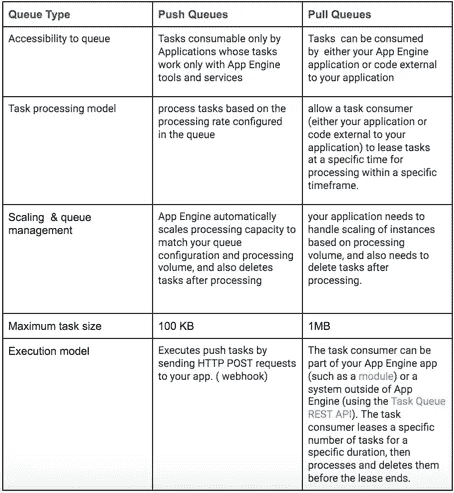

# 谷歌云平台的 a 到 Z 个人选择— Q —队列

> 原文：<https://medium.com/google-cloud/a-to-z-of-google-cloud-platform-a-personal-selection-q-queues-4f2220e5c80d?source=collection_archive---------0----------------------->

自从我谈到 App Engine 已经有一段时间了，我只想简单地谈谈它的[任务队列特性](https://cloud.google.com/appengine/docs/python/taskqueue/)。

任务队列旨在允许您的 App Engine 应用程序执行后台已知的小型作业或任务。使用任务队列，您的应用程序定义任务，将它们添加到一个队列中，然后使用该队列对它们进行汇总处理。

App Engine 的标准环境提供了两种类型的任务队列 Push 和 Pull 队列。以下是直接从文档中摘录的描述:

*   推送队列根据队列定义中配置的处理速率来处理任务。App Engine 标准环境会自动扩展处理能力，以匹配您的队列配置和处理量，并在处理后删除任务。推送队列是默认队列。
*   拉队列允许任务消费者(您的应用程序或应用程序外部的代码)在特定的时间租用任务，以便在特定的时间范围内进行处理。拉队列让您可以更好地控制任务的处理时间，还允许您使用任务队列 REST API 将应用程序与非应用引擎代码集成在一起。当使用拉队列时，您的应用程序需要根据处理量来处理实例的伸缩，还需要在处理后删除任务。

文档中定义的[任务](https://cloud.google.com/appengine/docs/python/taskqueue/#Python_Task_concepts)是由应用程序执行的工作单元。每个任务都是[任务](https://cloud.google.com/appengine/docs/python/taskqueue/tasks)类的一个对象。每个任务对象都包含一个端点(带有任务的请求处理程序和参数化任务的可选数据有效负载)。

我们可以使用推送队列的一个示例应用程序可以是您的应用程序接受各种时事通讯的注册。该任务的数据有效负载包括姓名、电子邮件地址和要订阅的时事通讯。webhook 可能位于/app _ worker/register _ subscriber，并包含一个将订阅详细信息添加到数据存储的函数。该应用程序可以为它收到的每个订户创建一个单独的任务。

下表以易于理解的格式提供了队列类型的比较

我认为，在决定是需要拉队列还是推队列时，有效负载的大小和队列是否需要在 App Engine 之外可访问将是首先要考虑的两个决策点。