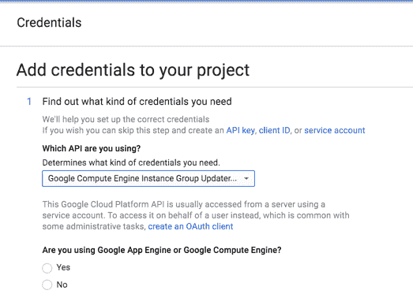
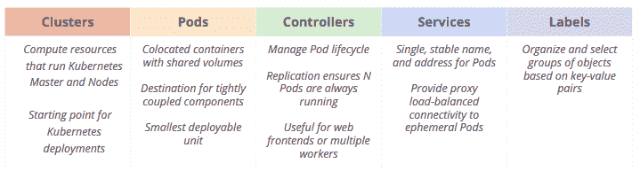
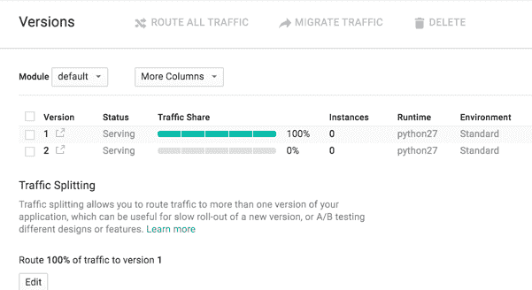
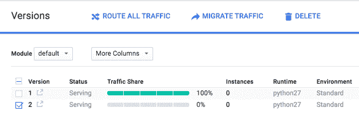

# 谷歌云平台的 a 到 Z 个人精选— R —滚动更新

> 原文：<https://medium.com/google-cloud/a-to-z-of-google-cloud-platform-a-personal-selection-r-rolling-updates-fb6634c5f400?source=collection_archive---------0----------------------->

我将讲述如何在 GCP 计算产品上实现应用程序的滚动更新。

在此之前，我只想确保我们在我所说的滚动更新的意思上是一致的。

我所说的滚动更新是指在几乎没有停机时间的情况下发布新版本软件的能力。当推出新版本时，软件的先前版本被推出，直到单步更新过程结束，只有软件的新版本在运行。除了推出更新之外，您还必须能够暂停推出，并在需要时回滚。如果你没有能力从垃圾部署中恢复，那么这是一条单行道！

对应用程序进行更新的另一种方法是 canary 发布。在 canary 版本中，你可以在发布现有版本的同时发布新版本，但是无论你在新版本和旧版本并行运行后做出什么决定，你都不只是继续推出更新，而是在一段时间内停止更新过程。如果新版本变得有点糟糕，你最终会完全或不完全切换到新版本。看一看[这里](http://martinfowler.com/bliki/CanaryRelease.html)的金丝雀释放的一个很好的演练。

我不打算讨论每种方法的利弊，尽管我觉得那样会让这篇文章偏离主题。所以从现在开始:-)

## 使用 GCE 滚动更新

我将在这里讨论的内容假设您为每个新版本“烘焙”了新的定制图像。

GCP 有一个很棒的[解决方案&教程](https://cloud.google.com/solutions/automated-build-images-with-jenkins-kubernetes)(感谢@evandbrown)使用 Jenkins、packer 和 kubernetes 创建“烘焙”图像。因此，如果你有兴趣了解如何建立一个 CI/CD 系统来烘焙/创建你自己的定制图像，这绝对值得一读。

我知道你可以使用一个配置管理工具在你的车队中推出应用程序级更新，但是通过将实例视为不可变的，你可以很容易地利用使用[管理的实例组](https://cloud.google.com/compute/docs/instance-groups/#create_managed_group)来实现滚动更新。

托管实例组使用[实例模板](https://cloud.google.com/compute/docs/instance-templates)来定义组中每个实例的属性。

您可以在创建实例的常规请求中定义的任何设置都可以在实例模板中描述，包括任何实例元数据、启动脚本、持久性磁盘、服务帐户等。

通过在[滚动更新](https://cloud.google.com/compute/docs/instance-groups/#starting_an_update)中指定一个新模板，您可以轻松地更新组中的所有实例。

要开始滚动更新，您需要遵循下面概述的步骤(详细步骤请参见[文档](https://cloud.google.com/compute/docs/instance-groups/#starting_an_update))。本高级演练假设您已经有一批通过托管实例组定义和管理的实例。

1.  请求进入[滚动更新功能](https://docs.google.com/forms/d/1zQa29jRJTDX_1A3_L7QHdeh6sRd8Z21HIqLSLb7RCrk/viewform)
2.  启用实例组更新程序 API，您将看到此屏幕



因为我们使用 GCE，所以您不需要创建任何其他凭证，并且您可以开始使用 API

3.使用更新的属性创建新模板。因此，假设您已经创建了一个新图像，您可以将该图像的名称添加到模板中

4.使用 gcloud 命令或 [API](https://cloud.google.com/compute/docs/instance-groups/updater/v1beta1/rollingUpdates) 开始更新。您可以通过传递想要的值来更改默认值。

下面列出了您可以更改的可选标志。它们给你一个很好的指示，告诉你如何控制更新，并满足我的要求，能够放弃推出。

— max-num-concurrent-instances，它定义了同时更新的实例数量。

— instance-startup-timeout，定义应用更新后更新等待实例启动的最大秒数。如果实例没有在时间限制之前启动，更新程序会将更新记录为失败。

— min-instance-update-time，定义更新程序更新每个实例所用的最小秒数。更新程序仅在当前更新完成且花费的更新时间最短时才开始下一次更新。

— max-num-failed-instances，它定义在更新程序将整个组更新记录为失败之前，可以失败的最大实例更新数。

—实例后自动暂停，指示更新特定数量的实例后自动暂停更新。暂停之后，你可以决定是[取消](https://cloud.google.com/compute/docs/instance-groups/#cancelrollingupdate)还是[继续](https://cloud.google.com/compute/docs/instance-groups/#continuerollingupdate)更新。

启动滚动更新的默认 gcloud 命令如下所示:

```
gcloud alpha compute rolling-updates start \

--group example-group \
--template example-template \
--zone us-central1-f
```

您可以传递上面列出的可选标志来覆盖 gcloud 命令的默认值。

滚动更新可以应用于所有实例组，无论它们是否启用了[自动缩放](https://cloud.google.com/compute/docs/autoscaler/)。查看[文档](https://cloud.google.com/compute/docs/instance-groups/#rollingupdateandautoscaler)了解自动缩放托管实例组和滚动更新如何交互的详细信息。

## 与 GKE 滚动更新

GKE (Google Container Engine)是 GCP 完全托管的 kubernetes 服务，因此当我们谈论如何实现滚动更新时，我们谈论的是如何更新您在 kubernetes 集群上运行的应用程序或组件。当我谈论 GCP 时，我指的是 GKE，但我描述的关于 GKE 滚动更新的大部分内容实际上是指 k8s(kubernetes 的缩写)

下表描述了 Kubernetes 的概念



您的应用程序容器被部署到一个 pod。

容器绝对应该被视为不可变的。是的，我没有进入辩论，没有让你做决定，只是陈述，并把它留在这里！这意味着当您更新应用程序或微服务组件时，您将创建一个新的容器映像。

滚动更新过程基本上是用更新的容器替换正在运行的容器。

有两种方法可以通过复制控制器或通过部署来管理您的应用程序，因此根据您选择的配置，滚动更新过程会略有不同。使用部署应该是所使用的方法，所以这就是我将要谈论的。

那么什么是部署呢？你可能会问。[部署](http://kubernetes.io/docs/user-guide/deployments/)为[容器](http://kubernetes.io/docs/user-guide/pods/)和[副本集](http://kubernetes.io/docs/user-guide/replicasets/)(下一代复制控制器)提供声明性更新。您只需要在一个部署对象中描述期望的状态，部署控制器就会以可控的速度为您将实际状态更改为期望的状态。(GKE 管理的 k8s 版本支持)

kubernetes 文档会向您详细介绍什么是部署以及如何使用，所以我不会重复。

下面是一个名为 webapp-deployment.yaml 的示例部署 yaml 文件

```
apiVersion: extensions/v1beta1kind: Deploymentmetadata:name: webapp-deploymentspec:replicas: 3template:metadata:labels:app: mywebappspec:containers:- name: mywebappimage: mywebapp:1.0.1ports:- containerPort: 80
```

它用于部署一个名为 mywebapp 的映像，该映像的版本是 1.0.1，并且将打开 mywebapp 的 3 个 pod

因此，让我们假设您已经有了一个 [GKE 集群并正在运行](https://cloud.google.com/container-engine/docs/clusters/operations#creating_a_container_cluster)，并且已经部署了这个版本(参见[文档](http://kubernetes.io/docs/user-guide/deployments/#creating-a-deployment)了解如何部署到正在运行的集群)

要对您的应用程序实施滚动更新，以下是所需步骤的总结:

1.  创建一个包含您的更新应用程序或微服务的新容器映像，并将其推送到您的映像存储库中
2.  使用上面的例子，我们将把我们的容器映像 my-app 从 1.0.1 更新到 2.0.0
3.  然后，您可以执行以下两项操作之一来执行更新:
4.  创建一个名为 new-webapp-deployment.yaml 的新部署 yaml 文件，该文件将 image: my-app:1.0.1 修改为 my-app:2.0.0
5.  通过运行以下命令来部署部署:

```
$ kubectl apply -f my-folder/new-webapp-deployment.yaml
deployment “webapp-deployment” configured
```

或者，您可以使用 kubectl edit 直接编辑部署(注意，除非您想在 vi 中找到自己，然后确保您设置了 KUBE 编辑器或编辑器环境变量)。编辑部署并更改**. spec . template . spec . containers[0]。图片**从 **mywebapp:1.0.1** 到 **mywebapp:2.0.0**

```
$ kubectl edit deployment/webapp-deployment
deployment “webapp-deployment” edited
```

这执行了一个[滚动更新](http://kubernetes.io/docs/user-guide/deployments/#rolling-update-deployment)。如果您按照 GKE/K8s 文档中的 hello world 示例进行操作，就可以看到这一点。特别要注意的是，它不会破坏所有运行旧版本的 pod，而是保持一些运行，直到有一些新的 pod 运行更新的应用程序。不过真正巧妙的是，使用**. spec . strategy . type = = rolling update**可以指定 **maxUnavailable** 和 **maxSurge** 来控制滚动更新过程。[文档](http://kubernetes.io/docs/user-guide/deployments/#rolling-update-deployment)对此有很好的解释

为了满足我的滚动更新标准，您必须能够回滚到以前的版本，GKE / k8s 允许通过实现方法 **.spec.rollbackTo** 和**. spec . roll back to . revision**或使用 kubectl 命令:**kube CTL rollout undo deployment**来实现这一点，因此在我们的示例中，要使用 [kubectl rollout](http://kubernetes.io/docs/user-guide/kubectl/kubectl_rollout/) 命令回滚到 my-app 的以前版本，我们将使用:

```
$ kubectl rollout undo webapp-deployment
```

您也可以回滚到特定版本。

## 与 GAE 滚动更新

GAE 是需要最少客户配置和管理的计算目标，您会认为它是进行滚动部署的最直接方式，您这样想是对的。

GAE 允许你上传不同版本的应用程序并切换到那个版本。你也可以分流流量，但这不符合我对滚动更新的定义。

App engine 默认从你应用的默认版本提供流量(我知道说一句笨拙的话！) .你可以上传一个新版本，这将不会提供任何流量，直到你切换到你刚刚上传的新版本

使用 python 和 App Engine 标准来阐述这个公认的简短描述。

GCP 提供了一个名为 appcfg.py 的工具，用于上传你的 python 应用程序的新版本(GO 也使用这个工具，但是 Java 使用 maven，所以检查语言特定的文档)

您的第一次部署会自动成为默认部署，并为 100%的流量提供服务。

使用 appcfg.py 来[上传](https://cloud.google.com/appengine/docs/python/tools/uploadinganapp)您的新版本，然后您将在控制台中看到您现在有了应用程序的两个版本



通过选中版本 2 旁边的复选框，您可以路由所有或部分流量，或将所有流量迁移到此版本。要实施滚动部署，请选择[迁移流量](https://cloud.google.com/appengine/docs/python/console/#traffic-migration)。迁移需要很短的时间(可能几分钟)，确切的时间间隔取决于应用程序接收的流量和运行的实例数量。迁移完成后，新版本将接收 100%的流量。

使用流量迁移时，您应该使用[预热请求](https://cloud.google.com/appengine/docs/python/config/appconfig#Python_Warmup_requests)在任何实时请求到达新实例之前将应用程序代码加载到该实例中，从而在您切换到新版本时帮助您的用户减少请求延迟



你可以加载 10 个不同的版本，并轻松地切换到其中任何一个。

*请注意，我描述的流量迁移功能仅在 App Engine 标准环境中可用*

应用引擎灵活环境的行为略有不同，因为当您创建新版本的应用时，您会创建一个新的 Docker 容器，并使用 [gcloud app deploy](https://cloud.google.com/sdk/gcloud/reference/preview/app/deploy) 命令自动构建 Docker 容器并将流量切换到这个新版本。

您可以通过使用-no-promote 标志来覆盖这种默认行为