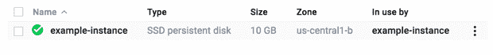

# 谷歌云平台的 a 到 Z 个人精选— U —唯一性

> 原文：<https://medium.com/google-cloud/a-to-z-of-google-cloud-platform-a-personal-selection-u-uniqueness-974cd289f305?source=collection_archive---------1----------------------->

这是这个系列中又一个有点奇怪的帖子(至少在下一个帖子中会恢复正常服务，但是至少可以说这些剩余的信件是有挑战性的！)

能够“真正”拥有大规模运行的应用身份需要进行抽象，这样，作为云规模服务的消费者，您实际上并不关心。仅仅因为你不关心那些身份，并不意味着你使用的服务不关心！

所以说，显而易见的是，每样东西都有某种同一性，是的，即使是我反复提到的那些例子，你也不应该在意(谷歌牛和宠物，我不会直接添加到关于这个概念的数百个帖子中)

在这篇文章中，我将首先关注 GCE，并探索**独特性**及其对你的意义(是的，我要说出来！)在一个云原生世界。然后，我将讨论在 GCP 以微服务为导向的世界中的独特性。

因此，一个实例被启动，并被赋予多个标识符，这些标识符共同允许您或作为其前端的服务来识别它(例如名称、IP 地址)。让我们快速看一下我已经开始的一个例子。如果你刚到 GCP，那么看看文档，看看如何[启动实例](https://cloud.google.com/compute/docs/instances/create-start-instance)。

如果您查看控制台，您将看到一些基本的细节，可以说，这些细节允许您将实例标识为一个个体！


您也可以使用 gcloud instances describe 命令:

因此，在我使用实例 example-instance 的示例中，命令如下所示

```
$ gcloud compute instances describe example-instance
```

你可以看到更多的细节


如果实例是托管实例组的一部分，您个人不会在意，但使用这些托管实例的负载平衡器会在意，毕竟它需要知道哪些实例是健康的，以及将流量定向到哪里。

你能想象在一个所有人都被称为“乔·布朗”的会议中，没有人有任何便于识别的昵称吗？(对不起乔你知道你是谁！)

磁盘也有一个身份，也有一个名称。在我的例子中，我只有启动盘，它默认为使用它的实例的名称。在控制台上看起来是这样的



这很好，但是操作系统需要可以使用的标识符。

如果我 ssh 到实例上并执行 fdsik -l，您可以看到磁盘上的操作系统信息。请注意，除了在格式化和挂载磁盘时，操作系统不会使用您使用 gcloud 命令或控制台为磁盘指定的名称。


阅读这里关于创建[持久磁盘](https://cloud.google.com/compute/docs/disks/add-persistent-disk)的文档，了解如何创建额外的磁盘以及如何让操作系统看到它的细节。

快照也是独一无二的，也需要命名。参见[文档](https://cloud.google.com/compute/docs/disks/create-snapshots)

好吧，我能听到你，所以我们明白，但我为什么要关心。如果您使用[管理的实例组](https://cloud.google.com/compute/docs/instance-groups/#create_managed_group)运行真正不可变的配置，并且您的实例是短暂的，那么您不必真的担心单个实例(是的，是的，我知道故障排除等，但在本文的上下文中，这是一个公平的陈述)，但您确实需要知道实例组的身份/名称，以便您可以自动伸缩，并允许该组中的实例由负载平衡器处理。

## 服务注册中心

如果您或您的应用程序确实需要直接关心实例身份，那么使用服务注册中心或中央索引，实例和应用程序可以自行注册，如果它们不再存在，也可以被删除。您的应用程序应该使用注册表来查找它们需要使用的实例和/或服务。

随着微服务的出现，这突然增加了您需要跟踪的独特服务和实例的数量，并且不可避免地，您需要考虑使用服务注册。

服务注册中心的一个常见例子是 DNS 服务器。例如，如果您使用 windows，那么您将使用 DNS 来允许发现域控制器。

在继续之前，我想介绍一下 GCP 实时迁移计算解决方案中我最喜欢的一个功能

在这种情况下，需要设置域控制器和 DNS 身份，并让其他具有临时实例的机器知道，这实际上是行不通的，因此您可以利用 GCP 的实时迁移来帮助您维护该身份。[这篇来自 2015 年 3 月的](https://cloudplatform.googleblog.com/2015/03/Google-Compute-Engine-uses-Live-Migration-technology-to-service-infrastructure-without-application-downtime.html)博文很好地概述了实时迁移的工作原理。

DNS 可以说是最受欢迎的注册服务，如果你正在阅读这篇文章，你是利用它来到这里的。

我还想提一下其他三个服务注册中心，排名不分先后。我不会花任何时间去比较和对比他们每一个人(互联网已经在这方面做得很好了)。最终，它们提供了一种注册和注销服务端点的动态方法，其他应用程序可以查找和使用这些端点。

Zookeeper — ZooKeeper 允许分布式进程通过一个共享的层级名称空间相互协调，该名称空间的组织方式类似于标准文件系统。名称空间由数据寄存器组成——用 ZooKeeper 的说法叫做 z nodes——这些类似于文件和目录。Stackdriver 有一个[动物园管理员插件。@vicnastea 讨论用](https://cloud.google.com/monitoring/agent/plugins/zookeeper)[动物园管理员与参展商](https://cloudplatform.googleblog.com/2016/04/taming-the-herd-using-Zookeeper-and-Exhibitor-on-Google-Container-Engine.html) r 整合 GKE

[Consul](https://www.consul.io/) — Consul 客户端运行在集群中的每个节点上。这些客户端是提供多种功能的[八卦池](https://www.consul.io/docs/internals/gossip.html)的一部分，包括分布式健康检查。。可以很容易地在 GCP 上运行，这篇关于在计算引擎上使用 HAProxy 和 Consul 的文章对在 GCP 上配置和使用 Consul 进行了很好的演练

e [tcd](https://github.com/coreos/etcd/) 可通过 HTTP 访问的键/值存储。它是分布式的，具有可用于构建服务发现的分层配置系统。它由 [Kubernetes](http://kubernetes.io/docs/admin/etcd/) 使用

它们的核心都有一个[共识协议](https://en.wikipedia.org/wiki/Consensus_(computer_science))来提供[一致性](https://en.wikipedia.org/wiki/CAP_theorem)

对于那些对这些注册管理机构使用的共识性模型理论感兴趣的人，这里有一些起点:

[Paxos](http://research.microsoft.com/en-us/um/people/lamport/pubs/paxos-simple.pdf)——不了解 Pax OS 你就无法开始钻研共识，所以我建议从这里的[开始](http://harry.me/blog/2014/12/27/neat-algorithms-paxos/)，它有一个出色的可视化来帮助解释它是如何工作的。这两种 zab &木筏都可以追溯到 paxos。T [他来自谷歌的](http://static.googleusercontent.com/media/research.google.com/en//archive/paxos_made_live.pdf)论文描述了他们在实现 paxos 时遇到的一些挑战(这多少说明了为什么 Raft 至少成为了一件东西),这是一篇好文章

[Raft](https://raft.github.io/) 是 etcd 和 consul 用的型号

Zab 是动物园管理员使用的模型