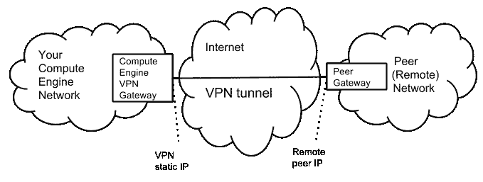
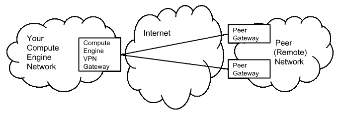
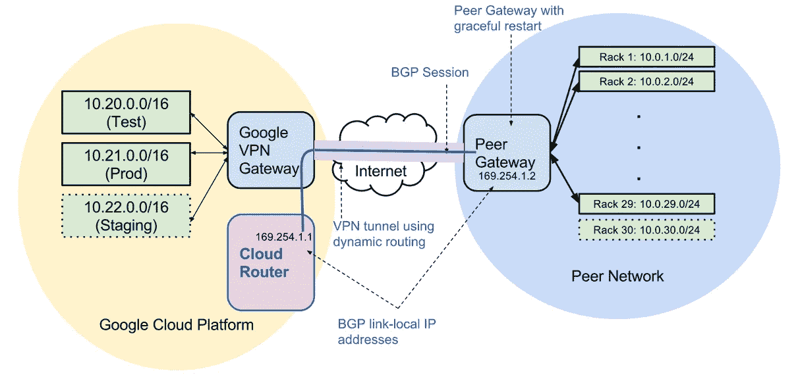

# 谷歌云平台的 a 到 Z 个人精选—V—VPN

> 原文：<https://medium.com/google-cloud/a-to-z-of-google-cloud-platform-a-personal-selection-v-vpns-a8ba8471f37b?source=collection_archive---------0----------------------->

在别人说什么之前，我知道我又回到了网络中:-)！

能够从您自己的网络安全地访问您的 GCP 资源是一个常见的要求，要做到这一点，您通常会在您的场所(从现在开始，我将把这一端称为本地)和 GCP 之间设置一个 VPN。

GCP 提供[云 VPN](https://cloud.google.com/compute/docs/vpn/overview) ，允许你建立[IPsec](https://wikipedia.org/wiki/IPsec)VPN 连接。在两个网络之间传输的流量由一个 VPN 网关加密，然后由另一个 VPN 网关解密

以及将您的网络连接到 GCP 网络。你还可以使用云 VPN 将不同地区的 [GCP 网络](https://cloud.google.com/compute/docs/networks-and-firewalls#networks)连接在一起。

我不打算详述配置 VPN 的细节和您可以拥有的排列，因为文档已经清楚地列出，请参见[此处的](https://cloud.google.com/compute/docs/vpn/creating-vpns)了解详细的设置说明，但在较高层次上，步骤如下:

1.  确定您的 GCP 网络配置，即哪个区域、多少个子网。
2.  决定您需要多少个隧道(如果您确实需要一个以上的隧道(通常用于冗余，请注意，额外的隧道必须指向不同的本地网关。)
3.  确保您有本地硬件网关的详细信息
4.  创建 GCP VPN 网关
5.  设置防火墙规则
6.  设置您的本地网关详细信息(对等方)

下面是两个直接来自文档的示例图，展示了云 VPN 配置的样子。简单的 1:1 设置和具有冗余通道的设置。

好吧，一切都很简单(如果你对网络感兴趣的话！)但在结束这个话题之前，我只想提一下[云路由器](https://cloud.google.com/compute/docs/cloudrouter)。

云路由器支持 Google 云平台网络和内部网络之间的动态[边界网关协议(BGP)](https://www.wikipedia.org/wiki/Border_Gateway_Protocol) 路由更新。为什么这很酷？很好地解释了直接来自文件的好处:

*   启用动态路由 VPN。动态路由意味着您不需要手动创建和删除与隧道两端的网络配置变化相对应的静态路由
*   消除了为 VPN 隧道配置静态路由的需要。实际上，使用 BGP 的动态路由提供了一种自动、快速和可互操作的方式来发现网络拓扑变化。
*   无需在拓扑变化时重启 VPN 隧道。因此，云路由器可以实现无缝的网络拓扑变化，而不会造成流量中断。

从文档中截取的下图显示了使用云路由器的 VPN 配置的典型情况:

