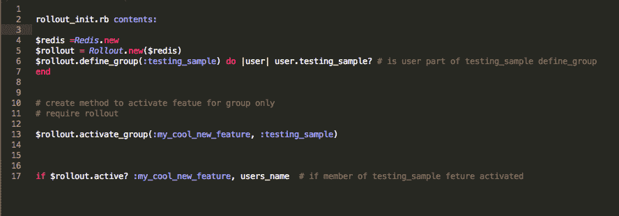
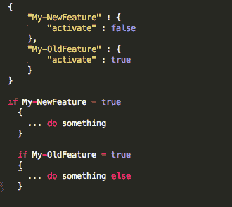

# 谷歌云平台 a 到 Z 个人精选— W — Wrappers

> 原文：<https://medium.com/google-cloud/a-to-z-of-google-cloud-platform-a-personal-selection-w-wrappers-f5618cbce672?source=collection_archive---------1----------------------->

另一个奇怪的，但拜托，是“w”。我为我得到“u”的想法的同一个地方摘下这个！

好吧，我一直听说锁定，很多时候这通常不是一个理性的讨论，因为在这个过程中，他们已经在使用一些“锁定”他们的东西，他们只是下意识地不承认这个事实。选择一个特定的数据库系统？你有，不是吗？利用了那个漂亮的存储过程，哦，想使用另一个数据存储吗？锁在里面是怎么回事？…你明白我的意思了吧！

你绝对不应该害怕使用最好的工具来工作，是的，如果你能得到一个托管服务，拥抱它，因为当你的提供商在照顾螺母和螺栓，你专注于这个可怕的应用程序，你想进入市场！

保持最小公分母真的是一个糟糕的选择。

即使我没有说服你“锁定”是你已经在做的事情，它不是一件真正的事情，但你仍然绝对相信“锁定”是你真正需要担心的事情。

你仍然可以利用更高级别的托管服务，使用像 GCP 这样的云提供商，让你更快地进入市场，同时仍然给你一个退出条款。

让我们首先讨论数据和以数据为中心的产品。不要再担心没有使用您的提供商提供的最佳产品。在 GCP，这可能是一个大问题，因为它的优势超过了你在其他地方能做的任何事情。我不打算在 BigQuery 上花费更多的时间，因为有很多关于它有多棒的独立评估，我不需要再重复这些陈词滥调了(不用说我是一个超级粉丝)。

不管怎样，GCP 是非常开放的，例如，如果你使用 Bigtable，你可以使用我在本系列的 [b](/google-cloud/a-to-z-of-google-cloud-platform-a-personal-selection-b-is-for-bigtable-87fbe9630f0d#.l5fvoqw1e) 中提到的 Bigtable hbase api。谷歌开源了 [Apache beam](http://beam.incubator.apache.org/) 即[数据流的 GCP 托管服务。](https://cloud.google.com/dataflow/)所以继续使用数据流吧，它也很棒，如果你真的需要在其他地方运行相同的数据处理管道，你可以选择使用 Apache beam。

关于数据的事情是你如何移动它，以及你可以把它存储在哪里。解决这种锁定的简单方法是定期将数据导出为高度可移植的平面格式，如 CSV、XML 或 JSON，并将其存储在云存储中。这种方法将提供最大的灵活性，允许您将数据导入到您选择使用的任何数据库系统中。

你甚至不需要导出，因为有很多工具可以在你需要的时候帮助你将数据从一种数据格式转换成另一种格式。

所以我要说的是，无论何种格式的数据存储和处理都不是您应该警惕的锁定因素(假设您仍然担心这种情况)。

我有时听到一些关于如何与提供者 API 接口的问题，比如说，不使用 Pub/Sub(如果你读了 [p](/google-cloud/a-to-z-of-google-cloud-platform-a-personal-selection-p-pub-sub-130538dab6e5#.zwh4pt6w0) 你就会知道我也喜欢这个服务)回避策略意味着他们仍然在 GCE 上做繁重的管理队列/消息服务的工作，而不是使用托管服务。数据只是通过一个排队/消息传递系统传递，所以花费所有精力来管理自己的服务真的值得吗？如果你仍然想抽象，那么在调用周围放一个[包装器](https://en.wikipedia.org/wiki/Wrapper_function)(我打赌你想知道我什么时候会用到包装器:-)。

您可以使用的另一项技术是特性标志，这样您就可以对 api 进行本机调用。功能标志通常用于以下情况:

*   允许你编写一个新的特性，但是在你准备好之前，不要让它真正投入使用。
*   敏捷无阻塞开发时间:-)
*   为您的用户群样本启用一个功能
*   滚动更新

您还可以轻松地使用特性标志将本机调用指向提供商的特定 API，比如说您有一个多云策略或正在进行迁移，这是指向正确环境的一种简洁方式。

特性标志基本上只是布尔值，可以像 switch 语句一样简单，也可以在配置文件或像 redis 这样的键值存储中保存实际值。

有适用于各种语言的框架

比如 togglz java，rollout ruby，

以及一个简单的 switch 语句示例:

开源是谷歌的基因，我已经提到了一些 GCP 已经开源的服务:Apache Beam/ Dataflow 和带有 Hbase 客户端的 Bigtable，如果我不提及其他几个已经开源的服务，即 Kubernetes/GKE 和[tensor flow](https://www.tensorflow.org/)/[Cloud ML](https://cloud.google.com/ml/)(目前在 alpha 中)，那将是我的失职

所以总结一下:

*   回避具体特征——不好
*   使用功能标志
*   用包装纸包起来
*   开源——在谷歌的 DNA 中