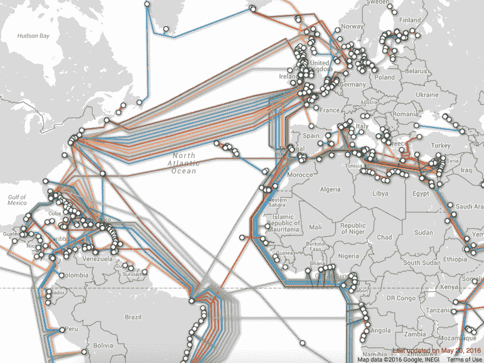
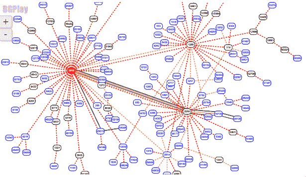

# 谷歌云平台 a 到 Z 个人选择——x-'外部因素

> 原文：<https://medium.com/google-cloud/a-to-z-of-google-cloud-platform-a-personal-selection-x-xternal-factors-3a1f7c0dded8?source=collection_archive---------0----------------------->

好吧，我承认我稍微曲解了这些规则，但是它的发音就像是 [this](http://dictionary.cambridge.org/pronunciation/english/external) See "xternal "好吧，不要用那个借口。

使用 GCP 使您可以扩展并被来自世界各地的数百万用户访问，但 GCP 不对其基础设施之外的因素负责。

简单地说，要通过互联网进行通信，你需要一个源地址和目的地址，以及一种从源地址到目的地址的方法。

这种交流涉及到终端用户设备、你开发的应用程序、TCP/IP(我也在这里[发布过这个](/@grapesfrog/why-the-world-is-still-connected-despite-finally-running-out-of-ipv4-addresses-7f38f02cf5ff#.yiktiqcvs)我承认我喜欢网络😃)、DNS 服务器、路由器、防火墙、各种类型的电缆、以太网、wifi、3G/4G 等等简直太迷人了(嗯对我来说就是！).

我知道我又要说网络了，但是要理解云提供商不负责的外部因素，了解一点互联网的工作原理是很重要的。我保证我会说得简单明了。

从您的最终用户到您的应用程序的旅程是复杂的。DNS 很重要，就像一个巨大的地址簿。因此，当你在 chrome 中输入例如 bbc.com 时，会发生 DNS 查询，提供 bbc.com 的 IP 地址(可以把它想象成门牌号和邮政编码的组合)。根据 IP 地址，可以导航从源到目的地的路径

用户可以位于世界上任何可以访问互联网的地方，现在它有了你的目标地址，你的请求包就开始了它的旅程，请求一个页面。这意味着你有数据包找到了去 bbc.com 的路。

用户实际上可以在任何地方，这意味着你的包可以通过海底电缆在水下移动，当包到达陆地时，改变物理传输，直到它们最终到达目标，然后回程发生逆转，以此类推。

看看我从[海底电缆图](http://www.submarinecablemap.com/)上截取的这张截图

为了让数据包在这些电缆上移动，实际上是在陆地上移动，路由器把它们看作是有路由表的路标。这些路由器使用 [BGP](https://en.wikipedia.org/wiki/Border_Gateway_Protocol) 来动态通告路由。简而言之，路由器因为知道到达目的地的下一跳是什么，所以可以告诉数据包下一步去哪里。(我知道我还没有谈到开关，但是这是一个很高的层次来表达一个观点！)

【题外话】忍不住看了一下 RIPE 的 [bgplay widget](https://stat.ripe.net/special/bgplay) 。这使被广告的路由可视化。输入您最喜欢的网站的 IP 地址。以下是 bbc.com 的广告路线。胡说八道。

互联网是非常神奇的，我们用它来填充网上可爱的狗和猫的图片！随便说说！我也不介意，但事实是我们可以在几毫秒内在世界各地来回发送数据包，我们只是认为这是理所当然的！

无论如何，从更高的层面来看数据包是如何物理移动的是很重要的，因为一旦离开 GCP 的网络，有许多因素会影响数据包的传输我几乎没有触及表面，不要诱使我揭开盖子，否则这篇文章真的会脱轨:-)

我关于电缆和 bgp 的主要观点是表明数据从 a 移动到 b，它实际上是这样做的，您的最终用户从哪里开始他们的旅程将影响数据在互联网上传输的时间长度。如果一个路由有问题，数据包可能会通过一个不太直接的路由。在许多情况下，数据包仍然会到达目的地，只是需要多一点时间。请求和响应之间的时间延迟就是等待时间。

GCP 有一个快速[高性能全球网络](https://cloud.google.com/products/networking/)，并有许多功能来帮助解决延迟问题，有 70 多个全球网络点靠近您的用户。

我将简单介绍一些您可以利用来帮助解决延迟问题的功能，以及一些您可以用来关注这些外部因素的方法。

使用边缘缓存服务让静态数据靠近你的用户，这样他们就不会把数据从原点拉回来。你可以使用 GCP 的[云 CDN](https://cloud.google.com/cdn/) 。

利用集成到 Google 前端的 GCS，这是一个强大的分布式边缘路由和缓存系统，为静态内容服务提供了令人难以置信的性能。

在 redis 或 memcached 这样的内存缓存系统中使用，以缓存查找表等内容。

仔细考虑你的架构，在同一个区域和同一个地区保持紧密的服务，即在 GCP 的网络中保持尽可能多的流量(毕竟这很棒！)

来自用户设备的不完整连接怎么办？将数据保存到您的最终用户设备，然后在连接恢复时进行同步。与 GCP 整合的谷歌移动平台有一个[实时数据库](https://firebase.google.com/docs/database)，可以实时同步所有客户端的数据，当你的应用程序离线时仍然可用。

确保你同时从外部和内部进行监控。内部监控可能会对您的应用程序运行良好竖起大拇指，但是如果您的用户中没有一个人能够访问它，例如因为一个不可靠的 DNS 条目或您的某个路径超时，那么您的用户不会看到您的应用程序如预期那样运行，即使您看到了！

无论如何，你也应该进行尽职调查，并使用独立的第三方，如[云和谐](https://cloudharmony.com/speedtest-for-google)(不是认可，只是我写这篇文章时第一个想到的)