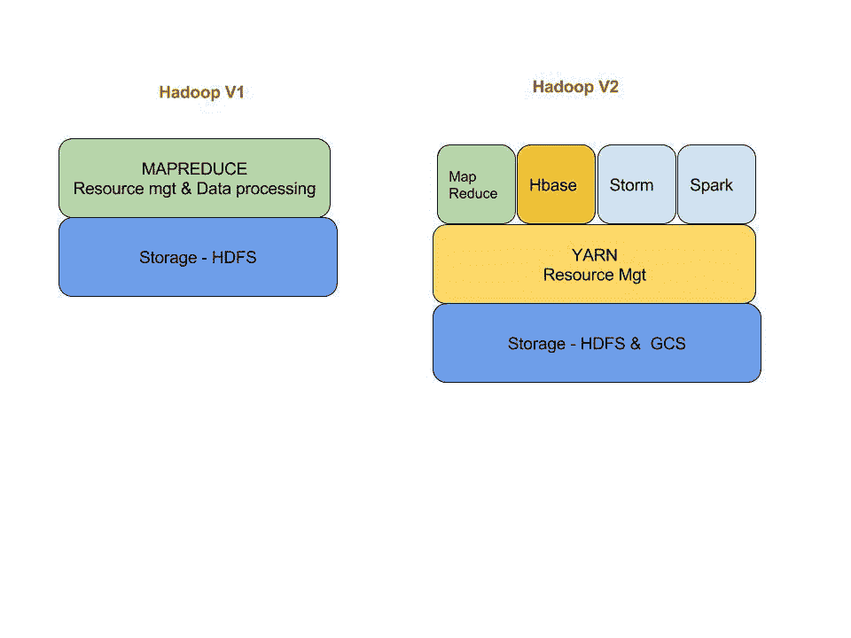
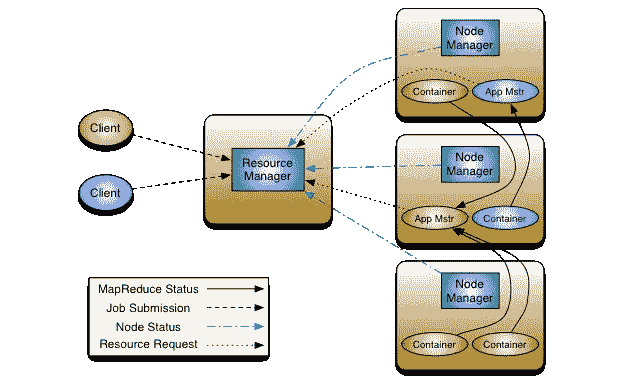
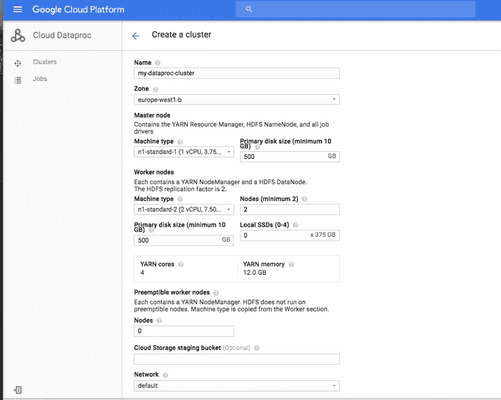

# 谷歌云平台的 a 到 Z 个人选择——Y——为纱

> 原文：<https://medium.com/google-cloud/a-to-z-of-google-cloud-platform-a-personal-selection-y-for-yarn-b9b0312d66b9?source=collection_archive---------1----------------------->

我完全被这封信打败了。我已经问了几个星期的建议，同样的主题一直扔给我。所以我只想感谢@complex 和@sveesible，感谢他们为我提供了建议，让我在六月份完成这个系列的目标，并让所有的事情都保持连贯。

纱线(YARN)——这代表另一个资源谈判者。它是作为 Hadoop v2 架构的一部分引入的。

YARN 实际上将 MapReduce 的资源管理和调度功能从数据处理组件中分离出来。为什么这是一件事？在 YARN 之前，Hadoop JobTracker 限制了可伸缩性，也是一个单点故障。

因此，从 Hadoop v1 中的紧密耦合配置来看，YARN 的引入改变了模型，如下图所示(因为我在这一系列帖子中谈论的 GCP GCS 在图中 Hadoop v2 的存储部分是准确的):

随着 YARN 的引入，这使得 Hadoop 能够支持更多样的处理方法和更广泛的应用程序，因此您现在可以使用 MapReduce 批处理作业同时运行交互式查询和流数据应用程序。上图中展示了其他一些工具。

来自 [apache YARN 页面](http://hadoop.apache.org/docs/current/hadoop-yarn/hadoop-yarn-site/YARN.html)的下图说明了该架构

Hadoop 纱线架构

我是一个老 skool Hadoop/ MapReduce 用户，所以当我最初接触 Hadoop 时，YARN 并不存在，但我希望它存在！

我不会花时间谈论 Hadoop v1 和 Hadoop v2 的历史，互联网上有一些关于这方面的精彩帖子。这是一个关于 GCP 的系列，所以我现在将重点关注纱线在 GCP 生态系统中的位置。

GCP 有一个完全托管的服务，让你运行 Apache Spark 和 Apache Hadoop 生态系统，称为[云数据平台](https://cloud.google.com/dataproc/)。它可以快速配置大型或小型集群，支持许多流行的作业类型。YARN 与这项服务相结合。从云控制台启动 Dataproc 集群这种集成是显而易见的。

您可以通过多种方式启动或停止 Dataproc 集群，包括使用 [YARN web 界面](https://cloud.google.com/dataproc/cluster-web-interfaces#available_interfaces_wzxhzdk5wzxhzdk6)。该接口可以在您的 Dataproc 集群主节点的端口 8088 上找到。

要访问该接口，强烈建议使用 SSH 隧道来创建到主节点的安全连接。SSH 隧道支持使用 [SOCKS](https://en.wikipedia.org/wiki/SOCKS) 协议的流量代理。这意味着您可以在任何支持 SOCKS 协议的浏览器中通过 SSH 隧道发送网络请求，从而允许您通过 SSH 传输所有浏览器数据，无需打开防火墙端口来访问 web 界面。参见[文档](https://cloud.google.com/dataproc/cluster-web-interfaces#step_1_-_create_an_ssh_tunnel)了解如何操作。

通过这个界面，除了使用云控制台或命令行之外，您还可以监控您的集群。这种集成意味着您可以继续使用您已经习惯的工具

您可以在 yarn-site.xml 中调整纱线参数

除了系统日志之外，应用程序日志(如 YARN 日志)也会被转发到云日志(关于日志的一些信息，请参见我在本系列文章中关于 [L](/google-cloud/a-to-z-of-google-cloud-platform-a-personal-selection-l-is-for-logging-230d459976f4#.aq7mhyrw7) 的文章)