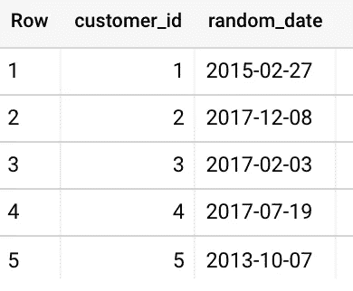
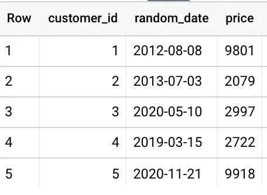
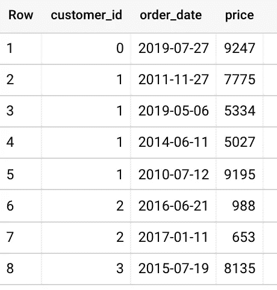

# 一种在 BigQuery 中生成样本数据集的方法

> 原文：<https://medium.com/google-cloud/a-way-to-generate-sample-test-dataset-in-bigquery-6e28fff9625c?source=collection_archive---------1----------------------->

> 你需要用一组随机的数字、日期来填充 BigQuery 表吗？酷继续..

BigQuery 有一个很酷的 Generate_Array 函数，它获取范围边界作为输入，并生成一个数组(嵌套字段)。Generate_date_array 相当于生成日期数组。

Unnest 函数可用于将数组项分解成单独行。在这篇博文中，我们将依靠这些函数来生成 int 和 date 值。

为了获得一些随机的字符串值，我们将受益于散列函数，如 MD5()和 RAND()函数。

# 首先是生成 int 或 date 值的一些基础知识

获取连续的 1000 个整数:

```
SELECT id FROM UNNEST(GENERATE_ARRAY(1, 1000)) id;--You can fill a table with one int column using insert/select statements like;insert into `project_id`.dataset_name.table_name 
SELECT id FROM UNNEST(GENERATE_ARRAY(1, 1000)) id;
```

获取有间隔的连续日期。ex；开始日期为 2021 年 1 月 1 日，结束日期为 2022 年 1 月 8 日，两个值之间相差 10 天:

```
SELECT date FROM UNNEST(GENERATE_DATE_ARRAY(‘2021–01–01’, ‘2022–01–08’, INTERVAL 10 DAY)) date--You can fill a table with only one date column using insert/select statements like;insert into `project_id`.dataset_name.table_name 
SELECT date FROM UNNEST(GENERATE_DATE_ARRAY(‘2021–01–01’, ‘2022–01–08’, INTERVAL 10 DAY)) date;
```

# 生成具有唯一 id 和随机日期的多个值

```
WITH parameters AS (
SELECT 10000 customer_id, DATE ‘2010–01–01’ start_date, DATE ‘2020–12–31’ finish_date
)SELECT 
  customer_id, 
  DATE_FROM_UNIX_DATE(CAST(start + (finish — start) * RAND() AS INT64)) random_date
FROM parameters,
UNNEST(GENERATE_ARRAY(1, customer_id)) customer_id,
UNNEST([STRUCT(UNIX_DATE(start_date) AS start, UNIX_DATE(finish_date) AS finish)])
```



# 还可以放一些附加栏目吗？

添加一个额外的整数列，例如价格:

```
WITH parameters AS (SELECT 10000 customer_id, DATE ‘2010-01–01’ start_date, DATE ‘2020–12–31’ finish_date)SELECT customer_id, DATE_FROM_UNIX_DATE(CAST(start + (finish — start) * RAND() AS INT64)) random_date, **CAST(10000*RAND() AS INT64) price**FROM parameters,UNNEST(GENERATE_ARRAY(1, customer_id)) customer_id,UNNEST([STRUCT(UNIX_DATE(start_date) AS start, UNIX_DATE(finish_date) AS finish)])--Note Medium blog converts '-' characters into a different ascii char. If you copy paste this please replace '-' with minus char in the date values manually.
```



添加一个额外的字符串列，例如 customer_id:

```
-- inserting into table which has 2 columns; an int and a string column;insert into `project_id`.dataset_name.table_name SELECT id, TO_BASE64 (MD5(cast (RAND() as string))) FROM UNNEST(GENERATE_ARRAY(1, 1000)) id
```

## 为每个唯一 id 生成多行

假设这是一个订单表，每个客户都有多个订单。需要每个客户有不同的订单计数。

```
WITH parameters AS (SELECT **1000** row_count,DATE ‘2010–01–01’ start_date, DATE ‘2020–12–31’ finish_date)select CAST(**500***RAND() AS INT64) customer_id, DATE_FROM_UNIX_DATE(CAST(start + (finish — start) * RAND() AS INT64)) order_date, CAST(10000*RAND() AS INT64) price from parameters,UNNEST(GENERATE_ARRAY(1, row_count)) row_count,UNNEST([STRUCT(UNIX_DATE(start_date) AS start, UNIX_DATE(finish_date) AS finish)])
```

这里，只需将行数除以期望的客户数，即可得到平均订单数:



你需要不同价值观的组合吗？

```
select order_id, date, price from(SELECT order_id FROM UNNEST(GENERATE_ARRAY(1, 3)) order_id) order_id,(SELECT date FROM UNNEST(GENERATE_DATE_ARRAY(‘2021–01–01’, ‘2022–01–08’, INTERVAL 100 DAY)) date) date,(SELECT price FROM UNNEST(GENERATE_ARRAY(100, 103)) price) price
```

好吧，这些都很酷，但我需要一些每行的逻辑。

脚本/存储过程？

好的，在这里，记住 BigQuery 是分析查询引擎，它喜欢处理集合中的数据，而不是行中的数据。所以，如果你想用一个循环产生 10 秒或 100 秒的记录，这可能是可以的，但这远远不是最佳的，但以防万一，如果你需要一个存储过程/脚本来生成一些行，这里放入:

```
DECLARE id STRING;
DECLARE d DATE DEFAULT CURRENT_DATE();
DECLARE x INT64 DEFAULT 0;
DECLARE datesub INT64 DEFAULT 0;LOOP
SET x = x +1;
IF x>=100 THEN
LEAVE;
END IF;SET id = CAST(CAST(10000*RAND() AS INT64) AS STRING);
SET datesub = CAST(10000*RAND() AS INT64);INSERT INTO xxx.orders (customer_id, order_date, price) VALUES(id, DATE_SUB(D, INTERVAL datesub DAY), datesub);SELECT FORMAT(“Created customer %s”, id);END LOOP;
```

这些选项看起来怎么样？你有更好的选择吗？请在下面评论一下👇