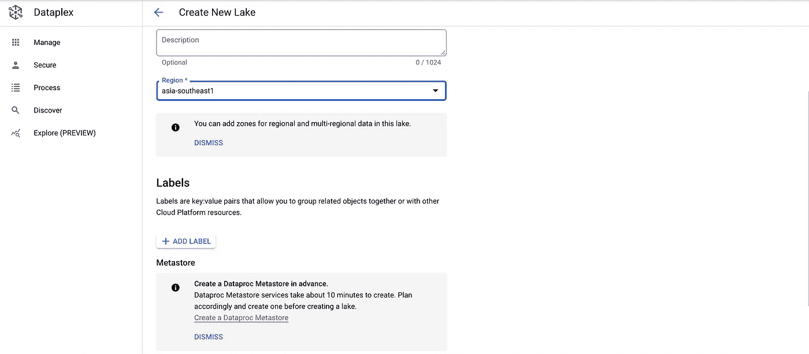
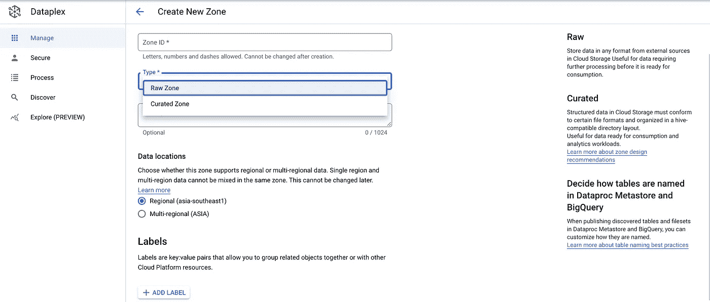
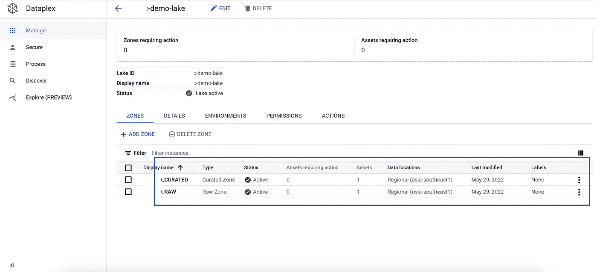
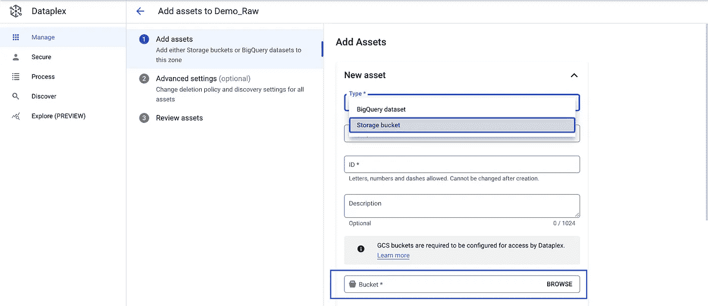
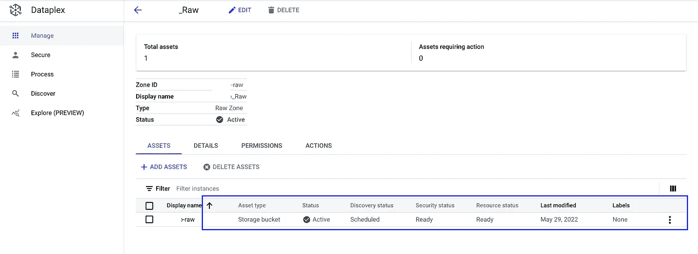
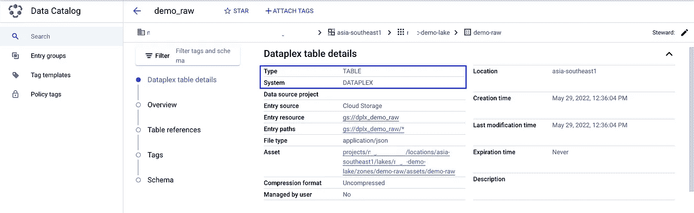
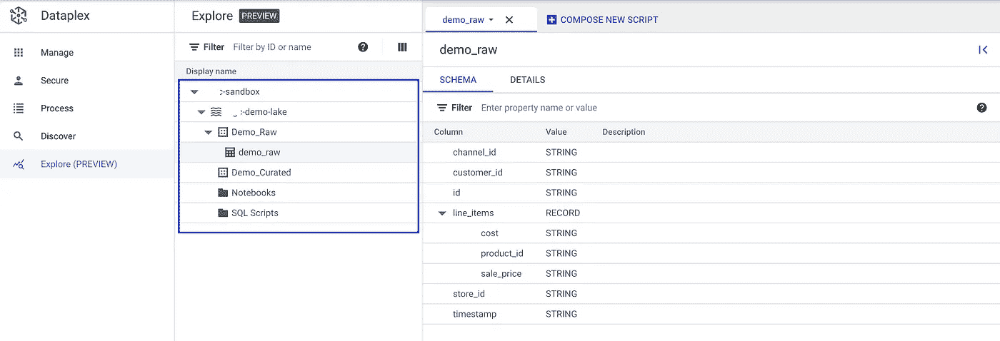

# 简化数据湖管理:使用 Dataplex (1)

> 原文：<https://medium.com/google-cloud/accelerate-data-lake-implementations-with-dataplex-1-920088c36b62?source=collection_archive---------0----------------------->

IT 部门已经花费了大量时间来定义、设计和实施数据湖。整个生命周期过程可能是乏味的、费时费力的。更不用说围绕设置完整性的问题以及可能的错误。

那么[谷歌云平台](https://cloud.google.com/)如何解决这个问题呢？

谷歌云最近推出了 [Dataplex](https://cloud.google.com/dataplex) ，这是一项解决关键**数据治理**能力的服务，如数据管理、元数据、数据质量、数据安全、数据生命周期管理。

所有这一切都以最简单的方式进行！

在这篇博客中，我们将重点讨论管理部分。让我们了解如何..

**第一步:创建数据湖。**

从导航菜单>分析>下选择 Dataplex >创建新湖

单击页面底部的创建，湖泊会列在管理下。

**步骤 2:定义数据区。**数据湖设置过程中最重要的一步是定义数据区。我们都很熟悉标准区域，如原始区域、管理区域、消费区域等。根据行业、组织以及它们要解决的使用情形，这些定义会有所不同。

单击新创建的数据湖>单击添加区域。

对目标区域重复此任务，如原始区域、管理区域。

**步骤 3:添加资产**，本质上是将区域与物理存储位置相关联。在这个场景中，我们将原始区域与专门为存储原始数据而创建的 GCS 存储桶相关联。

单击原始区域>单击添加资产>单击存储桶>为原始数据选择所需的桶>查看资产>工作完成！

这里需要注意的是，有一个选项可以为物理存储选择一个 BigQuery 数据集。

新资产列在原始区域下。

所以问题是我们如何浏览原始桶中的文件？数据目录来拯救这里。Dataplex 与数据目录有着天然的集成。关联是自动的！

**第四步:探索湖泊并开始使用它！**现在所有的数据湖组件都已经就绪，让我们浏览它们..

单击 Explore (Preview)并展开已创建的数据湖下的列表。

该视图中列出了所有区域、对象以及模式详细信息。

总之，使用传统方法构建数据湖会带来大量冗余和孤岛，导致效率低下和成本开销。有了 **Google Cloud 的 Dataplex** 服务，就有可能使用非常简单的步骤来定义&管理数据湖。

在本系列博客的下一篇文章中，我们将探讨其他一些关于数据质量、数据生命周期管理的 cools 特性。敬请期待！