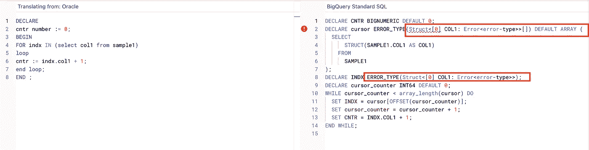
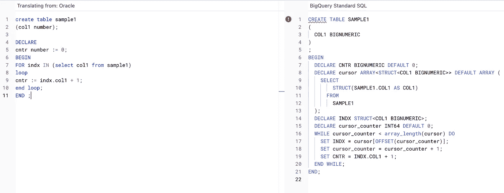
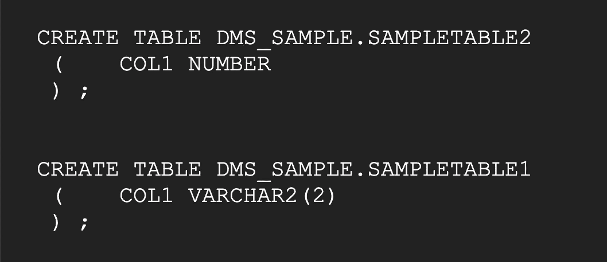

# 使用 Interactive SQL 转换加速 Oracle 到 BigQuery 迁移的转换。

> 原文：<https://medium.com/google-cloud/accelerate-translation-for-oracle-to-bigquery-migration-using-interactive-sql-translation-c421f9beea5d?source=collection_archive---------1----------------------->

在数据库或数据仓库迁移、翻译或转换引擎上加速整体采用和现代化。它模拟从源引擎到云上相应目标的特征映射转换的已知模式。

最近，我们宣布了面向 BigQuery 多个数据源的 interactive SQL Translator 的公共预览版。在这些博客中，我们将查看一些最佳实践和 SQL 实用程序，以加速从 Oracle 到 BigQuery 迁移的 SQL 转换。我们将主要关注交互式 sql 翻译，即利用 BigQuery 控制台和动态翻译代码。

我们已经有了详细的 SQL 转换模式 [publish](https://cloud.google.com/architecture/dw2bq/oracle/oracle-bq-sql-translation-reference.pdf) ，作为从 Oracle 到 BigQuery 迁移的映射特性\功能的一部分。

下面让我们考虑从 Oracle 到 BigQuery 的转换的 Oracle PL\SQL 块。

```
DECLARE
cntr number := 0;
BEGIN
FOR indx IN **(select col1 from sample1)**
loop
cntr := indx.col1 + 1;
end loop;
END ;
```

在为循环翻译*时，*翻译引擎试图将其转换为游标内的结构数组。作为交互接口的一部分，底层翻译引擎不知道列 col1 的数据类型，因此无法猜测它或有效地转换它。



## 在交互式翻译期间添加表 DDL

如果我们将表 DDL 作为翻译的一部分，底层翻译引擎将会很好地了解表的结构，并做出明智的翻译决定。在表格方面添加额外的元数据丰富了翻译引擎，以做出决策并全面加速迁移。



## 生成 DDL : Oracle 作为源

如果我们能够基于 Oracle 中程序块的依赖关系动态生成表 DDL，那么它将通过针对 pl\sql 程序块的 interactive sql 转换来加速整体转换。以下代码片段使用 Oracle 中的 DBMS_METADATA 和 ALL_DEPENDENCIES 来生成过程中相关表引用的 DDL。

当前输入是硬编码的，需要作为 SQL 的一部分传递，如**突出显示的**。

```
SET LONG 200000;
set pages 50000;
set lines 32767;
set heading off;--set option to disable unnecessary tags with DDL
EXEC dbms_metadata.set_transform_param(dbms_metadata.session_transform,'TABLESPACE',false);EXEC dbms_metadata.set_transform_param(dbms_metadata.session_transform,'STORAGE',false);EXEC dbms_metadata.set_transform_param(dbms_metadata.session_transform,'SEGMENT_ATTRIBUTES',false);EXEC dbms_metadata.set_transform_param(dbms_metadata.session_transform,'SQLTERMINATOR',true);WITH INPUT
AS
(
SELECT **'SAMPLE1' AS SCHEMA , 'SAMPLE_PROC'** AS PROC_NAME FROM DUAL --input values
) ,
DEPENDENT_OBJ AS
(SELECT DISTINCT REFERENCED_TYPE , REFERENCED_NAME , REFERENCED_OWNER
FROM ALL_DEPENDENCIES , INPUT
WHERE REFERENCED_TYPE IN ('TABLE','SYNONYM')
AND OWNER = UPPER(INPUT.SCHEMA)
AND TYPE IN  ( 'FUNCTION', 'PACKAGE BODY' , 'PACKAGE','PROCEDURE')
AND NAME = UPPER(INPUT.PROC_NAME)) ,
ALL_TBL_DEPENDENT AS
(
SELECT DISTINCT DECODE(REFERENCED_TYPE,'SYNONYM',SYN.TABLE_OWNER,REFERENCED_OWNER) AS REFERENCED_OWNER ,
DECODE(REFERENCED_TYPE,'SYNONYM',SYN.TABLE_NAME,REFERENCED_NAME) AS REFERENCED_NAME
FROM DEPENDENT_OBJ LEFT OUTER JOIN ALL_SYNONYMS SYN ON SYN.SYNONYM_NAME = REFERENCED_NAME  AND SYN.OWNER = REFERENCED_OWNER)
SELECT REPLACE(DBMS_METADATA.get_ddl ('TABLE', REFERENCED_NAME , REFERENCED_OWNER),'"') FROM ALL_TBL_DEPENDENT;
```

它将为我们生成表 DDL，以便在 Interactive SQL 控制台中作为 Oracle 到 BigQuery 迁移的一部分使用。它避免了手动检查表和生成 DDL 开销。



此外，我们还有[批处理模式](https://cloud.google.com/bigquery/docs/generate-metadata)，用于捕获作为 dumper 一部分的对象元数据，并将其用作整体代码转换策略的批处理翻译的一部分。

Interactive SQL 翻译提供了加速从不同来源到 BigQuery 的翻译的功能。添加表 DDL 丰富了转换，提高了转换率，加快了整体迁移。