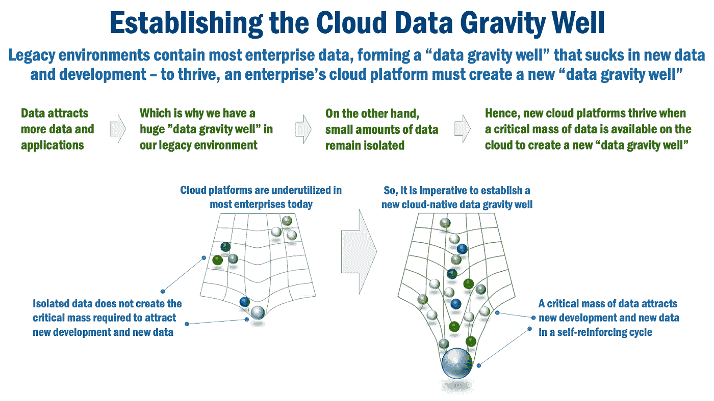

# 利用数据网格解决方案模式加速云迁移

> 原文：<https://medium.com/google-cloud/accelerating-cloud-migration-with-data-mesh-solution-patterns-a2d502e81208?source=collection_archive---------3----------------------->

图片来源: [Unsplash](https://unsplash.com/photos/pfiRyJvpyrE) 的[红色齐柏林飞艇](https://unsplash.com/@redzeppelin)

云计算在企业中的采用迅速增加。迁移到云可以提供更大的灵活性、更快的上市时间、更低的成本以及更高的安全性和稳定性。然而，在企业中采用云—尤其是核心应用程序和数据的迁移—可能会非常缓慢，并且充满挑战。

在我与 [Eric Broda](/@ericbroda) 合作的最近一篇文章[数据网格云迁移模式](https://towardsdatascience.com/data-mesh-cloud-migration-pattern-fcff598695e4)中，我们讨论了企业如何采用[数据网格解决方案模式](https://towardsdatascience.com/data-mesh-solution-and-accelerator-patterns-acffbf6e350)，例如[变更数据捕获](https://towardsdatascience.com/data-mesh-pattern-deep-dive-change-data-capture-eb3090178c34)、[事件流](https://towardsdatascience.com/data-mesh-pattern-deep-dive-event-streaming-backbone-99a5bb2a7cbf)和[数据产品目录](https://towardsdatascience.com/data-mesh-pattern-enterprise-data-product-catalog-ba4bf072d7c3)来加速云迁移。Eric Broda 是一名在金融服务领域设计和实施数据网格解决方案的顾问。Eric 写了许多数据网格文章，可在 medium.com/@ericbroda[获得。](/@ericbroda)

本文引入了*数据引力井*的概念来描述我们在客户中观察到的一致模式:**应用程序和用例将在更接近他们需要的数据可以被访问的地方被开发**。每个公开有价值数据供消费的应用程序自然会引入额外的用例及工作负载。因此，您应该考虑加速云迁移的一个中心问题是**您如何将数据重心很好地转移到云？**

*图一。建立云数据重力井(图片鸣谢:* [Eric Broda](https://ca.linkedin.com/in/ericbroda) )

将内部部署的企业应用程序拆分以迁移到云环境绝非易事。您可以通过释放这些应用程序产生的数据，并使它们在云上随时可访问和可用，来加快云的采用，而不是仅仅关注应用程序的迁移。

云迁移数据网格解决方案模式通过将数据从企业交易或分析系统以近乎实时且不引人注目的方式移动到安全的云原生数据产品来实现这一点。这种模式创建了原始数据的“实时副本”,并且不需要应用程序迁移。这提供了几个切实可行的好处:

*   它是不引人注目的，要求零应用程序更改，从而减轻了“解开”现有应用程序和数据蜘蛛网的需要。
*   由于不需要更改应用程序，因此可以非常快速地部署这种模式。
*   通过更简单的数据迁移，这建立了加速云迁移所需的云“数据引力井”。
*   作为一个“实时副本”，数据在云上近乎实时可用，为 AI/ML 和高级分析等更新的云原生任务提供及时、一致和准确的数据。
*   有了云上的可用数据，新的应用程序可以更快地开发出来，上市时间也可以大大缩短。

您可以在文章中了解更多信息:[数据网格云迁移模式](https://towardsdatascience.com/data-mesh-cloud-migration-pattern-fcff598695e4)。这些技术解决方案模式与[数据网格](https://martinfowler.com/articles/data-mesh-principles.html)原则和操作模型相结合，提供了一种在云上建立重力井的强大方法。我们相信这可以同时加快云的采用，并为未来的规模和灵活性做好准备。

值得注意的是，构建数据网格不仅仅涉及采用技术模式，因为它可能还需要您对数据文化和数据操作模型的看法发生巨大转变。我之前在[的《你还没准备好采用数据网格的 10 个原因](/google-cloud/10-reasons-why-you-should-not-adopt-data-mesh-7a0b045ea40f)中讨论过你在采用数据网格时可能会遇到的文化和组织挑战。

希望本文能为您提供必要的见解，帮助您启动自己的企业数据网格，并加速您的企业采用云技术！

***

本文表达的观点仅代表我个人，并不代表我的客户或谷歌的观点。

Eric Broda 在本文中表达的观点仅代表其个人，并不代表其客户的观点。