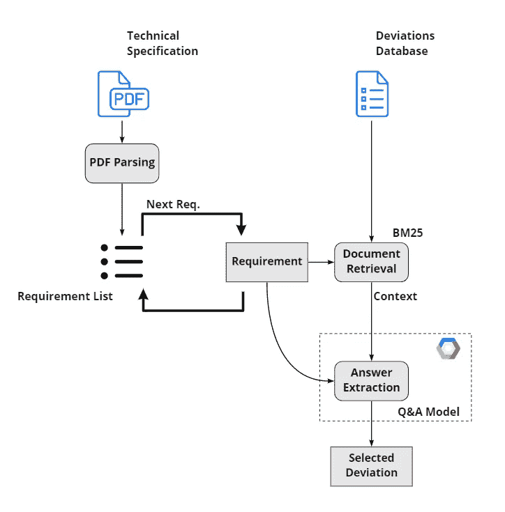
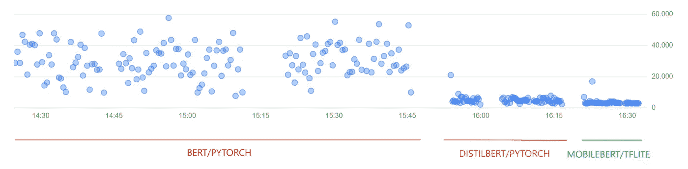

# 利用 MobileBERT 和 TFLite 加速问答应用

> 原文：<https://medium.com/google-cloud/accelerating-question-answering-applications-with-mobilebert-and-tflite-1f8d301ddbf7?source=collection_archive---------6----------------------->

随着预训练、自我监督模型的使用，自然语言处理的世界一直在快速发展。然而，最先进的模型，如 BERT，往往有大量的参数，因此，遭受高延迟。对于许多资源有限的应用程序，这些模型的计算需求可能使它们的使用不可行。

在这篇文章中，我想分享我们部署 BERT 系列问答模型的轨迹，以解决 [WEG](https://www.weg.net/) 的一个特定业务问题——在电机询价期间自动检测技术偏差。这些报价通常附有必须满足的技术要求，当有特定摘录需要评论/澄清时，汇编报价提案的分析师应强调这些注意点或偏差。

所提出的策略中最大的瓶颈是所需的等待时间，假设要处理一个单一的技术规范，需要查询成百上千的文本需求以获得适当的偏差。因此，我们将把重点放在我们如何解决这个问题并设法加速我们的问答应用程序上。

为了防止得出结论，让我们先从底线开始:我们的最终实现依赖于一个转换成 TFLite 格式的 [MobileBERT](https://arxiv.org/abs/2004.02984) 模型，以便与我们最初的 BERT 语言模型相比，显著地减少我们模型的二进制文件大小，这最终使我们能够部署我们提出的策略。

让我们仔细看看我们的应用程序。

# 应用概述

在收到一个或多个电动机的报价请求时，WEG 公司的分析师需要仔细阅读技术规范，以便提出报价建议。这包括寻找这些规范中列出的可能与 WEG 提供的有所不同的要求，或者可能需要额外的评论/澄清的要求。

例如，让我们假设其中一个规格说明如下:

> 所有尺寸的机器外壳都应该配备一个螺纹黄铜排泄塞。

然而，对于该特定的电机系列，WEG 公司可能必须澄清该特定要求的以下偏差:

> 我们可以供应橡胶和不锈钢排水管。

对于规范的大部分句子，不需要额外的注释，但是对于分析师来说，拥有某种“偏差检测器”是非常宝贵的，这种应用程序能够通读规范，以便检测这些注意点，同时提出可能的偏差。

我们决定将这个问题构建成一个问答问题，其中规范的句子或者需求是我们的输入问题，偏差是我们的答案。所有实验的问答模型都已经在 [SQuAD1.1](https://rajpurkar.github.io/SQuAD-explorer/) 问答数据集上进行了预训练，并随后在 WEG 的特定数据集上进行了微调。该数据集是使用分析师在过去 3 年中生成的简报集合构建的。简报是概括的文档，展示了关于相关报价请求的最基本的信息，包括我们感兴趣的需求-偏差对。

以下是我们应用程序的概述:

起点是您希望对其要求提出偏差建议的规范。技术规格可以以不同的格式接收，但大多数是 PDF 文件。因此，通过 PDF 解析过程提取句子，以便形成需求列表。

然后，每个需求由一个问答管道单独处理，以寻找潜在的偏差。为了做到这一点，我们首先从过去几年分析师制作的简报中创建一个偏差数据库。被训练来为每个需求搜索整个数据库的问题回答模型将花费非常长的时间，因此应用初步的文档检索阶段，以便将候选者缩小到 30 个可能偏差的列表。这是通过 [Okapi BM25](https://en.wikipedia.org/wiki/Okapi_BM25) 算法完成的，这是一种流行的词袋排名功能，用于检索与给定查询最相关的文档。

我们终于有了我们需要的东西来填充我们的问答模型:查询(需求)和我们的上下文(最相关的潜在偏差)。根据给定的上下文，模型输出一个可能答案的列表，以及每个答案的置信度值。如果得分高于预定义的阈值，则从得分最高的答案中选择适当的偏差。否则，不建议偏离当前要求。

# 延迟问题

一个技术规范由数百个句子组成。如果对 Q&A 模型的每个请求都有几十秒的延迟，那么我们手中的应用程序就无法使用。这就是为什么我们决定将问答模型与应用程序的其余部分分离，并将其作为容器化的应用程序托管在 [Google Cloud Run](https://cloud.google.com/run) 中。这样，我们就不必担心为计算要求最高的应用程序进程管理基础设施和资源供应。

第一个应用程序的迭代使用了 BERT 大模型的 Pytorch 实现。初始实验的延迟结果很快向我们表明，当前的解决方案行不通，这促使我们寻找替代方案。自然的途径是搜索 BERT 的压缩版本，如 [DistilBERT](https://arxiv.org/abs/1910.01108) ，它利用知识提炼的过程来减少整个模型的大小。最后，在最后一次迭代中，我们使用了 [MobileBERT](https://openreview.net/forum?id=SJxjVaNKwB) ，这是 BERT 的另一个压缩版本，专门为移动和资源受限的环境而设计。此外，我们从 Pytorch 切换到 Tensorflow 实现，并继续将 TF 模型转换为 [TFLite](https://www.tensorflow.org/lite) 。TFLite 最初设计用于在移动和嵌入式设备上运行 Tensorflow 模型。尽管目前情况并非如此，但延迟和模型二进制文件大小方面的优势证明了使用它的合理性。

下图展示了我们的每一项变革所带来的改进。在这个简单的实验中，跟踪了样本规范处理过程中每个请求的延迟值(以毫秒为单位)。实际上，每个实现都要处理三次规范:BERT/Pytorch、DistilBERT/Pytorch 和 MobileBERT/TFLite。

对于所创建的 3 个服务中的每一个，在云运行时都使用了相同的设置:4 个 vcpus，8GiB 的分配内存，每个容器的最大请求数为 80，最小实例数为 0，最大实例数为 5。MobileBERT 模型最初使用 TensorFlow 实现进行训练，并使用 [TensorFlow Lite 模型生成器](https://www.tensorflow.org/lite/tutorials/model_maker_question_answer)转换为 TFLite，而模型在 [TensorFlow Lite 支持](https://github.com/tensorflow/tflite-support)的帮助下部署在 C++实现上。在 TFLite 模型转换过程中，该过程被设置为针对延迟进行优化。

简单地通过观察上图，我们可以看到延迟的明显减少。处理单个规格的平均持续时间如下:

*   BERT/py torch—**1545****秒**
*   蒸馏器/Pytorch — **350** **秒**
*   mobile Bert/TF lite—**200****秒**

就百分比而言，与最初的实施相比，我们的最终解决方案在处理时间上减少了 87%。

至于模型的二进制文件大小，结果也非常令人印象深刻:

*   BERT/Pytorch — **1.2GB**
*   蒸馏器/Pytorch — **253MB**
*   MobileBERT/TFLite — **25MB**

在最好/最坏的情况之间，这是一个巨大的 98%的缩减。

## 结论

使用最先进的 NLP 模型可以为许多不同的应用产生令人印象深刻的结果。然而，当延迟是一个重要问题时，它的数亿个参数可能会阻止它的使用。在所示的应用程序中，我们感兴趣的是自动检测电动机报价请求中的偏差。对于这个用例，需要数百或数千个问题来处理一个技术规范。

对于最初用 BERT 的大模型进行的实验，这个限制似乎阻止了所提出的策略。然而，通过进一步研究压缩我们的语言模型的方式，我们能够结合两种特定的方法来实现一个可行的解决方案。第一个是将模型从 BERT 改为 MobileBERT 模型的简化版本，以加速我们的推断。最后，我们将 TensorFlow 模型转换为 TFLite 格式，以便在性能损失最小的情况下进一步压缩 MobileBERT。

至于性能指标，还需要在模型之间进行适当的比较，即使最初的评估没有表明 BERT 和 MobileBERT 之间的性能下降，这将与 [MobileBERT 在 SQuAD 数据集](https://arxiv.org/abs/2004.02984)上的结果一致。尽管需要每个模型的性能指标才能全面了解情况，但观察到的延迟和模型大小的减少使我们能够部署建议的策略来解决我们的业务问题。

如果您有任何反馈或问题，请随时联系我们！