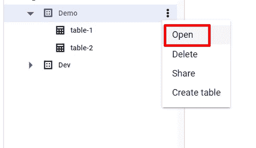

# BigQuery 中的访问控制

> 原文：<https://medium.com/google-cloud/access-control-in-bigquery-d5d800654f47?source=collection_archive---------0----------------------->

**简介**

本文解释了如何在大查询中控制访问。在组织中从事 GCP 项目时，安全性起着至关重要的作用。作为最佳实践，我们应该遵循为用户分配最小特权的方法。一旦用户拥有大型查询服务的项目级 IAM 角色，默认情况下，用户将能够访问所有数据集/表/视图。我们将看到如何在数据集级别、表级别以及列和行级别限制访问。

**在数据集级别限制访问**

1.  转到云控制台，导航到 Bigquery 控制台。
2.  展开项目以查看可用的数据集。

3.打开数据集，例如本演示中的演示

4.点击共享

5.点击添加委托人

6.输入用户电子邮件 id 并分配所需的角色。

7.现在，验证用户和只能看到演示数据集的用户的访问权限。

这样，我们可以在数据集级别限制访问。

**限制表级访问**

现在假设我们有一个需求，我们希望用户只看到表 1 中的数据，而不是表 2 中的数据，那么我们需要在表级别限制访问。

1.  转到表 1，单击共享

2.点击添加委托人

3.输入用户电子邮件并分配所需的角色。

4.请注意，在此步骤之后，您可能无法在数据资源管理器中看到该表，但是您可以访问该表。尝试在表上运行查询。

注意—如果运行查询时出现错误，请从 IAM 添加角色 **BigQuery 作业用户**。

能够访问表 1

因为我们只提供了对 table-1 的访问，所以在 table-2 上运行查询将会抛出一个错误。

**在列级别限制访问**

现在我们可以看到 table-1 有三列，最后一列 anonymous_string 包含敏感数据，我们希望将该列限制为特定用户。

在这种情况下，我们需要创建一个包含所需列的视图。

1.  创建新的数据集测试
2.  运行查询后，点击查询结果窗口上方的**保存视图**按钮，将查询保存为视图。

给出我们创建的数据集名称，即**测试**和期望的视图名称，即 **v_table-1**

创建视图后，添加用户对视图的访问权限。

用户可以看到表 1 中的数据，但基于视图的敏感列除外。

请找到下面的视频演示。