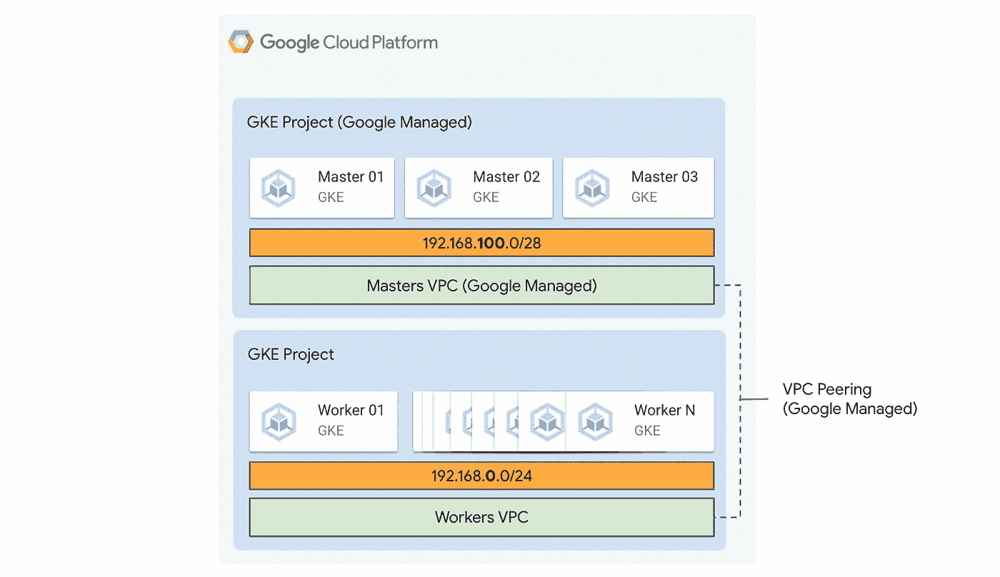
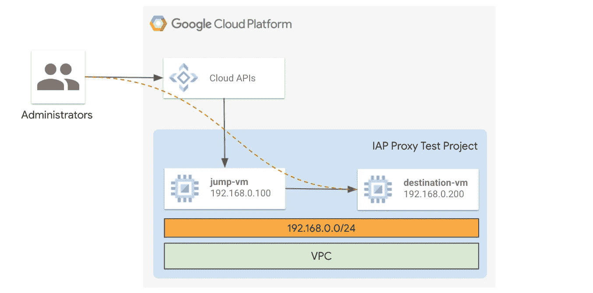
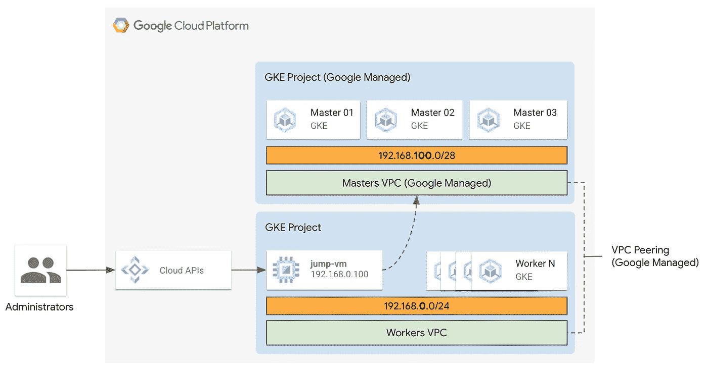

# 通过 IAP 访问 GKE 专用集群

> 原文：<https://medium.com/google-cloud/accessing-gke-private-clusters-through-iap-14fedad694f8?source=collection_archive---------0----------------------->

# **TL；博士**

本文展示了如何利用代理和 IAP 隧道连接到 GKE 专用集群的控制平面。

# 相关工作和动机

在写这篇文章的时候，我发现了一些有趣的工作，我希望你能把它们看作是这篇文章的补充，在决定可能适合你的道路之前，它们绝对值得回顾。

[官方谷歌云文档](https://cloud.google.com/architecture/creating-kubernetes-engine-private-clusters-with-net-proxies)提供了访问私有集群的教程，利用直接安装在 GKE 集群上的代理。
虽然这种方法比本文中描述的方法更轻量级，但随着时间的推移，我注意到它并不适用于每个人，因为不同的用户更喜欢将代理与他们的集群分开，所以如果集群本身有问题，他们不会冒险失去对它的访问。

更令人惊讶的是，几乎在我写作的最后，我发现了一篇由 [Peter Hrvola](https://medium.com/u/e263b759b3b0?source=post_page-----14fedad694f8--------------------------------) 撰写的[旧文章](/google-cloud/gke-private-cluster-with-a-bastion-host-5480b44793a7)提出了与我描述的相同的方法。虽然我确保了我在本文中使用的命令的语法一致，以避免产生混淆(基本上是修改参数的顺序)，但我觉得围绕同一个解决方案给出类似的视图可能仍然为读者增加了价值。然后我决定在这里提到 [Peter 的文章](/google-cloud/gke-private-cluster-with-a-bastion-host-5480b44793a7)，并继续出版。

**下面提供的例子与一些工作平台代码相关，这些代码可以在** [***云基础结构库***](https://github.com/terraform-google-modules/cloud-foundation-fabric/tree/master/examples/networking/shared-vpc-gke) **中找到。示例代码允许创建一个共享的 VPC、一个 GKE 集群和一个安装了 TinyProxy 的 bastion 主机。**

# **GKE 私人集群**

GKE 私有集群正变得越来越重要，尤其是在生产部署方面。

虽然私有集群是提供主节点和工作节点与互联网更强隔离的重要资源，但它们的配置有时看起来更复杂和混乱。这包括管理员如何从他们的客户端连接到控制平面，以便与 Kubernetes APIs 进行交互。

私有集群利用 [VPC 对等](https://cloud.google.com/vpc/docs/vpc-peering)来连接控制平面和工人。因此，只能从工作人员居住的 VPC 通过私有 IP 地址访问主节点。



典型的 GKE 集群部署

重要的是要记住，VPC peering 是不可传递的连接。此外，从内部客户端到主服务器的路径可能仍然很长且很复杂，因此需要非常重要的布线(路由、NAT 规则、防火墙规则等等)。
用户怎样才能安全、私密地连接到控制平面，而不经过复杂的网络设置？

# **身份感知代理(IAP)隧道**

[身份感知代理(IAP)隧道](https://cloud.google.com/iap/docs/using-tcp-forwarding)允许用户将来自 Google 外部的 TCP 流量转发到他们的 GCE 实例，而不会直接暴露在互联网上。
用户不是直接连接到终端机器，而是通过 gcloud 或控制台调用公共的 Google Cloud API，这将创建一个 WebSocket 隧道来封装私有流量。Google 对请求进行授权，并充当用户与其虚拟机之间的桥梁。

就像普通的 SSH 一样，IAP 隧道也可以用来建立到其他主机的连接，“跳过”用户连接的第一台机器。让我们看一个例子:



管理员连接到目标虚拟机，利用通过 jump-vm 的 IAP 隧道。两台机器都只配置了私有 IP。

在本例中，客户端利用通过跳转主机创建的 IAP 隧道，从本地连接到目标虚拟机。这很容易实现，只需在客户机上键入几个命令:

```
*# Create the SSH tunnel
gcloud compute ssh jump-vm \
  --project my-test-project \
  --zone europe-west1-b \
  -- -L 2222:192.168.0.200:22 -N -q -f*# Connect to the destination VM
ssh 127.0.0.1 -p 2222
```

需要注意的是，为了让这个例子工作，应该在 VPC 中设置两个入口[防火墙规则](https://cloud.google.com/vpc/docs/firewalls):

*   [允许从*35 . 235 . 240 . 0/20*(Google IAP 知名 IP 范围)](https://cloud.google.com/iap/docs/using-tcp-forwarding)进入 jump-vm，端口 *TCP 2222*
*   允许从 *192.168.0.100/32* 进入目的地虚拟机，端口 *TCP 22*

# **解决方案**

让我们开始把几个概念放在一起:

*   Kubernetes 客户端通过 HTTPS 连接到 Kubernetes APIs。这意味着连接可以被代理！
*   为了在 TCP 443 端口上建立 HTTPS 连接，我们可以利用 IAP 隧道，如上所述

这让我们想到了解决方案:



管理员连接到 GKE 控制平面，利用通过 jump-vm 的 IAP 隧道。

在这个例子中，我们将使用大多数 Linux 发行版免费提供的 [TinyProxy](http://tinyproxy.github.io/) 。

首先，让我们**部署一个连接到工人居住的同一个 VPC 的虚拟机。**一旦安装完毕，让我们**设置 TinyProxy**

```
*apt update
apt install -y tinyproxy**# Edit the /etc/tinyproxy/tinyproxy.conf adding this line
Allow localhost**service tinyproxy restart*
```

这也可以通过幂等函数[启动脚本](https://cloud.google.com/compute/docs/instances/startup-scripts/linux)自动完成:

```
*#! /bin/bash
apt-get update
apt-get install -y tinyproxy
grep -qxF ‘Allow localhost’ /etc/tinyproxy/tinyproxy.conf || echo ‘Allow localhost’ >> /etc/tinyproxy/tinyproxy.conf
service tinyproxy restart*
```

在 GCP，让我们[添加一个防火墙规则](https://cloud.google.com/vpc/docs/using-firewalls)来允许从[*35 . 235 . 240 . 0/20*IAP 范围](https://cloud.google.com/iap/docs/using-tcp-forwarding)到代理机器的连接。

**我们现在可以转移到本地客户端机器**，其中安装了 [*gcloud*](https://cloud.google.com/sdk/docs/install) 和 [*kubectl*](https://kubernetes.io/docs/tasks/tools/) 。

首先，让我们[下载 Kubernetes 集群配置](https://cloud.google.com/kubernetes-engine/docs/how-to/cluster-access-for-kubectl):

```
*gcloud container clusters get-credentials my-test-cluster \
  --zone europe-west1-b \
  --project my-test-project \
  --internal-ip*
```

利用 IAP 创建一个隧道(默认情况下，TinyProxy 监听端口 8888):

```
*gcloud compute ssh my-bastion-vm \
  --project my-test-project \
  --zone europe-west1-b \
  -- -L 8888:localhost:8888 -N -q -f*
```

我们现在可以利用代理运行 kubectl 并访问 Kubernetes APIs:

```
*HTTPS_PROXY=localhost:8888 kubectl get pods* NAME        READY   STATUS    RESTARTS   AGE
demo        1/1     Running   0          19h
nginx       1/1     Running   0          24h
```

*HTTPS _ 代理*变量也可以导出(*导出 HTTPS _ 代理=…* )，不用每次运行 kubectl 前都输入。无论如何，这将使所有的连接都通过代理，包括那些不指定给 kubectl 的连接，直到变量不被重置。这两种形式中的哪一种最适合他们的需求，这取决于用户。

# 后续行动

在下一篇文章中，我们将看到如何类似地利用代理，以便从其他 VPC 连接到 GKE 私有集群的控制平面。

*感谢*[*Ludovico magno avallo*](https://medium.com/u/4eb6c1562d42?source=post_page-----14fedad694f8--------------------------------)*帮我复习这篇文章！*