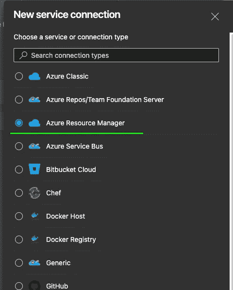
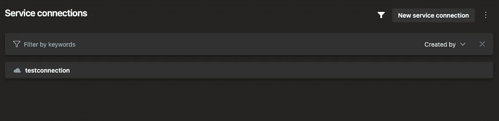
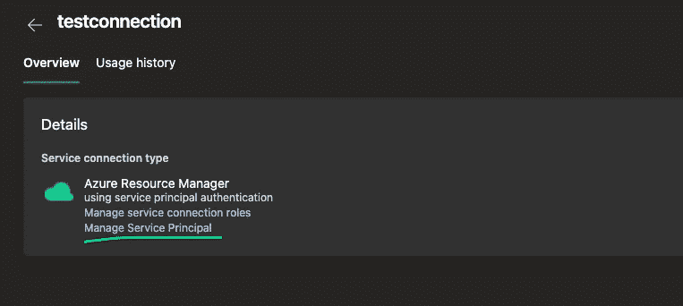
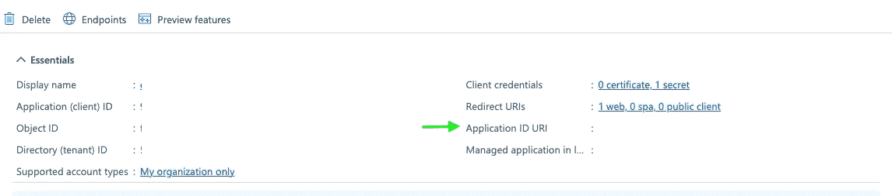
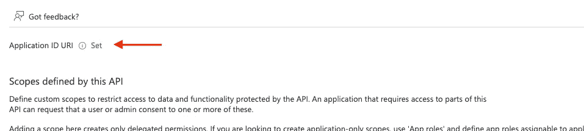
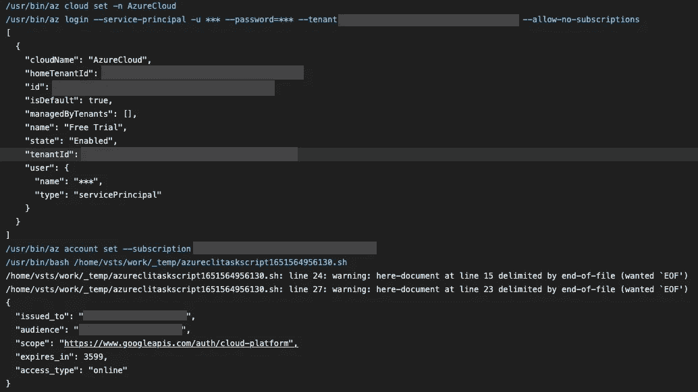

# 使用工作负载身份联合从 Azure DevOps 访问 Google Cloud APIs

> 原文：<https://medium.com/google-cloud/accessing-google-cloud-apis-from-azure-devops-using-workload-identity-federation-6acc5ad1a071?source=collection_archive---------0----------------------->


[摇滚猴子](https://unsplash.com/@rocknrollmonkey?utm_source=unsplash&utm_medium=referral&utm_content=creditCopyText)在 [Unsplash](https://unsplash.com/s/photos/robot-identity?utm_source=unsplash&utm_medium=referral&utm_content=creditCopyText) 上的照片

因此，在探索如何从 Azure DevOps 访问 Google Cloud APIs 时，我发现了一种方法，我想与您分享一下使用服务主体和服务连接的方法。为了自己实现它，你需要一个 Azure 订阅。一般来说，当使用谷歌云平台(GCP)时，你希望[避免导出服务账户密钥](https://cloud.google.com/iam/docs/best-practices-for-managing-service-account-keys#alternatives)。我们将使用 GCP [工作负载身份联盟](https://cloud.google.com/iam/docs/workload-identity-federation)来允许 Azure DevOps 管道访问 GCP API。

我的第一个方法是使用由 Azure DevOps 为每个作业提供的[作业访问令牌](https://docs.microsoft.com/en-us/azure/devops/pipelines/process/access-tokens)。但是发行者是以不符合 OIDC 的方式格式化的(没有领先的模式)，JWT 的公钥无处可寻，并且发行者没有在`.well-known/openid-configuration`下导出 openid 配置(事实上它没有公开任何 OIDC 配置)。所以这意味着现在，我们需要走另一条路。

在 Azure DevOps 中，您可以创建服务连接，这允许您使用服务主体与 Azure 进行交互。由于这依赖于 Azure Active Directory，它是一个 OIDC 兼容的身份提供者，所以这种方法将与工作负载身份联合一起工作。

## 在 Azure DevOps 和 Azure 中设置

请注意，我不是 Azure 专家。一个真正的 Azure 专家可能会对服务主体以及如何设置它们有自己的看法。

因此，为了设置好一切，请转到 Azure DevOps 项目，配置一个新的“Azure Resource Manager”(`Project Settings > Pipelines > Service Connections > New Service Connection`)类型的服务连接。



创建 Azure 资源管理器类型服务连接

使用新创建的或已经生成的服务主体进行设置。我选择了自动选项，因为它是向导推荐给我的。



接下来，我们需要从服务连接的服务主体中提取一些 id。选择您的服务连接，然后单击“管理服务主体”。这将把你带到 Azure 门户。



为了使 JWT 包含受众声明，您需要设置应用程序 ID URI

在接下来的步骤中，您需要捕获应用程序(客户机)ID 和目录(租户)ID。您还应该设置一个应用程序 ID URI，因此单击“添加一个应用程序 ID URI”，然后在下一个屏幕上单击“设置”。在我的测试中，如果没有应用程序 ID URI 集，JWT 不包含受众声明。



设置应用程序 ID URI，似乎对于这个流，建议的值是可以的

## Google Cloud 中的设置

在 GCP，我们需要为 Azure 订阅配置工作负载身份联合，并允许服务主体模拟 GCP 服务帐户。你可以在 [GCP 文档](https://cloud.google.com/iam/docs/configuring-workload-identity-federation#create_the_workload_identity_pool_and_provider)中找到一个关于如何设置它的很好的指南，所以我将在这里重点关注一个简短的指南，重点是我们需要什么来使 Azure DevOps/GCP 集成工作。

```
# Create a workload identity pool
gcloud iam workload-identity-pools create azure \
    --location="global" \
    --display-name="Azure"# Create a workload identity provider for the Azure Tenant
gcloud iam workload-identity-pools providers create-oidc azure \
    --location="global" \
    --workload-identity-pool="azure" \
    --issuer-uri="https://sts.windows.net/<azure_tenant_id>/" \
    --attribute-mapping="google.subject=assertion.appid" \
    --allowed-audiences="https://management.core.windows.net/"# Create a Service Account and allow the Azure Service Principal to access it
gcloud iam service-accounts create SERVICE_ACCOUNT_IDPRINCIPAL="principal://iam.googleapis.com/projects/<project_number>/locations/global/workloadIdentityPools/<pool_id>/subject/<azure_app_id>"gcloud iam service-accounts add-iam-policy-binding \
    SERVICE_ACCOUNT_ID@PROJECT_ID.iam.gserviceaccount.com \
    --member="$PRINCIPAL" \
    --role="roles/iam.serviceAccountUser"gcloud iam service-accounts add-iam-policy-binding \
    SERVICE_ACCOUNT_ID@PROJECT_ID.iam.gserviceaccount.com \
    --member="$PRINCIPAL" \
    --role="roles/iam.serviceAccountUser"
```

这里需要指出的是:我们使用服务主体的 App ID 作为属性映射的主题。

## 我们的 Azure DevOps 管道

请确保在服务连接的安全配置上，管道可以访问服务连接。下面是一个简单的示例管道，它使用 AzureCLI 任务来检索服务主体的 Azure 令牌，然后使用工作负载身份联合将其与服务帐户令牌进行交换。最后，调用一个内省端点来显示令牌工作正常。

```
name: $(Date:yyyyMMdd)$(Rev:.r)trigger:
  - mainstages:
  - stage: auth
    displayName: "GCP WIF Auth"
    jobs:
      - job: demo
        timeoutInMinutes: 20
        steps:
          - task: AzureCLI@2
            inputs:
              azureSubscription: '<service_connection_name>'
              scriptType: 'bash'
              scriptLocation: 'inlineScript'
              inlineScript: |
                SUBJECT_TOKEN_TYPE="urn:ietf:params:oauth:token-type:jwt"
                SUBJECT_TOKEN=$(az account get-access-token --query accessToken --output tsv)
                STS_TOKEN=$(curl --silent -0 -X POST [https://sts.googleapis.com/v1/token](https://sts.googleapis.com/v1/token) \
                    -H 'Content-Type: text/json; charset=utf-8' \
                    -d @- <<EOF | jq -r .access_token
                    {
                        "audience"           : "//iam.googleapis.com/projects/<project_number>/locations/global/workloadIdentityPools/<pool_id>/providers/<provider_id>",
                        "grantType"          : "urn:ietf:params:oauth:grant-type:token-exchange",
                        "requestedTokenType" : "urn:ietf:params:oauth:token-type:access_token",
                        "scope"              : "[https://www.googleapis.com/auth/cloud-platform](https://www.googleapis.com/auth/cloud-platform)",
                        "subjectTokenType"   : "$SUBJECT_TOKEN_TYPE",
                        "subjectToken"       : "$SUBJECT_TOKEN"
                    }
                EOF)
                echo $STS_TOKEN
                ACCESS_TOKEN=$(curl --silent -0 -X POST [https://iamcredentials.googleapis.com/v1/projects/-/serviceAccounts/](https://iamcredentials.googleapis.com/v1/projects/-/serviceAccounts/)<service_account_email>:generateAccessToken \
                    -H "Content-Type: text/json; charset=utf-8" \
                    -H "Authorization: Bearer $STS_TOKEN" \
                    -d @- <<EOF | jq -r .accessToken
                    {
                        "scope": [ "[https://www.googleapis.com/auth/cloud-platform](https://www.googleapis.com/auth/cloud-platform)" ]
                    }
                EOF)
                echo $ACCESS_TOKEN
                curl -H "Content-Type: application/x-www-form-urlencoded" -d "access_token=$ACCESS_TOKEN" [https://www.googleapis.com/oauth2/v1/tokeninfo](https://www.googleapis.com/oauth2/v1/tokeninfo)
```



管道的输出应该如下所示(我省略了标记的打印)

因此，现在您可以从 Azure DevOps 访问 Google Cloud APIs，而无需导出服务帐户密钥。我认为这种方法非常好，因为你可以在 Azure DevOps 中对哪些管道可以访问服务连接进行适当的权限控制。可能还有一些改进的空间，但这给了你一个好的起点。