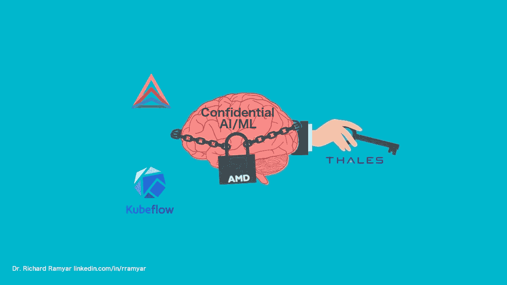
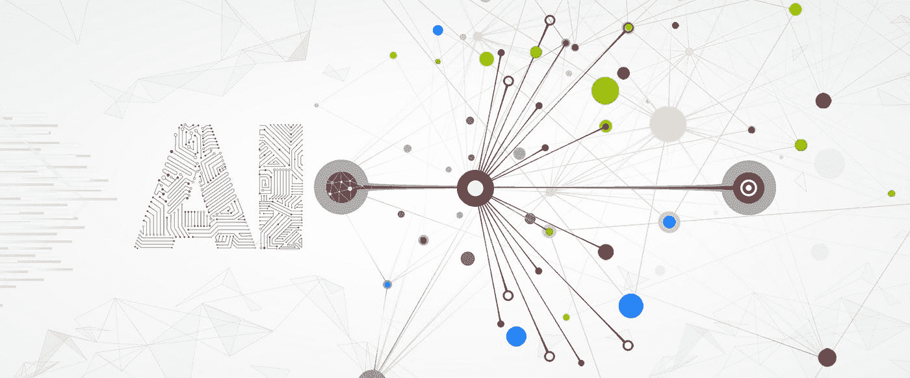
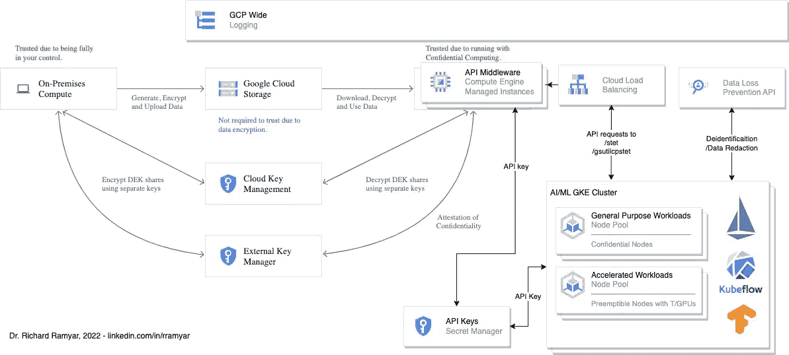
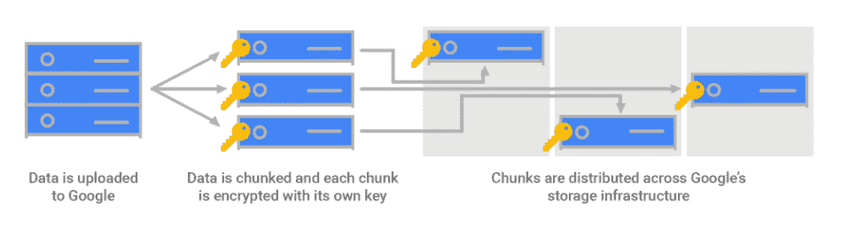
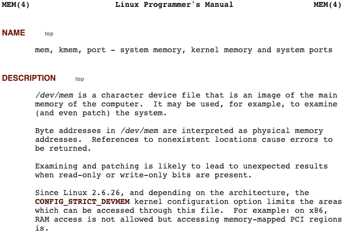
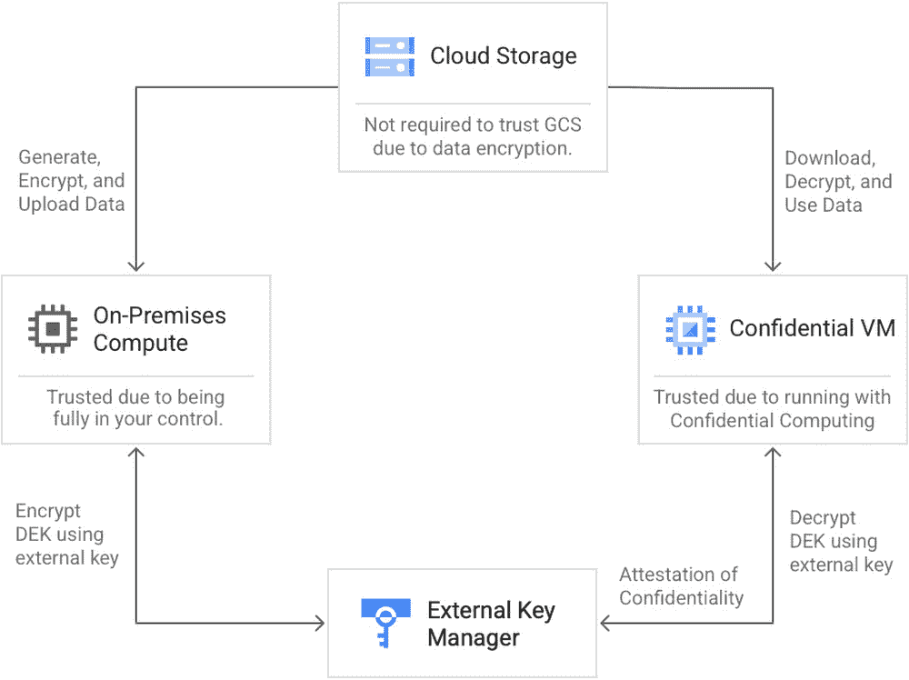
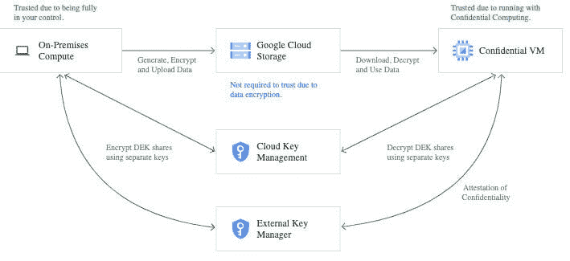
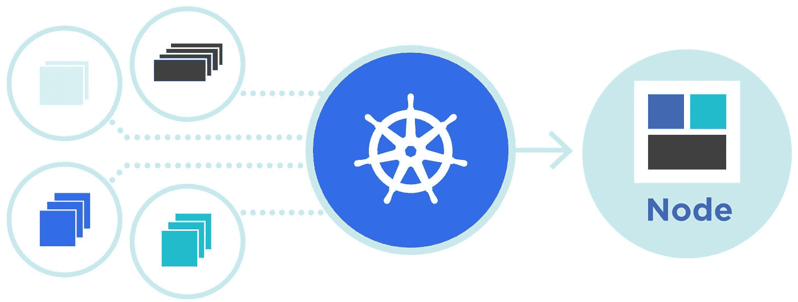
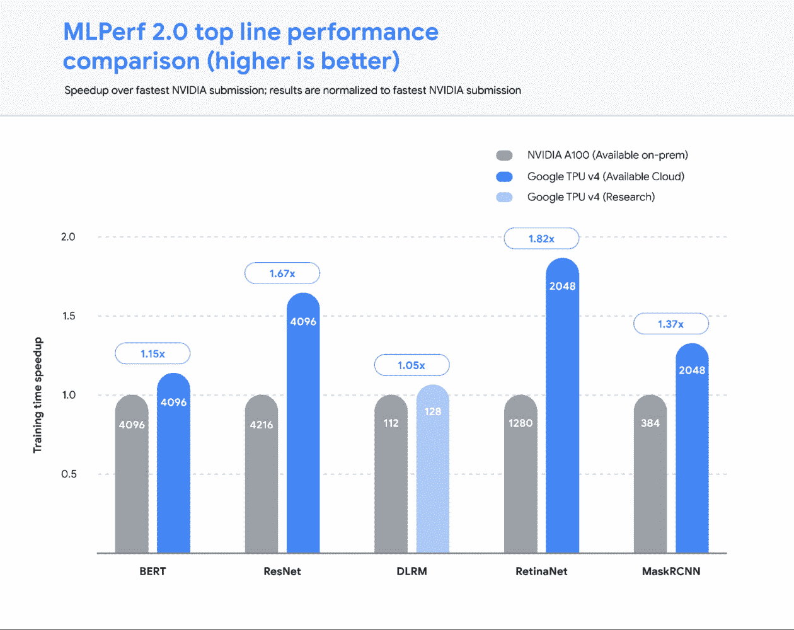
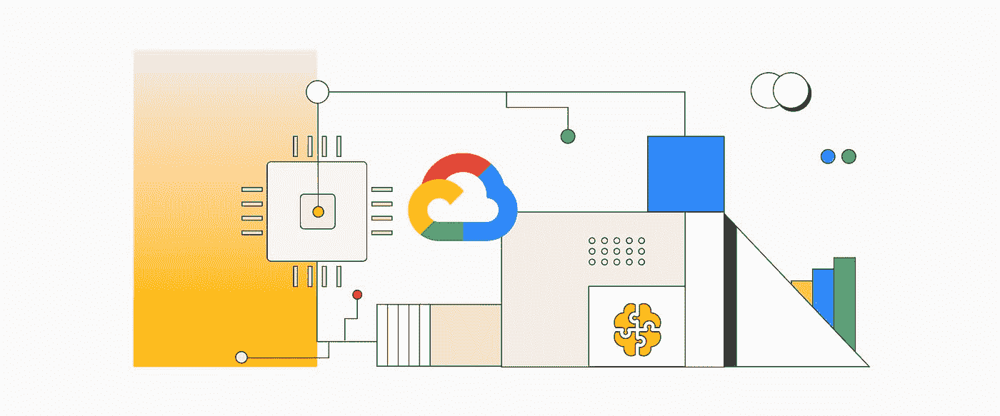

# 借助无处不在的数据加密技术的进步，实现保密和规避风险的 AI/ML

> 原文：<https://medium.com/google-cloud/achieving-confidential-and-risk-averse-ai-ml-with-advances-in-ubiquitous-data-encryption-8c9b251c48cd?source=collection_archive---------2----------------------->



*(本文原载于 LinkedIn，其中还链接了一段说明视频)*

云规模 AI/ML 解决方案按需提供无与伦比的容量和速度，但一些组织出于隐私、数据主权或安全考虑，不允许其工程师考虑这些解决方案。无论是出于商业还是文化原因，对保证的需求甚至可能超过监管要求。更严格地说，端到端数据加密无处不在，通过独特地结合来自谷歌云平台、AMD 和 Thales 等组织的解决方案，工程师可以提供保证。这些安全收益没有得到充分开发和理解，更不用说它们在规避风险的 AI/ML 环境中的潜力了。

具有讽刺意味的是，要实现这种保密性，还有一个障碍。Cloudnative，secured containerisation 与机器内存加密所需的硬件不兼容。我们提出了一种新的中间件 API 方法来解决这个问题，并考虑了 vTPM 加密证明在引导时的作用、Linux 内核选项和 T/GPU 可用性。

*   隐私、数据主权和商业问题人为地降低了人工智能/人工智能的胃口
*   成为贵组织的加密 AI/ML 提供商可提供安全的控制
*   查明加密故事中缺失的环节
*   使用无处不在的数据加密为机密数据带来 AI/ML
*   cloud native catch 22:container ization 是无处不在的数据加密的安全屏障
*   让机密 AI/ML 架构适合云原生工作负载
*   进一步阅读



AI/ML 解决方案的商业前景已经在一系列领域得到了充分证明，从预测分析和文档处理到语言和视频分析。云规模解决方案按需提供无与伦比的容量和速度，但一些组织不放心考虑它们的潜力。#隐私、#数据主权或#安全问题可能会面临棘手的障碍——云服务提供商(CSP)本身需要的隐性信任，以及在云中托管公共#AIML 计算的管辖权选择。#MachineLearning 的覆盖范围不断扩大，增加了可能受益但需要保证的群体数量。在关注还没有说出来或者对 AI/ML 的考虑还不成熟的地方，AI/ML 的潜在用途甚至可能不会公开。

通过[# Google cloud platform](https://www.linkedin.com/feed/hashtag/googlecloudplatform)([# GCP](https://www.linkedin.com/feed/hashtag/gcp))在 CPU 级内存加密和条件加密密钥访问方面的进步，为规避风险或对管辖权敏感的 AI/ML 使用开辟了新的可能性。这一未被充分利用且鲜为人知的机会已经被用于金融服务领域，并提供了比通常在云中更全面的数据 [#EndToEndEncryption](https://www.linkedin.com/feed/hashtag/endtoendencryption) 。CSP 控制可以阻止密钥访问，改进的管辖控制可以强制 [#cloudnative](https://www.linkedin.com/feed/hashtag/cloudnative) AI/ML 满足您的数据主权需求。同时保持非批处理工作负载所需的无与伦比的云可扩展性和按需速度。

我们下面要解决的架构挑战是如何将这些技术应用于现代集装箱工作负载，解决 GCP 提供的解决方案中不可避免的限制。这是因为涉及到你的容器不应该与之对话的硬件。我们提出了 API 中间件，并谈到了为什么 vTPM 加密证明的 GCP 操作日志是不够的。我们还简要探讨了 Linux 内核参数，即使在实例内存 [#encryption](https://www.linkedin.com/feed/hashtag/encryption) 不可用的情况下(例如，与 G/TPU 硬件一起)，这些参数也应该提供充分的保证。

下文将在本文后面解释，并且无疑可以改进。任何建议，意见和差距或错误的识别将不胜感激。



# 隐私、数据主权和商业问题人为地降低了人工智能/人工智能的胃口

与国家安全相关的金融服务、医疗保健和其他行业在信任第三方系统及其数据或分析方面仍会自然保守。云毕竟是“别人的电脑”。这种不安甚至可能是一个组织、部门或团队的文化，当 GCP 等提供商定期满足严格的合规标准时，这种不安就会持续存在，包括 ISO、FedRamp、HIPAA、PCI/DSS、EBA、ESMA、PRA 和其他与云外包相关的法规和标准。API 提供的 CSP 服务也不能幸免于此，这与机器学习非常相关。预装的最先进的 GCP 人工智能/人工智能服务是通过公共 API 以编程方式访问的，这些 API 是由不分配给你的安全“公共”计算提供的。

# 成为贵组织的加密 AI/ML 提供商可提供安全的控制

充当您组织的 cloudnative AI/ML 服务提供商是可行的备选方案——从您的私有集群构建、测试、服务和管理模型。这些可以在混合或多云# [Anthos](https://cloud.google.com/anthos) 环境中，或者在谷歌 Kubernetes 引擎( [#GKE](https://www.linkedin.com/feed/hashtag/gke) )上。虽然比使用谷歌的开箱即用 API 更麻烦，但这种越来越常见的方法通过标准的开源平台，如 [#Kubeflow](https://www.linkedin.com/feed/hashtag/kubeflow) (建立在 Knative 等技术上，用于私有 cloudnative 体验)，为您的机器学习工程师和基础设施管理员提供高效和可扩展的控制。快速浏览一下这个私有 GKE 集群解决方案的更广泛的安全状况，可以发现它解决了我们在本文开头提到的许多问题。但不完全是，我们将会看到。



即使不考虑 GCP 100 亿美元的网络安全计划，加密和 T2 密码术也是这个平台所固有的。您自己的 [#cloud](https://www.linkedin.com/feed/hashtag/cloud) 集群可以从引导固件和序列的加密签名和散列的机器完整性测试中受益(它们在屏蔽计算实例中聚集在一起，也可以部署为 GKE 屏蔽节点)。然后，您知道您的虚拟机本身没有受到干扰，即使是受到损害的虚拟机管理程序。存储中的静态数据总是加密的。还有增加云上和云下控制程度的选项，比如集成外部 [#keymanagement](https://www.linkedin.com/feed/hashtag/keymanagement) 系统或者直接提供你自己的密钥。此外，存储的数据被分块存储在不同的位置，每个数据块都单独加密，以防止谷歌文件系统 Colossus 遭到破坏。从你的机器的角度来看，数据也在网络层(第 3 层)进行加密，这一切都发生在 GCP 的 Andromeda 软件定义网络(SDN)上。作为其基础的旋转密钥由身份验证安全令牌补充，这是欺骗数据包无法模仿的。 [#ZeroTrustSecurity](https://www.linkedin.com/feed/hashtag/zerotrustsecurity) 规程可以在微服务之间进一步加密，比如在 Istio 或者其他服务 mesh 框架内使用 MTL(不限于容器化的工作负载)。GCP 的网络吞吐量[是其他 CSP 的三倍](https://www.cockroachlabs.com/blog/2021-cloud-report/)(部分原因是定制的 NIC 硬件从 CPU 上卸载了加密)。以及您在 GCP 地区的集群和您选择的司法管辖区(相对于 GCP AI/ML API 位置，这里的“全球”、“美国”或“欧盟”位置对于您的数据主权需求来说可能过于宽泛)。

# 查明加密故事中缺失的环节

所有上述控制和加密是至关重要的保证和最佳实践。适用于监管场景的防弹设计。但是在上面概述的传统云加密链中有两个漏洞。

首先，机器存储器本身是未加密的。这导致恶意行为者获取正在处理的未加密数据的可能性极小，这些数据在存储和传输过程中经过了精心加密。这可能是假设发生的，因为谷歌部署的无数安全措施遭到破坏。或者是因为一个新的 CPU 级别或 KVM/QEMU 虚拟机管理程序漏洞在被发现和修补之前就被利用了，从而允许某人在自己的虚拟机之外探索裸机主机。



用 [#Linux](https://www.linkedin.com/feed/hashtag/linux) 的术语来说，让我们阐明自由探索你的虚拟机或公共服务的内存是不可能的。在主流 Linux 发行版中，默认情况下不支持对/dev/mem 或/dev/kmem 的直接访问。分别地，主内存访问需要在[#内核](https://www.linkedin.com/feed/hashtag/kernel)中故意禁用 [CONFIG_STRICT_DEVMEM](https://www.kernel.org/doc/man-pages/online/pages/man4/mem.4.html) ，访问整个内核虚拟内存空间需要启用 [CONFIG_DEVKMEM](https://www.kernel.org/doc/man-pages/online/pages/man4/mem.4.html) 。最佳实践也是在 GCP 上启动 Linux 映像的[要求。x86 系统上的](https://cloud.google.com/compute/docs/images/building-custom-os#kernelbuild) [nopat](https://www.kernel.org/doc/Documentation/admin-guide/kernel-parameters.txt) 内核参数也不应该有意启用页面属性表，因为这样会减轻恶意的内存探测。GCP 用于 GKE 节点的[容器优化操作系统](https://cloud.google.com/container-optimized-os/docs/concepts/security)有一个超过这些标准的强化方法。鉴于引导加载程序是操纵内核引导选项的最直接的方式，还值得注意的是，所有这些 [#LinuxKernel](https://www.linkedin.com/feed/hashtag/linuxkernel) 选项的完整性都受到 UEFI measured-boot hashing 在 [GRUB](https://lists.gnu.org/archive/html/grub-devel/2017-07/msg00003.html) 上下文中的保护。人们可以合理地假设，以上所有以及更多都是谷歌裸机的默认做法，其他一切都在裸机上运行。

第二，CSP 仍然需要与管理和访问用于解密或签名的密钥相关的剩余信任级别。如果您将外部管理的加密密钥集成到 GCP 云 KMS 中，这种必要的信任也同样适用。在最基本的情况下，如果 GCP 向他们或您的内部部署系统索要密钥，GCP 会得到一个密钥。在此之上的许可控制来自基于角色的 GCP 身份访问管理(IAM)和 GCP 元数据。对 IAM 本身和元数据供应的假设违反需要足够具体或足够广泛，以实现访问 1) GCP 的云密钥管理系统(云 KMS)和/或 2)通过云外部密钥管理(EKM)集成到云 KMS 访问内部 [#KMS](https://www.linkedin.com/feed/hashtag/kms) 。

简而言之，跨虚拟机实例探索内存几乎是不可能的。某些形式的攻击还需要物理访问场所，这[更不可能](https://www.youtube.com/watch?v=kd33UVZhnAA)。许多将意味着一个严重的预先计划的复杂程度——也许需要国家赞助。现实情况是，主要的云提供商超出了几乎任何组织可以独自实现的安全级别和一致性。此外，在上述假设的可能性中，还有许多未言明的“如果”。

尽管如此，零信任安全作为一门学科存在是有原因的。从 [Meltdown 和 Spectre](https://meltdownattack.com/) 到 [hypervisor 漏洞](https://googleprojectzero.blogspot.com/2021/06/an-epyc-escape-case-study-of-kvm.html)，‘未知的未知’不会预先宣布它们自己。这意味着需要加密内存计算来进一步增强云安全性，而不仅仅是针对[#人工智能](https://www.linkedin.com/feed/hashtag/artificialintelligence)工作负载。已经满足的需求…

# 使用无处不在的数据加密为机密数据带来 AI/ML

硅巨头通过加密内存解决方案满足了这一市场需求，这也为更普遍的端到端加密开辟了一种新的 CSP 阻塞密钥管理模式。这些收益没有得到充分开发和理解，更不用说它们在规避风险的人工智能/人工智能环境中的潜力了。通常，GCP 提供的基于 API 的服务仍然是企业人工智能/人工智能对话中唯一的一等公民。最初考虑机器学习的可能性时，不要忽略共享的公共 CSP 计算选项。

虚拟机内存加密减少了 CSP 中所需的隐式信任，因为读取系统内存基本上变得不可能。这可以在不改变代码或执行速度的情况下直接放到大多数堆栈中，因为这是 CPU 级别的特性。GCP 通过 GCP N2D 和 C2D 机器类型中的 EPYC 罗马和米兰一代 CPU 实现了这一点。机密虚拟机实例可以用作独立的谷歌计算引擎(GCE)虚拟机，也可以用作 GKE 集群(包括 Anthos)中的机密节点。这些处理器使用 AMD [安全加密虚拟化(SEV)](https://developer.amd.com/sev/) 技术对内存进行加密，从而将其安全内存加密(SME)技术开放给 KVM 实例。内存加密密钥是在虚拟机创建期间生成的，并不存储在 AMD 芯片之外，这意味着谷歌在设计上无法访问它们。



来自 GCP 的令人兴奋的发展是，现有的技术可以创新地结合起来，超越端到端加密，实现谷歌所说的[# ubiquitousdatacryption](https://www.linkedin.com/feed/hashtag/ubiquitousdataencryption)([# UDE](https://www.linkedin.com/feed/hashtag/ude))。外部内部 KMS 可能已经通过[云 EKM](https://cloud.google.com/kms/docs/ekm#supported_partners) 连接到云 KMS，这意味着 GCP 服务可以依赖于外部管理的加密密钥。当机密实例与 EKM 结合时，GCP 看不到保存在加密内存中的临时密钥，也看不到数据解密/加密操作所需的临时密钥(可能用于数据块、对象或文件级存储)。外部 KMS 访问也可以锁定到特定的实例、特定的区域、特定的项目。这降低了 GCP IAM 漏洞的爆炸半径，并由外部 KMS 测井(可用于 SRE 自动化和警报)补充。 [VPC 服务控制](https://cloud.google.com/vpc-service-controls/docs/supported-products)也可能在限制访问云 EKM 方面发挥作用。但是存储器加密密钥隐藏的好处不能预先作为外部 KMS 的要求来实施。实例配置选择由 GCP 决定，不会阻止非机密虚拟机成功访问外部 KMS。GCP 现在已经弥补了这个缺口。



新的魔力来自于[进一步锁定外部 KMS](https://thalesdocs.com/ctp/cm/2.9/reference/cckmapi/ekm-apis/index.html#example-response_1)，EKM 访问以加密内存硬件发出请求为条件(最初仅由 [#Thales](https://www.linkedin.com/feed/hashtag/thales) CipherTrust 云密钥管理器支持)。因此，短暂的存储密钥访问可以锁定到加密的内存实例，进一步减少了 GCP 所需的隐式信任。[密钥访问策略](https://thalesdocs.com/ctp/cm/2.9/reference/cckmapi/ekm-apis/index.html#example-response_1)也可以由您的本地 KMS 单独控制加密和解密操作(例如，可能信任未加密内存的本地工作负载)。GCP 为这样的关键操作提供了一个客户端工具[,它也直接集成到了谷歌云存储(GCS)对象的 gsutil 中。用于 AI/ML 模型生成的数据湖通常理想地保存在](https://github.com/GoogleCloudPlatform/stet) [#ObjectStorage](https://www.linkedin.com/feed/hashtag/objectstorage) 上，这使得该特性对上面讨论的私有 AI/ML 集群具有直接的重要性。为了进一步保证，可以部署分割信任方法，其中秘密被[分割成多个部分](https://en.wikipedia.org/wiki/Shamir%27s_Secret_Sharing)，授权必须由 GCP 云 KMS 和外部 KMS 通过 EKM 授予。这种全面的 UDE 方法已经在现场成功部署，一个例子是[德意志银行](https://cloud.google.com/blog/products/identity-security/ubiquitous-data-encryption-on-google-cloud)。

我们可以看到我们已经解决了开始时的问题。Cloudscale AI/ML 的可能性不需要受到隐私、数据主权或安全问题的阻碍。可扩展的按需专用 GKE 节点池可以在特定的国家管辖区部署加密内存，取代云中的公共 AI/ML 计算。云最佳实践已经可以满足监管期望，但是额外的加密保护为文化风险厌恶者或特定的业务需求提供了 24 克拉的安全性。通过 UDE，CSP 所需的隐性信任可以大大减少，而控制力会增加。

下一步是克服该解决方案不可避免的技术限制。

# cloud native catch 22:container ization 是无处不在的数据加密的安全屏障

我们下面要解决的复杂问题是，GCP 工具必须作为根用户在机密虚拟机上运行。但是在 GKE 或 Anthos 实现中，以 root 用户身份运行容器是不可用的。出于良好的安全原因，最佳实践不允许特权容器。

AI/ML 工作负载可以直接部署在自动扩展的托管实例组(MIG)上，而不需要容器化来解决这个问题。这是一个合理的解决方案，但在云原生计算的世界中是一个现实的问题。 [#Kubernetes](https://www.linkedin.com/feed/hashtag/kubernetes) 是像 Kubeflow 这样的公司的 [#MLops](https://www.linkedin.com/feed/hashtag/mlops) 工作流和编排所必需的，在整个模型生命周期中提供了大量的实际收益。与仅仅构建和部署的传统软件不同，模型必须不断地被策划以保持预测能力。模型和版本的蔓延也必须得到相应的管理。

好奇者:这些根特权是必需的，因为必须核对硬件环境，特别是要用密码证明发出请求的虚拟机是机密实例。我们假设这需要访问/proc/cpuinfo、/dev/tpm0 和/或/dev/tpmrm0。目前尚不清楚哪些用于远程证明中使用的特别检查(由[安全嵌套分页(SNP)](https://www.amd.com/system/files/TechDocs/SEV-SNP-strengthening-vm-isolation-with-integrity-protection-and-more.pdf) 在启动时测量 boot 捕获 SEV 状态后执行)。可以选择使用 GCP Ops 日志记录，其中包含在引导时进行的 vTPM 证明。这在我们的机密计算场景中是不合适的。我们需要在不重启的情况下对请求进行特别证明，而 GCP 运营仍然依赖于对 CSP 系统的隐式信任。

# 让机密 AI/ML 架构适合云原生工作负载



安全集装箱化是实现 UDE 的一个障碍，所以我们能做什么？如上所述，我们可以放弃 kube flow type[# architecture](https://www.linkedin.com/feed/hashtag/architecture)的 cloudnative 收益，而仅仅将模型直接部署到 MIG。如果这是不可接受的，我们建议的解决方案是组装非常简单的中间件，在自动扩展 MIG 中的原始虚拟机上运行不受限制的 API。MIG 端点可以被防火墙保护，以仅通过 GCP 内部 Https 负载平衡进行应答(“ing and not”er，因为 GCP LBs 是 SDN 堆栈的一部分，其本身不是平衡器)。这将允许私有集群上运行的其他容器化工作负载通过 REST 或 gRPC 运行 UDE 操作或请求 GCS 上的 UDE 保护对象数据。还增加了一层“通过模糊来获得安全感”


这种方法保持了云的可扩展性。根据实际负载，MIG 中的机器数量将会增加或减少。值得注意的是，非批量数据分析场景对网络吞吐量更敏感。实例模板必须考虑到这一点，通过[选择机器形状](https://cloud.google.com/compute/docs/machine-types#machine_type_comparison)以获得及时的结果，因为最大带宽范围从 10 到 100Gbps。中间件 API 机器的配置可以由 cloudinit 部署，无论是运行 bash、ansible、puppet 还是其他脚本。用于加密和解密操作的 GCP UDE 工具的 [YAML 配置保存在~/。每个托管实例上的 config/stet.yaml(包括是否使用拆分键)。](https://github.com/GoogleCloudPlatform/stet/blob/main/docs/advanced_configuration.md)

在这个 MIG 上创建到 UDE 的 API 的一个“快速而肮脏”的方法是打开两个 https 端点来监听 post 请求。将中间件请求记录到每个虚拟机的系统日志将确保它们被自动收集到 GCP 日志中，以进行手动分析或自动化。命令行工具本身必须由 API 在后台使用，因为在撰写本文时，UDE 功能尚未集成到 GCP SDK 中:

1.  /stet 端点将从 GCP 工具运行 stet 命令，使用 UDE 保护密钥进行直接加密和解密，加密内存虚拟机上的客户端库将通过云 EKM 访问这些密钥。端点有三个参数 API 密钥、操作符类型(加密/解密)和操作数(base64 格式的文件)。
2.  /gsutilcpstet 终结点将运行带有–stet 标志的 gsutil cp 命令，该命令在一个命令中自动完成从 GCS 和 UDE 操作的对象传输。端点有三个参数 API 键、源和目的地。对于解密，源是 gs://对象位置，API 响应将包含 base64 格式的文件。对于加密，源是 base64 格式的文件，目标是 gs://对象位置。Base64 编码支持 blobs，如图像。可以在 GKE 节点本身上执行桶和对象的导航，因为查看 GCS 名称或元数据不需要关键字，只需要适当的 IAM 特权或访问范围。

还有一些额外的技术要点需要工程师考虑。gsutil 的 STDOUT 目前不能通过管道传输，因此可以在 bash 序列中调用它，如下所示:

```
destination="$(urlencode $source)"$EPOCHREALTIME; \gsutil cp --stet "gs://$source” $destination; \base64 $destination
```

在生成输出时，STDOUT 应该流式传输到 http，并且在完成之前不会被阻塞。否则，内存使用量将会激增，因为 base64 编码版本将一直保存在内存中，直到完全生成并准备好提供服务(数据归档可能非常大)。例如，[节点](https://www.npmjs.com/package/stdout-stream)和 [golang](https://github.com/go-cmd/cmd) 的相关模块似乎存在(应该评估这些模块是否具有适当的内存行为，即它们不会用自己的缓冲有效地覆盖最大外壳屏幕缓冲)。您还需要确保服务于端点的守护进程没有强加最大 http 响应大小。还可以考虑一个额外的端点或另一种方法来支持多个文件传输或 gsutil rsync(上述方法中的通配符下载和解密在 base64 编码阶段会失败)。您还可以考虑在服务网格中创建[外部服务条目](https://istio.io/latest/docs/tasks/traffic-management/egress/egress-gateway/#egress-gateway-for-https-traffic)，比如 [#Istio](https://www.linkedin.com/feed/hashtag/istio) /Anthos SM(指向 GCP 负载平衡端点)。或者，您可以完全取代 GCP 负载平衡，[在虚拟机](https://istio.io/latest/docs/setup/install/virtual-machine/)上安装 Istio，并利用# mTLS 提高 Istio 负载平衡的安全性(在 GCP LBs 上[不可用)。](https://cloud.google.com/load-balancing/docs/ssl-certificates#ssl-certificate-limits)

访问中间件的 API 密钥可以在 GCP 秘密管理器中存储和管理，对其的读取访问可以被[锁定](https://cloud.google.com/secret-manager/docs/access-control#conditions)到仅由 1)要保护的 API 中间件管理的实例和 2)允许访问中间件的 GKE 节点池使用的服务帐户。必须注意确保策略不允许模拟这些服务帐户，并且可以再次使用 VPC 服务控制。这里需要有一个平衡——这是通过使用 CSP 服务将对 GCP 的隐性信任重新提升到正常水平的唯一一点。但是真正的好处是通过服务帐户锁定对允许的 GKE 节点池的访问。坦率地说，同样值得注意的是，GCP 秘密和关键管理人员的安全绝对关系到谷歌平台的可信度。或者，可以集成第三方秘密管理器，可能包括基于硬件的安全模块(HSM)。

另一个需要考虑的因素是，GKE 机密节点目前不提供 T/GPU 硬件。这似乎不是什么大问题。并非所有的机器学习模型都从训练的硬件加速中受益匪浅(深度学习是一个主要的例外)。这意味着机密节点仍然适合于训练和服务多种类型的模型。



在不可避免地需要 T/GPU 的情况下，带有加速器的非机密可抢占节点池可以用于深度学习模型训练。这种未加密内存实例的使用并不妨碍交易，原因有很多——非机密节点对 UDE 收益的稀释可能是最小的、暂时的，并且具有有限的爆炸半径。首先，可抢占节点尽可能短暂(持续最长 24 小时，相比之下，点节点或正常节点持续更长时间)。您无法预先预测可抢占实例将在哪些 GCP 裸机上启动，并且它们会随着机器抢占而不断变化。这破坏了许多形式的攻击。为了增强这一功能，还可以按照随机的定期计划清空节点，然后直接删除它们的实例，让 GKE MIG 自动重新创建它们。其次，T/GPU 非机密节点内存仍然受到上面概述的 Linux 内核内存保护的保护，在 GKE 节点上运行的容器优化操作系统超过了这一保护。第三，训练数据很少需要包含个人身份信息或其他机密信息。如有必要，还可以使用 GCP 的云数据丢失预防 API (DLP)进行编辑，该 API 符合[严格的监管和行业标准](https://cloud.google.com/dlp/docs/support/data-security#certifications)、第三方产品或开源解决方案。第四，即使模型必须受益于 T/GPU 训练，非加速的高性能机密节点也可以提供服务。那些可以由机密节点提供服务的模型不受影响，因为它们仍然由加密的内存提供服务。

以上无疑可以改进。任何建议，意见和差距或错误的识别将不胜感激。

[*(本文原载 LinkedIn)*](https://www.linkedin.com/pulse/achieving-confidential-risk-averse-aiml-advances-data-ramyar/)

# 进一步阅读

*   [CipherTrust 数据安全平台现在允许用户控制由谷歌云的机密计算处理的数据的加密密钥](https://cpl.thalesgroup.com/blog/encryption/google-ubiquitous-data-encryption-ekm)， [Leonor Jones](https://www.linkedin.com/in/leonor-jones-b157891?miniProfileUrn=urn%3Ali%3Afs_miniProfile%3AACoAAABK7wEBCXrnK8mPTc1rSkzGfJCJ_XbW6pY) ，Thales，2021
*   [通过无处不在的数据加密更加信任谷歌云](https://cloud.google.com/blog/products/identity-security/ubiquitous-data-encryption-on-google-cloud)，[李一星](https://www.linkedin.com/in/ilsung?miniProfileUrn=urn%3Ali%3Afs_miniProfile%3AACoAAABbc28Bdjmaedp_F0XLwcrC955vsRNI7RE)，[阿诺什·萨博里](https://www.linkedin.com/in/anoosh-saboori-30619737?miniProfileUrn=urn%3Ali%3Afs_miniProfile%3AACoAAAeuBfYBAMrUiGEBs_BnS_5tzMQPCilO4Q4)，谷歌云博客，2021 年
*   [使用分裂信任加密工具促进无处不在的数据加密](https://cloud.google.com/compute/confidential-vm/docs/ubiquitous-data-encryption)，谷歌云文档，2021 年



博士[理查德·拉姆亚尔](https://www.linkedin.com/in/rramyar/)，2022(商标和原始图像是其各自所有者的财产)

相关服务见[https://www.wipro.com/cloud](https://www.wipro.com/cloud?utm_source=RichardRamyarLinkedInBlog&utm_campaign=RichardRamyarLinkedInBlog)和[https://www.wipro.com/cybersecurity](https://www.wipro.com/cybersecurity?utm_source=RichardRamyarLinkedInBlog&utm_campaign=RichardRamyarLinkedInBlog)

访问学者(荣誉)@ [伦敦银行和金融学院](https://www.libf.ac.uk/) / [LIBF 治理、风险和监管中心](https://risk.libf.ac.uk/) / [LIBF 数字银行和金融中心](https://digital.libf.ac.uk/)

我的观点不一定代表任何雇主、客户或其他相关组织的观点