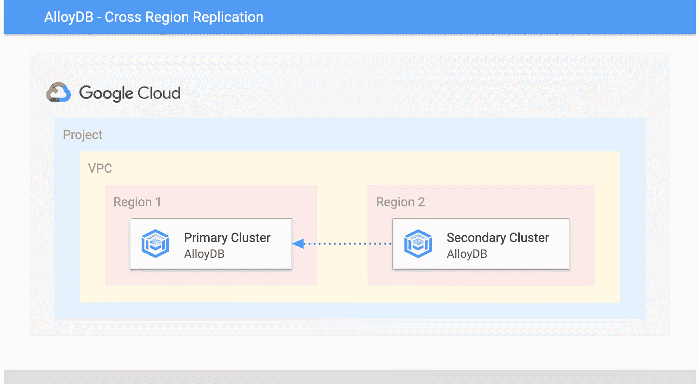
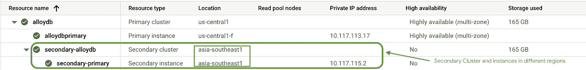
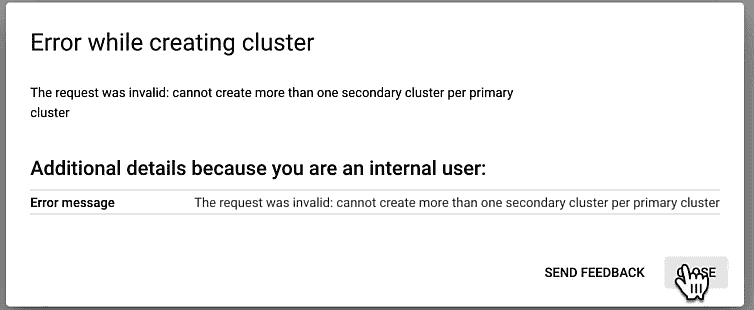
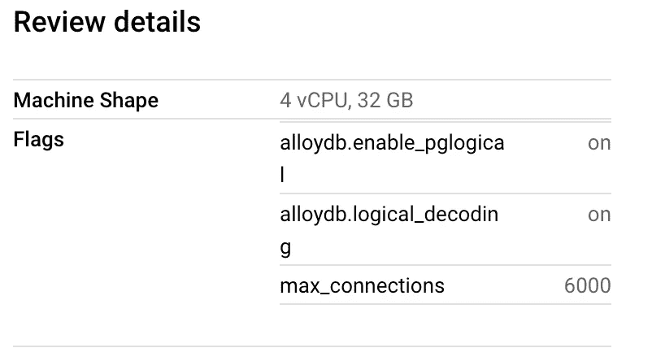
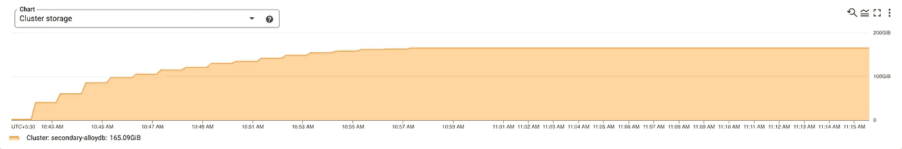
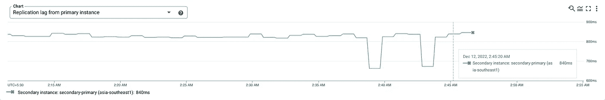
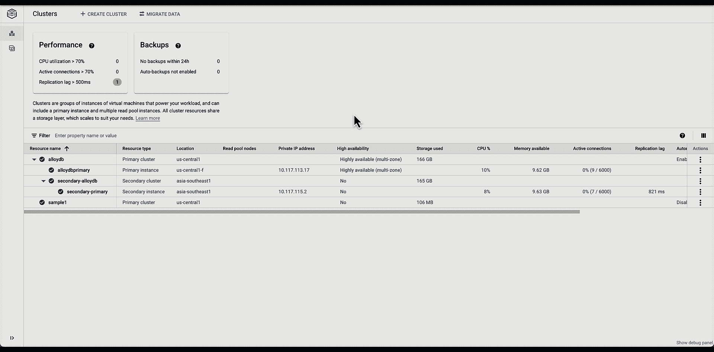
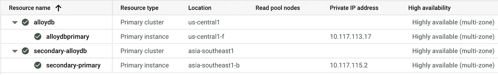

# 利用 AlloyDB 跨区域复制实现全球可靠性

> 原文：<https://medium.com/google-cloud/achieving-global-reliability-with-alloydb-cross-region-replication-3a67c6130c27?source=collection_archive---------3----------------------->

最近，lloyDB for PostgreSQL 宣布支持跨区域复制，以便跨区域复制主集群数据和资源。跨区域复制支持在主区域停机时为灾难恢复做准备。



Alloy DB —初级次级跨区域复制

AlloyDB 的快照，带有二级跨区域集群和实例。



AlloyDB 跨区域复制。

跨区域复制是在主区域停机时确保业务连续性的一项关键功能。通过支持将数据移动到更靠近区域的位置，它有助于减少网络延迟并提高性能。跨区域复制控制着克服区域中断和跨区域优化性能的设计原则。

*请注意，AlloyDB 仍处于预览阶段，所有观察都是为了支持，不应该用于生产。*

## 创建次级跨区域集群。

让我们看一下跨区域创建次级群集的步骤。


创建 AlloyDB —跨区域复制。

H 尝试创建多个辅助集群将导致错误或异常。



启用跨区域复制时，它将使用主区域中所有相似的数据库标志创建新的集群和实例。



查看-创建次级区域。

它在新的区域中以单独的二级存储开始初始回填过程。



二级区域存储—回填

## 具有复制延迟的写/读。

辅助群集和实例用于只读操作。不允许写入这些实例。

```
postgres=> create table test1 (col1 integer);
ERROR: cannot execute CREATE TABLE in a read-only transaction
```

让我们考虑一下向主节点写入数据并从辅助节点读取数据的场景。我们将创建一个新表，用示例数据填充它，然后从辅助实例查询该表。


与辅助群集相关联的辅助实例可以通过使数据更靠近区域来加速跨区域读取并减少总体网络延迟。

对于跨区域复制，一个关键指标是复制延迟。它主要意味着

> 辅助群集中的辅助实例和关联主群集中的主实例之间的复制滞后。



通过监视复制延迟，您可以测量当前的延迟，并决定是否应将跨区域辅助群集提升为主群集。

## 提升辅助集群。

让我们看看如何从控制台将辅助集群提升为其所在区域内的主集群。



辅助群集将在其区域内升级为主群集，但以前的主群集及其实例不会降级为辅助群集。如果我们需要为新升级的群集重新定义辅助跨区域复制，我们将需要根据区域首选项创建它。



升级后-辅助集群及其资源。

## 主群集的故障转移及其对辅助群集的影响。

为了演示辅助集群在主集群的故障转移情况下的行为，我们将设置一个演示，连接到主和辅助实例，并从 psql 客户端每隔 1 秒运行一次 SQL 查询。

这将使我们能够了解在主集群出现故障时，辅助集群如何接管主集群。

> select clock _ timestamp()；
> \手表 1

在两个实例上运行 sql 后，我们将在主实例上启动故障切换。


主实例上的故障转移— AlloyDB。

在主群集的故障转移期间，对主实例的连接中断最少。但是，到辅助群集资源的连接不会受到影响。

## 摘要

AlloyDB 跨区域复制允许用户从不同区域的主集群创建辅助集群和实例，以便在主区域发生故障时提供资源。辅助群集和实例是主群集及其资源的只读副本。如果主群集出现故障，辅助群集可以升级为主群集。