# 使用 Kerberized 化的 Dataproc 集群设置 Active Directory

> 原文：<https://medium.com/google-cloud/active-directory-setup-with-kerberized-dataproc-cluster-dd0da6987d7d?source=collection_archive---------1----------------------->

在之前的[帖子](/google-cloud/getting-started-with-kerberized-dataproc-clusters-with-cross-realm-trust-222d991660dd)中，我们提供了一个 terraform 模块，用于使用 Kerberos 部署 Dataproc 集群，并与麻省理工学院 KDC 分校合作管理用户/服务帐户主体。虽然麻省理工学院 KDC 分校提供了快速运行的能力，但在企业中更常见的是使用现有的身份管理系统，如 Active Directory，用于管理用户和服务帐户主体，以便通过 Hadoop 进行身份验证。

虽然我们可以使用 terraform 自动完成这一部署，但在本文中，我们将手动完成以下步骤，以熟悉这些概念。

1.  安装 Active Directory 域服务(域控制器)
2.  创建一个对 AD DS 单向信任的 Dataproc 集群
3.  创建一个带有密码的用户和一个带有密钥表的服务账户主体(存储在[秘密管理器](https://cloud.google.com/secret-manager)中)用于认证
4.  在演示身份验证的 Dataproc 中运行 Hadoop 命令

> **重要提示:**本指南不涵盖部署最佳实践，包括安全性、高可用性、混合体系结构、VPC 以及生产环境所必需的其他要素。参见[在 Google Cloud 上运行活动目录的最佳实践](https://cloud.google.com/managed-microsoft-ad/docs/best-practices)和[部署容错的微软活动目录环境](https://cloud.google.com/solutions/deploy-fault-tolerant-active-directory-environment)开始。

# 概观

下图和配置描述了此示例的部署。它包含一个沙箱活动目录服务器，具有跨领域信任和 Dataproc，并利用 Secrets Manager 存储非人类帐户的密钥表。我们通过对所有组件使用单个 GCP 项目来简化我们的示例，但是在真实世界场景中应该设置单独的项目、专用网络和防火墙。

AD 和 Dataproc 领域的域:

```
**Active Directory Domain**: FOO.INTERNAL
**Server Instance:**         active-directory-2016**Dataproc Cluster Realm:**  ANALYTICS.FOO.INTERNAL
**Dataproc Cluster:**        analytics-cluster
```

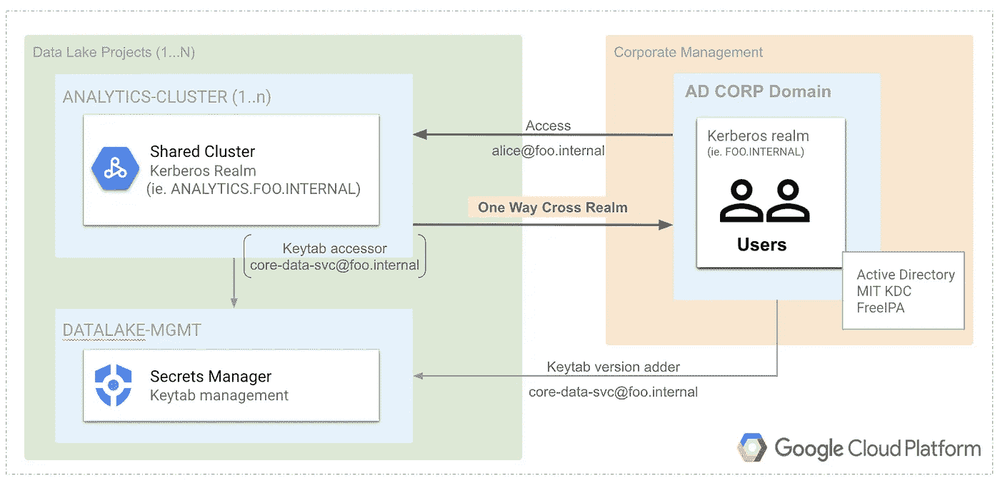

[带有 AD Kerberos 身份验证的 Dataproc 单向信任]

上述架构包含以下关键方面:

*   Active Directory 企业服务器中的用户/服务帐户
*   Dataproc 服务主体由集群上的 KDC 管理。不需要在 AD 中创建任何服务主体。
*   在创建 Dataproc 集群之前，可以在 Active Directory 中创建单向信任。这为临时集群动态加入 AD 提供了灵活性。
*   Secrets manager 用于存储/旋转由 Active Directory 管理员添加的 keytabs，仅可由 Analytics Dataproc 集群管理员访问。

# 先决条件

在我们的项目中设置 Windows 和 Dataproc GCE 实例需要以下先决条件。我们将不涉及设置 VPC 和前面提到的其他方面。以下步骤可以在云壳或者本地终端执行。

**1。设置环境/帐户(根据需要修改)** :
创建您的 GCP 项目(在我们的示例中使用了 *ad-kerberos* )，[初始化您的 gcloud sdk](https://cloud.google.com/sdk/docs/initializing) ，设置默认的[区域/区域](https://cloud.google.com/compute/docs/gcloud-compute#set_default_zone_and_region_in_your_local_client)，让我们开始吧。

```
**# properties**
export PROJECT=$(gcloud info --format='value(config.project)')
export ZONE=$(gcloud info --format='value(config.properties.compute.zone)')
export REGION=${ZONE%-*}
export SUBNETWORK=default
export BUCKET_SECRETS=${PROJECT}-us-dataproc-secrets**# gcp admin / service accounts**
export GCP_ADMIN=$(gcloud info --format='value(config.account)')
export SERVICE_ACCOUNT_AD=active-directory-sa
export SERVICE_ACCOUNT_DL=dataproc-analytics-cluster-sa**# create gcp service account for** [**dataproc**](https://cloud.google.com/dataproc/docs/concepts/configuring-clusters/service-accounts) **cluster** gcloud iam service-accounts create "${SERVICE_ACCOUNT_DL}" \
  --description="dataproc sa" \
  --display-name=${SERVICE_ACCOUNT_DL}**# create gcp service account for active directory** [**gce instance**](https://cloud.google.com/compute/docs/access/service-accounts)
gcloud iam service-accounts create ${SERVICE_ACCOUNT_AD} \
  --description="active directory sa" \
  --display-name=${SERVICE_ACCOUNT_AD}**# enable** [**private google access**](https://cloud.google.com/vpc/docs/configure-private-google-access) **on subnet**
gcloud compute networks subnets update ${SUBNETWORK} --region=${REGION} --enable-private-ip-google-access**# IAM role for** [**IAP tunnel**](https://cloud.google.com/iap/docs/using-tcp-forwarding) **to AD and Dataproc (if needed)**
gcloud projects add-iam-policy-binding ${PROJECT} \
  --member=user:[$](mailto:jhambleton@matsugo.org){GCP_ADMIN} \
  --role=roles/iap.tunnelResourceAccessor**# IAM role for** [**dataproc**](https://cloud.google.com/iam/docs/understanding-roles#dataproc-roles) **cluster**
gcloud projects add-iam-policy-binding ${PROJECT} --member=serviceAccount:${SERVICE_ACCOUNT_DL}@${PROJECT}.iam.gserviceaccount.com --role=roles/dataproc.worker
```

**2。设置云 KMS、秘密管理器和秘密**
在我们示例的后半部分，我们将使用云 KMS 通过 Kerberos 和[秘密管理器](https://cloud.google.com/secret-manager/docs)进行 [Dataproc 设置，以存储 core-data-svc 帐户的 Active Directory keytab。我们将在接下来的步骤中设置这些以备后用。](https://cloud.google.com/dataproc/docs/concepts/configuring-clusters/security#create_a_kerberos_cluster_with_your_own_root_principal_password)

2.1.创建云 KMS 密钥环、云 KMS 密钥，并分配 IAM 角色。

```
**# properties**
export KMS_KEY_RING_LOCATION=us
export KMS_KEY_RING_NAME=dataproc-key-ring
export KMS_KEY_NAME=dataproc-key
export KMS_KEY_URI=projects/${PROJECT}/locations/${KMS_KEY_RING_LOCATION}/keyRings/${KMS_KEY_RING_NAME}/cryptoKeys/${KMS_KEY_NAME}**# create kms keyring**
gcloud kms keyrings create ${KMS_KEY_RING_NAME} \
  --project ${PROJECT} \
  --location ${KMS_KEY_RING_LOCATION}**# create kms key**
gcloud kms keys create ${KMS_KEY_NAME} \
  --project ${PROJECT} \
  --location ${KMS_KEY_RING_LOCATION} \
  --purpose encryption \
  --keyring ${KMS_KEY_RING_NAME}**# allow dataproc decrypt IAM role on kms key for cluster creation**
gcloud kms keys add-iam-policy-binding ${KMS_KEY_NAME} --location ${KMS_KEY_RING_LOCATION} --keyring ${KMS_KEY_RING_NAME} --member=serviceAccount:${SERVICE_ACCOUNT_DL}@${PROJECT}.iam.gserviceaccount.com --role=roles/cloudkms.cryptoKeyDecrypter**# allow AD decrypt IAM role on kms key for shared secret**
gcloud kms keys add-iam-policy-binding ${KMS_KEY_NAME} --location ${KMS_KEY_RING_LOCATION} --keyring ${KMS_KEY_RING_NAME} --member=serviceAccount:${SERVICE_ACCOUNT_AD}@${PROJECT}.iam.gserviceaccount.com --role=roles/cloudkms.cryptoKeyDecrypter
```

2.2.为 Dataproc 根主体和与 Active Directory 共享的主体生成随机机密。

```
**# create secret**
openssl rand -base64 32 | sed 's/\///g' > cluster_secret.txt 
openssl rand -base64 32 | sed 's/\///g' > trust_secret.txt**# create bucket in project for secrets (restrict access)** gsutil mb gs://$BUCKET_SECRETS**# encrypt cluster secret and store in restricted bucket**
cat cluster_secret.txt \
  | gcloud kms encrypt --ciphertext-file - --plaintext-file \
  - --key "${KMS_KEY_URI}" | gsutil cp - gs://${BUCKET_SECRETS}/analytics-cluster_principal.encrypted**# encrypt trust secret and store in restricted bucket**
cat trust_secret.txt | gcloud kms encrypt \
  --ciphertext-file - --plaintext-file - --key "${KMS_KEY_URI}" \
  | gsutil cp - gs://${BUCKET_SECRETS}/trust_analytics-cluster_ad_principal.encrypted**# allow active directory access to shared secrets** gsutil iam ch serviceAccount:${SERVICE_ACCOUNT_AD}@${PROJECT}.iam.gserviceaccount.com:objectViewer gs://${BUCKET_SECRETS}
```

2.3.在 Secret Manager 中创建 Secret，并为存储 core-data-svc keytab 分配 IAM 角色。

```
**# properties**
export KEYTAB_SECRET=keytab-core-data-svc**# create secret manager secret for storing Kerberos keytab**
gcloud secrets create ${KEYTAB_SECRET}**# role for AD host account** [**secrets adder**](https://cloud.google.com/secret-manager/docs/access-control) **for keytab** gcloud secrets add-iam-policy-binding ${KEYTAB_SECRET} --member=serviceAccount:${SERVICE_ACCOUNT_AD}@${PROJECT}.iam.gserviceaccount.com --role=roles/secretmanager.secretVersionAdder**# role for dataproc host account** [**secrets acccessor**](https://cloud.google.com/secret-manager/docs/access-control) **for keytab** 
gcloud secrets add-iam-policy-binding ${KEYTAB_SECRET} --member=serviceAccount:${SERVICE_ACCOUNT_DL}@${PROJECT}.iam.gserviceaccount.com --role=roles/secretmanager.secretAccessor
```

## 安装 Active Directory 域控制器

在 Google Cloud 中，Windows Server 基础映像在计算引擎中可用。对于我们的例子，我们将使用`Windows Server 2016 Datacenter`创建域控制器，并完成一个轻量级的安装。参考[部署容错微软活动目录环境](https://cloud.google.com/solutions/deploy-fault-tolerant-active-directory-environment)指南，了解更全面的设置，包括 VPC、DNS、多区域部署等。

创建 Active Directory 实例。导航至`**Compute Engine > VM instances > Create Instance**`。

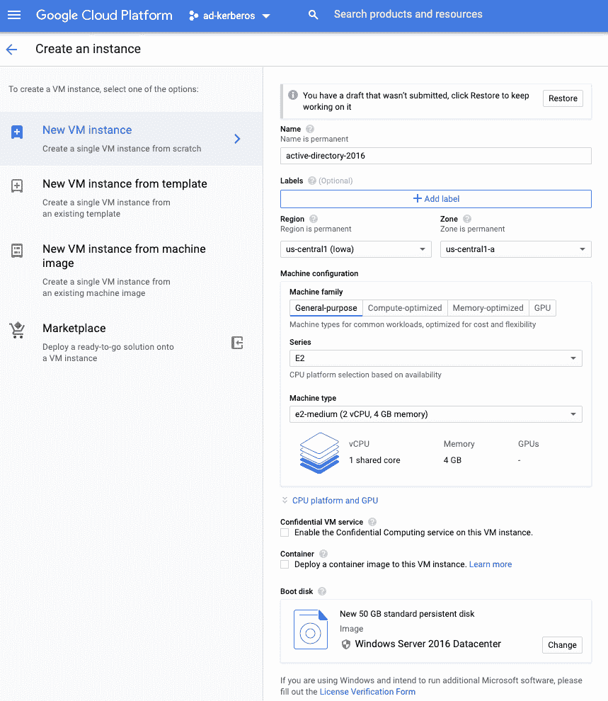

[带有 Windows 映像的 Google 计算引擎实例]

配置启动盘操作系统`**Windows Server**`和版本`**Windows Server 2016 Datacenter**`。

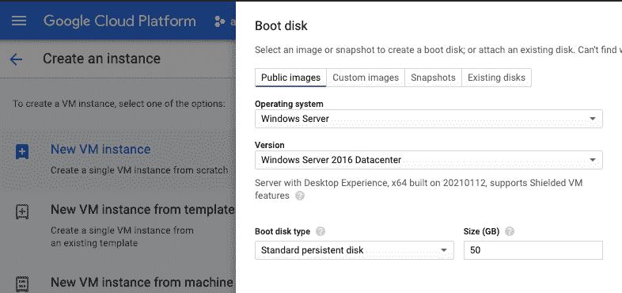

[Windows Server 2016 数据中心公共映像]

对于 GCE 实例，我们将使用上面配置了特定 IAM 角色的`**active-directory-sa**`服务帐户。

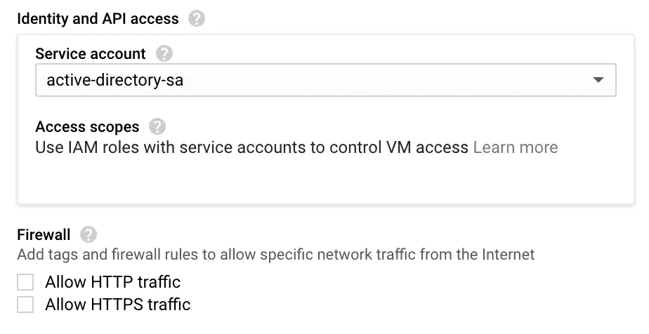

[GCE 实例服务帐户]

将带有外部 IP 的网络接口配置为`**None**`,以便实例仅使用内部 IP。如果仅使用内部 IP，请参考本指南后面的步骤，通过 IAP 隧道配置 RDP。

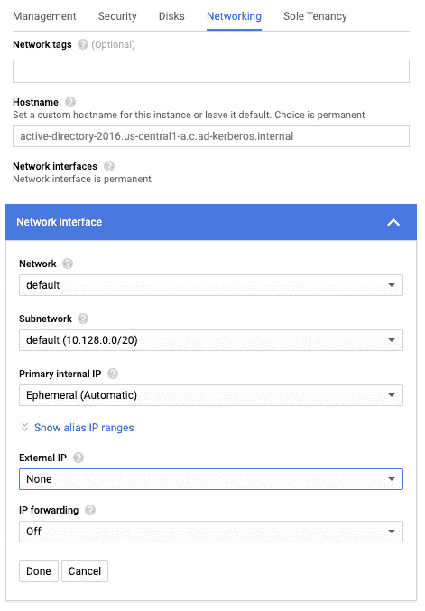

[没有外部 IP 的网络接口]

服务器完成初始化后，`**Set Windows password**`。

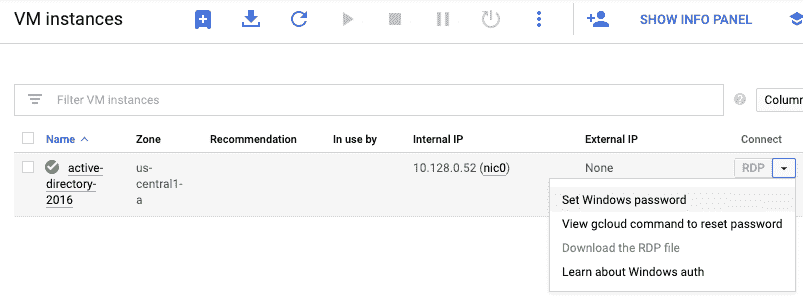

[Windows Server 实例 active-directory-2016]

为用户设置新密码。

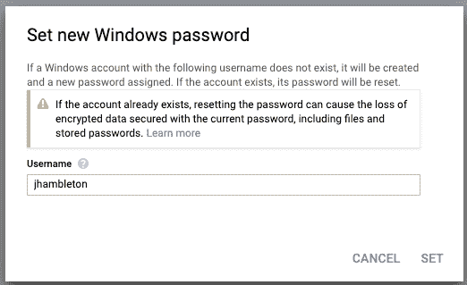

[Windows 密码重置提示]

# **使用远程桌面登录 Windows 服务器**

下一节将介绍如何使用内部 IP 访问 Windows 服务器，但是有多个选项可供选择。

*   如果配置了外部 IP(*不推荐*，那么安装[Chrome RDP for Google Cloud Platform](https://chrome.google.com/webstore/detail/chrome-rdp-for-google-clo/mpbbnannobiobpnfblimoapbephgifkm)扩展，通过 active-directory-2016 instance 下拉菜单可以直接从控制台创建 RDP 会话。
*   如果配置了内部 IP，则为 TCP 转发设置[IAP](https://cloud.google.com/iap/docs/using-tcp-forwarding)，创建隧道，并使用 RDP 客户端(即。 [Mac 客户端](https://docs.microsoft.com/en-us/windows-server/remote/remote-desktop-services/clients/remote-desktop-mac))遵循以下步骤。

## 通过 IAP 初始化 RDP 隧道

```
gcloud compute start-iap-tunnel active-directory-2016 3389 --local-host-port=localhost:3389 --zone=us-central1-a
*Testing if tunnel connection works.
Listening on port [3389].*
```

## **启动微软远程桌面客户端**

添加主机`**localhost**`并使用上面设置的用户名/密码进行连接。

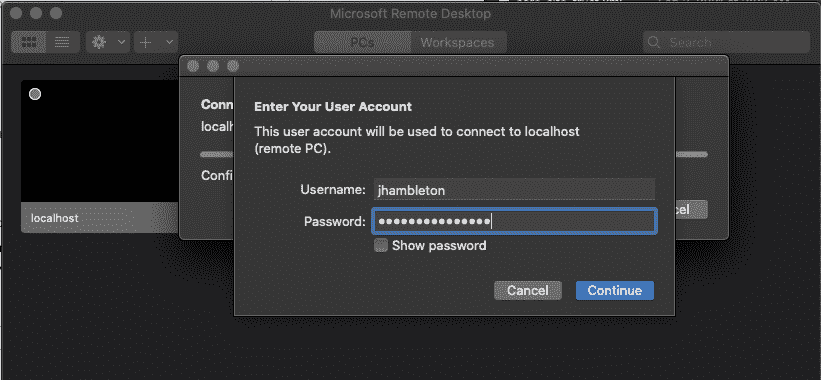

[用于 Mac 的微软远程桌面]

## **设置管理员密码**

连接到 Windows 服务器后，设置*管理员*密码。此步骤是*将服务器升级到域控制器所必需的*。

通过`**Tools > Computer Management**`导航至用户管理

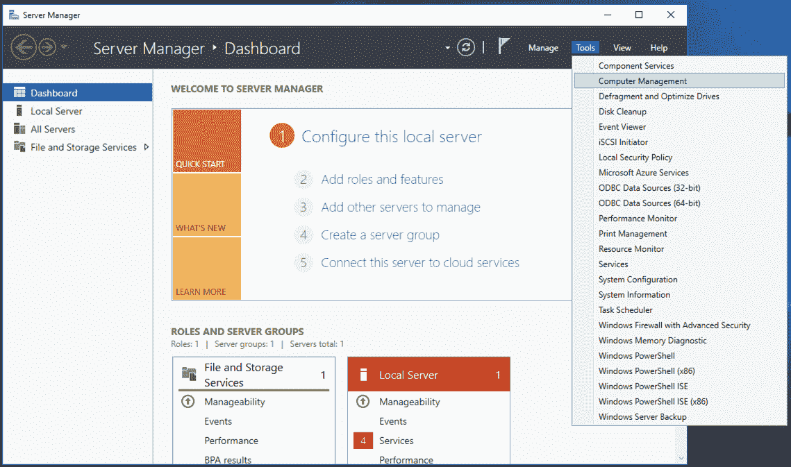

[Active Directory 服务器管理器计算机管理]

接下来，选择`**Local Users and Groups > Users > Administrator >**`右键并选择`**Set Password**`

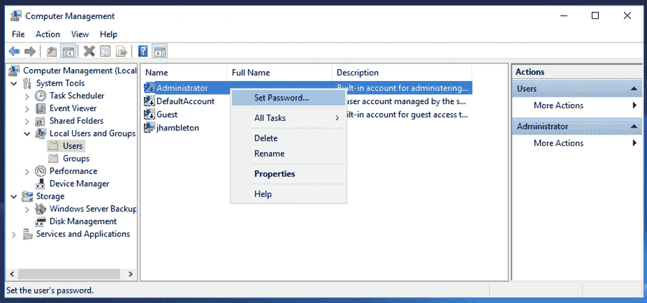

[计算机管理设置管理员密码]

## **设置域服务和域控制器**

选择`**Add roles and features**`进行设置。

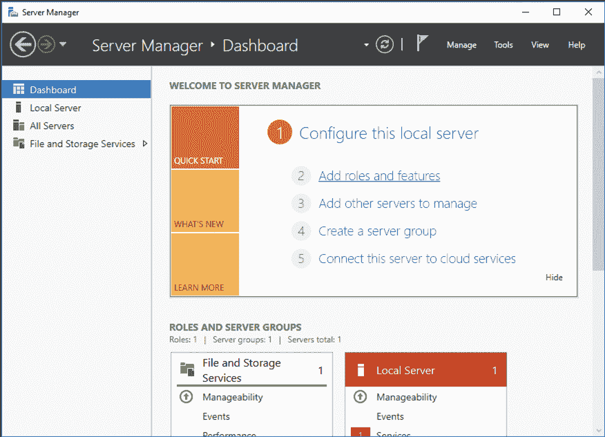

[Active Directory 服务器管理器添加角色和功能]

接下来，选择`**Role-based installation**`类型。

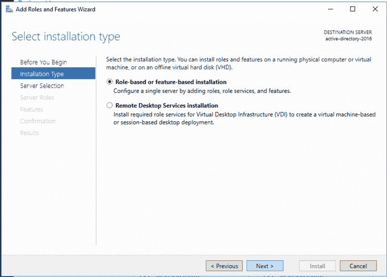

[添加角色和功能向导]

添加`**Active Directory Domain Services**`角色。

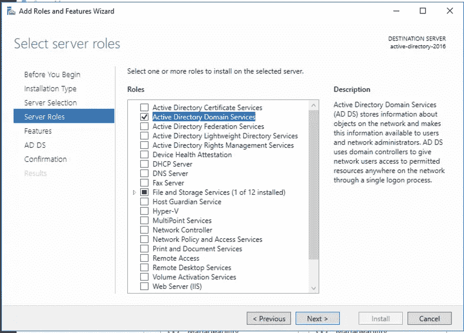

[添加角色和功能向导]

继续使用功能和 Active Directory 域服务的默认值，然后使用`**Install**`服务。

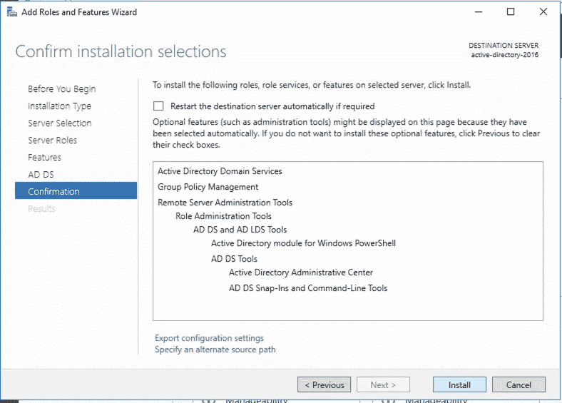

[添加角色和功能向导]

接下来，从服务器管理器仪表板中选择`**Promote this server to a domain controller**`。

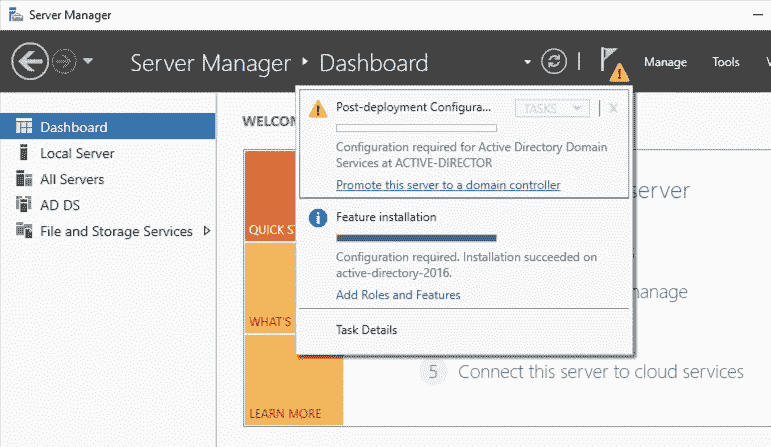

[将服务器提升为域控制器]

选择`**Add a new forest**`，添加根域。在我们的例子中，我们使用`**foo.internal**`。

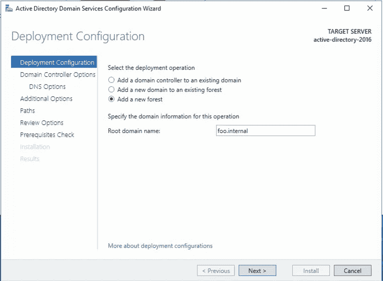

[Active Directory 域服务配置向导]

设置`**Restore Mode**`的密码并继续。

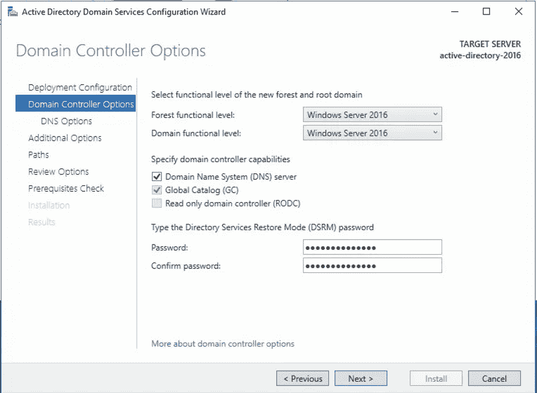

[Active Directory 域服务配置向导]

继续使用 DNS 选项和中 NetBIOS 域名的默认`**FOO**`并继续。

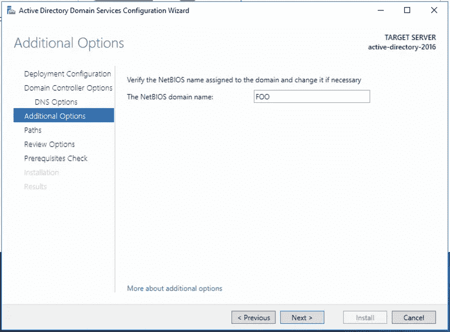

[Active Directory 域服务配置向导]

复习后继续`**install**`。服务器将自动重启以完成安装。

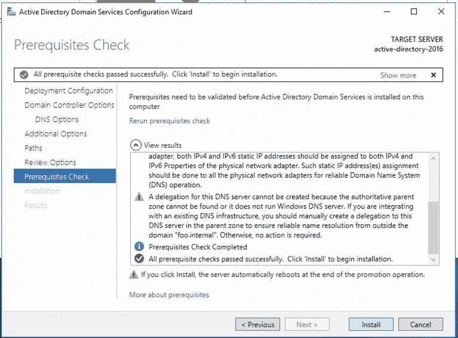

[Active Directory 域服务配置向导]

*恭喜*，域控制器现已安装完毕。接下来，我们将使用我们在先决条件部分中创建的加密秘密来设置从 Dataproc 集群 KDC 到 Active Directory 的信任。

## **将外部 KDC 添加到活动目录服务器**

接下来，我们设置外部 Dataproc KDC 领域，分析。FOO.INTERNAL，用于建立单向信任，即使我们还没有创建 Dataproc 集群。

打开`**powershell**`(右击&以*管理员*身份运行)并运行以下程序:

```
**# set powershell variables**
$KMS_KEY_URI="projects/ad-kerberos/locations/us/keyRings/dataproc-key-ring/cryptoKeys/dataproc-key"
$BUCKET_SECRETS="ad-kerberos-us-dataproc-secrets"**# add external KDC realm to Active Directory**
ksetup /addkdc ANALYTICS.FOO.INTERNAL analytics-cluster-m.us-central1-a.c.ad-kerberos.internal**# verify realm was added**
*PS C:\Users\jhambleton> ksetup
default realm = foo.internal (NT Domain)
ANALYTICS.FOO.INTERNAL:
        kdc = analytics-cluster-m.us-central1-a.c.ad-kerberos.internal***# retrieve trust secret** 
gsutil cp gs://$BUCKET_SECRETS/trust_analytics-cluster_ad_principal.encrypted .
$secret=gcloud kms decrypt --ciphertext-file .\trust_analytics-cluster_ad_principal.encrypted --plaintext-file - --key "${KMS_KEY_URI}"**# create one-way trust** 
netdom trust ANALYTICS.FOO.INTERNAL /Domain FOO.INTERNAL /add /realm /passwordt:$secret**# Configure other domain support for Kerberos AES Encryption**
ksetup /setenctypeattr ANALYTICS.FOO.INTERNAL AES256-CTS-HMAC-SHA1-96 AES128-CTS-HMAC-SHA1-96
```

## **创建单向信任 AD 域控制器的 Dataproc 集群**

在您的本地终端或云 shell 中，为 [Dataproc Kerberos 配置](https://cloud.google.com/dataproc/docs/concepts/configuring-clusters/security#create_the_cluster)创建一个 YAML 文件(确保这些配置被正确定义)。

```
**#####
# kerberos_dataproc.yaml config
#** enable_kerberos: true
realm: ANALYTICS.FOO.INTERNAL
root_principal_password_uri: 
  gs://ad-kerberos-us-dataproc-secrets/analytics-cluster_principal.encrypted
kms_key_uri:
  projects/ad-kerberos/locations/us/keyRings/dataproc-key-ring/cryptoKeys/dataproc-key
cross_realm_trust:
  realm: FOO.INTERNAL
  kdc: active-directory-2016.us-central1-a.c.ad-kerberos.internal
  admin_server: active-directory-2016.us-central1-a.c.ad-kerberos.internal
  shared_password_uri:
        gs://ad-kerberos-us-dataproc-secrets/trust_analytics-cluster_ad_principal.encrypted
  tgt_lifetime_hours: 1
```

创建 Dataproc 集群。

```
gcloud dataproc clusters create analytics-cluster \
  --enable-component-gateway \
  --no-address \
  --region ${REGION} \
  --zone ${ZONE} \
  --subnet default \
  --image-version 1.5-debian \
  --service-account ${SERVICE_ACCOUNT_DL}@${PROJECT}.iam.gserviceaccount.com \
  --scopes '[https://www.googleapis.com/auth/cloud-platform'](https://www.googleapis.com/auth/cloud-platform') \
  --project ${PROJECT} \
  --kerberos-config-file ./kerberos_dataproc.yaml
```

## 创建*爱丽丝*和核心数据服务主体

接下来，让我们在 Active Directory 中创建第一个测试用户 Alice。导航至
T10。

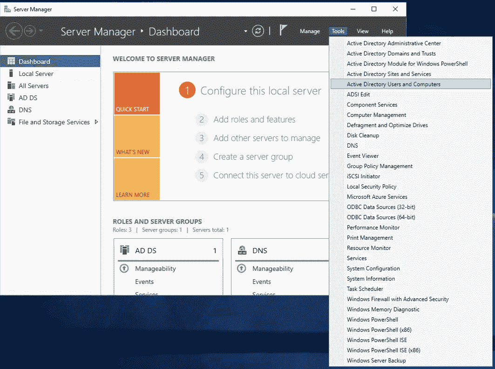

[Active Directory 用户和计算机]

创建新的组织单位。

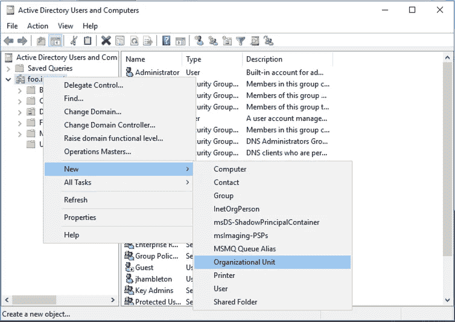

[新的组织单位]

在其中创建 *GCP 数据湖 OU* 和*用户 OU* 。

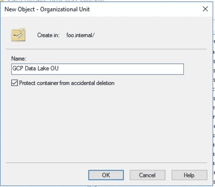

[新的组织单位— GCP 数据湖 OU]

*GCP 数据湖 OU* 中的用户将只包含特定于数据湖的特殊用户帐户(即用于运行计划作业的广告服务帐户)。

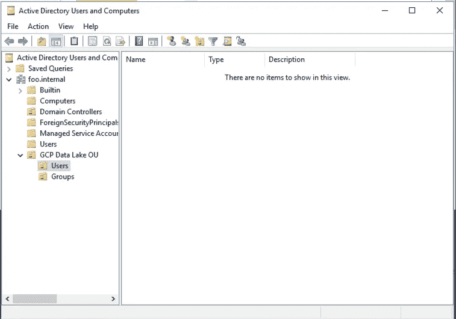

【GCP 数据湖欧】

在顶级用户下创建新用户。

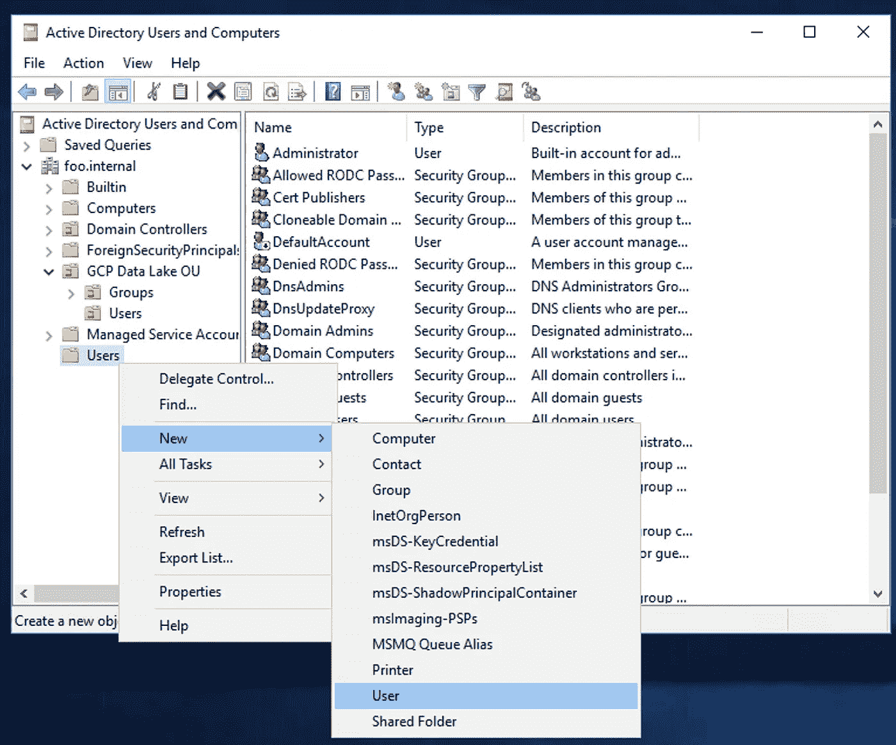

[创建新用户]

添加 Alice 为新用户(我们设置*不安全的 pwd alic123！*)。

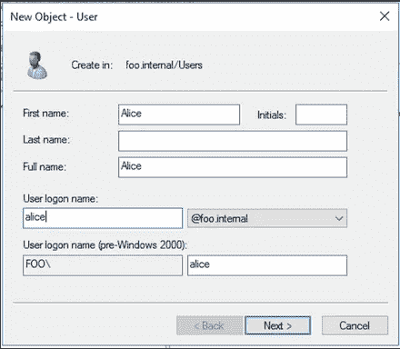

【新用户——Alice @ FOO。内部]

接下来，我们在 *GCP 数据湖 OU* 中创建 *core-data-svc* 服务帐户，并生成用于认证的密钥表。

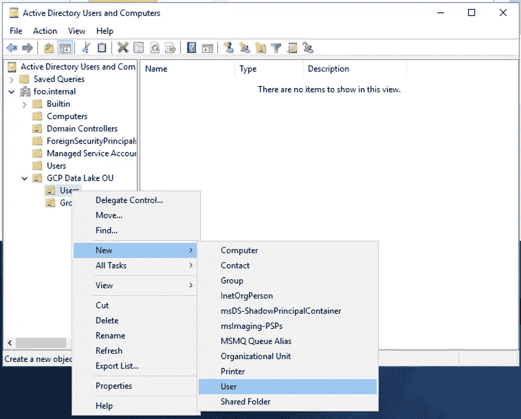

[GCP 数据湖 OU 核心数据服务中心新账户]

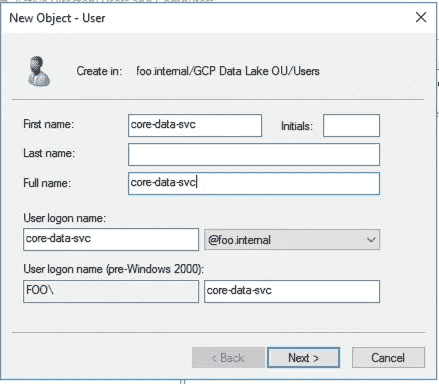

[核心数据服务的新对象]

为这个非人类 *core-data-svc* 帐户创建 keytab。打开`**powershell**`(右击&以*管理员*身份运行)并运行以下程序:

```
$KEYTAB_SECRET="keytab-core-data-svc"**# keytab generation** 
ktpass /out "C:\Users\jhambleton\core-data-svc.keytab" /mapuser core-data-svc /princ core-data-svc@FOO.INTERNAL +rndpass /ptype KRB5_NT_PRINCIPAL /target FOO.INTERNAL /kvno 0 /crypto AES256-SHA1**# export keytab to secret manager**
gcloud secrets versions add ${KEYTAB_SECRET} --data-file="C:\Users\jhambleton\core-data-svc.keytab"**# remove secret**
rm "C:\Users\jhambleton\core-data-svc.keytab"
```

# 使用 Active Directory 验证 Kerberos 身份验证

登录，以 alice 身份验证，并在 analytics-cluster 上运行 Hadoop 命令。

```
*$ gcloud compute ssh alice@analytics-cluster-m --tunnel-through-iap
$ kinit alice@FOO.INTERNAL          # remember insecure pwd alic123!
Password for alice@FOO.INTERNAL:
$ klist 
$ hadoop fs -ls /user/*
```

## 应用服务帐户测试核心-数据-svc@FOO。内部的

出于安全原因，下面的步骤使用密钥表，然后销毁本地密钥表。然后，它在分析集群上运行 hadoop 命令(或者可以启动 spark 作业)。该命令只能使用具有集群实例授权的 Google 身份来执行。

从本地终端或云 shell 运行(*不需要 ssh*):

```
**# properties**
export KEYTAB_SECRET=keytab-core-data-svc
export AD_SVC_ACCNT=core-data-svc
export DOMAIN=FOO.INTERNAL**## ## ## ##
## commands to be executed on remote cluster****# cmd 1 - get keytab from secret manager**
export cmd_get_secret="gcloud secrets versions access latest --secret ${KEYTAB_SECRET} --format='get(payload.data)' | tr '_-' '/+' | base64 -d > ./${AD_SVC_ACCNT}.keytab"**# cmd 2 - kinit**
export cmd_kinit="kinit -kt ./${AD_SVC_ACCNT}.keytab ${AD_SVC_ACCNT}@${DOMAIN}; rm ./${AD_SVC_ACCNT}.keytab"**# cmd 3 - execute hadoop cmd or spark-submit**
export cmd_hadoop="hadoop fs -ls /user/"**## ## ## ##
# execute cmd - run hadoop/spark-submit command with kerberos auth** gcloud compute ssh core-data-svc@analytics-cluster-m \
  --command="${cmd_get_secret}; ${cmd_kinit}; ${cmd_hadoop};" --tunnel-through-iap
```

# **故障排除**

在这一节中，我们捕获了一些有用的命令，如果有必要的话，这些命令对调试很有用。

**命令测试用户名默认规则**(Hadoop . security . auth _ to _ local rules)

```
$ hadoop org.apache.hadoop.security.HadoopKerberosName alice@FOO.INTERNAL
*Name: alice@FOO.INTERNAL to alice*
```

**Hadoop 和 Kerberos 握手的调试模式**

```
$ HADOOP_OPTS="-Dsun.security.krb5.debug=true" hadoop fs -ls /
*...
>>> KrbKdcReq send: kdc=active-directory-2016.us-central1-a.c.ad-kerberos.internal UDP:88, timeout=30000, number of retries =3, #bytes=1378
>>> KDCCommunication: kdc=active-directory-2016.us-central1-a.c.ad-kerberos.internal UDP:88, timeout=30000,Attempt =1, #bytes=1378
>>> KrbKdcReq send: #bytes read=1377
>>> KdcAccessibility: remove active-directory-2016.us-central1-a.c.ad-kerberos.internal
>>> EType: sun.security.krb5.internal.crypto.Aes256CtsHmacSha1EType
>>> TGS credentials serviceCredsSingle:
...*
```

**启用跟踪级 Hadoop 日志记录器并调试 JAAS 日志记录**

```
$ HADOOP_ROOT_LOGGER=TRACE,console HADOOP_JAAS_DEBUG=true hdfs dfs -ls /
*...
21/02/05 12:32:54 DEBUG security.UserGroupInformation: hadoop login commit
21/02/05 12:32:54 DEBUG security.UserGroupInformation: using kerberos user:alice@FOO.INTERNAL
21/02/05 12:32:54 DEBUG security.UserGroupInformation: Using user: "alice@FOO.INTERNAL" with name alice@FOO.INTERNAL
...*
```

**Kerberos 级别跟踪**

```
$ env KRB5_TRACE=/dev/stdout kinit alice@FOO.INTERNAL
*[14178] 1612528239.343161: Getting initial credentials for alice@FOO.INTERNAL
[14178] 1612528239.343163: Sending unauthenticated request
[14178] 1612528239.343164: Sending request (192 bytes) to FOO.INTERNAL
[14178] 1612528239.343165: Resolving hostname active-directory-2016.us-central1-a.c.ad-kerberos.internal
[14178] 1612528239.343166: Sending initial UDP request to dgram 10.128.0.55:88
...*
```

# **总结**

在本课程中，我们将活动目录域服务和域控制器设置为一个身份提供者，用于使用 Kerberized 化的 Dataproc 集群进行身份验证。虽然这个设置是一个简单的部署，只有一个 Dataproc 集群，但是它可以扩展到 Google Cloud 上的复杂数据湖架构。

# 附加参考

*   [https://cloud . Google . com/solutions/deploy-fault-tolerant-active-directory-environment](https://cloud.google.com/solutions/deploy-fault-tolerant-active-directory-environment)
*   [https://pc-addicts.com/setup-active-directory-server-2016/](https://pc-addicts.com/setup-active-directory-server-2016/)
*   [https://steveloughran . git books . io/Kerberos _ and _ Hadoop/content/sections/secrets . html](https://steveloughran.gitbooks.io/kerberos_and_hadoop/content/sections/secrets.html)
*   [https://blog . cloud era . com/how-to-deploy-a-secure-enterprise-data-hub-on-AWS/](https://blog.cloudera.com/how-to-deploy-a-secure-enterprise-data-hub-on-aws/)

作者:威尔逊·刘& [乔丹·汉伯顿](/@jordan.hambleton)