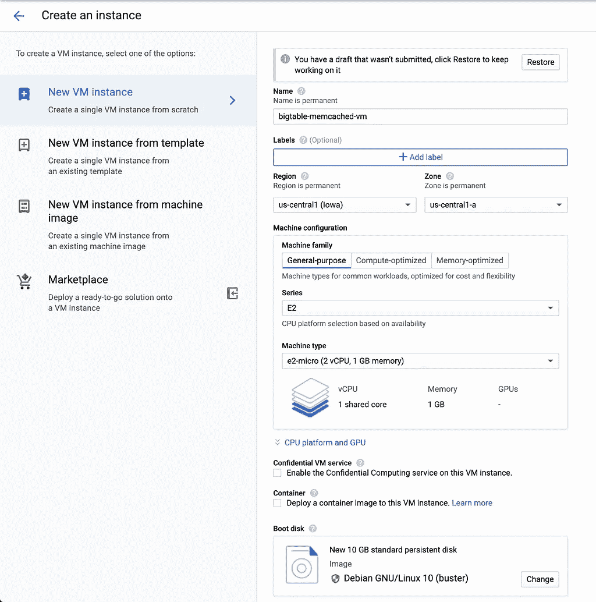

# 向 Google 云数据库添加缓存层(Bigtable + Memcached)

> 原文：<https://medium.com/google-cloud/adding-a-cache-layer-to-google-cloud-databases-memcached-bigtable-4db9de8c9873?source=collection_archive---------0----------------------->


TLDR:通过对经常查询的数据使用 Memcached 来提高应用程序的性能，如下所示:

数据库是为特定的模式、查询和吞吐量而设计的，但是如果您的数据在一段时间内被更频繁地查询，您可能希望通过引入缓存层来减少数据库的负载。

在本帖中，我们将关注可水平扩展的 Google Cloud Bigtable，它非常适合高吞吐量的读写。通过确保在数据库中统一查询行，可以优化性能。如果我们为更频繁查询的行引入一个缓存，我们可以从两个方面提高应用程序的速度:降低热定位行的负载，并通过将缓存和计算放在一起提高响应速度。

Memcached 是一个内存中的键值存储，用于存储小块的任意数据，我将为 Memcached (Beta)使用可伸缩的、完全托管的 [Memorystore，因为它与 Google Cloud 生态系统集成得很好。](https://cloud.google.com/memorystore/docs/memcached)

# 设置

1.  [创建一个新的](https://cloud.google.com/resource-manager/docs/creating-managing-projects) Google Cloud 项目，或者使用您选择的现有项目和数据库。这里的例子将显示 Cloud [Bigtable](https://cloud.google.com/bigtable/docs) ，但是 Spanner 或 Firestore 也是不错的选择。
2.  我将为大多数步骤提供 [gcloud 命令](https://cloud.google.com/sdk/gcloud)，但是如果您愿意，您可以在 Google [云控制台](https://console.cloud.google.com/)中完成大部分操作。
3.  使用以下命令创建云 Bigtable 实例和一个只有一行的表:

```
cbt createinstance bt-cache "Bigtable with cache" bt-cache-c1 us-central1-b 1 SSDcbt -instance=bt-cache createtable mobile-time-series "families=stats_summary"cbt -instance=bt-cache set mobile-time-series phone#4c410523#20190501 stats_summary:os_build=PQ2A.190405.003 
stats_summary:os_name=android# Verify this worked by reading the data.
cbt -instance=bt-cache read mobile-time-series
```

# 代码

高速缓存的通用逻辑可以在以下步骤中定义:

```
Pick a row key to query
If row key is in cache
    Return the value
Otherwise
    Look up the row in Cloud Bigtable
    Add the value to the cache with an expiration
    Return the value
```

对于 Cloud Bigtable，您的代码可能如下所示([GitHub 上的完整代码](https://github.com/GoogleCloudPlatform/java-docs-samples/tree/master/bigtable/memorystore)):

我选择将缓存键设为`row_key:column_family:column_qualifier`,以便于访问列值。以下是一些您可以使用的潜在缓存键/值对:

*   `rowkey: encoded row`
*   `start_row_key-end_row_key: array of encoded rows`
*   `SQL queries: results`
*   `row prefix: array of encoded rows`

创建缓存时，根据您的使用情况确定设置。请注意，Bigtable 行键的大小限制为 4KB，而 Memcached 键的大小限制为 250 字节，因此您的行键可能会太大。

# 创建 Memcached 实例

我将为 Memcached 实例创建一个 Memorystore，但是您可以安装并运行一个[本地 Memcached 实例](https://github.com/memcached/memcached/wiki/Install)来进行测试。如果你愿意，这些步骤可以用[内存商店云控制台](https://console.cloud.google.com/memorystore/memcached/instances)来完成。

1.  启用 Memcached API 的内存存储。

```
gcloud services enable memcache.googleapis.com
```

2.在默认网络上创建最小大小的 Memcached 实例。使用适合您的应用程序的区域。

```
gcloud beta memcache instances create bigtable-cache --node-count=1 --node-cpu=1 --node-memory=1GB --region=us-central1
```


3.获取 Memcached 实例的详细信息并获取 [discoveryEndpoint IP 地址](https://cloud.google.com/memorystore/docs/memcached/using-auto-discovery)(您可能需要等待几分钟来完成实例的创建)。

```
gcloud beta memcache instances describe bigtable-cache --region=us-central1
```

# 在网络内设置机器

我们需要在与 Memcached 实例相同的网络上创建一个运行代码的地方。您可以使用云功能等[无服务器选项](https://cloud.google.com/vpc/docs/configure-serverless-vpc-access)，但是计算虚拟机需要的配置较少。

1.  在默认网络上创建一个计算实例，并为云 Bigtable 数据启用 API 作用域。请注意，该区域必须与 Memcached 实例位于同一区域。

```
gcloud beta compute instances create bigtable-memcached-vm --zone=us-central1-a --machine-type=e2-micro --image=debian-10-buster-v20200910 --image-project=debian-cloud --boot-disk-size=10GB --boot-disk-type=pd-standard --boot-disk-device-name=bigtable-memcached-vm --scopes=https://www.googleapis.com/auth/bigtable.data,https://www.googleapis.com/auth/servicecontrol,https://www.googleapis.com/auth/service.management.readonly,https://www.googleapis.com/auth/logging.write,https://www.googleapis.com/auth/monitoring.write,https://www.googleapis.com/auth/trace.append,https://www.googleapis.com/auth/devstorage.read_only
```



2.SSH 到您的新虚拟机。

```
gcloud beta compute ssh --zone “us-central1-a” bigtable-memcached-vm
```

# 可以选择通过 Telnet 连接到 Memcached

Memcached 文档的[memory store](https://cloud.google.com/memorystore/docs/memcached/connecting-memcached-instance?hl=en_US)包含了关于这个过程的更多信息，但是您可以运行下面的命令来设置和获取缓存中的值。

```
sudo apt-get install telnet
telnet $DISCOVERY_ENDPOINT_ID 11211
set greeting 1 0 11
hello world
get greeting
```

# 运行代码

现在我们准备把代码放到机器上。

1.  您可以将回购直接克隆到虚拟机上，并从那里运行它。如果您想定制代码，请查看我的文章[将代码同步到计算引擎](/google-cloud/rsync-on-gcp-compute-engine-when-you-cant-run-your-code-locally-network-issues-cb2ff2c9c176)或者使用 [gcloud scp 命令](https://cloud.google.com/sdk/gcloud/reference/compute/scp)将代码从本地机器复制到虚拟机。

```
sudo apt-get install git
git clone [https://github.com/GoogleCloudPlatform/java-docs-samples.git](https://github.com/GoogleCloudPlatform/java-docs-samples.git)
cd java-docs-samples/bigtable/memorystore
```

2.安装 maven

```
sudo apt-get install maven
```

3.为您的配置设置环境变量。

```
PROJECT_ID=your-project-id
MEMCACHED_DISCOVERY_ENDPOINT="0.0.0.0" # Get this from the memcache describe command above. Exclude the ':11211' suffix
```

4.运行该程序一次，从数据库中获取值，然后再次运行它，您将看到该值是从缓存中获取的。

```
mvn compile exec:java -Dexec.mainClass=Memcached \
    -DbigtableProjectId=$PROJECT_ID \
    -DbigtableInstanceId=bt-cache \
    -DbigtableTableId=mobile-time-series \
    -DmemcachedDiscoveryEndpoint=$MEMCACHED_DISCOVERY_ENDPOINT
```

# 后续步骤和清理

现在，您应该理解了在数据库前放置缓存层的核心概念，并且可以将它集成到您现有的应用程序中。如果您遵循了这篇博文，请使用以下命令删除您的 VM、Cloud Bigtable 实例和 Memcached 实例，以防止收到资源账单:

```
cbt deleteinstance bt-cache
gcloud beta memcache instances delete bigtable-cache --region=us-central1 
gcloud compute instances delete bigtable-memcached-vm --zone=us-central1-a
```