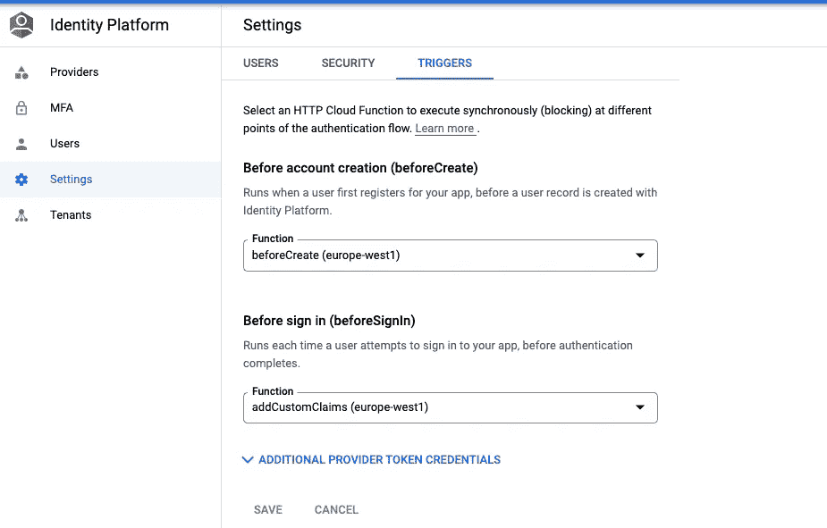

# 使用 Google 身份平台登录时向 JWT 添加自定义角色

> 原文：<https://medium.com/google-cloud/adding-custom-roles-to-jwt-on-login-with-google-identity-platform-476cd15301d9?source=collection_archive---------2----------------------->


由[布雷特·乔丹](https://unsplash.com/@brett_jordan?utm_source=unsplash&utm_medium=referral&utm_content=creditCopyText)在 [Unsplash](https://unsplash.com/s/photos/identity?utm_source=unsplash&utm_medium=referral&utm_content=creditCopyText) 上拍摄的照片

谷歌身份平台是一个非常酷的托管服务，用来保存你的用户的身份。它提供多租户，并允许跨各种身份验证提供者统一用户实体。但是该功能非常侧重于管理用户的身份。

有时你的应用程序需要更多的信息来帮助授权(AuthZ)它所提供的动作。因此，您可能希望在应用程序中添加一些基于角色的访问控制(RBAC)。但有时使用角色并不是最好的方法，您可能需要所有者方法，或者希望允许来自某个国家的用户查看某些数据项，基于属性的访问控制(ABAC)可能是更好的选择。有时您只想采用基于策略的访问控制(PBAC)机制。我很高兴 Identity Platform 没有试图为这个问题提供解决方案，因为它总是局限于其他选项之一。

但是 Identity Platform 提供了一种巧妙的方法，允许您使用云函数向 JWT 添加自定义声明。这显然是遵循了一种开放-封闭的设计方法，具有明确的扩展机制。你可以在这里找到那个[的文档。](https://cloud.google.com/identity-platform/docs/asynchronous-functions)

要点如下，只需进入您的身份平台设置并选择设置->触发器。您可以在此选择[云函数](https://cloud.google.com/functions)，当用户在身份平台中创建或用户登录时触发。云功能需要是可公开访问的，但是身份平台 SDK 将检查每个请求的认证。如果您使用 javascript，您还需要添加对`package.json`的`”gcip-cloud-functions”: “0.0.1”`依赖。



身份平台触发设置屏幕

**beforeCreate** 触发器允许在将用户添加到 Identity Platforms 用户存储库之前为她添加自定义声明。这是一个很好的特性，可以添加关于用户的信息，您希望在令牌中访问这些信息，而这些信息很少改变。您也可以通过 admin SDK ( [链接](https://cloud.google.com/identity-platform/docs/how-to-configure-custom-claims))更改这些声明。下面是一个示例函数，它在注册时向我们的用户添加自定义声明。

```
gcipCloudFunctions = require('gcip-cloud-functions');const authClient = new gcipCloudFunctions.Auth();exports.beforeCreate = authClient.functions().beforeCreateHandler((user, context) => {
  return {
    customClaims: {
      "test_claim": "Awesome!"
    }
  };
});
```

**beforeSignIn** 触发器允许为用户的每次登录添加声明。例如，如果您在数据库表中有角色，并且想要添加用户可以访问的角色，这将非常有用。下面是一个向令牌添加另一个自定义声明的示例函数:

```
gcipCloudFunctions = require('gcip-cloud-functions');const authClient = new gcipCloudFunctions.Auth();exports.beforeSignIn = authClient.functions().beforeSignInHandler((user, context) => {
  return {
    customClaims: {
      "signInClaim": "Awesome Too!!!"
    }
  };
});
```

对于这两个选项，有一点需要记住，你的函数需要在 **7** 秒内做出响应。对于某些用例来说，这可能是永久的，但是您可能希望密切关注您正在加载的信息。尤其是在登录期间，如果你加载了大量数据，这可能会导致糟糕的用户体验。