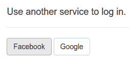
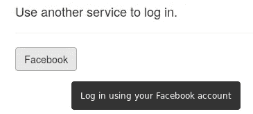
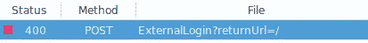
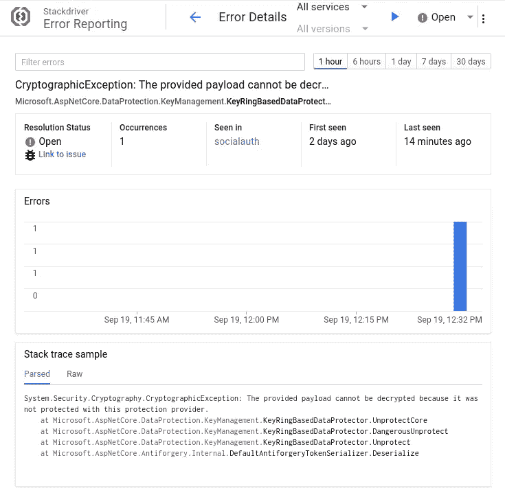
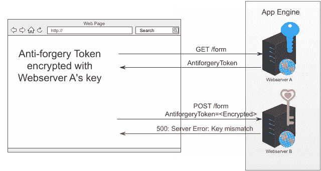
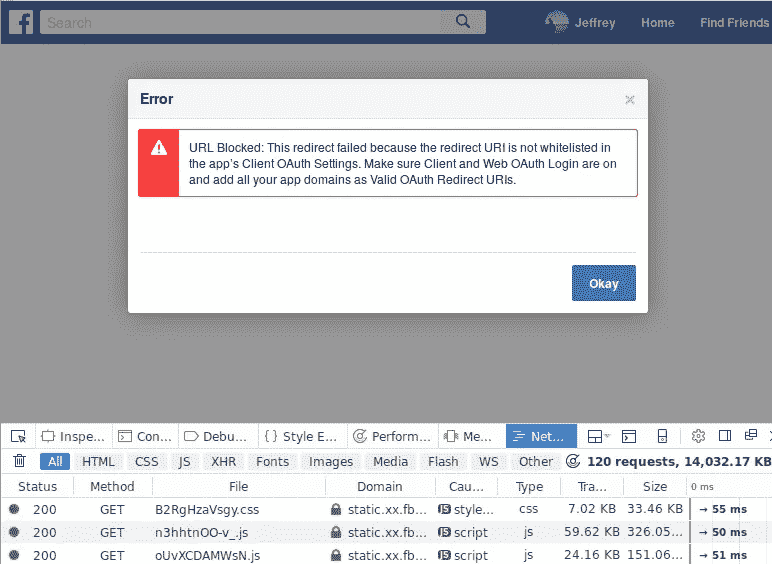
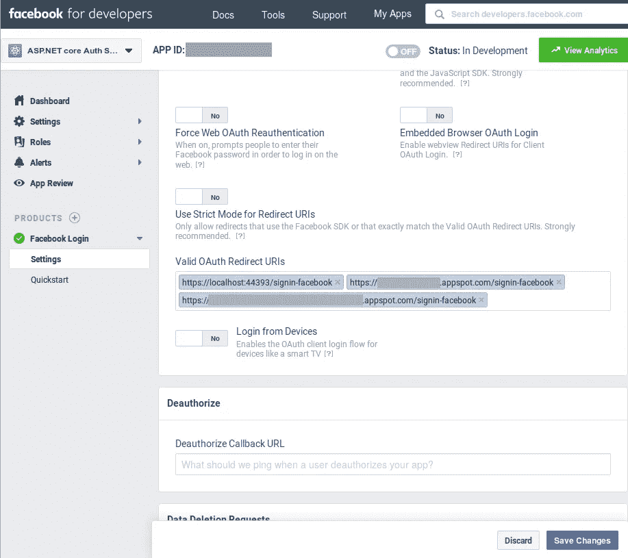
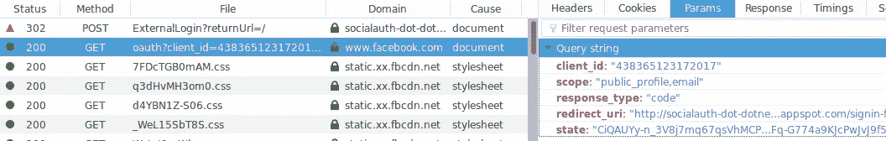

# 将社交登录添加到您的 ASP.NET 核心 2.1 谷歌云平台应用中

> 原文：<https://medium.com/google-cloud/adding-social-login-to-your-asp-net-core-2-1-google-cloud-platform-application-1baae89f1dc8?source=collection_archive---------0----------------------->

注意，这是我在 2017 年 6 月发表的[一篇帖子的刷新。从那以后，ASP.NET 核心和谷歌云都取得了进步。现在，向 ASP.NET 核心](/google-cloud/adding-social-login-to-your-net-app-engine-application-9b7f4149eb73)[应用引擎](https://cloud.google.com/appengine/docs/flexible/dotnet/)应用添加社交登录变得简单多了。ASP.NET 核心 2.1 也更新了[代码样本](https://github.com/GoogleCloudPlatform/dotnet-docs-samples/tree/master/appengine/flexible/SocialAuth)。一个额外的好处是，这个新的解决方案也适用于谷歌 Kubernetes 引擎。

# 请不要再输入密码了

用户厌倦了为他们访问的每个网站创建新的登录名和密码。2013 年，一项[调查](http://www.webhostingbuzz.com/blog/2013/03/21/whos-sharing-what/)发现，86%的人表示他们被在网站上创建新账户的需求所困扰。这个数字今天可能变得更大了。就我个人而言，我在我的密码管理器中记录了超过 100 次登录和密码。

根据[调查](http://www.webhostingbuzz.com/blog/2013/03/21/whos-sharing-what/)，77%的用户倾向于一个更好的解决方案，即允许用户使用他们最喜欢的社交账户登录，无论是脸书、推特还是谷歌。对于用户来说，社交登录消除了使用你网站的障碍。 [Saavn 发现使用脸书登录的听众参与度提高了 65%](https://developers.facebook.com/case-studies/saavn)。 [Skyscanner 在交互方面也有令人印象深刻的改进。](https://developers.facebook.com/case-studies/skyscanner)


好消息是微软已经提供了。NET 程序员使用库来简化将社交登录集成到他们的。NET MVC 核心 web 应用程序。他们还提供了优秀的文档，描述如何为所有流行的提供商添加社交登录。我按照这些文档中的说明，迅速将社交登录添加到我的。NET core web app。我按下 F5 在我的开发机器上运行应用程序，点击脸书按钮，它工作了！耶！



然后我试着将它部署到 Google App Engine，看到了一条错误消息:

```
Unhandled Exception: System.ArgumentException: The ‘ClientId’ option must be provided.at Microsoft.AspNetCore.Authentication.Facebook.FacebookMiddleware..ctor(RequestDelegate next, IDataProtectionProvides`1 sharedOptions, IOptions`1 options)
```

结果是，我需要对我的 MVC Web 应用程序做一些调整，以便在 App Engine 上运行时可以进行社交登录。事实上，这些调整对于运行任何。App Engine 上的 NET 核心应用。我在下面描述了这些问题及其解决方案。

# App Engine 不知道我的脸书 AppSecret。


为了让用户能够登录脸书，我创建了一个脸书应用程序，如微软的[文档](https://docs.microsoft.com/en-us/aspnet/core/security/authentication/social/facebook-logins)中所述。脸书给了我一个 AppSecret，这是一个秘密字符串，当我想验证一个用户时，我会将它传递给脸书。将我的脸书 AppSecret 存储在`appsettings.json`中会非常方便，但*也非常不安全*。

所以，我从我之前的一篇帖子中借用了一个解决方案，把我的秘密放在`appsecrets.json`里，用[谷歌云密钥管理服务](https://cloud.google.com/kms/)加密:

```
PS > .\Encrypt-AppSecrets.ps1
```

我只将加密文件`appsecrets.json.encrypted`提交到我的 git repo 中，并将其部署到 App Engine。App Engine 环境包含解密机密所需的凭证。参见我之前的[帖子](/google-cloud/keeping-secrets-in-asp-nets-appsettings-json-5694e533dc87)了解这个解决方案如何保证秘密安全的细节。

我将应用程序重新发布并重新部署到 App Engine，点击了脸书按钮，



并得到一个带有 **400** 错误的空白页:



# 显示错误信息。

我看到的是没有错误信息的 400。为了调试这个问题，我需要查看详细信息。我不想将开发模式应用程序部署到 App Engine，因为那会有暴露我的秘密的风险。但是，我知道如何使用[stack driver Error reporting in](https://cloud.google.com/error-reporting/)g 来收集未捕获的异常，并在 Google Cloud Dashboard 中向我报告它们。所以，我添加了对 [Google 的依赖。cloud . diagnostics . aspnetcore](https://www.nuget.org/packages/Google.Cloud.Diagnostics.AspNetCore/)并在我的 [StartUp.cs](https://github.com/GoogleCloudPlatform/dotnet-docs-samples/blob/master/appengine/flexible/SocialAuth/Startup.cs) 中添加了几行代码:

我将应用程序重新部署到 App Engine，并再次点击脸书按钮。我看到了同样的 400 空白页，但现在 Stackdriver 错误报告——在谷歌云控制台中向我显示了完整的错误消息:



微软。AspNetCore.DataProtection 试图解密某些内容，但失败了。这是怎么回事？

# AspNetCore 的默认 [DataProtectionProvider](https://docs.microsoft.com/en-us/aspnet/core/api/microsoft.aspnetcore.dataprotection.dataprotectionprovider) 不能跨多个 web 服务器实例工作。


像微软这样的社交登录中间件。AspNetCore . authentic ation . Facebook 需要加密。同样，AspNetCore 的作者在预见这种需求方面做得很好，并提供了一个标准接口 [IDataProtectionProvider](https://docs.microsoft.com/en-us/dotnet/api/microsoft.aspnetcore.dataprotection.idataprotectionprovider?view=aspnetcore-2.1) 来提供加密。但是，问题是默认的 IDataProtectionProvider 在 web 服务器上本地存储加密密钥。然而，在 App Engine 上，总是有多个 web 服务器，并且每个 web 服务器都创建自己唯一的密钥。此外,(通过设计)预测一个请求将被路由到哪个 web 服务器是不可能的。



在上面图示的情况下，这成为一个问题:

1.  一个请求被路由到 Web 服务器 A，Web 服务器 A 用一个用 Web 服务器 A 的蓝密钥加密的[反请求伪造令牌](https://docs.microsoft.com/en-us/aspnet/core/security/anti-request-forgery?view=aspnetcore-2.1)进行响应。
2.  带有反请求伪造令牌的 POST 请求被路由到 Web 服务器 B，Web 服务器 B 试图用其粉红密钥解密该令牌，但由于其密钥不同而失败。

## 更新 2019 年 5 月 9 日

Google 发布了库来解决这个问题。请看我的新帖子[讨论这个问题和解决这个问题的新库。](/google-cloud/antiforgery-tokens-asp-net-core-and-google-cloud-7ac6a5c7842b)

我更新了我的代码来使用谷歌的新库。然后，我将我的应用重新发布并重新部署到 App Engine，再次点击脸书按钮，看到:



嗯。我仔细检查了我在脸书注册的重定向 URIs 的白名单，我使用的 URI 肯定在那里:



我的 URIs 为脸书所知。这不是问题所在。

我更仔细地检查了来自浏览器的`/oauth?client_id=…`请求:



啊哈！这个`redirect_uri`是一个`http` URI，但它应该是一个`http**s**` URI。为什么 ASP.NET 认证中间件重定向到一个`http` URI？

# **App Engine 让 HTTPS 看起来像 HTTP** 。

当我在浏览器中输入[https://my-app.appspot.com/](https://my-app.appspot.com/)时，我的应用程序看到一个具有以下属性的请求:

```
Scheme: http
X-Forwarded-Proto: https
```

如谷歌的[应用引擎文档](https://cloud.google.com/appengine/docs/flexible/dotnet/how-requests-are-handled)所述:

> Google Cloud 负载平衡器终止所有 https 连接，然后通过 http 将流量转发给 App Engine 实例。例如，如果用户通过[https://[MY-PROJECT-ID]. appspot . com 请求访问您的站点，](https://[MY-PROJECT-ID].appspot.com,)X-Forwarded-Proto 头值是 https。

再次感谢构建 AspNetCore 的开发人员，他们似乎拥有预见我所有问题的魔力。`[app.UseForwardedHeaders](https://docs.microsoft.com/en-us/dotnet/api/microsoft.aspnetcore.builder.forwardedheadersextensions.useforwardedheaders?view=aspnetcore-2.1)()`指示 ASP.NET 中间件根据`X-Forward-*`头重写请求。带有`X-Forwarded-Proto: https`报头的请求被重写为与通过 https 到达的请求相同。我在我的`Configure()`方法中添加了一个对`UseForwardedHeaders()`的调用:

我重新发布并重新部署我的应用到应用引擎，点击脸书按钮，最后**成功**！


# 结论

在这个练习中学到的经验教训可以用来使大多数 ASP.NET 核心应用程序更容易地部署到 Google AppEngine。

## 经验教训

1.  使用`app.UseForwardedHeaders()`以便中间件通过 HTTP **S** 知道请求何时到达。
2.  使用 [Stackdriver 错误报告](https://cloud.google.com/error-reporting/)报告未捕获的异常。详情见[这篇早先的帖子](/google-cloud/reporting-exceptions-in-asp-net-d1c0d448d822)。
3.  使用
    `[Google.Cloud.AspNetCore.DataProtection.Storage](https://www.nuget.org/packages/Google.Cloud.AspNetCore.DataProtection.Storage)`和`[Google.Cloud.AspNetCore.DataProtection.Kms](https://www.nuget.org/packages/Google.Cloud.AspNetCore.DataProtection.Kms/)`如我的[新帖](/google-cloud/antiforgery-tokens-asp-net-core-and-google-cloud-7ac6a5c7842b)所示，这样一个 web 服务器发出的[反请求伪造令牌](https://docs.microsoft.com/en-us/aspnet/core/security/anti-request-forgery)就不会被其他 web 服务器拒绝。
4.  使用`appsettings.json`和[谷歌云密钥管理服务](https://cloud.google.com/kms/)来轻松维护、部署和保护机密。详见[本早帖](/google-cloud/keeping-secrets-in-asp-nets-appsettings-json-5694e533dc87)。
5.  使用 SocialAuth 作为新项目的模板，一次性应用课程 1-4。

事实上，在将应用程序部署到其他 Google 云平台服务(如 Kubernetes Engine 和 Compute Engine)时，所有这些经验都很有用。

github.com[网站](https://github.com/GoogleCloudPlatform/dotnet-docs-samples/tree/master/appengine/flexible/SocialAuth)提供了完整的代码以及构建和运行说明。