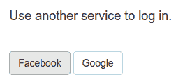
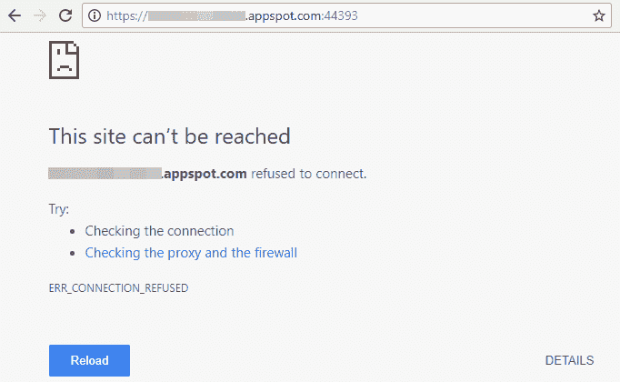

# 将社交登录添加到您的。NET App 引擎应用程序

> 原文：<https://medium.com/google-cloud/adding-social-login-to-your-net-app-engine-application-9b7f4149eb73?source=collection_archive---------0----------------------->

# 这个帖子现在已经过时了！

请看我的[新帖](/@SurferJeff/adding-social-login-to-your-asp-net-core-2-1-google-cloud-platform-application-1baae89f1dc8)，它演示了将社交登录添加到 ASP.NET 核心 *2.1* 应用中。这篇旧文章展示了老 ASP.NET 核心 1.1 应用程序的相同之处

用户厌倦了为他们访问的每个网站创建新的登录名和密码。2013 年，[的一项调查](http://www.webhostingbuzz.com/blog/2013/03/21/whos-sharing-what/)发现，86%的人表示他们被在网站上创建新账户的需求所困扰。这个数字今天可能变得更大了。就我个人而言，我在我的密码管理器中记录了超过 100 次登录和密码。

根据[调查](http://www.webhostingbuzz.com/blog/2013/03/21/whos-sharing-what/)显示，77%的用户倾向于一个更好的解决方案，即允许用户使用他们最喜欢的社交账户登录，无论是脸书、推特还是谷歌。对于用户来说，社交登录消除了使用你网站的障碍。 [Saavn 发现使用脸书登录的听众参与度提高了 65%](https://developers.facebook.com/case-studies/saavn)。 [Skyscanner 在交互方面也有令人印象深刻的改进。](https://developers.facebook.com/case-studies/skyscanner)


好消息是微软已经提供了。NET 程序员使用库来简化将社交登录集成到他们的。NET MVC 核心 web 应用程序。他们还提供了优秀的文档，描述如何为所有流行的提供商添加社交登录。我按照这些文档中的说明，迅速将社交登录添加到我的。NET core web app。我按下 F5 在我的开发机器上运行应用程序，点击**用脸书**登录，它就工作了！耶！



然后我试着将它部署到 Google App Engine，看到了一条错误消息:

```
Unhandled Exception: System.ArgumentException: The ‘ClientId’ option must be provided.at Microsoft.AspNetCore.Authentication.Facebook.FacebookMiddleware..ctor(RequestDelegate next, IDataProtectionProvides`1 sharedOptions, IOptions`1 options)
```

结果是，我需要对我的 MVC Web 应用程序做一些调整，以使社交登录在 App Engine 上运行时工作。事实上，这些调整对于运行任何。App Engine 上的 NET core MVC 应用。我在下面描述了这些问题及其解决方案。

# App Engine 不知道我的脸书 AppSecret。


为了让用户能够登录脸书，我创建了一个脸书应用程序，如微软的[文档](https://docs.microsoft.com/en-us/aspnet/core/security/authentication/social/facebook-logins)中所述。脸书给了我一个 AppSecret，这是一个秘密字符串，当我想验证一个用户时，我会将它传递给脸书。当我在我的开发机器上运行程序时，我使用 dotnet 的 [Secret Manager 工具](https://docs.microsoft.com/en-us/aspnet/core/security/app-secrets)存储了这个秘密，如下所示:

`dotnet user-secrets set Authentication:Facebook:AppSecret <app-secret>`

当然，dotnet 命令将秘密存储在我的开发机器上，当我的应用程序运行在 App Engine 上时，它无法访问我的开发机器。当我在 App Engine 上运行应用程序时，上面的异常报错了，因为我向`app.UseFacebookAuthentication()`传递了一个空的脸书 ClientId。我需要一种安全的方式将 AppSecret 分发到我的应用引擎实例。我可以把它保存在我的 appsettings.json 中，但是我的 AppSecret 会被签入 git，并最终在[github.com](https://github.com/)上被所有人看到。我的 AppSecret 将立即变成非秘密！

[元数据](https://cloud.google.com/compute/docs/storing-retrieving-metadata)来救援了！Google App Engine 和 Compute Engine 允许您将键值对存储在元数据中，这是安全的，可以由 App Engine 实例读取。我用如下命令设置元数据:

`gcloud compute project-info add-metadata — metadata=$key=$value`

实际上，我[写了一个脚本](https://github.com/GoogleCloudPlatform/dotnet-docs-samples/blob/895dc320212a56d558845a1ec6508424aae9c3bc/appengine/flexible/SocialAuth/Upload-UserSecrets.ps1)将所有相关的用户机密复制到元数据中。然后，我[写了](https://github.com/GoogleCloudPlatform/dotnet-docs-samples/blob/895dc320212a56d558845a1ec6508424aae9c3bc/appengine/flexible/SocialAuth/Services/MetadataConfigurationSource.cs)一个 ConfigurationProvider，它在 App Engine 上运行时读取元数据。

新法规解决了这个问题。我成功部署到应用引擎，但是当我访问我的应用主页时，我看到一个错误:



# 应用引擎和 HTTPS

社交登录提供商需要 HTTPS 连接来防止各种攻击。为了强制浏览器通过 HTTPS 连接到我的应用程序，我在 [Startup.cs](https://github.com/GoogleCloudPlatform/dotnet-docs-samples/blob/895dc320212a56d558845a1ec6508424aae9c3bc/appengine/flexible/SocialAuth/Startup.cs) 中添加了以下三行代码:

```
var rewriteOptions = new RewriteOptions();
rewriteOptions.AddRedirectToHttps(302, 44393);
app.UseRewriter(rewriteOptions);
```

这在本地运行时工作正常，但当我部署到 App Engine 时失败了，因为 App Engine 负载平衡器侦听 HTTPS 的默认端口 443。因此，我更改了代码，将 HTTP 请求重定向到端口号 443，重新编译并部署了我的应用程序，然后看到:


这是怎么回事？

**App Engine 让 HTTPS 看起来像 HTTP** 。


当我在浏览器中输入[https://my-app.appspot.com/](https://my-app.appspot.com/)时，我的应用程序看到一个具有以下属性的请求:

```
Scheme: http
X-Forwarded-Proto: https
```

如谷歌的[应用引擎文档](https://cloud.google.com/appengine/docs/flexible/dotnet/how-requests-are-handled)所述:

> Google Cloud 负载平衡器终止所有 https 连接，然后通过 http 将流量转发给 App Engine 实例。例如，如果用户通过[https://[MY-PROJECT-ID]. appspot . com 请求访问您的站点，](https://[MY-PROJECT-ID].appspot.com,)X-Forwarded-Proto 头值是 https。

当我的应用程序收到一个 HTTPS 请求时，重写器并不认为它是 HTTPS。相反，它看到了`Scheme: http`，并决定仍然需要将请求重定向到 HTTPS。因此，它将请求重定向到它所请求的完全相同的 url，导致重定向的无限循环。我需要让重写者明白传入的请求实际上是 HTTPS。

感谢构建 AspNetCore 的优秀开发人员，他们提供了一种以自定义方式重写传入请求的方法。为了重写传入的请求，我[实现了](https://github.com/GoogleCloudPlatform/dotnet-docs-samples/blob/895dc320212a56d558845a1ec6508424aae9c3bc/appengine/flexible/SocialAuth/Services/RewriteHttpsOnAppEngine.cs)一个微软。检查 X-Forwarded-Proto 的 AspNetCore.Rewrite.IRule。当 X-Forwarded-Proto 设置为 https 时，我的 IRule 将方案重置为 https。

```
string proto = request.Headers[“X-Forwarded-Proto”]
  .FirstOrDefault();
if (proto == “https”) {
  request.IsHttps = true;
  request.Scheme = “https”;
  return true;
```

有了这个新的 IRule，我把我的应用程序重新部署到 App Engine，HTTPS 开始工作了。耶。我用脸书点击**登录，看到这个错误页面:**


# 显示错误信息。

正如你在上面看到的，错误页面隐藏了所有重要的细节。为了调试这个问题，我需要查看详细信息。我不想将开发模式应用程序部署到 App Engine，因为那会有暴露我的秘密的风险。所以，我增加了对谷歌的依赖。Cloud.Diagnostics.AspNetCore 并在我的 [StartUp.cs](https://github.com/GoogleCloudPlatform/dotnet-docs-samples/blob/895dc320212a56d558845a1ec6508424aae9c3bc/appengine/flexible/SocialAuth/Startup.cs) 中添加了一条语句:

```
services.AddGoogleExceptionLogging(projectId,
  Configuration[“GoogleErrorReporting:ServiceName”],
  Configuration[“GoogleErrorReporting:Version”]);
```

然后，我可以在谷歌云控制台中看到完整的错误消息:


微软。AspNetCore.Dataprotection 试图解密某些内容，但找不到密钥。这是怎么回事？

# AspNetCore 的默认 [DataProtectionProvider](https://docs.microsoft.com/en-us/aspnet/core/api/microsoft.aspnetcore.dataprotection.dataprotectionprovider) 不能跨多个 web 服务器实例工作。


像微软这样的社交登录中间件。AspNetCore . authentic ation . Facebook 需要加密。同样，AspNetCore 在预见这种需求方面做得很好，它提供了一个标准接口 IDataProtectionProvider 来提供加密。但是，问题是默认的 IDataProtectionProvider 在 web 服务器上本地存储加密密钥。然而，在 App Engine 上，总是有多个 web 服务器，并且每个 web 服务器都有不同的密钥。此外,(通过设计)预测一个请求将被路由到哪个 web 服务器是不可能的。


这在以下情况下会成为一个问题:

1.  一个请求被路由到 Web 服务器 1，Web 服务器 1 用一个用密钥加密的新 cookie 进行响应。
2.  带有加密 cookie 的后续请求被路由到 Web 服务器 2，Web 服务器 2 试图用密钥解密 cookie，但没有 A 密钥。

幸运的是，谷歌创造了[云密钥管理服务](https://cloud.google.com/kms/?utm_source=google&utm_medium=cpc&utm_campaign=2017-q1-cloud-na-kms-freetrial-en&dclid=CIrJ-pKXw9QCFY8oaQodinQNsA)来解决这类问题。所以我[实现了](https://github.com/GoogleCloudPlatform/dotnet-docs-samples/blob/895dc320212a56d558845a1ec6508424aae9c3bc/appengine/flexible/SocialAuth/Services/KmsDataProtectionProvider.cs)我自己的 IDataProtectionProvider，它使用谷歌 KMS 来管理密钥。

我将我的应用程序重新部署到应用引擎，再次点击**用脸书**登录，我看到成功了！


# 结论

为了让我的应用程序在谷歌应用引擎上正常工作，我花了一些功夫，但结果是一个应用程序能够保守秘密，并随着负载的增加自动扩展。相当不错。感谢 AspNetCore 精心设计的界面和功能，以及 Google 精心设计的服务，不需要任何黑客攻击！只需做一点工作就能让事情协调起来。

Google 的 Cloud Tools for Visual Studio 团队正在努力将所有这些解决方案构建成一个新的库和一个新的项目模板。当它发布时，您将能够在 Visual Studio 中选择一个新的 **App Engine Flex MVC 项目**，并享受所有这些集成，而无需额外的工作。

在那之前，你可以自己构建并运行[我的项目](https://github.com/GoogleCloudPlatform/dotnet-docs-samples/tree/895dc320212a56d558845a1ec6508424aae9c3bc/appengine/flexible/SocialAuth)！请随意浏览我们 [github 资源库](https://github.com/GoogleCloudPlatform/dotnet-docs-samples/tree/895dc320212a56d558845a1ec6508424aae9c3bc/appengine/flexible/SocialAuth)中的完整代码，并在该资源库中记录问题。