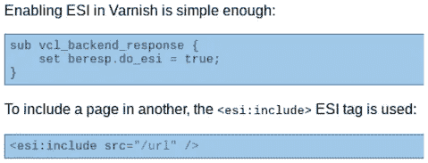
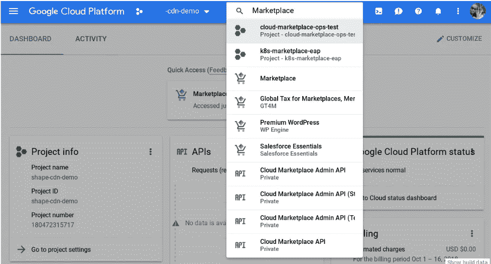
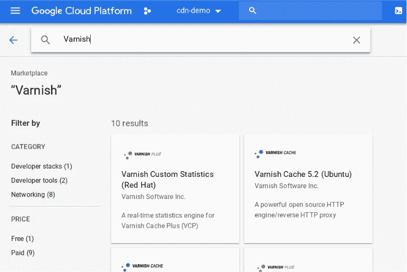
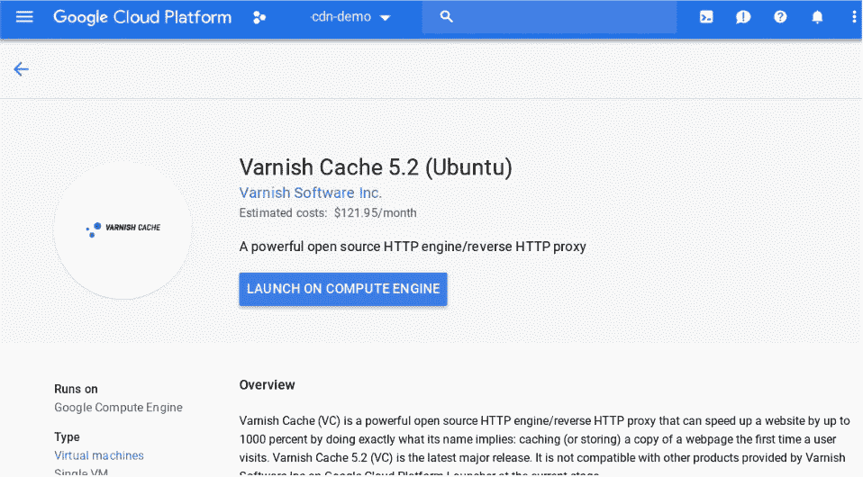
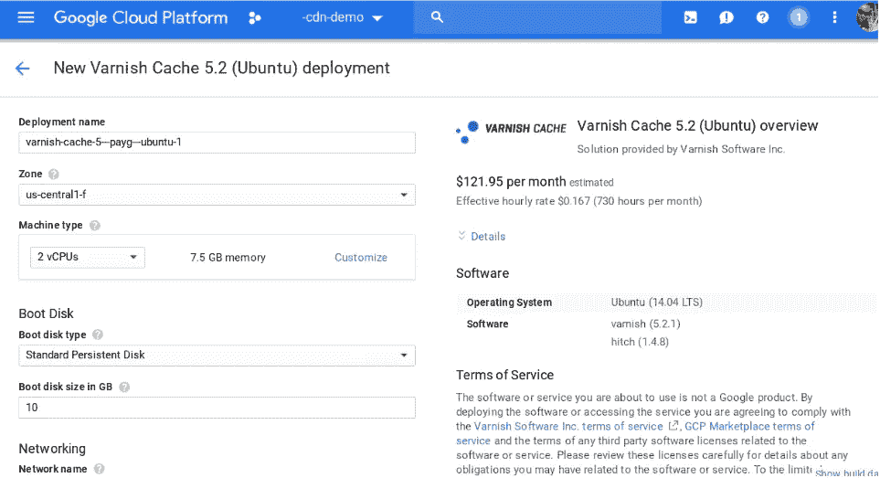
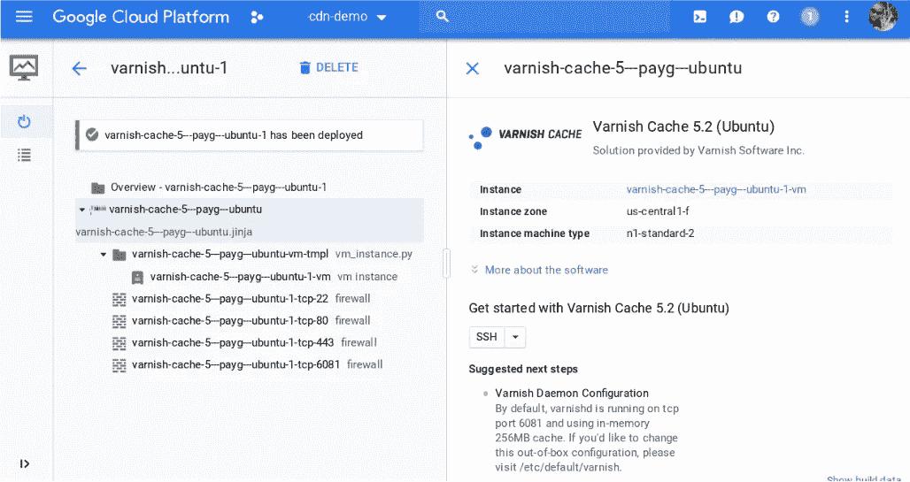
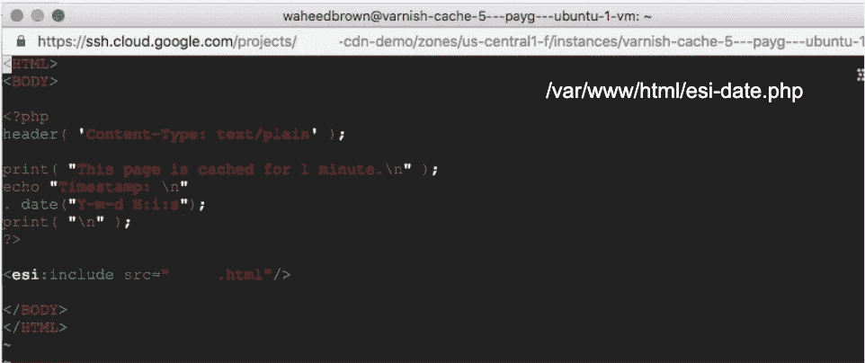
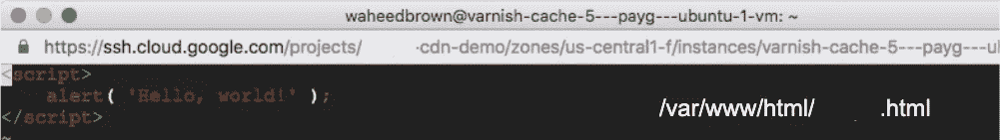
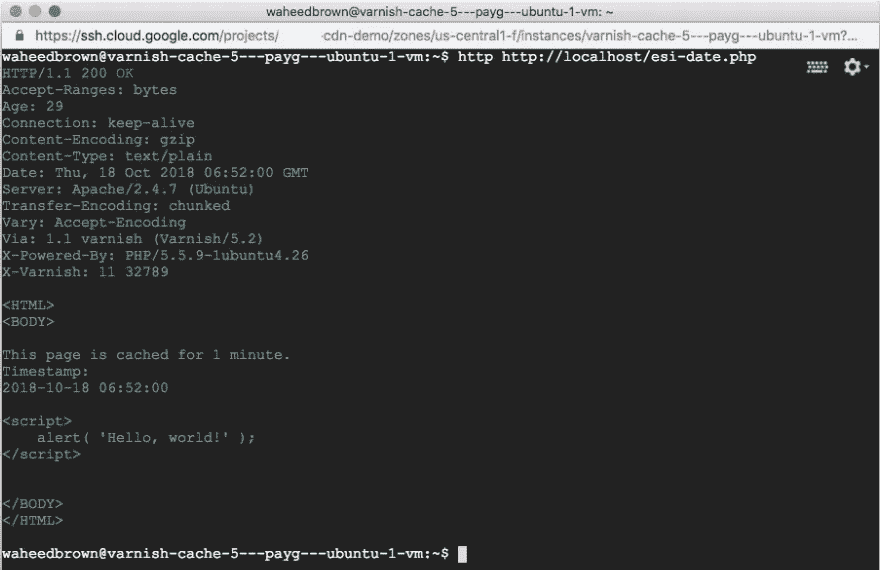
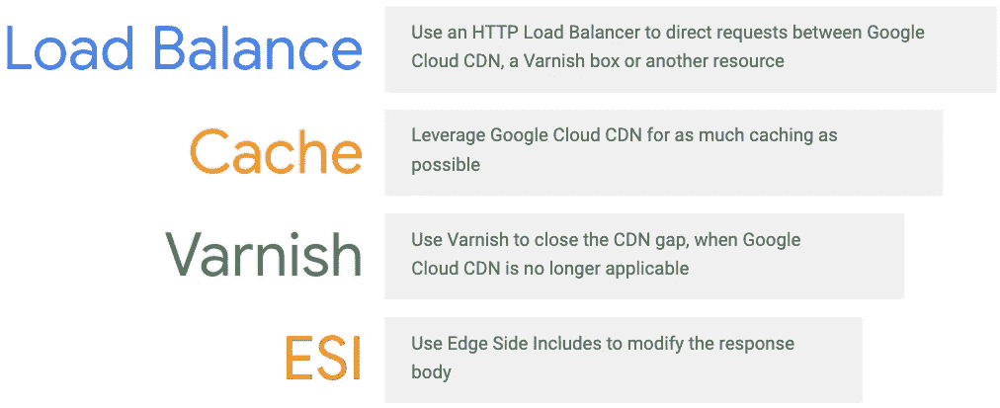

# 高级缓存第 1 部分:Google Cloud CDN 和 Varnish

> 原文：<https://medium.com/google-cloud/advanced-caching-part-1-google-cloud-cdn-and-varnish-e63d79252367?source=collection_archive---------0----------------------->

Google Cloud CDN 和 Varnish Cache 可以加速您的最终用户体验

G [oogle Cloud CDN](https://cloud.google.com/cdn/) 是一个轻量级的内容交付网络解决方案。它抵消了后端的负载。当然，它大大减少了最终用户的 HTTP 响应时间。当这还不够时，还有[清漆缓存](https://varnish-cache.org)。

这篇博文将带您了解如何在 Google Cloud 中实现 Varnish 的高级缓存规则。这可以在 Google Cloud CDN 背后完成，也可以完全靠自己。它解决了编辑 HTML 响应主体的需要，以便可以缓存伪动态内容。

arnish Cache 缩小了与 Google Cloud 的 CDN 差距。Varnish 允许您以声明方式设置缓存规则。这是通过使用一个名为[的功能完成的，边缘侧包括](https://varnish-cache.org/docs/5.2/users-guide/esi.html) (ESIs)。

Edge Side Includes (ESIs)允许直接在 Varnish 缓存服务器上编辑 HTML 响应

**1。谷歌云平台** 登录你的谷歌云平台(GCP)控制台并导航至该平台

流行服务的可信虚拟机映像在谷歌云市场中

**2。选择一个清漆图像** 选择一个清漆缓存图像*，安装在谷歌计算引擎(GCE)虚拟机(VM)上

Varnish Cache 是一个反向代理，具有 HTML(和其他)响应的高级缓存

**3。部署映像** 启动会将您导航到 GCP 控制台的 GCE 部分

虚拟机映像可以直接从市场启动到 GCE 实例上

**4。选择机器类型** 根据您的用例，您可能想要选择强大的虚拟机
或者，考虑在 Google Kubernetes 引擎(GKE)集群中手动部署 Varnish

出于开发目的，一台双 CPU 机器就足够了

**5。映像无缝部署**

GCP 市场映像优雅地为您配置了虚拟机和网络端口

清漆图像在技术上是一个容器，在引擎盖下

6。Edge Side 包括([link](http://book.varnish-software.com/4.0/chapters/Content_Composition.html#edge-side-includes))esis 允许您将内容注入到 Varnish 机器上的响应主体
中，创建具有< esi >标签
的 web 文件这里我们将 PHP 放入 HTML 文件中，以演示除 ESI 之外的脚本编写

<esi>标签引用了一个单独的 HTML 文件</esi>

接下来，我们创建第二个 web 文件，上面的<esi>标记引用了这个文件
。第二个文件包含 JavaScript，它将在最终用户的浏览器中运行</esi>

HTML 文件包含动态填充响应的 JavaScript

**7。ESI 在 Google Cloud 工作！** 在下面的 HTTP 响应中，PHP 代码在服务器上运行
**然而**，Varnish < esi >标签根据需要插入了 JavaScript
这个 HTTP 响应因此被 Varnish
有效地缓存，这是一个伪动态网页的缓存

Varnish 的 ESI 服务构建响应体，插入 JavaScript，从而缓存伪动态响应

**谷歌云 CDN 最佳实践** ( [链接](https://cloud.google.com/cdn/docs/best-practices))

