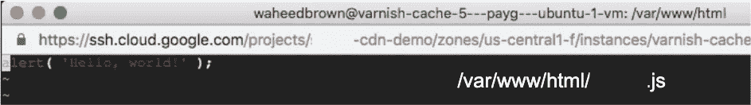
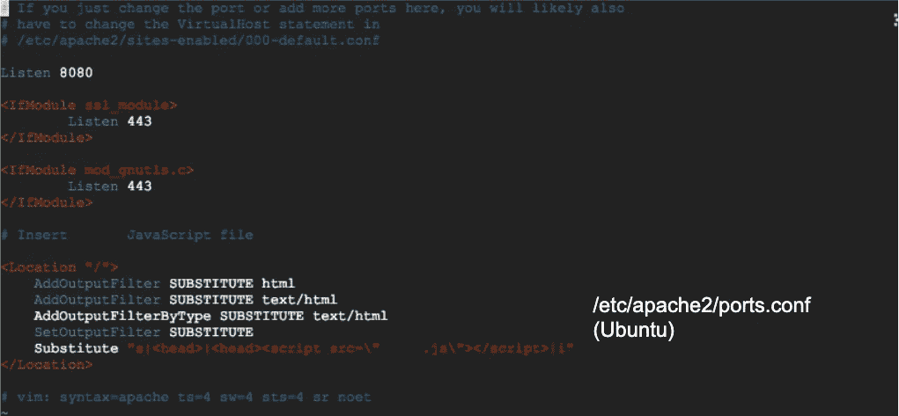
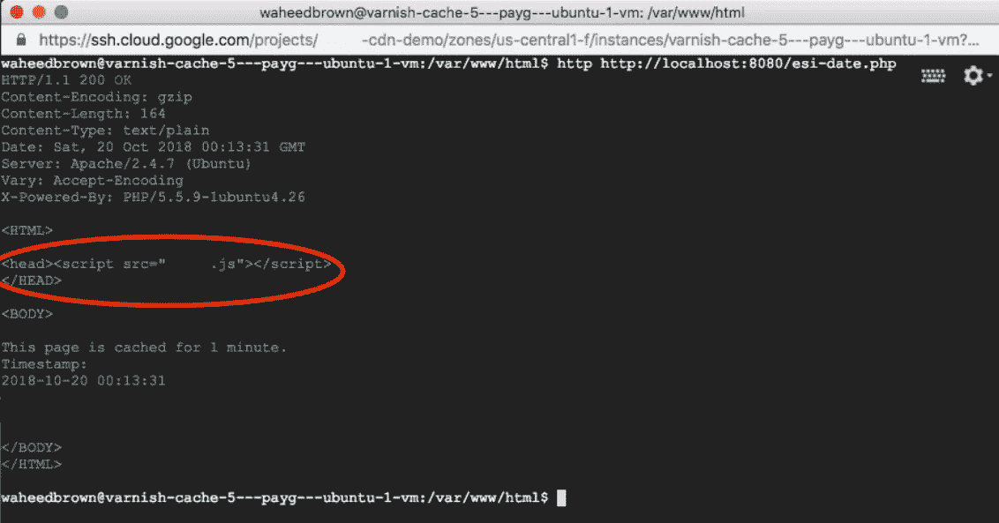

# 高级缓存第 2 部分:Google Cloud CDN 和 Apache

> 原文：<https://medium.com/google-cloud/advanced-caching-part-2-google-cloud-cdn-and-apache-fccf4ca84a9f?source=collection_archive---------2----------------------->

如果 Google Cloud CDN 和 Varnish Cache 都不够用，那就该 DIY 了

在第 1 部分，Google Cloud CDN 和 Varnish 中，我们学习了缓存动态响应。在第 2 部分中，我们完全去掉了图片上的清漆，并且自己完成了所有的工作。假设 Google Cloud CDN 已经启动并运行，我们可以使用 Apache 在 HTML 响应被缓存之前对其进行修改。

**1。Apache 模块 mod_substitute** 在谷歌计算引擎(GCE)虚拟机(VM)上启用 Apache 模块 [mod_substitute](http://httpd.apache.org/docs/2.4/mod/mod_substitute.html)

*sudo a2enmod 替换
sudo 服务 apache2 重启*

注意:以上终端命令适用于 Ubuntu Linux

**2。在. js 文件中添加所需的 JavaScript 代码**

创建一个. js 文件来保存所需的 JavaScript 代码(在最终用户的 web 浏览器上运行)

**3。使用 Apache Substitute 插入一个<脚本>标签** Apache 的 mod_substitute 模块允许您编写标记规则

*vim/etc/Apache 2/ports . conf*

在 ports.conf 文件中，这些标记命令允许您利用 Linux 替代命令“s”

将步骤 2 中的 JavaScript 文件放入脚本标记中

使用 Linux 替代命令“s”将 JavaScript 文件插入到 HTML 响应中

**4。为不同的目录和文件制定规则**
请注意，上述替换中的<位置>标签
这种替换是针对 web 服务器根目录
中的所有网页，针对特定的 web 目录和文件使用附加的<位置>标签

**5。响应身体修改有效！**
HTML 响应中的< head >标签被 Apache
修改，它现在包含一个引用您的 JavaScript 文件的< script >标签

标签已经更新，这个修改后的 HTML 响应将被 Google Cloud CDN 缓存

这是在缓存网页中填充动态内容的好方法*

***注意:**确保您的内容的[到期时间](https://cloud.google.com/cdn/docs/best-practices#setting_the_expiration_for_time-sensitive_content)与您的生命周期相匹配。js 文件更改