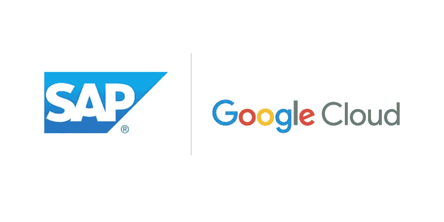
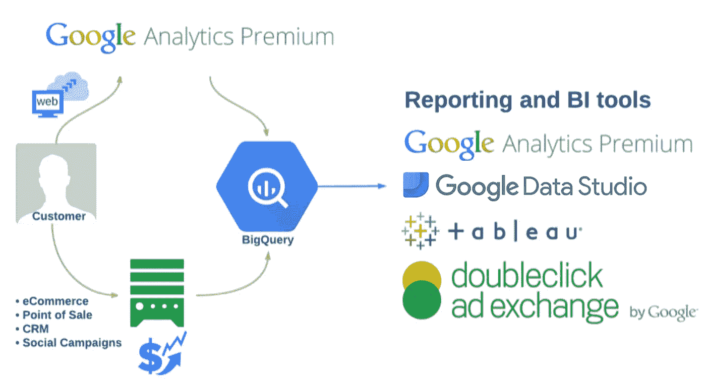

# 在谷歌云上运行 SAP 的优势

> 原文：<https://medium.com/google-cloud/advantages-of-running-sap-on-google-cloud-2632a862feeb?source=collection_archive---------1----------------------->

谷歌云平台(GCP)通过了[认证](https://cloud.google.com/sap/)，可以运行 SAP 应用、SAP 云平台(PaaS)和 SAP HANA。
请继续阅读，了解 GCP 与众不同的一些亮点，尤其是在 SAP 工作负载方面。

## **价格、可用性和性能领导者**

Google Cloud 为计算和存储以及灵活的创新定价和所有类型的工作负载和应用程序使用案例提供按秒计费和按需付费。
[**持续使用折扣**](https://cloud.google.com/compute/docs/sustained-use-discounts) 对于运行一整月的实例，自动应用高达 30%的折扣。对于运行时间不确定的标准工作负载，这是一个很好的默认增值。
[**承诺的使用折扣**](https://cloud.google.com/compute/docs/instances/signing-up-committed-use-discounts) 没有前期成本，在常规定价的基础上提供高达 57%的折扣，以换取 1 年或 3 年的承诺。如果您考虑在 GCP 运行 SAP，这很可能是您想要的地方。更多关于承诺使用折扣的信息[请点击](https://cloudplatform.googleblog.com/2017/09/committed-use-discounts-for-Google-Compute-Engine-now-generally-available.html)。
[**可抢占虚拟机(pVM)实例**](https://cloud.google.com/preemptible-vms/) 非常适合无状态、批处理作业和容错处理工作负载。PVM 的折扣约为正常价格的 80%。

[定制机器类型](https://cloud.google.com/compute/docs/instances/creating-instance-with-custom-machine-type)允许您准确选择需要多少 vCPU 和内存，从而摆脱其他供应商的预定义实例类型。
GCP 拥有所有云提供商中最快的实例启动时间，以及无与伦比的地区正常运行时间。
性能由私有分布式主干[网络](https://cloud.google.com/products/networking/)支撑，在世界各地有 100 多个全球网络点，让云[位置](https://cloud.google.com/about/locations/)离您更近。GCP 为您的内部关键任务应用提供了各种灵活快速的私有[互连和对等](https://cloud.google.com/interconnect/)选项，或者使用[云身份感知代理(Cloud IAP](https://cloud.google.com/iap/) )进行身份验证，而无需 VPN。

## BigQuery 减少您的 HANA 占用空间并用于广告分析

HANA 和 [BigQuery](https://cloud.google.com/bigquery/) (BQ)是两种非常独特的数据服务，可以一起用于处理热、温和冷数据层。运行 HANA 数据库可能成本高昂，并且通常需要维护可变的 OLTP 和 OLAP 工作负载。不常访问的 HANA OLAP 数据可以从内存中移动到 BQ 等数据仓库，以提高成本效益。BigQuery 是现收现付的，区域性的，有缓存查询，SQL 查询和容易集成。使用 SAP 数据服务将 BQ 与 HANA 集成，并使用 Tableau 或 Data Studio 显示所有内容，以优化和减少 HANA 系统占用空间。

您的企业中运行 Google Analytics 360 吗？使用 BigQuery 进行预测分析，更好地了解您的客户。每天自动处理几次数据流，并使用 Google Cloud Data Studio 进行可视化。更多[此处](https://cloud.google.com/solutions/google-analytics-bigquery)。

## **完全合规的云和零成本 BAA (HIPAA)、深度防御和集成安全服务**

Google Cloud 不对 HIPAA 合规性所需的业务伙伴协议(BAA)等协议收费。谷歌云进行常见和不常见的[合规性审计](https://cloud.google.com/security/compliance)以保护客户并让所有行业做得更多。

在过去的 15 年里，谷歌有一套非常独特的安全方法来保护用户在 Gmail、搜索和广告上的安全。所有的东西在传输中和静止时都在平台上加密，不需要额外的费用。基础设施和网络堆栈每一层的深度防御。[阅读更多谷歌安全白皮书。](https://cloud.google.com/security/whitepaper)

> 在 2017 年，公共云比大多数客户拥有的内部数据中心更安全。更多关于谷歌云安全[的信息请点击这里](https://cloud.google.com/security/)。

## **全面管理，集成容易**

您的组织是否使用 G-Suite (Google Apps，如 Gmail、docs 或 drive？)如果是这样的话，在 G-Suite 中将 Google 云项目和用户与 Google Admin 集成起来是非常容易的。更多[此处](https://cloudplatform.googleblog.com/2017/06/enterprise-identity-made-easy-in-GCP-with-Cloud-Identity.html)。

尝试谷歌云平台很容易。点击查看自由层计划[。没有前期成本，也没有尝试的承诺。](https://cloud.google.com/free/)

您是否与系统集成商或合作伙伴合作？Google Cloud 与大多数大型、区域性和精品专业 SAP 合作伙伴建立了合作关系。

再也不用担心部署和管理实例或复杂的数据仓库集群。关注生产系统，并从数据中获得有利可图的见解。默认情况下，谷歌云上的几乎所有服务都是完全托管的。

# 如果您本周在 SAPTechEd 参观您的展位，我们将额外提供 300 美元(总计 600 美元)的免费等级积分。我整天和明天(星期四)下午都会在那里。过来打个招呼。

更多信息:

[关键词博文-谷歌云平台上的 SAP、认证和更多](https://www.blog.google/topics/google-cloud/sap-google-cloud-platform-new-certifications-and-more/)
[谷歌云上的 SAP](https://cloud.google.com/sap/)
[谷歌云上的 SAP HANA](https://cloud.google.com/sap/saphana/)