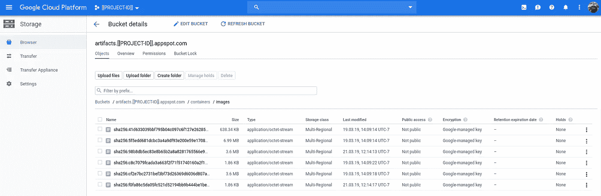

# 带有集装箱清单的冒险

> 原文：<https://medium.com/google-cloud/adventures-w-docker-manifests-78f255d662ff?source=collection_archive---------0----------------------->

**TL；DR** 我被提示去了解集装箱图像清单，这些是如何计算|验证的，以及清单如何与层相对应。以下是我学到的。

> **注意**您的 sha256 会有所不同

我创建了最简单的 Golang httpd，并将其封装为:

```
FROM golang:1.12 as buildWORKDIR /go/src/app
COPY . .RUN go get -d -v ./...
RUN go install -v ./...FROM gcr.io/distroless/base
COPY --from=build /go/bin/app /ENTRYPOINT ["/app"]
```

然后:

```
IMAGE=hellofreddie
TAG=v1docker build \
--rm \
--file=Dockerfile \
--tag=${IMAGE}:${TAG} \
hellofreddie
```

> **NB** `--rm`删除中间容器，这是默认设置。

然后:

```
docker history ${IMAGE}:${TAG} \
--format="{{.ID}}\t{{.CreatedBy}}"IMAGE               CREATED BY                                      
c8c7079fcada        /bin/sh -c #(nop)  ENTRYPOINT ["/app"]
de61bd0d36a4        /bin/sh -c #(nop) COPY file:549fe06ce41c1ab2…
**a5a1c6b2c22f**        bazel build ...
<missing>           bazel build ...
```

这些图像层从上到下与 Dockerfile 文件中的命令反向对应:

```
docker image ls gcr.io/distroless/base
REPOSITORY               TAG                 IMAGE ID
gcr.io/distroless/base   latest              **a5a1c6b2c22f**docker image history gcr.io/distroless/base \
--format="{{.ID}}\t{{.CreatedBy}}"
**a5a1c6b2c22f**        bazel build ...
<missing>           bazel build ...
```

然后由`build`层生成文件的副本。

最后，设置`ENTRYPOINT`。

我们可以:

```
docker image inspect ${IMAGE}:${TAG} \
| jq --raw-output '.[0].**Id**'
sha256:c8c7079f...docker image inspect ${IMAGE}:${TAG} \
| jq --raw-output '.[0].**RepoDigests**[]'
dazwilkin/hellofreddie@sha256:**2f93667f**...
gcr.io/dazwilkin-190319-docker/hello@sha256:**2f93667f**...
gcr.io/dazwilkin-190319-docker/hellofreddie@sha256:**2f93667f**...docker image inspect ${IMAGE}:$}{TAG} \
| jq --raw-output '.[0].RootFS.**Layers**[]'
sha256:44873b56...
sha256:87c747af...
sha256:5ef84fd2...
```

> **假设#1** :(回购)摘要散列(`2f93667f`)应该专门从图像清单的内容中确定。希望在这篇文章结束之前，我们能证明这一点。

## 码头枢纽(`hub.docker.com`

如果您有 Docker 凭证(`${USERNAME}`)，您可以将您的图像推送到 Docker 的注册表(`hub.docker.com`):

```
docker tag ${IMAGE}:${TAG} ${USERNAME}/${IMAGE}:${TAG}
docker push ${USERNAME}/${IMAGE}:${TAG}
```

在我看来是这样的:


dockerhub

UI 看起来不错，但似乎缺乏深入清单和层的功能。幸运的是，有一个注册 API，这个文档有助于使用它:

`[https://success.docker.com/article/how-do-i-authenticate-with-the-v2-api](https://success.docker.com/article/how-do-i-authenticate-with-the-v2-api)`

为了保持连续性，我将在这里重复其中的一些例子:

```
REG="[https://hub.docker.com/v2](https://hub.docker.com/v2)"
USR=[[YOUR-DOCKER-USERNAME]]
PWD=[[YOUR-DOCKER-PASSWORD]]TOKEN=$(\
  curl \
  --silent \
  --header "Content-Type: application/json" \
  --request POST \
  --data '{"username": "'${USR}'", "password": "'${PWD}'"}' \
  ${REG}**/users/login/** \
  | jq -r .token\
) && echo ${TOKEN}curl \
--silent \
--header "Authorization: JWT ${TOKEN}" \
${REG}**/repositories/${USR}/**?page_size=100 \
| jq -r '.results|.[]|.name' curl \
--silent \
--header "Authorization: JWT ${TOKEN}" \
${REG}**/repositories/${USR}/${IMAGE}/tags/**
```

> 我极力推荐 jq，但是如果您不想使用它，您需要从 curl 命令返回的 JSON 中手动获取`token`值。

下一步应该是为 image `${IMAGE}:${TAG}`拉一个清单，但是我努力让它与 dockerhub 一起工作:

```
curl \
--silent \
--header "Authorization: JWT ${TOKEN}" \
${REG}**/${USR}/${IMAGE}/manifests/v1**
```

让我们看看 Stackoverflow 上的好心人是怎么说的:

`[https://stackoverflow.com/questions/55269256/how-to-get-manifests-using-http-api-v2](https://stackoverflow.com/questions/55269256/how-to-get-manifests-using-http-api-v2)`

因为我无法提取货单，所以我无法在 dockerhub 上进一步证实货单。

**更新 2019–09–12:**[**已解决**](https://stackoverflow.com/a/57878742/609290) **由**[**schna tter**](https://stackoverflow.com/users/1845976/schnatterer)**—感谢！**

您使用以下方式获得一个`TOKEN`:

```
AUTH="[https://auth.docker.io](https://auth.docker.io/token?service=registry.docker.io&scope=repository:dazwilkin/hellofreddie:pull)"
SERV="registry.docker.io
REPO=${USR}/${IMAGE}TOKEN=$(\
  curl \
  --silent \
  --location \
  "${AUTH}[/token?service=${SERV}&scope=repository:${REPO}:pull](https://auth.docker.io/token?service=registry.docker.io&scope=repository:dazwilkin/hellofreddie:pull)" \
  | jq --raw-output .token\
) && echo ${TOKEN}
```

然后:

```
REG="**https://index.docker.io/v2**"
SCHEMA="application/vnd.docker.distribution.manifest.v2+json"curl \
  --silent \
  --location \
  --header "Authorization: Bearer ${TOKEN}" \
  --header "Accept: ${SCHEMA}" \
  "${REG}/${USR}/${IMAGE}/manifests/${TAG}" \
| jq --raw-output
```

或者:

```
curl \
  --silent \
  --location \
  --header "Authorization: Bearer ${TOKEN}" \
  --header "Accept: ${SCHEMA}" \
  "${REG}/${USR}/${IMAGE}/manifests/${TAG}" \
| sha256sum \
| head --bytes 64
**2f93667f...**
```

## 谷歌容器注册

如果您可以访问谷歌云平台项目，您也可以使用谷歌容器注册:

```
docker tag ${IMAGE}:${TAG} **gcr.io/${PROJECT}/**${IMAGE}:${TAG}
docker push **gcr.io/${PROJECT}/**${IMAGE}:${TAG}v1: digest: sha256:**2f93667f**... size: 949
```

**NB** 推送完成后提供给我们的摘要(`sha256:2f9e667f…`)。

这是我使用云控制台时看到的样子:

`[https://console.cloud.google.com/gcr/images/${PROJECT}](https://console.cloud.google.com/gcr/images/${PROJECT})`


谷歌容器注册

还有一个有用的深入查看图像的功能，首先显示可用的标签，然后显示清单细节:


Google 容器注册表:清单

**NB** 容器注册表提供了摘要(`2f93667f`)。这与我们完成推送时提供给我们的摘要相匹配。当我们引用图像时，我们可以通过`${IMAGE}:${TAG}`来引用它，但是同一个`${IMAGE}:${TAG}`可能会产生不同的图像。相反，我们可以将图像唯一且不变地称为`${IMAGE}@sha256:2f9e667f...`。

Google 容器注册实现了 Docker 注册 API v2。不幸的是，因为容器注册中心*不是*一个常规的 Google API，所以不可能使用美妙的 Google APIs Explorer 来探测这个 API。

然而，根据以上 Docker 实现的经验，这里的主要问题是如何根据 Google Registry 进行认证。

解决方案如下:

```
TOKEN=$(gcloud auth print-access-token)
```

因为这很容易获取，我建议在随后的命令中直接使用该命令，而不是使用`${TOKEN}`，因为这会过期。

**抛开**不谈:我试图通过对`gcloud container image`命令使用 gcloud `-log-http`来找出使用了哪些 API 调用:

```
gcloud container images list \
--repository=**gcr.io/${PROJECT}** \
--log-http==== request start ====
uri: [https://**gcr.io/v2/token**?scope=repository%3A**${PROJECT}**%3A**pull&service=gcr.io**](https://gcr.io/v2/token?scope=repository%3Adazwilkin-190319-docker%3Apull&service=gcr.io)
method: GET
== headers start ==
Authorization: --- Token Redacted ---
content-type: application/json
== headers end ==
== body start ==== body end ==
---- response start ----
-- body start --
{
  "expires_in":43200,
  "issued_at":"2019-03-21-T23:59:59.00000000-7:00",
  **"token":"[[TOKEN]]"** }
-- body end --==== request start ====
uri: [https://gcr.io/v2/**${PROJECT}/${IMAGE}/tags/list**](https://gcr.io/v2/dazwilkin-190319-docker/tags/list)
method: GET
== headers start ==
Authorization: --- Token Redacted ---
== headers end ==
== body start ==== body end ==
==== request end ====
---- response start ----
-- headers start --
content-location: [https://gcr.io/v2**/${PROJECT}/${IMAGE}/tags/list**](https://gcr.io/v2/dazwilkin-190319-docker/tags/list)
docker-distribution-api-version: registry/2.0
server: Docker Registry
status: 200
-- headers end --
-- body start --
{
  "child":["**${IMAGE}**"],
  "manifest":{"sha256:2f93667f...":{...}},
  "name":"**${PROJECT}**",
  "tags":["**${TAG}**"]
}
-- body end --
---- response end ----
----------------------DIGEST        TAGS  TIMESTAMP
2f93667f005b  v1    2019-03-19T00:00:00
```

我无法在针对容器注册 API 的后续调用中应用值`[[TOKEN]]`。相反，使用我的凭证来获得一个访问令牌(`gcloud auth print-access-token`)是可行的，所以我放弃了这条路。

从上面可以看出，有趣的是，您看到 Google 容器注册中心正在接受 Docker Registry v2 API 调用:

```
/token
/${PROJECT}/tags/list
/${PROJECT}/${IMAGE}/tags/list
```

因此，现在让我们使用与 dockerhub 相同的 API 调用，为容器注册库进行配置:

```
REPO=https://**gcr.io/v2**/${PROJECT}/${IMAGE}
TOKEN=$(gcloud auth print-access-token)curl \
--silent \
--request GET \
--user _token:${TOKEN} \
${REPO}**/tags/list**
{
 "child": ["**${IMAGE}**"],
 "manifest": {},
 "name": "**${PROJECT}**",
 "tags": []
}
```

并且:

```
curl \
--silent \
--request GET \
--user _token:${TOKEN} \
${REPO}**/tags/list**
{
 "child": [],
 "manifest": {"**sha256:2f93667f...**": {...}},
 "name": "**${PROJECT}**/**${IMAGE}**",
 "tags": ["**${TAG}**"]
}
```

此外，我无法使用 dockerhub 的 manifests 命令可以正确使用容器注册表:

```
curl \
--silent \
--request GET \
--user _token:${TOKEN} \
${REPO}**/manifests/${TAG}** \
| jq .
{
  "schemaVersion": 2,
  "config": {
    ...
    "digest": "sha256:c8c7079f..."
  },
  "layers": [
    {
      "size": 653664,
      "digest": "sha256:41d63303..."
    },
    {
      "size": 7326227,
      "digest": "sha256:5f5edd68..."
    },
    {
      "size": 3774900,
      "digest": "sha256:cf2e7bc2..."
    }
  ]
}
```

让我们在这里暂停一下，试着理解(我不确定我现在是否理解)我们所拥有的:

*   `config.digest` ( `c8c7079f...`)对应的是`Id`的方式，当我们检查图像建成后。
*   然而，容器注册表报告了另一个`2f93667f...`摘要。并且该值对应于来自同一图像检查命令的`RepoDigest`值。这也是我们可以用来提取图像的摘要值:`docker pull ${REPO}/${IMAGE}@sha2f93667f...`。
*   `layers[].digest`值与本地副本上的层散列不匹配。

这次让我们使用摘要:

```
DIGEST="sha256:2f93667f..."
curl \
--silent \
--request GET \
--user _token:${TOKEN} ${REPO}/${IMAGE}/manifests/${DIGEST} \
| jq .
{
  "schemaVersion": 2,
  "config": {
    ...
    "digest": "sha256:c8c7079f..."
  },
  "layers": [
    {
      "size": 653664,
      "digest": "sha256:41d63303..."
    },
    {
      "size": 7326227,
      "digest": "sha256:5f5edd68..."
    },
    {
      "size": 3774900,
      "digest": "sha256:cf2e7bc2..."
    }
  ]
}
```

结果是一样的。该摘要唯一地引用了该图像。如果我们改变图像(不管有多小)并把它作为`${IMAGE}:${TAG}`重新推送，它的摘要(很可能)会不同。

最后，让我们计算清单的 SHA-256 散列:

```
curl \
--silent \
--request GET \
--user _token:${TOKEN} ${REPO}/${IMAGE}/manifests/${TAG} \
| sha256sum \
| head --bytes 64**2f93667f...**
```

**旁白** : [斯科佩奥](https://github.com/containers/skopeo)

我在搜索中找到了 skopeo。我以前没有用过它，但它很有用:

```
./skopeo inspect docker://**docker.io**/${USER}/${IMAGE}:${TAG}
{
    "Name": "docker.io/${USER}/${IMAGE}",
    "Digest": "**sha256:2f93667f...**",
    "RepoTags": [
        "${TAG}"
    ],
    "Created": "2019-03-19T00:00:00.000000000Z",
    "DockerVersion": "18.06.2-ce",
    "Labels": null,
    "Architecture": "amd64",
    "Os": "linux",
    "Layers": [
        "sha256:41d63303...",
        "sha256:5f5edd68...",
        "sha256:cf2e7bc2..."
    ]
}
```

并且:

```
./skopeo inspect docker://**gcr.io**/${PROJECT}/${IMAGE}:${TAG}
{
    "Name": "gcr.io/${PROJECT}/${IMAGE}",
    "Digest": "**sha256:2f93667f...**",
    "RepoTags": [
        "v1",
        "v2"
    ],
    "Created": "2019-03-19T00:00:00.000000000Z",
    "DockerVersion": "18.06.2-ce",
    "Labels": null,
    "Architecture": "amd64",
    "Os": "linux",
    "Layers": [
        "sha256:41d63303...",
        "sha256:5f5edd68...",
        "sha256:cf2e7bc2..."
    ]
}
```

> 在这种情况下，GCR 的 URL 中没有`/v2/`。
> 
> **注意**`Digest`和`Layers[]`值匹配。
> 
> 因为清单完全相同，所以摘要匹配。

## 层

根据 Docker 的 API，应该可以通过它们的哈希来拉特定的层。我与多克和 GCR 的电话都没有成功。然而，有了 GCR，我知道这些层被埋在哪里。GCR 使用谷歌云存储(GCS)进行图层持久化。

使用 GCS 存储浏览器，GCR 创建了一个存储桶`artifacts.${PROJECT}.appspot.com`，其中包含`containers/images/`:



云存储浏览器

如果你还记得，我有名为`sha256:441d63303...`、`sha256:5f5edd68...`和`sha256:cf2e7bc2`的层。让我们来计算这些档案的哈希值:

```
DIGESTS=$(\
  curl \
  --silent \
  --request GET \
  --user _token:${TOKEN} \
  ${REPO}/${IMAGE}/manifests/${TAG} \
  | jq -r .layers[]**.digest** \
)BUCKET=artifacts.${PROJECT}.appspot.comfor DIGEST in ${DIGESTS}
do
  echo "Provided: ${DIGEST}"
  CALCD="sha256:"$(gsutil cp gs://${BUCKET}/containers/images/${DIGEST} - \
  | sha256sum \
  | head --bytes 64)
  echo "Calculated: ${CALCD}"
  if [ "${DIGEST}" != "${CALCD}" ]; then
    echo "Match!"
  else
    echo "Error!"
  fi
 done
```

因此，该脚本获取了`${IMAGE}:${TAG}`的清单，并使用它来确定存储在 GCS 中的图层的相应存档。然后，它将每个归档文件传输到`sha256sum`中，以(重新)计算归档文件的哈希，并将其与该层的清单摘要进行比较。在我的例子中，结果是:

```
sha256:41d63303...
sha256:41d63303...
Match!
sha256:5f5edd68...
sha256:5f5edd68...
Match!
sha256:cf2e7bc2...
sha256:cf2e7bc2...
Match!
```

还可以使用类似的过程来确认归档大小是否匹配。在这种情况下，最好将档案保存在本地，计算其`sha256sum`并确定其大小。

## 结论

我一直避免更好地理解支撑容器图像的元数据。除了提供导航 DockerHub 和 Google Container Registry 注册表的基本概述之外，希望这篇文章对其他人理解图像清单和层背后的基础知识是有用的。

你可能还记得假设 1。我们确实能够证明(回购)摘要(即清单摘要)可以简单地从清单中计算出来。

仅此而已！

**补遗**

关于集装箱注册基础桶的 sha256 计算的另一个重复部分是:

```
BUCKET=[[YOUR-BUCKET]]for OBJECT in $(gsutil ls gs://${BUCKET}/containers/images)
do 
  OBJECT_SHA=$(gsutil cp ${OBJECT} - | sha256sum | head --bytes 64)
  printf "%s\tsha==%s\n" ${OBJECT} ${OBJECT_SHA}
done
```