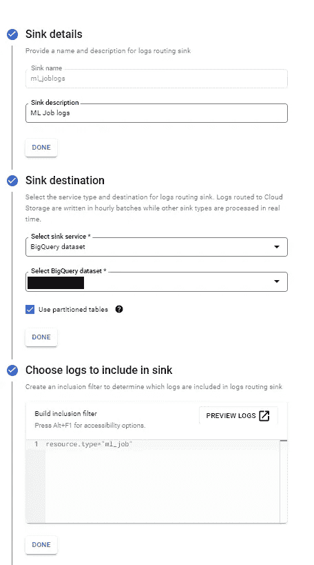
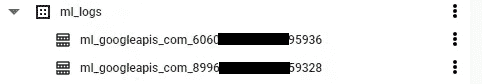
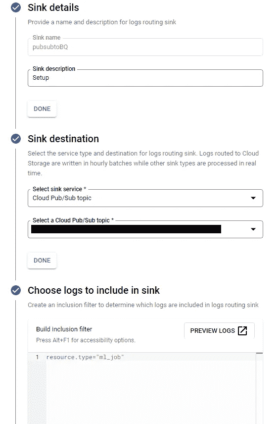
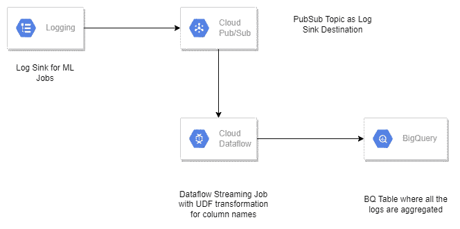
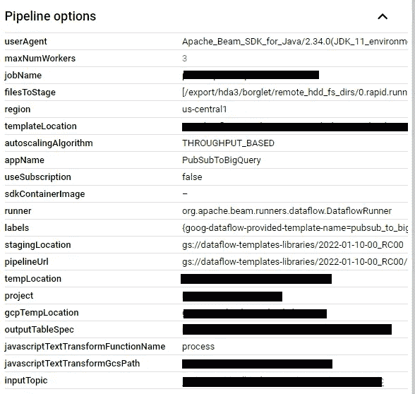
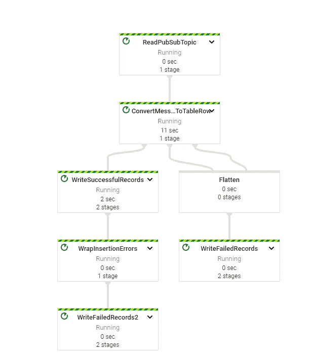
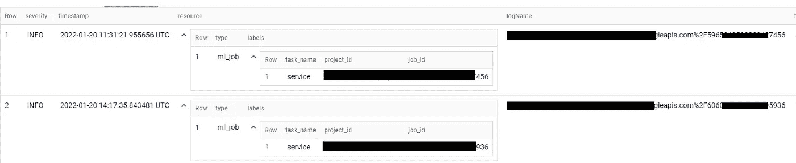

# 在 BigQuery 表中聚集顶点 AI 模型训练日志

> 原文：<https://medium.com/google-cloud/aggregate-vertex-ai-model-training-job-logs-into-a-single-bigquery-table-6e074b90b5c2?source=collection_archive---------4----------------------->

Vertex AI 将构建 ML 的谷歌云服务汇集在一个统一的 UI 和 [API](https://googleapis.dev/python/aiplatform/latest/index.html) 之下。在 Vertex AI 中，您现在可以使用 AutoML 或自定义代码训练来轻松训练和比较模型，并且您的所有模型都存储在一个中央模型库中。这些模型现在可以部署到 Vertex AI 上的相同端点。

如果您正在编写自己的培训代码，而不是使用 AutoML，那么有多种方式可以考虑进行定制培训。您可以创建三种类型的顶点 AI 资源来进行训练——自定义作业、超参数调整作业和训练管道。这些资源在执行时会生成资源类型为***【ml _ job】***的日志条目。

# **挑战—**

云日志记录通过云日志记录 API 接收这些 ML 作业日志条目，在那里它们通过日志路由器。日志路由器中的接收器根据现有的包含过滤器(严重性、资源类型)和排除过滤器检查每个日志条目，这些过滤器确定日志条目应该发送到哪些目的地，包括云日志记录桶。接收器控制云日志记录路由日志的方式。使用接收器，您可以将部分或全部日志路由到受支持的目的地，BigQuery 是受支持的目的地之一。我们可以创建如下所示的接收器，并将日志推送到提供的 BigQuery 数据集——



将日志条目直接聚合到 BQ 的接收器详细信息

但是，对于新的作业 id，在所选的 BigQuery 数据集中创建了一个新的表，连接多个表以对各种类似的训练作业进行聚合分析变得很麻烦，因为该接收器为每个作业 id 创建了新的表，如下所示



为每个作业 id 创建一个新表

# 解决方案—

另一个支持路由日志的目的地是 Pub/Sub，它支持与其他服务的集成，如**数据流**，Splunk 等。我们可以创建如下所示的接收器，将这些日志条目推送到发布/订阅服务器



将日志条目聚合到发布/订阅的接收器详细信息

Dataflow 是一种统一的流和批处理数据处理服务，无服务器、快速且经济高效。它能够以更低的数据延迟实现快速、简化的流数据管道开发。使用 Google 提供的数据流模板(BigQuery 的发布/订阅)，我们可以近乎实时地将日志条目推送到 BQ。

BigQuery 模板的发布/订阅是一个流管道，它从发布/订阅中读取 JSON 格式的消息，并将它们写入 BigQuery 表。您可以使用模板作为将发布/订阅数据移动到 BigQuery 的快速解决方案。该模板从 Pub/Sub 读取 JSON 格式的消息，并将它们转换成 BigQuery 元素。

下面提到的流程使我们能够将所有 ML 培训工作的日志汇总到同一个 BQ 表中



将数据移动到 BQ 表的架构流程

但是在 ml 作业创建的日志条目中，某些日志字段不符合 BQ 列命名约定(BQ 列名只能包含' _ '或字母数字字符，而 ml_job 日志字段的名称类似于“ml.googleapis.com/job_state”)。

因此，我们必须使用 UDF 来转换日志字段名，将所有特殊字符都改为“_”，这样它就符合 BQ 列命名约定，然后将数据移动到 BQ 表中。UDF(用户定义的函数)帮助客户使用他们的自定义逻辑扩展某些数据流模板，以动态转换记录。

用于将日志字段更改为 BQ 兼容列名的 UDF 函数—

```
/**
 * User-defined function (UDF) to transform events
 * as part of a Dataflow template job.
 *
 * @param {string} inJson input Pub/Sub JSON message (stringified)
 * @return {string} outJson output JSON message (stringified)
 */
function process(inJson) {
  var obj = JSON.parse(inJson);
  var keys = Object.keys(obj);
  for each (var key in keys ) {
      print(key);
      if(key.indexOf("labels")!== -1)
      {
         for each (var item in Object.keys(obj[key]))
         {
             var newitem = item.replace(/([./!,])/g, "_")
             //print(newitem)
             obj[key][newitem] = obj[key][item]
             delete obj[key][item]
         }
      }
    //if(key.includes('.') || key.includes('/'))
     //  {
     //       var newkey = key.replace(['.','/']/g,'_')
     //       obj[newkey] = obj[key]
    //        delete obj[key]
   //    }
  };
  if (!obj.hasOwnProperty('jsonPayload')) {
      obj.hasOwnProperty('')
    return JSON.stringify(obj);  }
  }
```

数据流作业管道选项，其中我们必须描述输出表规范，即 BQ 输出表(该表的模式必须与输入 JSON 对象相匹配)和 UDF 脚本路径



javascriptTextTransformGcsPath 是 UDF 脚本在 GCS 中所处的路径

数据流作业的图形视图—



图表视图-数据流作业

上述过程将所有 ML 作业日志条目移动到单个 BQ 表中，从该表中可以很容易地对其进行分析。下图显示了多个作业的日志条目如何出现在同一个表中——



多个作业的日志条目

# 总结一下-

如果过滤器的聚合不是在开箱即用的单个 BQ 表中进行的，则该过程可以以通用方式用于任何资源类型或过滤器的聚合。如果需要，您只需修改 UDF 脚本来处理日志字段的更新转换。

# 参考文献-

[](https://cloud.google.com/dataflow/docs/guides/templates/provided-streaming#pubsub-subscription-to-bigquery) [## 谷歌提供的流模板|云数据流|谷歌云

### 对 BigQuery 模板的发布/订阅是一个流管道，它从发布/订阅中读取 JSON 格式的消息…

cloud.google.com](https://cloud.google.com/dataflow/docs/guides/templates/provided-streaming#pubsub-subscription-to-bigquery) [](https://cloud.google.com/blog/topics/developers-practitioners/extend-your-dataflow-template-with-udfs) [## 使用 UDF |谷歌云博客扩展您的数据流模板

### 要配置的相关参数:gcs-location:数据流模板的 gcs 位置路径…

cloud.google.com](https://cloud.google.com/blog/topics/developers-practitioners/extend-your-dataflow-template-with-udfs)