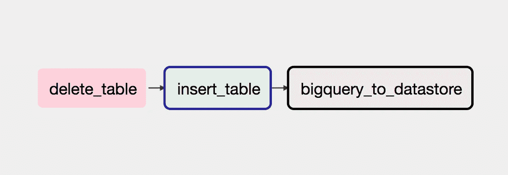

# 气流满足大型数据存储查询

> 原文：<https://medium.com/google-cloud/airflow-meets-bigquery-to-datastore-6ac8eb460566?source=collection_archive---------2----------------------->

我在文章的[中描述了一个将 BigQuery 表导出到 Google Datastore 的工具。当然，当您通过 CLI 制作数据产品的新版本时，该工具会很有帮助。](/google-cloud/export-bigquery-to-google-datastore-with-apache-beam-google-dataflow-7fff1566f345)

在这篇文章中，我将描述气流可以增强`bigquery-to-datastore`，使其成为一个预定的工作。我想给你一个在生产中使用`bigquery-to-datastore`的提示。

# 什么是`bigquery-to-datastore`

bigquery-to-datastore 是一个将 bigquery 表导出到 Google Datastore 的工具。我们不必被它的模式所困扰，我们只需执行一个命令就可以了。

 [## Yu-iskw/大查询到数据存储

### bigquery-to-Datastore——使用 Apache Beam/Google 数据流将整个 big query 表导出到 Google Datastore

github.com](https://github.com/yu-iskw/bigquery-to-datastore) 

在这方面，我觉得可以把 BigQuery 不仅仅看作是一个数据分析平台，更可以看作是一个分布式处理平台。如你所知，BigQuery 速度非常快，有很多方便的功能，而且简单易学。许多人可以参与开发可伸缩的数据产品。

# 带气流的 BigQuery

您可能知道，apache airflow 有一个与 BigQuery 相关的各种运算符:`BigQueryOperator`执行 bigquery SQL 查询。它允许我们将查询结果存储到 bigquery 表中；`BigQueryTableDeleteOperator`可以删除 bigquery 表；`BigQueryToBigQueryOperator`允许我们从一个 bigquery 表复制到另一个；以及`BigQueryValueCheckOperator`和`BigQueryIntervalCheckOperator`允许我们检查 bigquery SQL 查询的结果。这就是为什么我们基本上不需要在 airflow 中为 bigquery 实现任何功能。

# 气流符合`bigquery-to-datastore`

正如我上面描述的，我们完全可以用气流操作 bigquery。我们能够充分利用 airflow 的 bigquery 操作符和`bigquery-to-datastore`来进行调度作业。我会给你一个使用它的例子。

现在，考虑我们想要在像 Medium 这样的博客站点中给出用户的统计页面。此外，统计页面包括每天阅读页面的用户数量。为此，我们必须计算统计数据，然后将结果存储到任何数据存储中。



气流流向的有向无环图

在示例 DAG(有向无环图)中，有三个任务。首先，`BigQueryTableDeleteOperator`任务删除一个 bigquery 表，如果已经存在的话。不幸的是，气流 1.8.2 下的`BigQueryOperater`不支持写配置，比如`WRITE_TRUNCATE`。因此，我们不能通过直接执行查询来重写表。这就是为什么我们需要事先删除一个以防万一。其次，`BigQueryOperator`的任务将一个查询的结果存储到另一个任务中。最后，将执行一个任务`bigquery-to-datastore`将表传输到 Google Datastore。

```
*# Delete a BigQuqery table in just case*
delete_table_task = BigQueryTableDeleteOperator(
    dag=dag,
    task_id='delete_table',
    deletion_dataset_table="stats.page_views",
    bigquery_conn_id='google_cloud_default',
    ignore_if_missing=True,
)
```

其中`deletion_dataset_table`选项表示我们要删除的目标 bigquery 表，`ignore_if_missing`选项表示当目标表不存在时任务将忽略。

```
query = """
SELECT
  page,
  DATE(event_time) AS dt,
  COUNT(DISTINCT user_id) AS users
FROM event_log
WHERE DATE_DIFF(CURRENT_DATE(), dt, DAY) <= 30
GROUP BY 1
"""
insert_table_task = BigQueryOperator(
    dag=dag,
    task_id='insert_table',
    bigquery_conn_id='google_cloud_default',
    bql=query,
    destination_dataset_table="stats.page_views",
    allow_large_results=True,
    use_legacy_sql=False)
```

其中`destination_dataset_table`表示我们希望存储 bigquery SQL 查询结果的 bigquery 表，`user_legacy_sql=False`表示该查询作为标准 SQL 执行。

```
bash_command = """
java -cp /var/lib/dataflow/bigquery-to-datastore-bundled.jar
  com.github.yuiskw.beam.BigQuery2Datastore 
  --project=YOUR_GCP_PROJECT
  --runner=DataflowRunner
  --gcpTempLocation=gs://dataflow/dataflow-staging/ 
  --tempLocation=gs://udataflow/dataflow-staging/
  --inputBigQueryDataset=stats 
  --inputBigQueryTable=page_views
  --outputDatastoreNamespace=stats
  --outputDatastoreKind=PageViews
  --keyColumn=page
  --workerMachineType=n1-standard-4
  --maxNumWorkers=5
bigquery_to_datastore_task = BashOperator(
    dag=dag,
    task_id="bigquery_to_datastore",
    bash_command=bash_command,
)
```

最后，我们只需定义这些任务之间的依赖关系。

```
delete_table_task.set_downstream(insert_table_task)
insert_table_task.set_downstream(bigquery_to_datastore_task)
```

# 结论

在本文中，我描述了如何将气流与`bigquery-to-datastore`结合起来。我们能够使用 airflow 和`bigquery-to-datastore`非常轻松地制作可扩展的数据产品。我知道它不能满足你所有的要求。但是，如果您可以避免系统不使用，它允许不太熟悉大数据产品的人构建可扩展的数据产品。

我们不需要用机器学习做所有的事情。如果不用机器学习就能造出东西，那就更好了。在这种情况下，我确信我在文章中描述的内容会有所帮助。