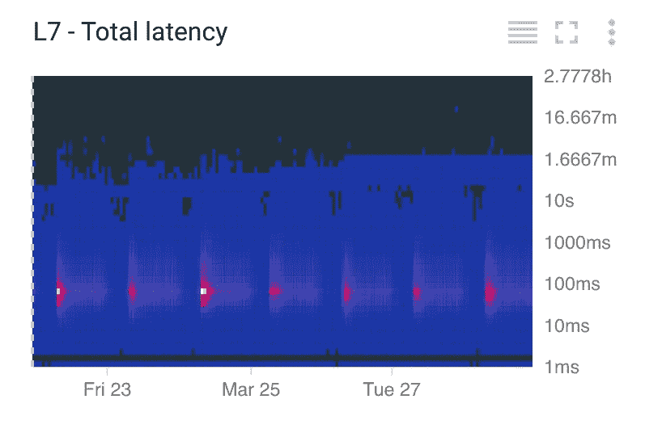
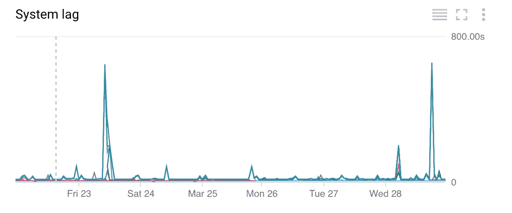

# 警告 API 方式

> 原文：<https://medium.com/google-cloud/alerting-the-api-way-d7541f2ed2d3?source=collection_archive---------1----------------------->

在一个项目上工作了一年多之后，顺利地进行角色扮演是一件很好的经历。让您的应用程序构建在一系列稳定的托管服务之上，让您从大量的运营负担中解脱出来:让我感到惊讶的是，我只需点击几下鼠标就可以升级 Google Kubernetes 引擎集群，而不必担心停机。这就像你在开车的时候更换引擎一样。

HTTP 负载平衡器延迟

尽管如此，构建云原生应用并不意味着您不必考虑监控和警报。相比之下，您应该从第一天就考虑您的日志记录、指标和监控。当我们在 Google 云平台上运行时，我们在我们的微服务中与 Stackdriver 进行了深度集成:跟踪、日志记录、错误报告和自定义指标(一切都通过跟踪 id 很好地关联起来)以及云端点代理。Stackdriver 还自动收集所有基础设施指标(负载平衡器、Kubernetes 引擎、防火墙、计算等)。

现在您已经有了所有这些数据点，您希望在出现异常时得到提醒。虽然您可以通过用户界面创建和发出警报是件好事，但您很快就会发现，警报需要创建、复制、稍加更改并再次创建，一遍又一遍…只是因为它是不同资源上的相同类型的警报。我们一直在寻找一种整洁且容易出错的方式来创建警报，所以你可以想象，我真的很高兴发现现在有了一个警报 API。

 [## 包 Google . Monitoring . v3 | stack driver Monitoring | Google Cloud

### AlertPolicyService API 用于管理(列出、创建、删除、编辑)Stackdriver Monitoring 中的警报策略。安…

cloud.google.com](https://cloud.google.com/monitoring/api/ref_v3/rpc/google.monitoring.v3#google.monitoring.v3.AlertPolicyService) 

一旦您在 UI 中创建了警报原型，就可以通过 API 在类似的资源上获取和复制警报策略。现在，您甚至可以开始考虑在 git 存储库中签入您的模板化警报。

以下是警报 API 可用于以下目的的一些想法:

**管理不同的环境/不同的客户**:您有一个测试、试运行和生产环境。您可以编写一些代码来管理模板中的警报，并将其应用到不同的环境中，而不是在开发集群上开发和测试您的警报并将它们复制到生产环境中。

**云数据流健康检查模式**:作为一名长期[云数据流](https://cloud.google.com/dataflow/)用户，我们注意到两种模式，我们可以检查以查看管道是否平稳运行:日志中的异常和数据流中的系统滞后。我们甚至用发布/订阅的积压量来完成它。为了实现这一点，我们有一个脚本来发现正在运行的管道，并添加一个关于异常和警报数量的自定义日志度量。除此之外，我们还创建了一个关于系统延迟的额外警报。

**微服务**:我们可以查询 kubernetes 的部署，并通过标签或注释查看它使用了哪些资源，我们可以为这些资源创建警报。

我已经给出了三个例子，但我可以想象你还能找到十几个。欢迎在评论中留下你的想法。如果你想更深入地了解警报世界，我建议阅读网站可靠性工程书籍中的[警报章节](https://landing.google.com/sre/book/chapters/practical-alerting.html)。当你在做的时候，只要读完整本书，它绝对值得。

 [## 谷歌网站可靠性工程

### 愿询问源源不断，传呼机保持沉默。“传统的 SRE 加持监控，底层的…

landing.google.com](https://landing.google.com/sre/book/chapters/practical-alerting.html) 

> 注意:从 2018 年 6 月 30 日起，基本层将拥有与 Stackdriver premium 层完全相同的警报功能，为您提供更多通知渠道。警报 API 目前是软启动的，这意味着您必须查看文档才能找到它:-)

祝你警戒愉快。