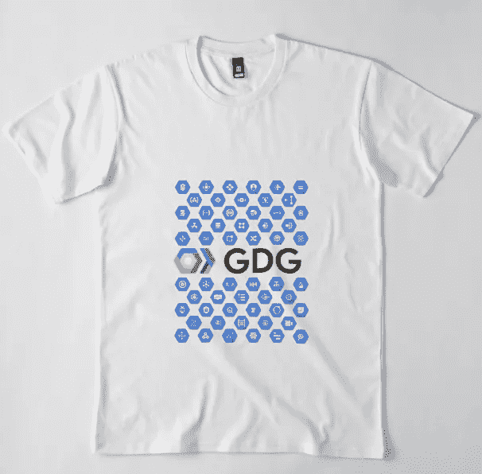

# 一个 Adobe Illustrator 页面上的所有 Google 云平台产品图标

> 原文：<https://medium.com/google-cloud/all-google-cloud-platform-product-icons-on-one-adobe-illustrator-page-c7f04a5c7f14?source=collection_archive---------1----------------------->

***更新:2018 年 3 月 20 日***

*   *我重新上传了带有新谷歌云标志的一体机*
*   我添加了所有旧衬衫设计的副本。ai 文件+png 供你使用

如果你曾经尝试过在一个项目(图像/视频)中用多个 GCP 图标制作东西，你会知道不得不进入所有单个 GCP 图标文件夹来找到你正在寻找的那个图标的挫败感。为了解决这个问题，我把所有的图标(SVG)放在一个页面上，并试着从[那篇流行的 GCP 产品总结](/google-cloud/gcp-products-described-in-4-words-or-less-f3056550e595)中复制所有的描述

> 这是 Google Drive 文件夹的链接。人工智能文件+谷歌产品无字体(所以你的文本显示不会中断)+一些我为温哥华谷歌开发组设计的 t 恤

> [https://drive.google.com/open?id = 1 qc3 nn 1 zfp 35 WP 0 fn _ 3 zm 70 iob S8 antlm](https://drive.google.com/open?id=1QC3Nn1zfp35WP0Fn_3zm70IoBS8ANtLM)

这里是一些我用所有图标设计的 t 恤的截图。你可以使用我提供的资源制作你自己的，或者如果你想要一个**现在**我将它们添加到 Redbubble 以方便快速购买[https://www . red bubble . com/people/de world/collections/836124-Google-cloud-platform？(顺便说一句，我很惊讶上传/设置账单/购买他们的衬衫是如此容易)](https://www.redbubble.com/people/deworld/collections/836124-google-cloud-platform?asc=u)

我也刚刚在 TeeSpring 上发布了我的谷歌云平台设计(测试这个网站，让我知道你是否想要更多)

 [## GCP 衬衫谷歌云平台

### 探索 Gcp 谷歌云平台 t 恤，这是 Teespring 专为您定制的产品。拥有世界一流的…

teespring.com](https://teespring.com/en-GB/gcp-shirt-googles-cloud-platfo#pid=2&cid=2122&sid=front) 

尽情享受吧！

## ps。谷歌如果这不酷，让我知道，我会把它拿下来

