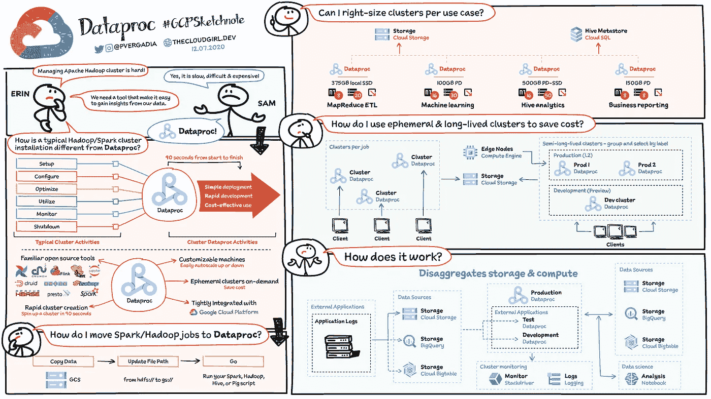

# 关于 Google Cloud Dataproc 你需要知道的一切

> 原文：<https://medium.com/google-cloud/all-you-need-to-know-about-google-cloud-dataproc-23fe91369678?source=collection_archive---------0----------------------->

## 回答“什么是 Dataproc？”的最佳备忘单

## 托管 Hadoop 和 Spark #GCPSketchnote

如果您正在使用 Hadoop 生态系统，并希望使其更易于管理，那么 Dataproc 就是检验的工具。

> Dataproc 是一个托管的 Spark 和 Hadoop 服务，它允许您利用开源数据工具进行批处理、查询、流和机器学习。

Dataproc 自动化帮助您快速创建集群，轻松管理集群，并通过在不需要集群时关闭集群来节省资金。管理花费的时间和金钱越少，您就可以专注于最重要的事情—您的数据！

在这个视频中，我在 2 分钟内总结了 Dataproc 提供了什么。

在这个视频中，我在 2 分钟内总结了 Dataproc 提供了什么。#GCPSketchnote

Erin 和 Sam 是使用 Apache Hadoop 生态系统的不断发展的数据科学团队的一员，他们正在处理运营效率低下的问题！因此，他们正在研究 Dataproc，它可以在 90 秒内安装一个 Hadoop 集群，与传统的集群管理活动相比，它可以简单、快速且经济高效地获得洞察力。它支持:

*   开源工具— Hadoop、Spark 生态系统
*   可定制的虚拟机，可根据需要扩展和缩减
*   按需临时集群以节省成本
*   与其他 Google 云服务紧密集成。

要迁移您的 Hadoop/Spark 作业，您只需将您的数据复制到 [Google 云存储](https://thecloudgirl.dev/CloudStorage.html)，将您的文件路径从 HDFS 更新到 GS，您就准备好了！

Dataproc 备忘单#GCPSketchnote

## Dataproc 如何工作的简要说明:

它分解了存储和计算。假设一个外部应用程序正在发送您想要分析的日志，您将它们存储在一个数据源中。Dataproc 使用云存储(GCS)中的数据进行处理，然后将其存储回 GCS、 [BigQuery](https://www.youtube.com/watch?v=So-tVyBQt8E&list=PLTWE_lmu2InBzuPmOcgAYP7U80a87cpJd&index=20) 或 Bigtable。你也可以使用笔记本中的数据进行分析，并将日志发送到[云监控和记录](https://www.youtube.com/watch?v=Y7L2y6NVa9Y&list=PLTWE_lmu2InBzuPmOcgAYP7U80a87cpJd&index=9)。

由于存储是独立的，对于长期集群，每个作业可以有一个集群，但是为了节省成本，可以使用按标签分组和选择的临时集群。最后，您还可以使用适量的内存、CPU 和磁盘来满足您的应用需求。

# 后续步骤

如果你喜欢这个#GCPSketchnote，那就订阅我的 [YouTube 频道](https://www.youtube.com/channel/UCfmz_Hi-G7sushJ_3mhLYvg?view_as=subscriber)，在那里我每周都会就一个话题发布一个 Sketchnote！此外，如果您对其他主题有什么想法或想法，可能对这种形式有所帮助，请在下面的评论中提出！

这是下载和打印的网站👇

 [## 计算引擎#GCPSketchnote

### 计算引擎是在 Google Cloud #GCPSketchnote 中运行虚拟机的最佳位置

thecloudgirl.dev](https://thecloudgirl.dev/)