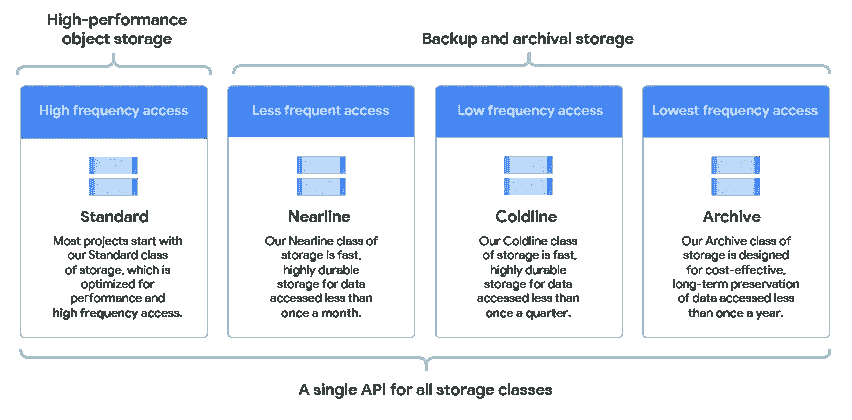
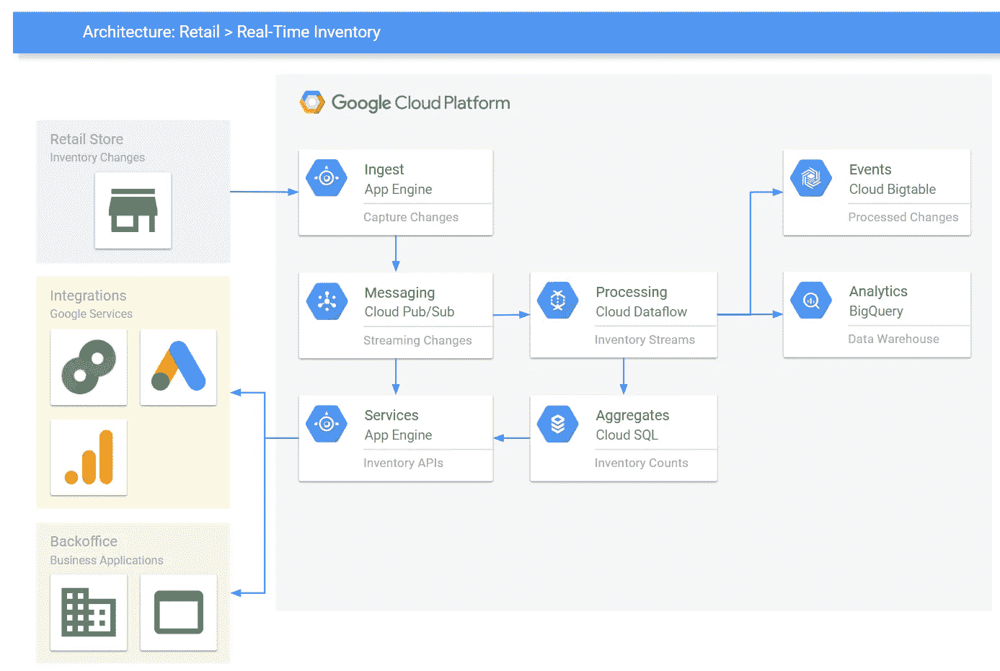

# 关于谷歌云存储选项，你需要知道的一切——5 分钟阅读

> 原文：<https://medium.com/google-cloud/all-you-need-to-know-about-google-cloud-storage-options-5-min-read-9f6dfd9cfbb2?source=collection_archive---------0----------------------->

> 以下是 GCP 不同储物选项的超级快速集中阅读

# 我们需要存储哪些不同类型的数据？

1.  *结构化数据*【姓名、电话号码等，可以分类关联】
2.  *非结构化数据*【照片、视频、pdf、docx 等静态文件】

## **对于结构化数据，有不同的数据库可用**

1.  [*Google Cloud SQL*](https://cloud.google.com/sql) :这是完全托管服务，提供 MySQL、Postgresql 和 MS SQL 服务器。简而言之，它是一种关系数据库服务
2.  [*云扳手*](https://cloud.google.com/spanner) :横向扩展能力，这是一种完全托管的关系数据库服务，用于区域和全球应用程序数据。
3.  [*云 Bigtable*](https://cloud.google.com/bigtable) : NoSQL 宽列数据库，低延迟存储大数据。
4.  [*Firestore*](https://cloud.google.com/firestore):NoSQL 文档数据库，用于移动和 web 应用数据。
5.  [*Firestore 实时数据库*](https://firebase.google.com/products/realtime-database/) : NoSQL 云数据库，用于实时存储和同步数据。
6.  [*内存存储*](https://cloud.google.com/memorystore):Redis&Memcache 的内存数据存储服务，用于快速数据处理。
7.  [*BigQuery*](https://cloud.google.com/bigquery) :完全托管的无服务器企业级数据仓库。它是一个 Pb 级的数据仓库。它内置了机器学习和 GIS 功能。

## 对于非结构化数据，有不同的选项可用

1.  [*云存储*](https://cloud.google.com/storage) :这是一个对象存储。你可以在这里存储你的静态内容。适合存储图像、视频、文件等。不同的存储类别适用于不同的使用情形，例如用于热存储的“标准类别”和用于归档或灾难恢复目的的不常用存储的“近线类别”和“冷线类别”。此外，您还可以定义保留策略、版本控制、访问和生命周期策略。

存储类别说明

*2。块存储* : [持久磁盘](https://cloud.google.com/persistent-disk)和本地 [SSD 磁盘](https://cloud.google.com/local-ssd)可用，可连接到任何计算引擎实例以满足通用存储需求。

> *除此之外，还有许多其他选项可供选择，但这里我们讨论了所有最受欢迎和最受欢迎的存储选项。*

**实时库存系统的参考架构**

> 就是这样。让我知道如果你喜欢这个快速阅读，我可以开始经常发表这样的文章。