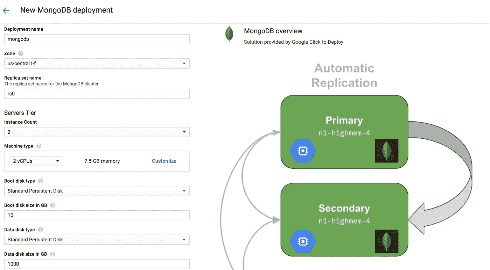

# 关于 Google Cloud 上的 MongoDB，你需要知道的一切

> 原文：<https://medium.com/google-cloud/all-you-need-to-know-about-mongodb-on-google-cloud-28adc359af37?source=collection_archive---------0----------------------->

Google Cloud 提供了一个市场，其中有许多栈和服务解决方案，可以点击部署。解决方案包括数据库解决方案(mongodb，cassandra，mysql)到博客和 CMS(wordpress，joomla)以及开发工具(gitlab，jenkins)。它们不是一个完全管理的解决方案，谷歌不提供任何支持，但堆栈减少了建立解决方案的时间，人们可以通过只支付 GCP 资源而不是解决方案*来享受服务。

在 Google Cloud Launcher 上提供的部署中，mongodb 是一种可以通过在副本集中创建主实例、辅助实例(计算引擎)以及仲裁节点来进行部署的部署。

## 如何创建 MongoDB 副本集

前往谷歌云控制台上的 [MongoDB 启动器，在实例集群中部署 NoSQL 数据库。点击“在计算引擎上启动”。](https://console.cloud.google.com/launcher/details/click-to-deploy-images/mongodb)



在控制台上配置部署、副本集名称和磁盘类型。选择节点数量，其中一个将作为主副本，其余为辅助副本。此外，选择一个仲裁节点，它可以是一个小实例，因为它仅用于通过投票选择主副本。建议选择 SSD 作为数据存储，它具有高 IOPS 和吞吐量。从[官方优化指南](https://cloud.google.com/compute/docs/disks/performance)中获取关于性能差异的详细信息。

现在，在几分钟内，群集不仅有了指定数量的副本和仲裁器，而且每个节点都有一个单独的磁盘，这些磁盘具有连接到各自实例的命名标准`[mongodb-servers-vm-0-data](https://console.cloud.google.com/compute/disksDetail/zones/us-central1-f/disks/mongodb-servers-vm-0-data?project=pv-lb-test&authuser=1&folder&organizationId=264425354354)`。那些磁盘上数据是相互同步的。此外，通过选择**外部 IP** 选项**无**，我们可以隐藏特定子网外部的节点。

## 与 MongoDB 复制集连接

有不同的方法连接到 mongodb 副本集:

**连接到每个节点**:在控制台的[计算实例页面](https://console.cloud.google.com/compute/instances)上，点击 ssh 按钮，新窗口打开，显示 SSH 连接。此外，使用 [gcloud sdk](https://cloud.google.com/sdk/gcloud/reference/compute/ssh) : `gcloud compute ssh [Instance Name] --zone [zone] --project [project]`登录 google cloud 实例也很容易

在仲裁节点上:

```
raju@mongodb-arbiters-vm-0:~$ mongoMongoDB shell version v3.4.14connecting to: mongodb://127.0.0.1:27017MongoDB server version: 3.4.1
```

在主节点上:

```
raju@mongodb-servers-vm-0:~$ mongo
MongoDB shell version v3.4.14 connecting to: mongodb://127.0.0.1:27017 MongoDB server version: 3.4.14 
.....rs0:PRIMARY>
```

在次要位置:

```
raju@mongodb-servers-vm-0:~$ mongo
MongoDB shell version v3.4.14
.....
rs0:SECONDARY>
```

**连接到复制集**

因为我们有主副本和辅助副本在运行，所以要与副本集而不是每个副本集建立 mongodb 连接，请在任一节点上输入以下命令:

```
raju@mongodb-servers-vm-1:~$ mongo “mongodb://mongodb-servers-vm-0,mongodb-servers-vm-1/myDB?replicaSet=rs0”
```

这样，我们首先连接到主副本/节点，如果发生故障转移，仲裁节点会选择另一个节点作为主节点，并建立到新主节点的连接。

## 故障转移演示

首先，我们从仲裁器节点连接到副本集

```
raju@mongodb-arbiters-vm-0:~$ mongo "mongodb://mongodb-servers-vm-0,mongodb-servers-vm-1/myDB?replicaSet=rs0"MongoDB shell version v3.4.14 connecting to: mongodb://mongodb-servers-vm-0,mongodb-servers-vm-1/myDB?replicaSet=rs0I NETWORK  [thread1] Starting new replica set monitor for rs0/mongodb-servers-vm-0:27017,mongodb-servers-vm-1:27017I NETWORK  [thread1] Successfully connected to mongodb-servers-vm-1:27017 (1 connections now open to mongodb-servers-vm-1:27017 with a 5 second timeout)I NETWORK  [ReplicaSetMonitor-TaskExecutor-0] Successfully connected to mongodb-servers-vm-0:27017 (1 connections now open to mongodb-servers-vm-0:27017 with a 5 second timeout)rs0:PRIMARY>
```

在这里，实例`mongodb-servers-vm-0`是主要的，`mongodb-servers-vm-1`是次要的。现在，让我们在主节点上重启 mongod 服务

```
raju@mongodb-servers-vm-0:~$ sudo service mongod restart
```

在仲裁器连接上:

```
I NETWORK  [thread1] Successfully connected to mongodb-servers-vm-1:27017 (1 connections now open to mongodb-servers-vm-1:27017 with a 5 second timeout)W NETWORK  [thread1] No primary detected for set rs0
...
W NETWORK  [thread1] No primary detected for set rs0rs0:PRIMARY>
```

现在，我们连接到实例`mongodb-servers-vm-1`，它现在已经成为主副本。检查副本集状态:

```
raju@mongodb-arbiters-vm-0:~$ mongors0:ARBITER> rs.status()
```

我们得到状态:

```
"members" : [ {
"_id" : 0, 
"name" : "mongodb-servers-vm-1:27017",                        "health" : 1,
"state" : 1, 
"stateStr" : "PRIMARY",
.....
"electionTime" : Timestamp(1525084250, 1),
},
{ "_id" : 1,
"name" : "mongodb-servers-vm-0:27017",                        "health" : 1,
"state" : 2,
"stateStr" : "SECONDARY",
.....
"syncingTo" : "mongodb-servers-vm-1:27017",
}
```

**来自计算引擎实例的 MongoDB 复制集连接**

从任何 Google 云计算引擎实例中，可以通过传递 replicaset 主机名来建立 mongodb 连接:`mongodb://mongodb-servers-vm-0,mongodb-servers-vm-1/myDB?replicaSet=rs0`

但是我们不能通过提供任何节点的 ip 地址来连接到该设备。副本的名称可以在各自实例的`/etc/hosts`上找到。

**来自本地主机的 MongoDB 复制集连接**

有时，我们可能需要从本地计算机连接到 Google Cloud 上启动的副本集，为此我们需要创建 SSH 隧道:

```
gcloud compute ssh --ssh-flag=-L27017:localhost:27017 --project=*PROJECT* --zone=*ZONE* *INSTANCE_NAME*
```

顺便说一下，我们甚至可以从 MongoDB Compass 连接到 replicaSet 来探索和操作数据。

## 监控 MongoDB 集群

正如他们所说的*使用 Ops Manager* 使生活变得更轻松，它是 MongoDB 提供的最佳解决方案之一，提供了查询优化的性能可见性以及开箱即用的警报。Ops Manager 可以在各种平台上下载，但我在 ubuntu 上遇到了问题，后来在 CentOS 上成功了，没有任何障碍。