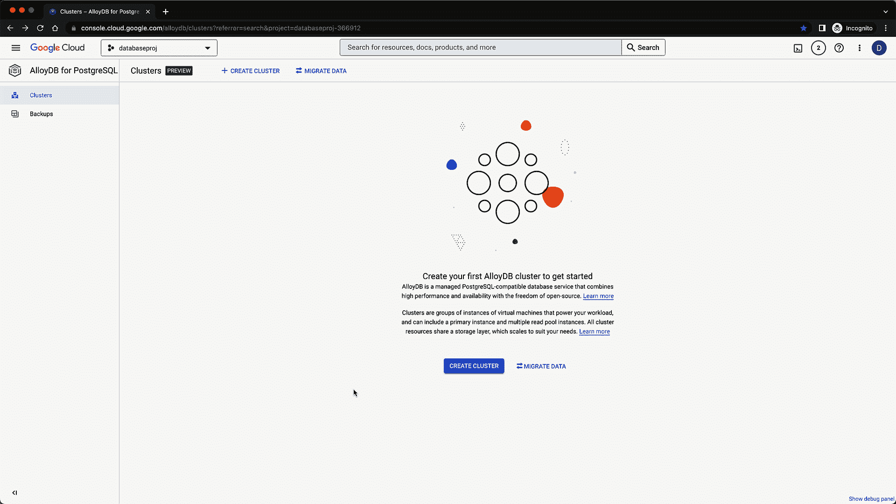

# 释放 AlloyDB 上索引咨询扩展的威力，提升性能。

> 原文：<https://medium.com/google-cloud/alloydb-and-advisory-extension-for-improving-performance-90f0b06192be?source=collection_archive---------3----------------------->

作为一名数据库爱好者。 [*AlloyDB*](https://cloud.google.com/alloydb) 公开预览版的发布确实是令人兴奋和充满希望的谷歌云数据库工作负载发布。最近，AlloyDB Index advisor 被宣布为一项通过分析查询运行时指标和推荐索引来提高整体性能特性。点击查看[了解更多详情。](https://cloud.google.com/alloydb/docs/release-notes#December_12_2022)

AlloyDB 带来了 Google Cloud 的精华，并且与 PostgreSQL 兼容，PostgreSQL 是最受欢迎的开源数据库之一。AlloyDB 提供了丰富的特性列表。

查看一些精心策划的官方链接，获得关于 AlloyDB 的有趣见解。

> [公告](https://cloud.google.com/blog/products/databases/introducing-alloydb-for-postgresql)
> [intelligent storage](https://cloud.google.com/blog/products/databases/alloydb-for-postgresql-intelligent-scalable-storage)
> [ColumnarEngine](https://cloud.google.com/blog/products/databases/alloydb-for-postgresql-columnar-engine)
> [播客](https://www.gcppodcast.com/post/episode-304-alloydb-with-sandy-ghai-and-gg-goindi/)
> [视频-什么是 AlloyDB](https://www.youtube.com/watch?v=YODa-x0_3l0)
> [视频-简介](https://www.youtube.com/watch?v=ep2pdW_ywo4)
> [视频-详细介绍](https://www.youtube.com/watch?v=o5pKfH0Tonw)

如果您是数据库开发人员或 DBA，性能改进始终是我们的核心工作，并有助于关键工作流的业务 SLA。索引一直是促进性能提高的关键驱动力。选择正确的候选索引一直是数据库领域讨论的话题。候选索引涉及多个决策点。

> a 柱的选择性如何？
> 
> 它有好的基数或唯一性吗？
> 
> 列数据是倾斜的，并且只为特定的一组值提供选择性。
> 
> 复合索引的前导列应该是什么
> 
> 在单列和多列索引之间选择

主动确定可以从索引中受益的 SQL 也是一项挑战，因为通常情况下，它在任何性能下降或用户投诉后都会更加被动。

AlloyDB 为推荐以***Google _ db _ advisor***为扩展名的索引提供了一个简化的自动化解决方案。它分析数据库上查询工作负载，并推荐索引作为提高整体性能的建议。

让我们来看看**行动，**

## 步骤 1 —创建 AlloyDB 集群和主实例。

作为供应的一部分，我们还为 google_db_advisor 扩展启用了必要的数据库标志。



AlloyDB 集群和实例创建

## 步骤 2—扩展创建

实例创建后，我们可以验证是否创建了必要的扩展。


谷歌数据库顾问扩展。

你会注意到一个额外的扩展[](https://github.com/HypoPG/hypopg)*也被创建了。*

## ***步骤 3—加载样本数据集来测试 google_db_advisor***

***我们将利用 [*可收养的狗公共数据集*](https://www.kaggle.com/datasets/thedevastator/adoptable-dogs-in-the-us) 并使用复制命令将其加载到 AlloyDB 中。***

*****创建表格 DDL，用于存储可收养的狗数据集。*****

```
***drop 
 table if not exists tbldogdesc;CREATE TABLE tbldogdesc(
 id BIGINT NOT NULL PRIMARY KEY, 
 org_id VARCHAR(10) NOT NULL, 
 url text NOT NULL, 
 breed_primary VARCHAR(100), 
 breed_secondary VARCHAR(100), 
 breed_mixed BOOLEAN, 
 breed_unknown BOOLEAN, 
 color_primary VARCHAR(100), 
 color_secondary VARCHAR(100), 
 color_tertiary VARCHAR(100), 
 age VARCHAR(100) NOT NULL, 
 sex VARCHAR(10) NOT NULL, 
 size VARCHAR(100), 
 coat VARCHAR(100), 
 fixed BOOLEAN, 
 house_trained BOOLEAN, 
 declawed VARCHAR(30), 
 special_needs BOOLEAN, 
 shots_current BOOLEAN, 
 env_children BOOLEAN, 
 env_dogs BOOLEAN, 
 env_cats BOOLEAN, 
 name text, 
 status VARCHAR(9), 
 posted DATE, 
 contact_city VARCHAR(100), 
 contact_state VARCHAR(100), 
 contact_zip VARCHAR(100), 
 contact_country VARCHAR(2), 
 stateQ VARCHAR(100), 
 description text
);***
```

***使用复制命令将 csv 加载到 AlloyDB 表中。***

```
*****\copy** public.tbldogdesc from '/home/deepakmahto/allDogDescriptions.csv' (header true , format csv);postgres=> select count(1) from tbldogdesc ;**count
-------
58147**(1 row)***
```

## ***步骤 4—模拟索引建议的工作负载***

***在工作负载中，我们为具有不同选择性和偏斜度的不同列类型提供了不同的访问模式。***

```
***SELECT 
  * 
from 
  public.tbldogdesc 
where 
  ***house_trained = true;***

SELECT 
  * 
from 
  public.tbldogdesc 
where 
  ***house_trained = false;***

SELECT 
  * 
from 
  public.tbldogdesc 
where 
  ***special_needs = true;***

SELECT 
  * 
from 
  public.tbldogdesc 
where 
  ***special_needs = false;***

select 
  * 
from 
  public.tbldogdesc 
where 
  ***upper(name) = 'HARLEY';***

select 
  * 
from 
  public.tbldogdesc 
where 
  ***status = 'adoptable';***

SELECT 
  * 
FROM 
  public.tbldogdesc 
where 
  ***org_id = 'NV129';******
```

***使用 ***psql*** 命令行在 AlloyDB 上运行工作负载。***

> ***注意* :-使用 AlloyDB 身份验证代理连接到 AlloyDB 主实例。查看 [**这里**](https://cloud.google.com/alloydb/docs/auth-proxy/overview) 了解更多详情。***

```
***PGPASSWORD=******** psql -h localhost -U postgres -d postgres -p 5433 ***-f dbadvisor_sample.sql*** > output.txt***
```

## ***第五步——分析谷歌数据库顾问的建议。***

***自动捕获工作负载，并对其运行索引建议。我们可以使用 AlloyDB 提供的 google_db_advisor 函数来获取推荐索引。***

******

***谷歌数据库顾问推荐索引***

***它提供了多个视图来查看工作负载语句、推荐索引等的详细信息。***

******

***视图—谷歌数据库顾问***

***让我们对为
AlloyDB 执行的工作负载运行索引建议。***

```
***select * from *google_db_advisor_recommend_indexes*();***
```

******

***谷歌数据库顾问推荐索引***

***基于工作负载，我们根据查询模式和列的底层统计信息获得了索引建议。***

***让我们检查一下作为 *google_db_advisor* 一部分的一些工作负载报告视图。***

```
***select * from *google_db_advisor_workload_report*;***
```

******

## ***第 6 步—验证 google db advisor 的建议。***

***根据访问模式、选择性、基数和偏斜度来验证对列的索引建议始终是最佳实践。
让我们根据列过滤器，合并狗收养表上 SQL 工作负载的统计数据。我们可以查询 PostgreSQL 底层的与 stats 相关的表，以获得一些列的指标。***

```
***select attname , null_frac , n_distinct , most_common_vals, most_common_freqs
from pg_stats where tablename = 'tbldogdesc'
and attname in ('house_trained','special_needs','status');***
```

******

```
***select attname , null_frac , n_distinct , most_common_vals, most_common_freqs
from pg_stats where tablename = 'tbldogdesc'***
```

******

***基于列的底层统计数据，让我们检查一些数据库工程师或 DBA 应该很清楚的关键观察。***

> ***建议不支持基于函数的索引— **upper(name)** 。***
> 
> ***列**状态**上的索引由于**低的不同值而被忽略，它只有 1(可采用)。*****
> 
> ***由于**低不同值**和**无数据偏斜**，忽略列 **house_trained** 上的索引***
> 
> ***建议对列 **org_id** 进行索引，因为**具有良好的不同值**并且**具有选择性**。***
> 
> ***由于真实病例的**数据偏斜，建议在**特殊需求**列添加索引。*****

***作为最佳实践，根据推荐索引上所需的访问模式进行审查和验证并在后续步骤中实施它是至关重要的。***

## ***步骤 7—创建并测试推荐的索引。***

***现在，我们已经完成了工作负载的运行，生成了推荐的索引，并完成了必要的验证步骤。现在让我们继续前进，创造它。***

******

***我们将运行 explain analyze 来验证运行时计划 post 新索引，并测量与之前的顺序扫描相比的改进(整个表)***

```
***explain (analyze , buffers)
SELECT * FROM public.tbldogdesc where org_id = 'NV129';explain (analyze , buffers)
SELECT * FROM public.tbldogdesc where special_needs = true;explain (analyze , buffers)
SELECT * FROM public.tbldogdesc where special_needs = false;***
```

******

***正如我们所看到的，索引创建对于推荐的工作负载来说是最佳的。它是由底层查询引擎根据选择性和数据偏斜度选择的。***

# ***摘要***

***AlloyDB for PostgreSQL 为要求苛刻的企业级数据库工作负载带来了最佳的 Google 云和 PostgreSQL。借助 Google DB advisory 特性，我们可以获得关于提高整体性能的推荐索引，作为主动措施。目前，AlloyDB 在公共预览版中可用，用于必要的测试和数据库工作负载资格分析。***