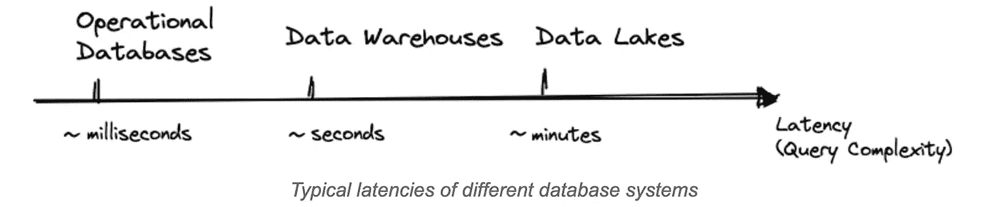
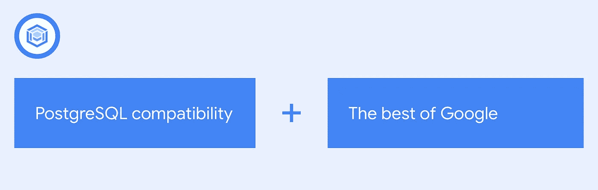
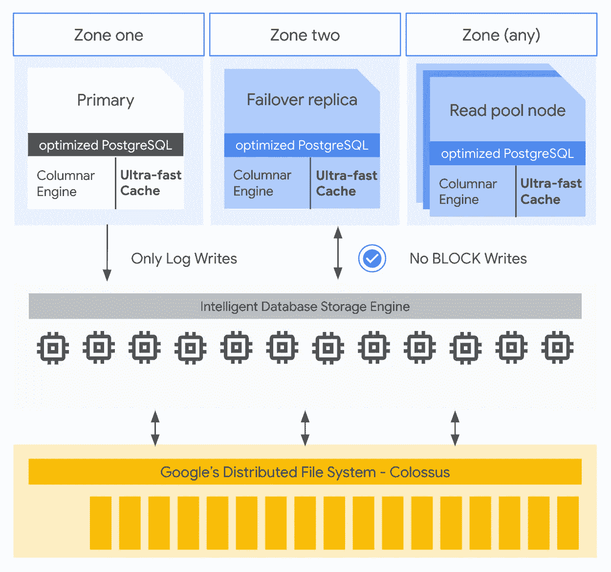
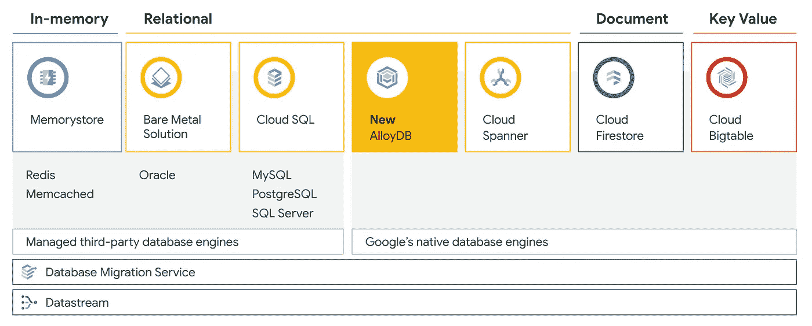
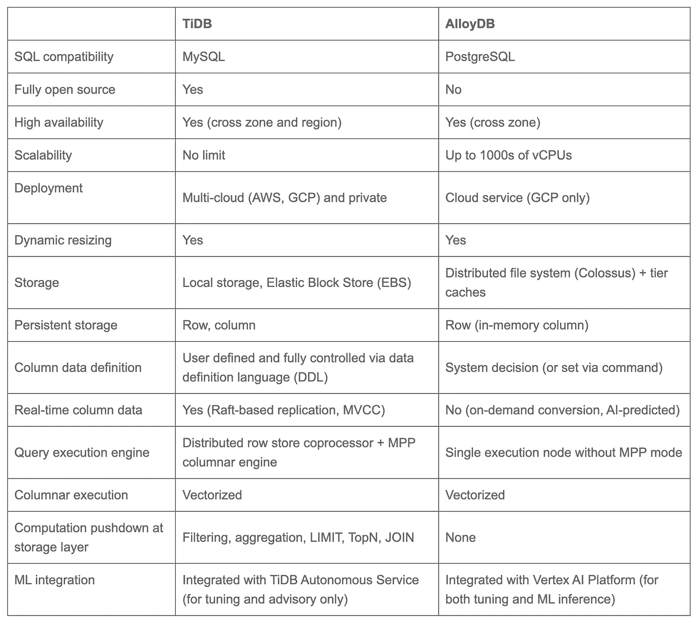

# alloy db—HTAP 街区的新成员

> 原文：<https://medium.com/google-cloud/alloydb-new-kid-on-the-htap-block-188a732fdd35?source=collection_archive---------3----------------------->

Gartner 在 2014 年创造了术语 HTAP，指具有混合工作负载处理能力的内存数据库，如 SAP HANA。然而，技术挑战阻止了 HTAP 数据库真正流行起来。

直到最近，随着 PingCAP 的 TiDB、Google 的 AlloyDB、SnowFlake 的 UniStore 和 Oracle 的 HeatWave 等现代架构设计的出现，HTAP 才开始崛起。

几十年来，联机事务处理(OLTP)和联机分析处理(OLAP)工作负载一直由不同的数据库系统单独处理。这是多年来的惯例，因为这两种工作负载在延迟、吞吐量和数据一致性等设计因素上有所不同。这也是为什么单个数据库系统可能关注 OLTP 或 OLAP 工作负载。以延迟为例，操作数据库通常需要非常短的延迟，但是数据仓库或数据湖系统可以容忍更长的延迟。

然而，这也导致了复杂的技术堆栈和数据孤岛，限制了公司的发展速度。这需要一种混合方法。混合事务处理和分析处理(HTAP)数据库可以在同一架构中处理 OLTP 和 OLAP 工作负载，而这些工作负载不会相互干扰。

# AlloyDB —全面管理的 HTAP 服务

AlloyDB 是一个完全托管的 PostgreSQL 兼容数据库服务，适用于要求最苛刻的企业数据库工作负载。AlloyDB 结合了 Google 的精华和最流行的开源数据库引擎之一 PostgreSQL，以获得卓越的性能、规模和可用性。AlloyDB 的名字恰如其分，因为 alloy 的定义是将两种金属结合起来，锻造出一种具有独特性能的新材料。在这种情况下，Alloy DB 采用 PostgresSQL API，这使它成为一个兼容的平台，吸引了越来越多的 PostgreSQL 开发人员，并在存储和 AI/ML 分析层替代了核心的 Google 技术。其结果是为高吞吐量事务处理和运营分析而设计的数据库。

谷歌声称 AlloyDB 对于事务性工作负载的速度是 AWS 的同类产品 Aurora PostgreSQL 的两倍(对于相同的工作负载，比标准 PostgreSQL 快 4 倍，对于分析性查询快 100 倍)。

如果你深入了解谷歌云生态系统，那么一个完全托管的 PostgreSQL 数据库服务可能听起来很熟悉。谷歌已经为 PostgreSQL 和 Spanner 提供了 CloudSQL，这是谷歌云的完全托管、水平可伸缩的关系数据库服务，也提供了一个 [PostgreSQL 接口](https://cloud.google.com/spanner/docs/postgresql-interface)。但是这些服务提供了与 PostgreSQL 兼容的接口，允许具有这些技能的开发人员使用这些服务。AlloyDB 的核心是标准的 PostgreSQL 数据库，尽管该团队确实修改了内核，以允许它最大限度地使用谷歌的基础设施，同时允许团队在推出新版本时保持更新。

# 关键特征

## 完全托管的数据库服务

AlloyDB 是一个完全托管的、PostgreSQL 兼容的数据库服务，具有业界领先的性能、可用性和规模。它自动执行备份、复制、修补和容量管理等管理任务，并使用自适应算法和机器学习进行 PostgreSQL 真空管理、存储和内存管理、数据分层和分析加速，因此您可以专注于构建您的应用程序。

## 快速交易处理

对于事务性工作负载，AlloyDB 比标准 PostgreSQL 快 4 倍以上。它适合要求最苛刻的企业工作负载，包括需要高事务吞吐量、大数据量或多个读取副本的工作负载。读取连接在低延迟、横向扩展读取副本池的支持下水平扩展。

## 高可用性

AlloyDB 提供 99.99%的正常运行时间 SLA，包括维护。它可以在 60 秒内自动检测大多数数据库故障并从中恢复，与数据库大小和负载无关。该架构支持无中断的实例大小调整和数据库维护。

## 实时业务洞察

AlloyDB 的分析查询速度比标准 PostgreSQL 快 100 倍，在运行商业智能、报告以及混合事务和分析工作负载(HTAP)时，对运营性能没有任何影响。与谷歌人工智能平台 Vertex AI 的内置集成，允许您在查询或交易中直接调用机器学习模型，为您提供低延迟、高吞吐量的增强洞察力，而无需编写任何应用程序代码。

## 对客户友好的定价

定价透明且可预测，没有昂贵的限制性许可，也没有不透明的 I/O 费用。存储是自动管理的，只对您使用的内容收费，读取副本没有额外的存储成本。除了实例内存之外，还会自动配置免费的超高速缓存，使您能够最大限度地提高性价比。[数据库迁移服务](https://cloud.google.com/database-migration)免费提供易于使用、可靠的迁移。

# AlloyDB 在谷歌云数据库产品组合中的位置？

简而言之，AlloyDB:

1.  为普通 PostgreSQL 提供了更高性能、更高吞吐量的替代品。
2.  不会取代 Cloud Spanner，因为 Spanner 的目标是跨越多个地区的全球分布式主动-主动 ACID 事务工作负载。
3.  不会取代 BigQuery 或其他谷歌分析服务。

Bigquery 有许多相似之处，因为它们都运行在相同的底层存储上，都有缓存功能，都可以在数据库中运行 ML 模型。但是基本的区别是 BigQuery 目前不支持 PostgreSQL API。Bigquery 是无服务器的，而 AlloyDB 不是。Bigquery 一直是为大规模分析而设计的，而 AlloyDB 主要是为高吞吐量事务处理而设计的，并辅以轻量级运营分析和 ML。

# TiDB 和 AlloyDB 的比较

[TiDB](https://github.com/pingcap/tidb) 是一个开源的分布式 HTAP 数据库。TiDB 是唯一提供 HTAP 功能的开源、兼容 MySQL 的数据库。它已经被不同行业的数千个生产系统作为主要数据库。TiDB 的 HTAP 架构是典型的，因为它使用分离的架构来分离计算和存储。它利用一些主要技术为混合工作负载实现了行存储和列存储。

# 包扎

AlloyDB 可以作为主数据库，帮助用户应对快速增长的复杂业务负载。当单个传统 OLTP 或 OLAP 数据库发现处理工作负载极具挑战性时，AlloyDB 是一个不错的选择。AlloyDB 是一个可靠的解决方案，可以根据生态系统、增长和工作负载来满足企业的需求。HTAP 时代即将到来，我们期待越来越多的 HTAP 系统出现。