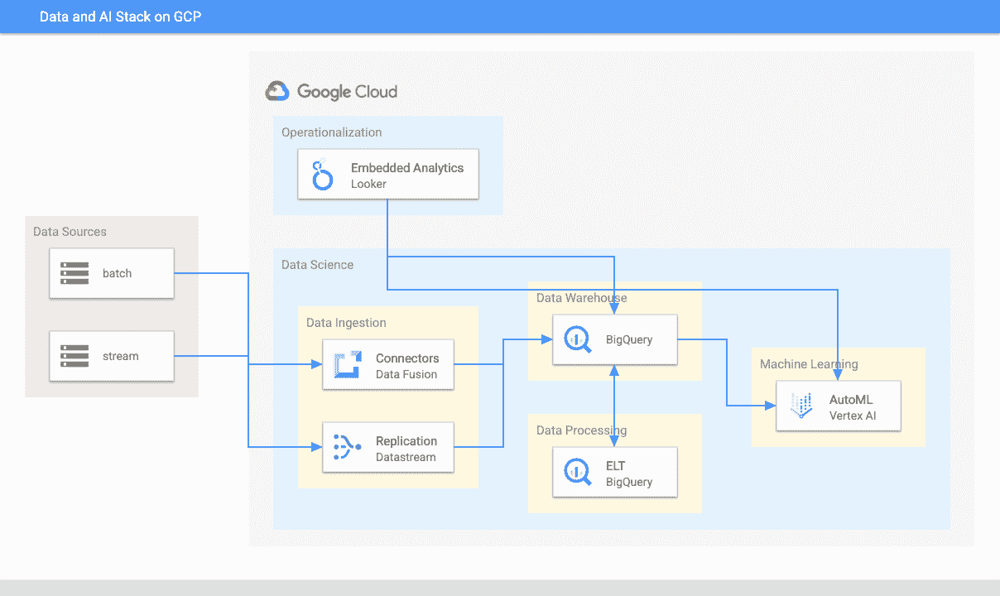
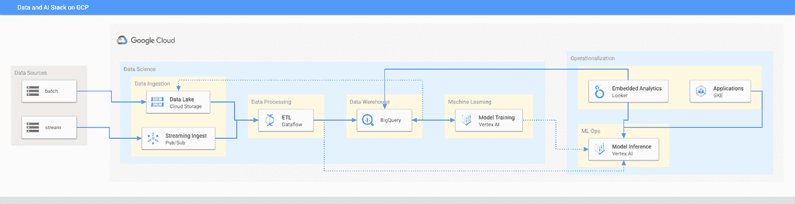

# 谷歌云上分析和人工智能的敏捷架构

> 原文：<https://medium.com/google-cloud/an-agile-architecture-for-analytics-and-ai-on-google-cloud-6415e692591f?source=collection_archive---------0----------------------->

## 押注于低代码/无代码和无服务器

敏捷架构能够为您提供:

*   **发展速度。**你应该能够尽可能快地从想法到部署
*   **灵活性**快速实施新功能。有时速度是以灵活性为代价的——架构可能会把你硬塞进一组非常有限的用例中。你不想那样。
*   **低维护**这样你就不用花时间管理基础设施了。
*   **自动扩展和弹性**让您不必花费时间监控基础设施

当涉及到数据分析和人工智能时，这样的架构在谷歌云上看起来是什么样的？它将使用低代码和无代码服务(预建的连接器、自动复制、ELT、AutoML ),以便您获得开发速度。就灵活性而言，该架构将允许您在任何需要的时候使用对开发人员友好的强大代码(Apache Beam、SQL、TensorFlow)。这些将运行在无服务器的基础设施上(Pub/Sub、Dataflow、BigQuery、Vertex AI ),这样你就可以获得低维护、自动伸缩和弹性。

## 无代码、低代码分析和人工智能堆栈

说到架构，选择无代码而不是低代码，选择低代码而不是编写定制代码。在将数据放入 BigQuery 之前，不要编写 ETL 管道来转换数据，而是使用预建的连接器(在数据融合、数据流、数据传输服务、数据流模板、FiveTran 等中)。)将原始数据直接放入 BigQuery。然后，直接在数据仓库中使用 SQL 视图将数据转换成您需要的形式。如果您选择 ELT 方法而不是 ETL 方法，您将会更加敏捷。

另一个地方是当你选择你的 ML 建模框架的时候。不要从定制 TensorFlow 模型开始。从 AutoML 开始。这是无代码。您可以直接从 BigQuery 调用 AutoML，避免构建复杂的数据和 ML 管道。如有必要，从 TensorFlow Hub、HuggingFace 等处转移到预建模型。以及 Vertex AI 上的预建容器。那是低代码。只有在万不得已的情况下，才构建自己的定制 ML 模型。

## 使用托管服务

如果低级代码的方法限制太多，您将希望能够直接使用代码。幸运的是，上面的无代码架构是这个完整架构的子集，它为您提供了所需的所有灵活性:

当用例允许时，您将拥有 Apache Beam、SQL 和 TensorFlow 的全部灵活性。这一点至关重要——对于 ELT+AutoML 方法限制性太强的用例，您可以使用 ETL/数据流+ Keras/Vertex 方法。

最重要的是，架构是统一的，所以您不用维护两个堆栈。因为第一个架构是第二个架构的子集，所以您可以用统一的方式完成简单和困难的用例。

尽情享受吧！