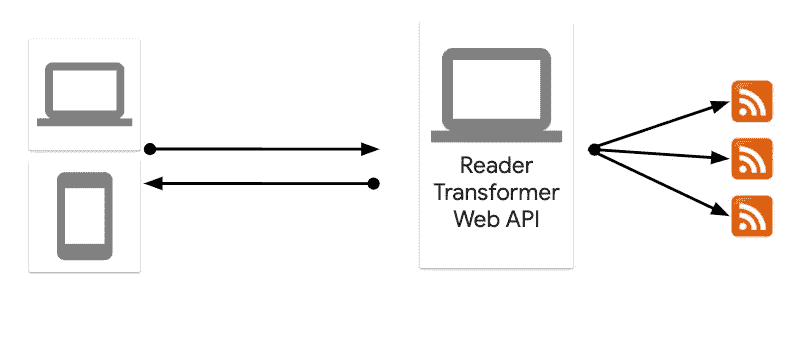

# 应用程序现代化故事—第 1 部分(原型)

> 原文：<https://medium.com/google-cloud/an-app-modernization-story-part-1-prototype-6a11398f6e7e?source=collection_archive---------0----------------------->

我们都有以某种“传统方式”运行一些“传统代码”的应用程序。“遗留”一词在不同的项目中有不同的含义，但我们知道当我们看到它时，我们希望有时间以某种方式更新这些应用程序。

我最近经历了一个传统应用程序现代化的最新阶段。尽管它是一个相对较小的应用程序，但我认为它有许多值得分享的经验。

在这个博客系列中，我想概述应用程序和现代化之旅，我们经历的阶段，我们在每个阶段必须做出的决定，并最终谈论最终的架构。

希望这将是有趣的，并与许多人相关。我们开始吧！

## 欢迎来到阿马瑟斯

回到 2015 年末，我和我的一个朋友忙于公司的软件工程工作，几乎没有选择我们想要使用的工具、语言和框架。我们的两个项目都充满了一层又一层的遗留问题和不必要的复杂性，它们吸走了软件工程的乐趣。

我们错过了开始一个全新的项目，使用我们想要的最新工具、语言和框架。最重要的是，我们想感受端到端完成一个项目的成就感，不管它有多小。

因为我们都来自塞浦路斯，都是家乡的新闻爱好者，所以我们决定开发一个新闻聚合应用。在这个应用程序中，我们从塞浦路斯的报纸上收集信息，并在移动应用程序上以简单、清晰的时间线显示出来。我朋友做手机 app，我做后端。我们称之为[阿马瑟斯](https://en.wikipedia.org/wiki/Amathus)，塞浦路斯的一座古城:-)

我们在 2015 年末的几个周末完成了原型，并恢复了我们对软件工程能力的信心:-)前端是用 [Ionic](https://ionicframework.com/) 编写的，用于跨平台移动支持。后端是用 C#和 ASP.NET 框架编写的。在这个博客文章系列中，我们将关注后端。

## 原型

我不知道你是否可以称之为架构，但是最初的后端看起来是这样的:

它是在 ASP.NET 框架(4.6)上用 C#编写的，运行在 Windows 上。作为单个应用程序部署到由随机 IIS 主机提供的随机计算机上。

尽管它是作为单个应用程序部署的，但实际上，它有 3 个不同的部分:

1.  Reader:从各种来源获取 RSS 提要的预定服务。
2.  Transformer:使用我们定义的规则将各种 RSS 格式转换成通用格式的转换器。
3.  Web:一个 Web API，为前端公开转换后的提要。

## 利弊

最初的原型很原始，但有一些优点:

1.  **奏效了**！嗯，算是吧。它不具备可扩展性或弹性，但满足了我们当时的需求。
2.  **通俗易懂**:单机上的单个 app。有什么不明白的？
3.  **易于部署**:从 Visual Studio 推送到 ISS 主机很容易(除非事情失败)。
4.  **便宜** : IIS 托管相当便宜。

尽管当时后端还能工作，我们还是走了很多捷径，比如:

1.  耦合:从一开始就很明显，这个应用实际上是 3 个独立的服务。我们试图用独立的库来保持事物的解耦性，这种做法有点奏效，但是特性最终还是从一个服务蔓延到了另一个服务。
2.  糟糕的 DevEx:ISS 主机很便宜，但是它提供了零开发经验。例如，为了查看日志，我必须通过 FTP 进入机器。
3.  **没有冗余**:它实际上是一台机器上的一个应用程序。有时机器会停机，移动应用程序会停止提供订阅源。
4.  **没有持久性**:一切都在内存中。有时应用程序会崩溃，需要一些时间来获取所有的提要并再次填充内存。
5.  **没有弹性**:因为没有冗余或持久性，所以没有任何弹性。阅读器将耗尽内存，这将导致整个应用程序和 web API 全部关闭。

## 经验教训

最初的架构为接下来的阶段提供了很好的经验:

1.  坚持 MVP:我们最初认为除了新闻之外，我们还需要阅读专栏。因此，我们试图让阅读和转换提要变得过于复杂。我们应该定义并坚持最小可行产品(新闻),并且只实现它。后来删除不需要的列特性是一件痛苦的事情。
2.  **研究你的选择**:当然，IIS 托管是便宜的，但是机器会频繁停机，我们没有意识到 DevEx 是如此糟糕，直到我们迁移到云(稍后会有更多介绍)。在选择最便宜的方案之前，先做好调查。
3.  **不惜一切代价避免耦合**:仅仅因为你一起部署一些功能并不意味着它们必须在代码中紧密耦合。恰恰相反，你必须从一开始就用不同的库、包、测试来定义和保持应用程序的不同部分(阅读器、转换器、网络)是分开的。我们最初没有注意到这一点，后来发现很难将事情区分开来。
4.  **着眼未来进行设计**:即使你想坚持 MVP，你还是想着眼未来进行设计。您不必用您可能不需要的东西使架构过于复杂，但是您必须允许您的架构具有灵活性。例如，在 prototype 中，我们决定将所有内容都保存在内存中。这是最简单的事情，也是我们当时所需要的。然而，我们知道在某些时候，我们必须使用一些坚持。我们没能把后端设计成可插拔的。在后面的阶段，我们必须重构代码，使后端可插拔，以补偿设计中最初的不灵活性。

## 然后

后端远非理想，但在我们于 2016 年底和 2017 年初开始寻找其他选择之前，它为我们服务了大约一年。在下一个帖子里，我会谈到 app 的 [**解除&转移到云**](/google-cloud/an-app-modernization-story-part-2-lift-shift-7a3740f22860) 阶段。敬请期待！