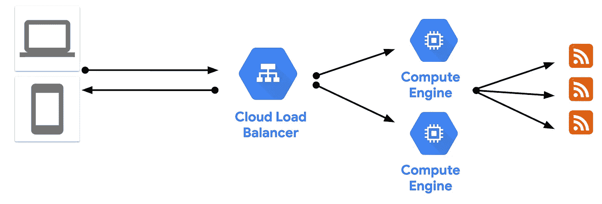

# 应用程序现代化故事—第 2 部分(提升和转变)

> 原文：<https://medium.com/google-cloud/an-app-modernization-story-part-2-lift-shift-7a3740f22860?source=collection_archive---------2----------------------->

在应用程序现代化系列的第 1 部分中，我介绍了一个简单的新闻聚合器，以及其初始架构中的一些挑战。在第 2 部分中，我将谈论云计算之旅，以及在此过程中一些意想不到的好处和收获。

## 为什么是云？

最初的后端有许多我在[第一部分](/google-cloud/an-app-modernization-story-part-1-prototype-6a11398f6e7e)中概述的问题。大约一年后，在 2016 年末，我们决定将它搬到一个更稳定的家。我们的主要目标是**提高应用**的弹性，因为 IIS 主机一直在崩溃，但是**我们不想以一种主要的方式重写或重新架构**应用。大约在同一时间，我开始在谷歌工作，学习所有关于谷歌云的知识。我们决定试一试，看看如何将应用程序迁移到那里。

## 提升和移位

我们的应用程序是基于 Windows 的，因此，当时在谷歌云上的唯一选择是将其部署到计算引擎上的 Windows 服务器虚拟机。(现在 Windows 应用程序有更多选项，但我们将在下一篇文章中讨论。)

谷歌云有一个[市场](https://cloud.google.com/marketplace)，提供随时可以部署的解决方案。我们使用[ASP.NET 框架](https://console.cloud.google.com/marketplace/details/click-to-deploy-images/aspnet) 解决方案来获得已经安装了 IIS、SQL Express 和 ASP.NET 的 Windows 虚拟机。简直就是轻轻一点。

一旦我们有了 Windows VM，从 Visual Studio 发布到计算引擎就非常简单了。这部分是因为我们的架构非常简单，没有持久性。我们*把&我们的应用程序转移到*云端，但当时并不知道这个术语。

## 初始云架构

这是建筑在最初的提升和转变后的样子:

我们将运行我们应用的 2 个负载平衡计算引擎虚拟机的实例组保持在最低水平。这样，我们实现了冗余和基本负载平衡的主要目标。

## 意外的好处

然后，我们开始研究计算引擎提供了什么。

我们发现了[实例模板](https://cloud.google.com/compute/docs/instance-templates)，它允许我们从现有虚拟机转到一个模板，并从该模板创建[实例组](https://cloud.google.com/compute/docs/instance-groups/)，这是一个完全相同且负载平衡的虚拟机群。实例组有很好的附加功能，如重新创建崩溃的虚拟机，尽可能自动修复虚拟机，跨多个区域分布虚拟机，负载平衡和[自动扩展](https://cloud.google.com/compute/docs/autoscaler)。

我们发现永久磁盘可以连接到虚拟机，以后您可以非常轻松地拍摄这些磁盘的快照进行备份。

Google Cloud 上的 DevEx 比我们之前的主机好多了。只需点击一下鼠标即可从浏览器 RDP 到虚拟机，能够在 Stackdriver 中查看和搜索应用程序日志，能够停止/暂停虚拟机以节省成本等等。

在计算引擎基础设施中有许多这样的小宝贝。诚然，我们还不需要这些特性中的大部分，但我们确实感觉马上升级到了企业级环境。

## 经验教训

这些是我们应用程序提升和转变阶段的主要经验:

1.  **提升&转变不一定很难**:我们惊喜地发现，将现有应用程序迁移到云是多么容易。当然，我们有一个简单的架构，我们必须做一些研究来弄清楚事情如何在云中工作，但最终，我们不必做太多改变。
2.  **云不仅仅是托管**:我们只是希望我们的应用程序有一个稳定的环境，我们在云上得到了很多，同样没有真正改变我们的应用程序。
3.  **没有免费的午餐**:我们从一台机器发展到几台在虚拟机上运行的负载平衡的机器。毫不奇怪，这比我们以前拥有的原始 IIS 主机更贵。我们觉得我们的钱花得值，免费层也有所帮助，但是我们每月的账单超出了我们对这个小应用程序的期望。这是我们想以后解决的问题。

## 然后

我们的第一个云架构为我们提供了大约两年的良好服务。与此同时，随着多平台的出现，技术领域正在快速变化。NET Core，带有 Docker 的容器等等。在下一篇文章中，我将谈论这些技术如何将我们的 Windows 专用虚拟机应用程序转变为可以在任何地方运行的容器化应用程序。