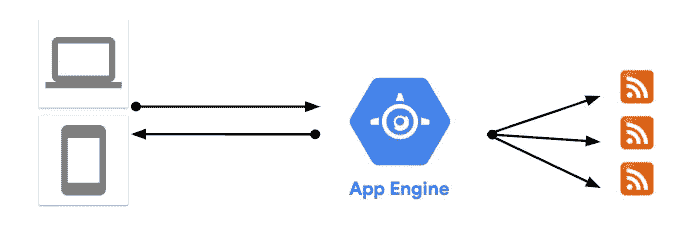

# 应用程序现代化故事—第 3 部分(容器化和重新部署)

> 原文：<https://medium.com/google-cloud/an-app-modernization-story-part-3-containerize-redeploy-223b2be2c807?source=collection_archive---------1----------------------->

在 [part 1](/google-cloud/an-app-modernization-story-part-1-prototype-6a11398f6e7e) 中，我谈到了最初的 app 及其挑战。在[第 2 部分](/google-cloud/an-app-modernization-story-part-2-lift-shift-7a3740f22860)中，我谈到了向云的提升&转变，带来了一些意想不到的好处。在本系列的第 3 部分中，我将讨论我们如何转变我们的纯 Windows。NET 框架 app 到容器化的多平台。NET Core app 以及我们一路走来获得的巨大收益。

## 为什么？

最初基于 Windows VM 的云设置为我们提供了良好的服务，在大约 2 年的时间里(从 2017 年初到 2019 年初)，问题很少。2019 年初，我们想再次重温架构。这主要是由技术领域的进步推动的，即:

1.  **。NET Core，**的模块化和现代化版本。NET 框架变得非常流行。这是我们在开发下一代应用时必须考虑的问题。
2.  Windows:我们对 Windows 的依赖严重限制了我们部署应用的空间。我们希望打破这种依赖，以释放更多的部署选项。
3.  容器和围绕它们的项目如 Kubernetes 也变得非常受欢迎。我们想看看我们的应用程序是否可以容器化，并可能部署到 GKE。
4.  **成本**:我们希望避免 Windows 许可的成本以及在计算引擎上始终运行 2 个虚拟机的成本。

## 。网络核心

我们的首要任务是看看这个应用程序是否可以运行。网芯。我最初预订了一个周末来调查和移植应用程序。网芯。我原以为它需要在许多地方进行重大的重写。

我在一个周六的早上开始调查，到午饭时间，我已经有了运行这个应用程序的基础。网芯 2.2。我很惊讶只用了半天时间。微软有很好的移植文档。NET 框架到。NET Core )和类似*可移植性分析器*的工具，看看你的应用程序是否可以移植，以及 *dotnet try-convert* 工具，以实际转换应用程序。

我们不再依赖工具，而是简单地将我们的项目复制/粘贴到新的。NET 核心项目，并让它们一个接一个地工作。这主要包括遵循。网核心风格的东西，寻找新的。NET 核心版本的库，最后移植测试以确保一切正常。我们很幸运，这个应用程序很简单，相对模块化，有很好的测试覆盖率和所有的 NuGet 依赖项。NET 核心版本。

## 容器化(Linux 与 Windows)

我们的主要动机。NET Core 移植是为了能够在 Docker 上的 Linux 容器中运行应用程序。如果我们这样做，不仅会打破我们对 Windows 的依赖，还能让我们在 Windows 服务器虚拟机之外部署应用。

容器化有它自己的挑战，特别是如果你不太熟悉 Docker 的复杂性(这里有一个[例子](https://www.softwaredeveloper.blog/multi-project-dotnet-core-solution-in-docker-image))但是对于我们的应用来说，遵循微软的基本图像和文档是相对简单的。

**关于 Windows 容器的说明**。当时，有 Windows 容器，但谷歌云对它们的支持不多。这就是为什么我们认为尝试移植到是个好主意。NET 核心，并使应用程序在 Linux 上工作。在由于某些 Windows 依赖而无法实现的情况下，Windows 容器现在在 Google Kubernetes 引擎(GKE)上得到支持。这是一个可行的选择，开始获得容器的好处，而不需要进行大的重写。

## 应用引擎与谷歌 Kubernetes 引擎(GKE)

一旦我们的应用程序在容器中运行，是时候从 Windows 服务器虚拟机转移到 Linux 和容器友好的环境中了。我们有两个主要选择:应用引擎(Flex)和 GKE。最终，我们决定使用 App Engine，主要是因为:

1.  **Kubernetes 复杂性**:如果你有许多需求不同的微服务，并且你想以细粒度的方式单独管理它们，那么 Kubernetes 是一个很好的选择。我们不认为 Kubernetes 的复杂性在我们的单块应用程序中是合理的。
2.  **App Engine 特性**:这是一个部署到 App Engine 的单一命令，默认有 2 个实例，无需任何配置就能自动缩放，以及修订和流量分流等非常有用的特性。

我们不仅摆脱了 Windows(终于！)，但我们也保留了计算引擎的冗余/负载平衡功能，但在应用引擎上的麻烦要少得多。

另一方面，基于应用引擎的解决方案在某些方面并不理想:

1.  基于虚拟机:应用引擎(Flex)应用仍在虚拟机上运行。当然，大部分时间你不必看到或管理这些虚拟机，它们基于 Linux 很好，但你不能像真正的无服务器平台一样完全忽略它们
2.  定价:由于你在虚拟机上运行，即使你的应用没有被使用，你也要像虚拟机一样被计费(每秒)。
3.  缓慢的部署:定制映像部署对我们来说太慢了(长达 10 分钟),影响了我们的开发周期。

## 经验教训

在应用程序的这一阶段有许多变化和经验教训:

1.  **为了明显的好处而重构**:我们几乎有 2 年没有重构应用了，因为没有明显的好处。只是在那之后。NET Core 成为主流，多平台和容器化提供了更好、更便宜的部署选项，其好处超过了对 Windows 的依赖。
2.  **扎实的功能测试至关重要**:我们的端口要。NET Core 之所以成功，是因为我们有可靠的功能测试作为依据。没有他们，我不认为我们会如此自信地完成主要的重构。
3.  **项目组织比你想象的更重要**:当你需要重构的时候，你如何组织你的解决方案，你的项目，你的库，你的包会有很大的不同。因为我们已经很好地组织了具有明确依赖关系的项目，所以我们能够将它们一个接一个地移植到。网芯。
4.  **没有灵丹妙药**:部署到应用引擎(Flex)解决了我们的主要问题(Windows 依赖性)，但它并没有解决所有问题(基于虚拟机的定价)。它还引入了其他问题(部署缓慢)。重要的是要记住，没有完美的解决方案，一切都是妥协。

## 然后

消除对 Windows 的依赖是我们应用程序这一阶段的主要成就。然而，我们的应用程序仍然是运行在虚拟机上的单一整体。在本系列的下一篇也是最后一篇文章中，我将讨论我们如何通过云运行迁移到无服务器微服务架构。