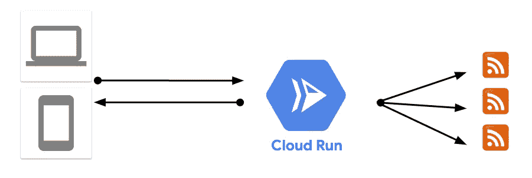
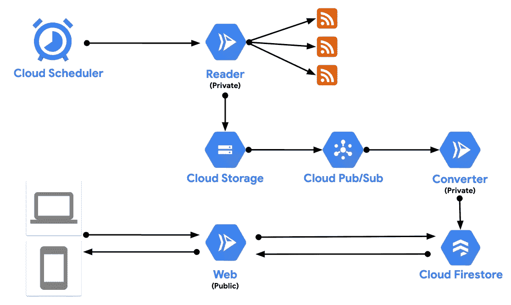

# 应用程序现代化故事—第 4 部分(无服务器微服务)

> 原文：<https://medium.com/google-cloud/an-app-modernization-story-part-4-serverless-microservices-f9acdb0d8370?source=collection_archive---------1----------------------->

在博客系列的第 3 部分中，我谈到了我们如何转变我们的纯 Windows。NET 框架 app 到容器化的多平台。NET Core app。

这消除了我们对 Windows 的依赖，使我们能够部署到基于 Linux 的平台，如 App Engine (Flex)。另一方面，该应用程序仍然在虚拟机上运行，即使没有人使用它，它也是按秒计费的，部署很慢，最重要的是，它是作为单个单元部署和扩展的单个整体。

在现代化的最后阶段，我想谈谈我们如何将我们的 monolith 转变为一套具有云运行的无服务器微服务，以及这种转变的好处。

# 无服务器云运行

在 2019 年初将我们的应用容器化后，我们希望在一个托管/无服务器平台上运行它，主要是为了避免虚拟机定价。然而，[云函数](https://cloud.google.com/functions)并不支持 C#/。NET 作为运行时(现在仍然不是)，这束缚了我们的手脚，直到 2019 年年中。

2019 年年中， [Cloud Run](https://cloud.google.com/run) 在三藩市的 Google Cloud Next 大会上宣布，作为一个全新的完全托管的平台来运行无状态容器。我们的应用程序已经是无状态的(所有的状态都在内存中)，并且已经容器化了，所以 Cloud Run 立即改变了我们的游戏规则。

在将我们的代码快速更新到 ASP.NET 核心 3.0 之后，我们能够用一个 *gcloud* 命令将我们的容器部署到云运行。我们在一夜之间用云运行取代了应用引擎:

这可能看起来不是一个大的变化，但它有直接的好处:

1.  **定价**:我们从基于虚拟机的定价转变为云运行定价，您只需为请求时间付费。对于像我们这样的小型且偶尔连接的应用程序，账单基本上几乎是免费的(Cloud Run 有一个免费层)。
2.  **部署时间**:我们的部署时间从 App Engine 上的 5–10 分钟减少到了云运行上的 3–5 秒。这使我们能够更快地迭代。
3.  **DevEx**:Cloud Run 上的开发者体验棒极了！我们在云运行控制面板中很好地显示了指标和日志。我们有一些功能，比如在云上运行的应用引擎的修改和流量分流。
4.  **基于开源**:知道 Cloud Run 是基于 [Knative](https://knative.dev/) ，一个开源项目也很好。如果我们想要离开受管理的谷歌云环境，我们可以在 Kubernetes 运行的任何地方轻松部署相同的应用程序并获得类似的功能。

这些几乎不费吹灰之力就赢得了胜利。

# 整体问题

尽管取得了快速的胜利，但云运行也放大了我们的应用程序的整体性质所导致的问题。我们的应用由三个服务组成:捆绑部署在一起的**阅读器**、**转换器**和 **web 前端**。这导致了如下问题:

1.  **缩放**:我们通常需要 1 个阅读器和 1 个转换器，偶尔会缩放 web 前端。当我们扩展时，我们扩展了所有 3 个服务，这是不必要的。
2.  **冷启动** : Cloud Run 在不使用的时候自动缩小你的容器。这可以节省资金，但在我们的情况下，这是一个问题，因为即使是阅读器也会被缩小。当容器从零开始向上扩展时，阅读器需要一些时间来获取提要并填充内存状态。
3.  **内存状态**:我们所有的状态都在内存中。冷启动后这并不理想。在这个阶段，我们需要更持久的存储。
4.  **无法更新单个服务**:我们不得不频繁更新 transformer，因为 RSS 提要格式经常变化，而我们不需要那么频繁地更新 reader 或 web frontend。没有办法挑选要更新的内容。

所有这些问题都清楚地表明，我们最终必须将我们的整体分解成独立的服务。

# 整块分解

理论上，整体分解听起来是个好主意。在现实中，要做到恰当是相当困难的。你需要回答很多问题:

1.  **如何打破独石？**理想情况下，你有足够独特的功能来使独特的服务显而易见，但这并不总是一目了然的。即使它是清晰的，你也可能需要做大量的重构来实现它。
2.  **微服务如何沟通？一旦你用服务间的网络调用替换了 monolith 内部的函数调用，你需要考虑服务是如何通信的。应该是同步还是异步调用？应该是 HTTP 还是某种发布/订阅消息？不管怎样，这都比函数调用难。你需要确定这是你想要付出的代价。**
3.  **如何在没有耦合的情况下处理持久性？出于多种原因，您希望您的服务尽可能无状态，但是在某些时候，您需要在某个地方保存一些数据。一个容易犯的错误是让多个服务依赖于同一个持久层。这将不是在代码中而是在持久性中耦合微服务，这违背了分解的初衷。**

还有许多其他的考虑，但你得到的想法。整体分解并不像你想象的那么简单。

# 最终建筑

最后，这就是我们最终得到的架构:

这 3 个独立的服务:阅读器，转换器，网络前端:

*   **Reader** 是一个内部云运行服务，由云调度程序按照设定的时间表调用。它从一个源列表中获取 RSS 提要，并将它们作为 json 存储在云存储中。
*   **转换器**是另一个内部云运行服务。一旦 Reader 将 RSS json 保存在云存储中，这将触发一条消息到一个 Pub/Sub 主题，反过来，Pub/Sub 调用 Converter 服务。然后，Converter 使用预定义的规则将不同的 RSS 提要转换为一种通用格式，并保存到 Cloud Firestore，这是一个 NoSQL 数据库，非常适合 JSON 之类的数据。
*   **Web** 是一个公有云运行服务，它只是为保存在 Cloud Firestore 中的 feed 数据公开了一个 Web API。

如果你想仔细看看代码，它已经在 GitHub 上了:[https://github.com/meteatamel/amathus](https://github.com/meteatamel/amathus)

最终的架构几乎解决了我之前概述的所有问题。有三个专注的服务，每次做好一件事。每项服务都可以独立推理、更新和扩展。更新已经不可怕了。这只是对其中一项服务的更新，云运行的修订功能使恢复到以前的代码非常容易。通过 Pub/Sub 和 Firestore 的服务之间存在松散的依赖关系。冷启动没有问题，因为 Web 前端有 Firestore 支持，启动非常快。

另一方面，体系结构比以前复杂得多。有几个移动部分，整体设置不像没有外部依赖的单一云运行服务那样简单。然而，这是我们愿意付出的代价，以使架构更具弹性，更易于更新。

这就结束了我们的应用程序现代化之旅的 4 部分博客系列。希望您喜欢阅读我们的旅程，如果您有任何反馈或问题，请随时通过 Twitter @ [meteatamel](https://twitter.com/meteatamel) 联系我