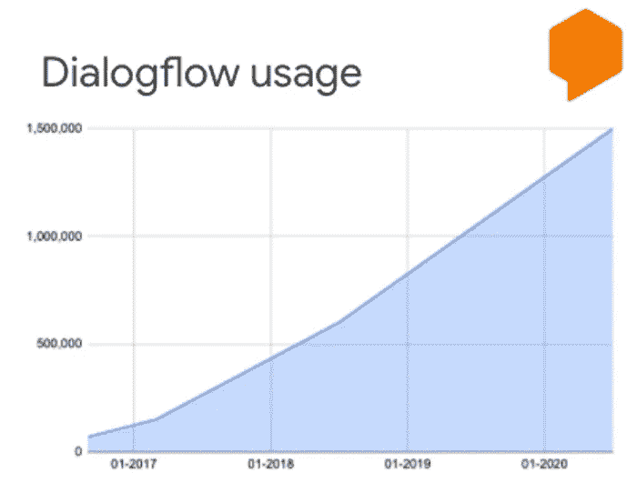
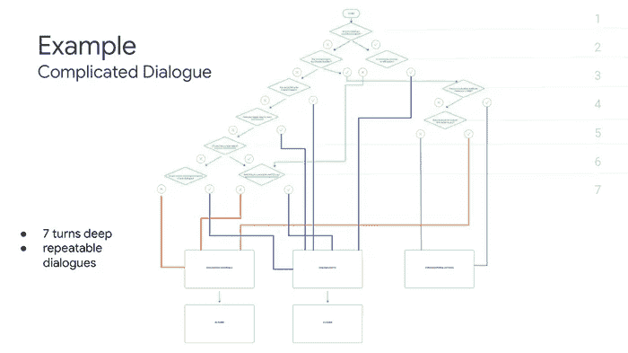
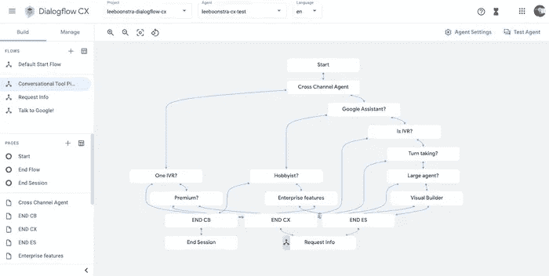

# bot builder 平台 Dialogflow CX 简介

> 原文：<https://medium.com/google-cloud/an-introduction-to-bot-builder-platform-dialogflow-cx-9f8635b07584?source=collection_archive---------2----------------------->

**以及与 Dialogflow Essentials 的差异**

A **根据 Gartner 的报告，今年 50%的企业将在 bot 开发上投入比传统移动应用程序开发更多的资金！在谷歌，我们也做了类似的观察。通过谷歌云，我们与企业客户进行了大量合作，我们收到了许多关于我们用于构建聊天机器人和语音机器人的对话式人工智能工具的问题，我们帮助公司构建这些工具。这包括用于网站、iOS、Android 移动应用程序和社交媒体(如 Facebook Messenger、Twitter、Slack、Whatsapp、Line 等)等明显渠道的机器人。而且:在联络中心建立虚拟代理！**

Dialogflow 最近更改了名称；它现在被称为**dialog flow Essentials**(**dialog flow ES**)为新的谷歌云对话式人工智能工具腾出空间: **Dialogflow 客户体验** ( **Dialogflow CX** )。Dialogflow CX 将是一个替代开发套件，用于构建对话式用户界面，并将存在于下一个 Dialogflow ES 中。谷歌将继续支持 Dialogflow ES，因为我们拥有庞大的用户群。要了解 Google 为什么要创建另一个 bot builder，我们先来了解 Dialogflow ES 是如何工作的。

注意这个图，你会看到 bot builder 平台 Dialogflow Essentials 有多受欢迎。据 2021 年初统计，它拥有超过 160 万用户。Dialogflow 以前叫 API。AI；谷歌收购了 API。AI，并将其更名为 Dialogflow，使其成为谷歌云的一部分。Dialogflow 之所以如此受欢迎，是因为其出色的底层 NLU 机器学习模型(如自然语言理解、意图分类和实体提取)，类似于谷歌助手。

*本博客交叉发布于*[*https://www . leeboonstra . dev*](https://www.leeboonstra.dev)*—开发者崇尚对话式 AI，谷歌*

# Dialogflow Essentials 如何工作

**(了解区别)**

Dialogflow Essentials 是一个用于构建对话式用户界面的开发套件。

因此聊天机器人，语音机器人，电话网关。您可以使用相同的工具构建它，甚至可以支持 20 多种不同语言的多个频道。Dialogflow UX 设计人员(代理建模人员、语言学家)或开发人员通过指定训练短语来训练底层机器学习模型，从而创建意图。

**意图**对用户的意图进行分类。对于每个 Dialogflow ES 代理，您可以定义许多意图，其中组合的意图可以处理一个完整的对话。每个意图可以包含参数和响应。

匹配意图也被称为**意图分类**或意图匹配。这是 Dialogflow ES 中的主要概念。一旦匹配了一个意图，它就可以返回一个响应，收集参数(实体提取)或触发 webhook 代码(实现)，例如，从数据库获取数据。

当最终用户在聊天机器人中写或说一些东西时，称为**用户表达**或**话语**，Dialogflow ES 会根据训练短语将该表达与您的 Dialogflow 代理的最佳意图进行匹配。引擎盖下的 Dialogflow ES 机器学习模型是在这些训练短语上训练的。

Dialogflow ES 使用一个叫做 **context** 的概念。就像人类一样，对话流 ES 可以在第二和第三个话轮中记住上下文。这就是它跟踪用户先前话语的方式。

# 行业如何改变其复杂性

过去几年，大型企业一直在使用 Dialogflow ES。这是我在谷歌看到的一个观察:在最初(2016 年)，大多数对话式 ai 都是简单的聊天机器人。(语音助手机器人，常见问题机器人…)，用于网络或语音机器人，如谷歌助手。它通常使用 1 或 2 轮轮流。例如:

> "嘿，谷歌，美国广播公司正在播放什么？"——《单身汉》在晚上 8 点开播，这是你从未看过的一集！”

众所周知，构建对话式 ui 是一个持续的过程。当您捕捉到正确的聊天机器人洞察力时，您将看到您的客户在要求什么。当您继续在现有代理的基础上构建对话时，这个机器人会随着时间的推移变得更加复杂。

所以**对话复杂性**是一个观察结果。我的另一个看法是**企业希望他们的客户在哪里**。因此，他们的聊天机器人将需要连接到更多频道，以创造全频道体验。现在，公司希望开发由数据湖支持的完整对话平台，并使用 RPA 自动化流程，而不是构建一个聊天机器人。想想复杂的用例，比如用机器人代替你的客户服务或人力资源部门。在超负荷的呼叫中心和被低估的单调任务弄得精疲力竭的员工的情况下，通过聊天机器人和虚拟(语音)代理的自动化可以削减巨大的商业成本。通过联络中心的对话式人工智能，企业可以减少呼叫时间、等待时间并提供 24/7 可用性，同时通过捕获分析来改进我们的流程。

> 到 2022 年，聊天机器人预计将帮助每年削减 80 多亿美元的商业成本
> 
> *—瞻博研究*

# 对话流 CX 适合在哪里

Dialogflow Essentials 因其简单而受到好评。你可以快速建立一个聊天机器人或语音机器人。这些是聊天和语音应用程序，其中一个简短的话语符合一个意图，有几个话轮。例如，零售聊天或语音应用程序，您可以说:

> "把牛奶放在我的购物单上."

现在想象你正在为杂货店的电话服务台建造一个语音机器人。这一次，顾客不是说几句话，而是说整个故事:

> “昨天，就在开业时间，我和我的 4 个月大的宝宝一起在某某商店买了牛奶，当我回家时，我想把牛奶放在冰箱里，我注意到日期已经过了保质期。我打开纸盒，注意到了奇怪的味道，但味道还好。”

突然间，匹配意图变得更加棘手。对一个人类来说，理解意图可能变得具有挑战性；对于一个 AI 来说，这也很难！因为我们说的是 ***买奶******坏品*** ，还是 ***要求退款*** ？

对话是长时间的，对话很大，可以有很多轮次，我们需要记住上下文——分支成数百个可能的结果。看，我甚至没有提到处理多个扬声器、中断、背景噪音等等的技术复杂性。

高级对话包含可重用的意图和流程，并且可以在许多结果中分支

为联络中心创建一个虚拟(语音)代理或创建一个自动化的机器人平台要复杂得多，因为它达到了 Dialogflow Essentials 的边界。当然，当你有一个大的开发团队时，他们可以在 Dialogflow ES 的基础上定制一个解决方案，就像用户过去一直做的那样。但这意味着你必须开发和维护额外的软件，而不是专注于设计对话。

直到现在……随着对话流 CX 的发布。

# Dialogflow CX 产品说明

Dialogflow CX 通过可视化机器人构建器、可重复使用的意图和解决多回合对话的能力，使您的团队能够加速创建企业级对话体验。

它允许您通过以下方式快速创建代理:

*   大而复杂的流程。想想有成百上千个意图的巨型代理实现。
*   三次以上的话轮转换(保持上下文)和以各种结果从彼此分支的对话。
*   流程中可重复的对话部分(考虑登录功能，对问题说是/否，等等。)
*   理解长话语的意图和语境。
*   与团队合作进行大型实施。
*   本地联络中心功能，如 DTMF、一键式电话合作伙伴集成、强插、实时代理移交。
*   代理是附加语言，区域化(例如 GDPR)很重要。
*   具有各种结果和可重复部分的流程。比如报税。通常这需要你填写大量的表格，表格中的问题会互相跳转。——如果你要为这个用例建立一个聊天机器人，Dialogflow CX 将会是很好的选择，因为它可以重复使用流程、意图和答案的分支。

CX 可视化流程生成器

对话流 CX 已经推进了他们的 NLU。尽管 Dialogflow ES 因为出色的 NLU 结果而广受欢迎，但我们通过将我们的 NLU 基于 BERT 语言模型看到了显著的质量改进**。**

它引入了新的概念，如**页面**和**流程**，用于创建可重用的流程和分支，在此基础上，它还附带了一个**可视化流程生成器**，用于快速预览和理解对话流程。

# 对话流定价解释

[Dialogflow 定价页面解释了基本产品和客户体验之间的定价](https://cloud.google.com/dialogflow/pricing?utm\_source=blog&utm\_medium=partner&utm\_campaign=CDR\_lee\_aiml\_leedialogflowblog\_personal\_)。

Dialogflow Essentials 有一个**免费试用**。**现收现付版本基于您的请求数量**，您将不得不为附加功能支付额外费用，如情感分析、知识库、电话网关等。

请求被定义为对 Dialogflow 服务的任何调用，无论是直接使用 API 还是间接使用集成或控制台。

有了 Dialogflow CX，你**按次付费**。会话是最终用户和 Dialogflow 代理之间的对话。会话保持活动状态，其数据在为该会话发送最后一个请求后存储 30 分钟。会话可以是聊天会话，也可以是语音会话。

定价似乎很贵，但如果你考虑到你不需要一个开发团队解决 fulfillment webhooks 中的复杂问题来方便大型企业规模的 bots plus，你就不需要为所有附加功能额外付费；企业客户使用 Dialogflow CX 实际上可能会更好。

此外，每个新用户将获得 600 美元的信用点数，免费试用 Dialogflow CX。此点数在首次使用 Dialogflow CX 时自动激活，12 个月后到期。这是 Google Cloud [免费试用](https://cloud.google.com/free/docs/gcp-free-tier#free-trial?utm\_source=blog&utm\_medium=partner&utm\_campaign=CDR\_lee\_aiml\_leedialogflowblog\_personal\_)的 Dialogflow 特定扩展；这应该足够您使用该工具并开始使用了！

# 结论

Dialogflow CX 是一个独立的产品，将与 Dialogflow Essentials 共存。开发者和企业可以选择哪个 bot 构建套件是适合他们的工具。

## Dialogflow CX 与 Dialogflow 要点:何时使用哪种工具

当你是一名自由职业者、初创企业或小企业，当你正在构建一个单独的聊天或语音机器人时，例如，为谷歌助手或构建一个 FAQ 机器人，Dialogflow Essentials 可能是你更好的选择。这个工具因其简单性而经常被选用。

当你是一个企业客户建立一个大型复杂的聊天机器人平台或联络中心客户体验，当数据区域化对你来说是至关重要的(例如因为 GDPR)或你的谈话需要大量的轮流和对话分支，对话流 CX 是使用的工具。**该工具满足了企业构建更复杂聊天的需求&联络中心语音机器人。**

[试用新的 Dialogflow CX 控制台](https://dialogflow.cloud.google.com/cx/projects?utm_source=blog&utm_medium=partner&utm_campaign=CDR_lee_aiml_leedialogflowblog_personal_)

*本博客交叉发布于*[*https://www . leeboonstra . dev*](https://www.leeboonstra.dev)*—开发者倡导对话式 AI，Google*