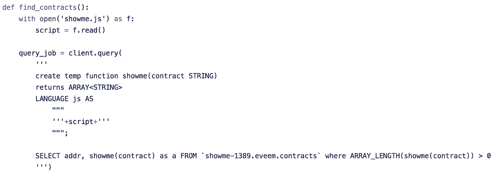
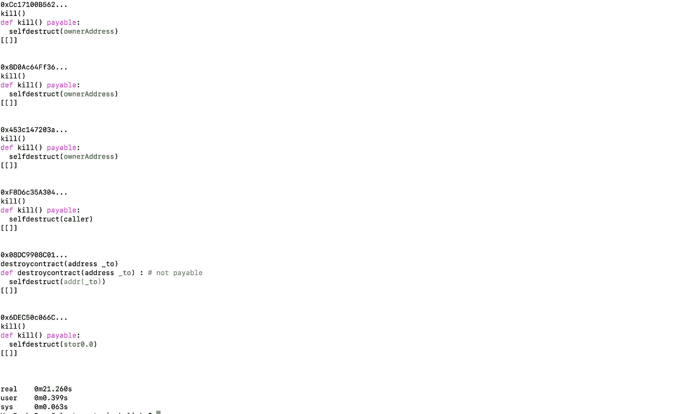
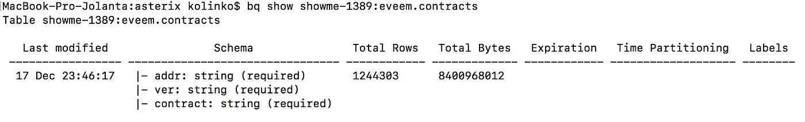

# 使用 Eveem 和 BigQuery 在 20 秒内分析 120 万份以太坊合约

> 原文：<https://medium.com/google-cloud/analysing-1-2m-mainnet-contracts-in-20-seconds-using-eveem-and-bigquery-f69b6d66c7b2?source=collection_archive---------0----------------------->

上个月，我向 Eveem.org 发布了一个 API，它允许对以太坊合约进行简单的静态分析。

如果你去:

[http://eveem . org/code/0x 06012 c8 cf 97 bead 5 deae 237070 f 9587 F8 e7a 266d . JSON](http://eveem.org/code/0x06012c8cf97bead5deae237070f9587f8e7a266d.json)

您将在那里找到一个 JSON 文件，所有的函数都被反编译成一种相对容易分析的中间语言。例如，你可以构建一个像 https://showme-1389.appspot.com/[这样的工具，向你展示一些关于智能合约的有趣事实。](https://showme-1389.appspot.com/)

这种中间表示还有一个更酷的地方——它使得合同的安全性分析变得非常容易和快速。

而且，由于所有的契约都已经被反编译了，所以批量反编译是可能的。

最初，我是在一个控制台上使用一个 python 脚本一个接一个地检查所有的合同。这对我来说很方便，但不允许其他人使用这项技术——如果通过 API 访问 120 万份合同，速度会非常慢。

幸运的是，在 EthSingapore 期间，来自谷歌的 [Allen Day](http://twitter.com/AllenDay) 向我介绍了 BigQuery，你可能从他们最近关于以太坊数据集的声明中知道。

BigQuery 最酷的地方是——它是一个为数据的顺序访问和批量操作而设计的数据库。换句话说——如果您有一个数据集，BigQuery 在获取随机行方面不是很好，但是如果您想要访问所有的行，并在其中执行一些操作，这将是非常令人惊讶的。

更酷的是——它支持 UDF(用户定义函数),但不仅仅是普通的 UDF。BigQuery 完全支持 Javascript(通过扩展——WASM ),所以如果你写一个脚本来做一些数据分析，在几秒钟内对整个数据集运行它是非常容易的。

你会问，这有多微不足道？

我只花了几个小时就将所有反编译契约的数据集上传到 BigQuery，并编写了[Asterix](https://github.com/kolinko/asterix)——一个在所有反编译契约中寻找所有开放的自毁的示例脚本。

你问有多快？

运行一个查询需要 23 秒，该查询返回匹配给定模式的所有合同——在 open self-destructs 的情况下，它会发现 mainnet 上现在大约有 700 个合同处于活动状态，任何人都可以在任何时候杀死它们。额外的 500 份合同也可能被取消，但有一些条件适用。

那么，下一步是什么？

我已经公开了数据集:

Asterix 在这里是完全开源的:

[https://github.com/kolinko/asterix](https://github.com/kolinko/asterix)

如果有人感兴趣，不妨一试！你可以先浏览一下 [BigQuery quickstarts](https://cloud.google.com/bigquery/docs/quickstarts) ，这大约需要 1-2 个小时。在你熟悉它们之后，[获取 Asterix](https://github.com/kolinko/asterix) 并运行它以获得带有自毁的合同的完整列表。

如果您对一些更深入的分析感兴趣，请查看 [showme.js 文件](https://github.com/kolinko/asterix/blob/master/showme.js)。您还需要熟悉 Eveem 提供的中间语言——[showme python 演示](https://github.com/kolinko/showmewhatyougot)应该会有所帮助。

**关闭思路**

Eveem 仍然是一项正在进行的工作，并且遗漏了许多东西——许多契约和函数没有完全反编译。它也遗漏了一些东西。例如，在 safesub 库的情况下，它通常不会显示在减法之前进行了检查，所以你会得到大量的误报。

坦白说——这是我写过的最鼓舞人心也最吓人的工具。给定一个漏洞，你可以编写一个类似于你用 [Mythril](https://github.com/ConsenSys/mythril-classic) 或[蝎狮](https://github.com/trailofbits/manticore)所做的扫描器，并立即得到一个带有该漏洞的所有活动合同的列表。

这也让人想知道在这种情况下如何进行合理的漏洞利用披露——显然，找到与任何重要以太网或流量相关的合同，然后找到它们的所有者似乎是正确的事情。

该工具还有其他潜在的有趣用途——在已部署的契约中找出模式。如果你曾经好奇有多少合同使用某种编程模式(如可升级性，或管理交易所之间的套利，或某种循环)，这可能是第一个让你这么容易就弄明白的工具。

在此基础上还可以构建另一个有趣的东西:现在很容易就能找出一个契约调用了哪些其他契约。人们可以编写一个脚本，对它们之间的所有连接进行静态分析。像 [Bloxy.info](http://www.bloxy.info/) 这样的网站已经通过分析交易动态地做到了这一点，但似乎没有人静态地做到这一点。我想知道会有什么结果。

玩得开心！:)