# 使用 BigQuery SQL 分析 Git 存储库活动

> 原文：<https://medium.com/google-cloud/analysing-a-git-repository-activities-with-bigquery-sql-e40a6d85d667?source=collection_archive---------2----------------------->

从 git 平台生成的报告很棒，但是如果我们需要更大的灵活性来创建 git 日志报告呢？在本文中，我们将探索如何将日志从 git 存储库导出到 BigQuery 中，并使用 SQL 应用一些分析查询。

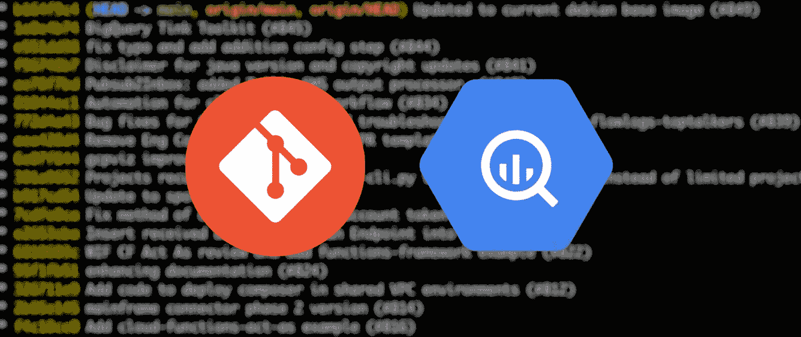

考虑一个 git 存储库，它有多年的活动历史和成千上万的贡献。给定日志，人们最终需要对其进行深入查询，以了解一些历史、活动和贡献。在本文中，我们将遵循一种从头开始的方法，并尝试使用 git 和 SQL 所提供的功能。

我们将以[这个存储库为例](https://github.com/GoogleCloudPlatform/professional-services)。有趣的是，它被用作一个单一的回购协议，由几个代表不同项目的文件夹组成。分析的一部分将与理解文件夹的活动并最终识别可能的所有者相关。

# 提取并加载 Git 日志

我们练习的第一部分，从从 git 日志中提取有用的信息开始。git log 命令提供了一个有用的特性，叫做[漂亮的格式](https://git-scm.com/docs/pretty-formats#_pretty_formats)。它在显示什么作为提交元数据以及如何格式化它方面提供了很大的灵活性。这对于准备稍后解析和导入的日志数据非常有用。

在本地克隆的存储库上，您可以运行类似于下面的命令。

```
git —-git-dir ../professional-services/.git log —-name-only --pretty=format:’commit: %H %nsubject: %s %nauthor: %aN %nemail: %aE %ndate: %at’
```

这应该会返回类似于以下示例的输出。对于每次提交，代表散列、主题、作者姓名、作者电子邮件、日期和在该提交中修改的文件列表的行。

```
commit: e551dd384acc13f6d9d186d678a8b158214c62e6
subject: fix typo and add addition config step (#844)
author: Someone
email: [someone@somewhere.com](mailto:7sanai@gmail.com)
date: 1655821884
tools/pubsub2inbox/examples/scc-finding-config.yamlcommit: f96748b7b3b8f54b17e18e57c58934c57071f676
subject: Disclaimer for java version and copyright updates (#841)
author: abc-xyz
email: [78390589+abc-xyz@users.noreply.github.com](mailto:78390589+anuradha-bajpai-google@users.noreply.github.com)
date: 1655797941
tools/quota-monitoring-alerting/README.md
tools/quota-monitoring-alerting/java/quota-notification/src/main/java/functions/SendNotification.java
tools/quota-monitoring-alerting/java/quota-notification/src/main/java/functions/eventpojos/PubSubMessage.java
tools/quota-monitoring-alerting/java/quota-notification/src/test/java/functions/SendNotificationTest.java
tools/quota-monitoring-alerting/java/quota-scan/pom.xml
tools/quota-monitoring-alerting/java/quota-scan/src/main/java/functions/ListProjects.java
tools/quota-monitoring-alerting/java/quota-scan/src/main/java/functions/ScanProjectQuotas.java
tools/quota-monitoring-alerting/java/quota-scan/src/main/java/functions/ScanProjectQuotasHelper.java
tools/quota-monitoring-alerting/java/quota-scan/src/main/java/functions/eventpojos/GCPProject.java
tools/quota-monitoring-alerting/java/quota-scan/src/main/java/functions/eventpojos/GCPResourceClient.java
tools/quota-monitoring-alerting/java/quota-scan/src/main/java/functions/eventpojos/ProjectQuota.java
tools/quota-monitoring-alerting/java/quota-scan/src/main/java/functions/eventpojos/PubSubMessage.java
tools/quota-monitoring-alerting/java/quota-scan/src/main/java/functions/eventpojos/TimeSeriesQuery.java
tools/quota-monitoring-alerting/java/terraform/example.tfvars
tools/quota-monitoring-alerting/java/terraform/main.tf
tools/quota-monitoring-alerting/java/terraform/terraform.tfvars
tools/quota-monitoring-alerting/java/terraform/variables.tf
```

## 决定日志存储结构

解析和转换逻辑将取决于我们希望用来存储数据的结构。该数据类似于“一对多”关系，每个提交都有其独特的细节，以及与该提交相关联的一组文件。

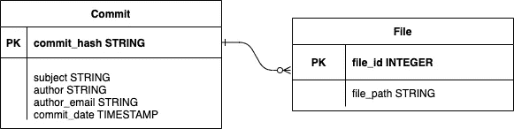

我们的日志数据类似于 1:n 的关系

使用上面的模型，一个人可能会在与多个提交相关联的文件上重复。在关系数据库的上下文中，我们甚至可以进一步规范化。

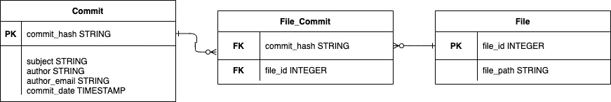

完全反规范化是一种选择，但不是 BigQuery 的最佳选择！

然而，这个用例的实际情况是，我们主要是在一组日志上运行分析性读取查询，而不是应用事务性 CRUD 操作。

为此，我们可以通过将我们的日志存储在一个完全非规范化的表中来使事情变得更加灵活和简单。这简化了解析、日志编写，并最终避免了 BigQuery SQL 中的额外连接。我要研究的结构应该是这样的:

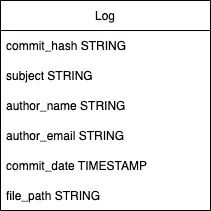

非标准化但对分析工作有效

BQ 中非规范化表中存储的日志在每个文件的每次提交中都有一个**行。我知道行与行之间有很多重复，但 BigQuery 的引擎针对以这种方式构建的数据进行了很好的优化，即表更少，列更窄，行更高。**

## 提取并加载到 BigQuery

现在我们已经在 BigQuery 中定义了目标结构，我们可以继续编写一个快速脚本，将这些日志解析成一个结构，该结构可以通过 BQ CLI 命令轻松地加载到 BigQuery 表中。在这个例子中，我们将把 git 日志转换成表示为 JSONL(行分隔的 JSON)的行。

下面是一个快速的 Python 脚本。

通过类似下面的方式运行脚本

这将生成一个 **jsonl** 文件，准备加载到 BigQuery 中。结构看起来会像这样

从这一点来看，通过 bq 命令加载到 BigQuery 应该是微不足道的，例如

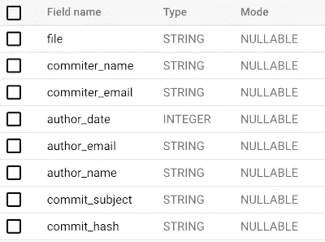

生成的模式应该如下所示

现在我们已经将数据添加到了 BigQuery 表中，我们可以开始运行一些分析查询了。

# 查询数据

## 从路径派生子项目类型和名称

在本文的前面，我提到了我们正在使用的存储库示例将遵循命名约定的文件夹和子文件夹视为独立的项目。

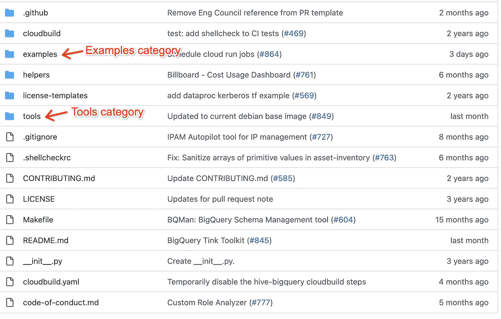

在每个类别下，我们有一堆代表独立项目的文件夹。

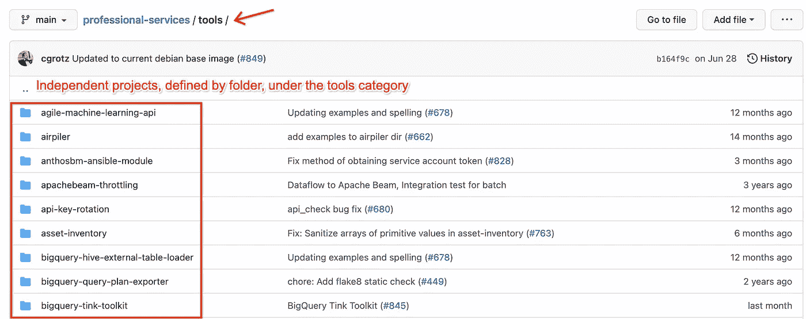

## 初始清理查询

假设我们有与每次提交相关联的每个文件的文件路径，我们可以应用 **REGEXP_EXTRACT** 来导出项目名称和类型(基于父文件夹)。

在 repo 中，有几个不相关的文件夹也包含在提取的日志中。我们可以从 REGEXP_EXTRACT 的结果中过滤出那些与我们要寻找的模式不匹配的空值。

清理初始日志，提取文件夹

结果应该类似于下面的截图。如果你打算经常使用这个结果作为基础，你可能想考虑把它定义为一个单独的 [**物化视图**](https://cloud.google.com/bigquery/docs/materialized-views-intro) 。

为了方便和说明，我将通过**和**在后续查询中重用这个查询，而不是一个物化视图。

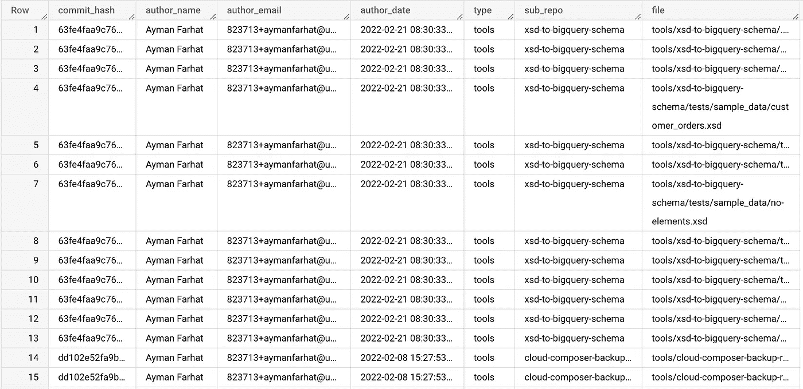

## 每个子项目的上次更新

如果我们对识别每个子文件夹(也就是子项目)的最后作者日期感兴趣呢？这对于 SQL 来说应该很简单，通过**和**将查询建立在前一个查询的基础上。我们所要做的就是在类型和项目名称上应用一个 **GROUP_BY** ，同时获得 author_date 的最大值。

确定每个项目的最后作者日期

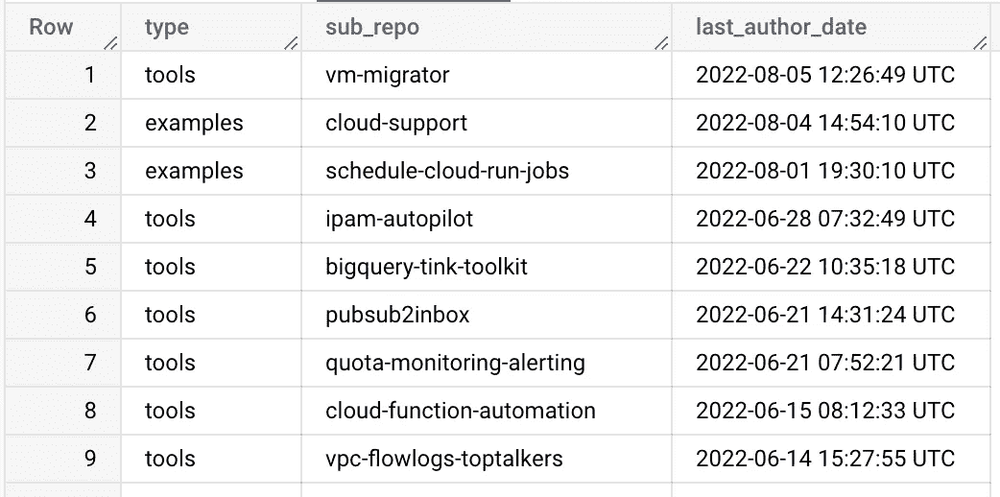

## 每个子项目的作者

另一个有用的查询是识别每个文件夹中的所有作者。

这与前面的查询略有不同。 **ARRAY_AGG** 是一个很酷的聚合函数，允许我们通过**ARRAY _ AGG(DISTINCT author _ email)**为每个 sub_repo 生成一个所有作者的数组字段。在这里应用 **DISTINCT** 很重要，因为在原始数据中，由于每次提交每个文件都有一行，所以我们有很多重复。

在 BigQuery UI 上，这应该会给出类似于下图的结果(在截图中，作者的电子邮件被模糊处理以保护隐私)。

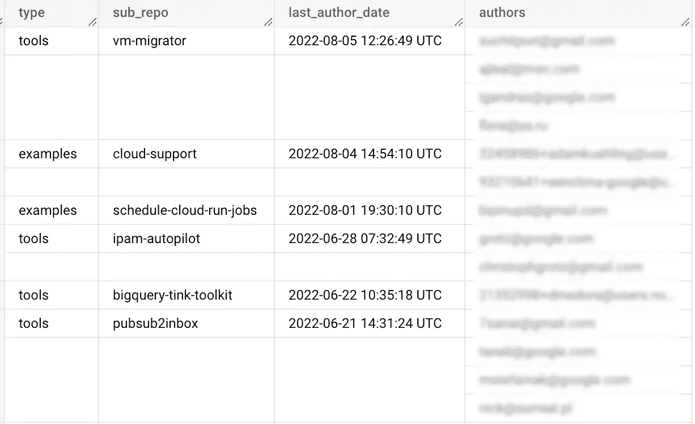

## 每个子项目中每个作者的提交次数

以类似的方式，我们可以通过简单地对这两个值进行分组并对 commit_hash 值应用不同的**COUNT**来确定每个用户的每个子回购的提交数量。

输出如下所示

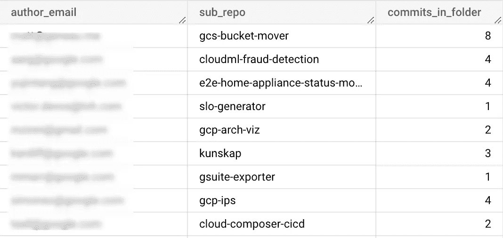

## 确定每个子项目的顶级作者

现在让我们考虑一下，在同一个报告中获得每个项目的顶级作者列表。我们可以在前一个查询的基础上编写一个新的查询，简单地将每个项目的作者提交聚合到一个漂亮的结构值数组中，并通过

```
ARRAY_AGG(STRUCT(author_email,
      commits_in_folder)
  ORDER BY
    commits_in_folder DESC) AS authors
```

并且应该返回每个子 repo 的 struct 数组，如下所示。

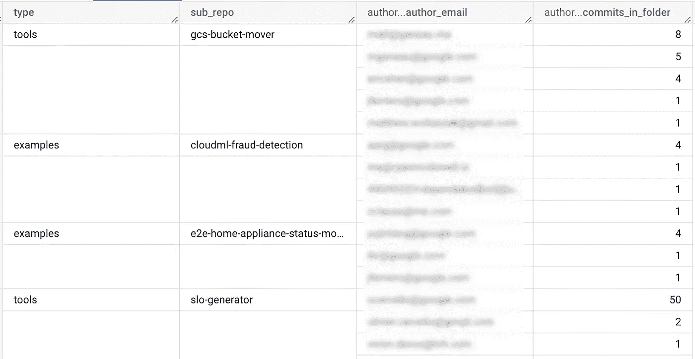

# 包裹

现在，您已经有了一个快速的工具，可以简化和导出 git 日志，以便在 BigQuery 中进行分析。查询这些数据的可能性是无限的，可能还有我们没有涉及的重要(可解决的)角度，例如

*   不断将新日志应用到 BigQuery 表中
*   处理不再存在但包含在历史中的目录/文件夹
*   在仪表板上绘制结果

这些可能是另一篇后续文章中要解决的有趣主题。同时，希望听到您的反馈！