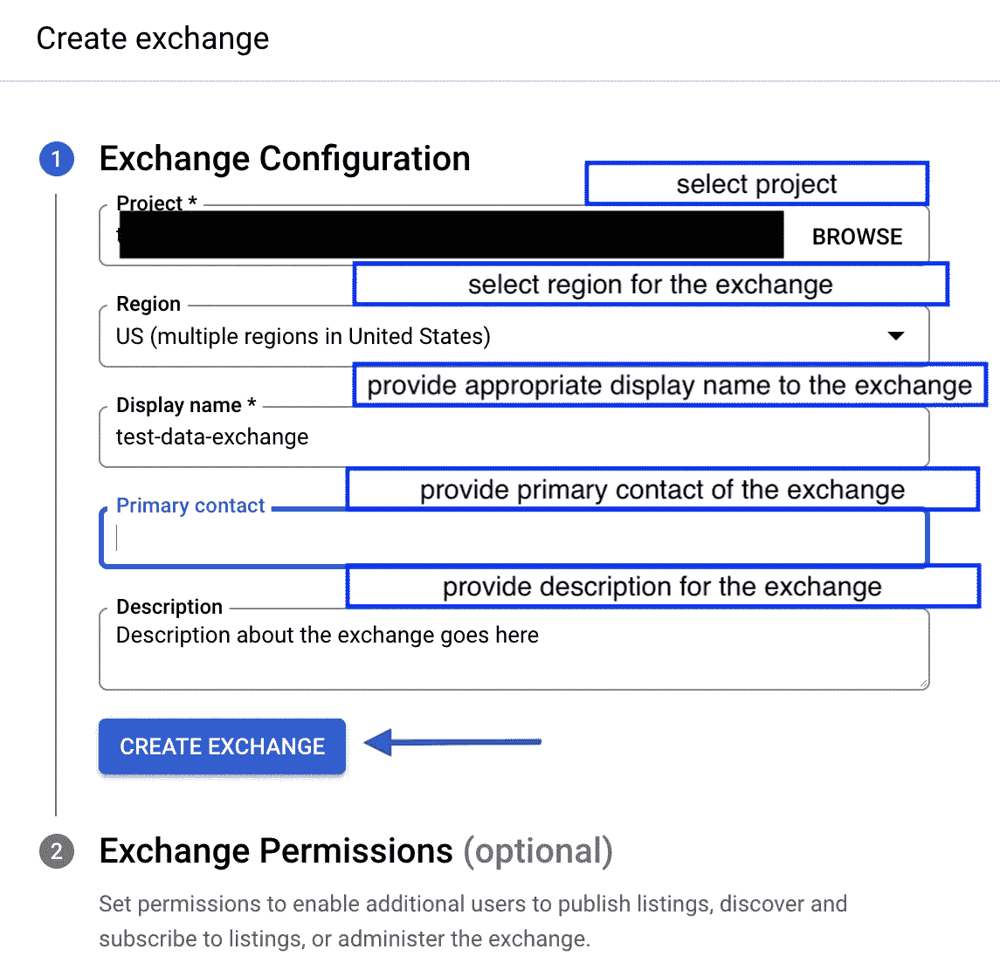
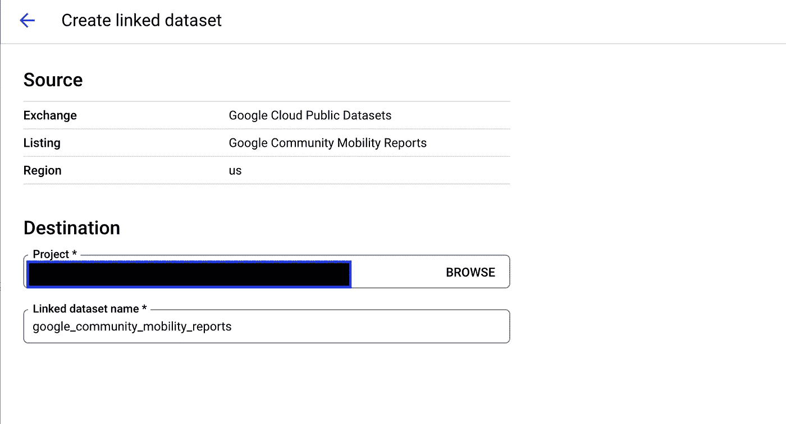

# 分析中心- GCP 的数据交换解决方案

> 原文：<https://medium.com/google-cloud/analytics-hub-gcps-data-exchange-solution-2e01aca6a071?source=collection_archive---------6----------------------->

在这篇文章中，我们将探索 Analytics Hub 的基础知识，并分享如何使用它在组织内外轻松交换 BigQuery 数据集。

我们都知道现有的数据共享方案非常昂贵。此外，它需要一些数据共享设置，但由于缺乏适当的审计能力，仍然经常违反安全或治理协议。除了这些挑战，数据共享、协作和扩展的选择也很有限。这就是 Analytics Hub 为我们提供帮助的地方！

## **什么是分析中心？**

Analytics Hub 是一个数据共享平台，旨在简化组织内共享大型数据资产的任务，以应对数据可靠性和大规模成本的挑战。您需要的数据很少存储在一个地方，通常数据以不同的格式分散在多个来源中。

分析中心不仅允许在全球范围内管理和共享大量可供分析的数据集，还允许团队利用只有谷歌提供的独特数据集，如谷歌搜索趋势或数据共享知识图。

Analytics Hub 允许您以三种不同的方式共享支持分析的数据集(默认设置为私有交换)

1.  **Public** —向所有谷歌云用户公开分享的列表
2.  **私人** —与您或您所属的群组直接共享的列表
3.  **组织内** —与您的组织共享的列表

分析中心|数据交换和数据共享

**分析中心的关键组件**

1.  **数据交换** —数据交换将数据发布者和数据消费者联系在一起。在一个数据交换中，可以有许多允许用户唯一识别数据的列表。
2.  **列表** —列表主要用于唯一标识数据。清单只不过是对用户在数据交换中发布的数据集的引用。
3.  **数据发布者** —数据发布者将数据集发布到 Analytics Hub，作为交换中的列表，可以在 Analytics Hub 的列表页面上进行搜索(如果公开共享)。
4.  **数据订阅者** —数据订阅者是希望在自己的 BigQuery 项目中使用共享数据集的人。数据订阅者可以使用类别、位置、提供商和列表类型等各种过滤器来搜索所需的数据集。

T21:接下来，我们来做一个快速的动手练习。

# **a .使用分析中心的先决条件**

要使用分析中心，必须启用分析中心 API，但在此之前，他们必须拥有以下权限

1.  在云控制台中查看 API—serviceUsage.services.get/list
2.  启用 API—service usage . services . enable

添加上述权限后，用户可以通过以下链接启用分析中心 API(请修改*项目名称*)。

[https://console . cloud . Google . com/market place/product/Google/analytic shub . Google APIs . com？q = search&referrer = search&project =](https://console.cloud.google.com/marketplace/product/google/analyticshub.googleapis.com?q=search&referrer=search&project=test-project-1-351206)<**project-name-here**>

启用分析中心 API

单击“启用”以启用分析中心 API。

万岁！！您已经准备好使用分析中心。

# **b .创建数据交换并发布列表**

**步骤 1** :您可以在 BigQuery 页面的左侧找到分析中心选项

**步骤-2.a** :点击创建交换选项

创建交换

**Step-2.b** :填写兑换相关明细

**第三步(*可选* )** :设置兑换权限。下面提供了有关 exchange 权限的更多详细信息

*   **管理员**:这些用户被分配了[分析中心管理员角色](https://cloud.google.com/bigquery/docs/analytics-hub-grant-roles#ah-admin-role)。
*   **发布者**:这些用户被分配了[分析中心发布者角色](https://cloud.google.com/bigquery/docs/analytics-hub-grant-roles#ah-publisher-role)。有关发布者可以执行的任务的信息，请参见[管理列表](https://cloud.google.com/bigquery/docs/analytics-hub-manage-listings)。
*   **订户**:这些用户被分配了[分析中心订户角色](https://cloud.google.com/bigquery/docs/analytics-hub-grant-roles#ah-subscriber-role)。有关订阅者可以执行的任务的信息，请参见[查看和订阅列表](https://cloud.google.com/bigquery/docs/analytics-hub-view-subscribe-listings)。
*   **查看者**:这些用户被分配了[分析中心查看者角色](https://cloud.google.com/bigquery/docs/analytics-hub-grant-roles#ah-subscriber-role)。观众可以查看列表。

创建交换后，您将能够在 Analytics Hub 的页面上看到交换

数据交换列表

**步骤 4** :点击分析中心页面上列出的交易所，并创建列表

**Step-5.a** :填写与发布房源相关的详细信息

**步骤 5.b** :使用 markdown 语言创建关于列表的文档。点击这里快速查阅降价语法[。](https://cloud.google.com/apigee/docs/api-platform/publish/portal/markdown-reference)

第六步:点击保存，你就完成了。你的物品已建立。

# **c .在项目中使用现有清单**

**步骤 1** :转到分析中心页面，点击搜索列表。

**步骤 2** :使用搜索选项和过滤器搜索您想要在项目中使用的列表。

**步骤 3** :选择搜索到的列表。

**步骤 4** :点击 add dataset to your project 添加数据集。

**步骤 5** :选择项目，并为这个链接数据集提供一个名称。单击保存。

你完了。您将能够在您在上一步中提到的项目下看到链接的数据集。

就是这样！感谢浏览博客，下次见！

**附加参考:**

*   [分析中心官方文档](https://cloud.google.com/analytics-hub)
*   [分析中心定价](https://cloud.google.com/analytics-hub#section-6)
*   [一分钟后的分析中心](https://www.youtube.com/watch?v=h8_xCbTYtTU)