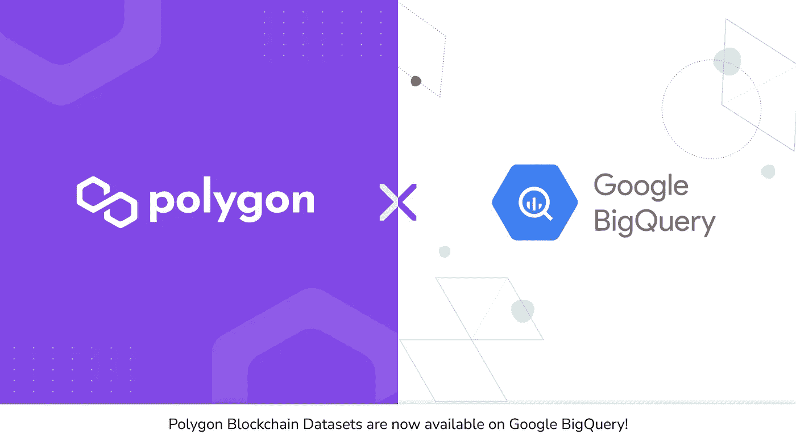
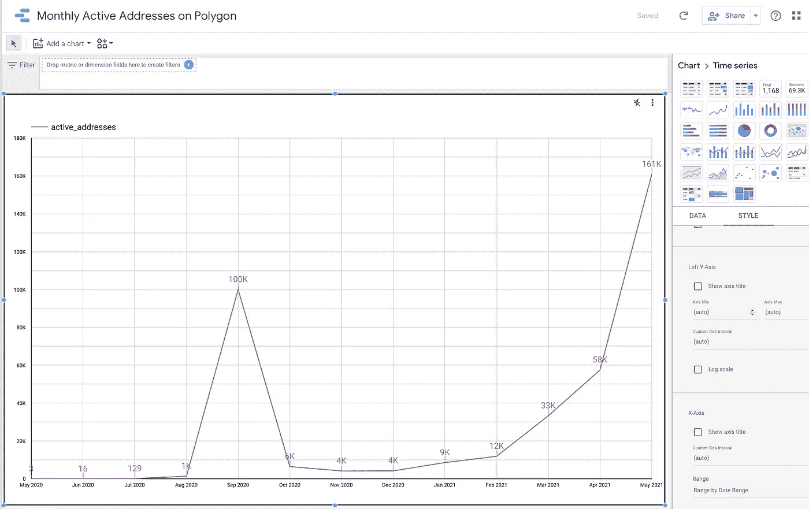
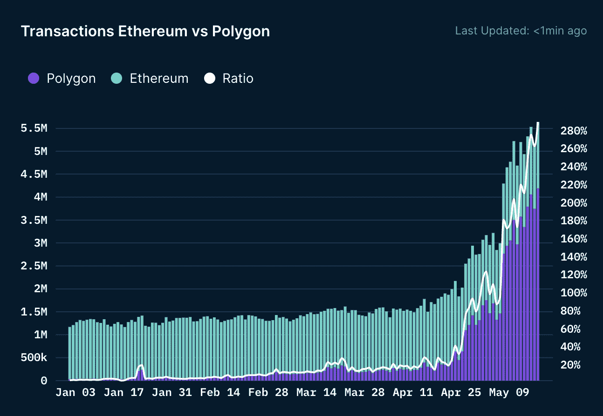

# 🔥用 Google BigQuery 分析实时多边形区块链数据

> 原文：<https://medium.com/google-cloud/analyze-polygon-blockchain-datasets-with-google-bigquery-e079b24d2bee?source=collection_archive---------0----------------------->



由谷歌云作为**金融服务公共数据集**托管的**多边形区块链**数据集已经在谷歌云市场中列出，并且可以在这里找到[。](https://console.cloud.google.com/marketplace/product/public-data-finance/crypto-polygon-dataset?project=public-data-finance)

[Polygon](https://polygon.technology/) 旨在作为[以太坊](https://ethereum.org)的*区块链互联网*，通过 Polygon SDK 为以太坊带来巨大规模，支持独立的区块链和安全的区块链。

这个数据集是通过谷歌云[公共数据集计划](https://cloud.google.com/public-datasets)使加密货币数据在**谷歌大查询**中可用的更大努力的一部分。该计划托管了许多实时加密货币数据集，并计划扩展产品，以包括更多的分布式分类账。你可以通过在 GCP 市场搜索[“crypto】找到这些数据集](https://console.cloud.google.com/marketplace/browse?q=crypto&filter=solution-type:dataset)。对于分析互操作性，谷歌设计了一个统一的模式，允许所有类似比特币的数据集共享查询。

这个公共数据集托管在 Google BigQuery 中，包含在 BigQuery 的 1TB/mo 免费层处理中。这意味着每个用户每个月都会收到 1TB 的免费 BigQuery 处理，可以用来在这个公共数据集上运行查询。观看此短片，了解如何快速开始使用 BigQuery 访问公共数据集。

## 什么是 BigQuery？

[Google BigQuery](https://cloud.google.com/bigquery/what-is-bigquery?hl=en_US) 使用标准 SQL 语法，以简单、有组织的方式在云上查询链上数据。你可以把它想象成一个巨大的索引器，允许你执行强大的数据分析。您还可以一次在多个区块链上执行相同或类似的查询，并对它们进行比较，或者跟踪可互操作令牌上的跨链活动。

使用 Google BigQuery 在面数据集上解锁的一些可能性包括:

*   监控一段时间内的天然气成本
*   监控智能合同的通话和活动
*   多边形 SDK 等 SDK 的多链分析
*   与传统的财务记录处理系统集成
*   确定 Polygon 上最活跃/最受欢迎的令牌、合同或应用程序
*   审核交易记录组

## *在 BigQuery 上使用多边形数据的示例查询:*

1.  你可以通过[运行这个简单的查询来找出 Polygon 上活动地址的数量。](https://console.cloud.google.com/bigquery?sq=359263505692:40fc19fe661b4b7880ead6402e1dc7c1)

```
**# Calculate Active Monthly EOA's from Polygon Transactions****#standardSQL**SELECTDATE(TIMESTAMP_TRUNC(block_timestamp, MONTH, "UTC")) AS month,COUNT(DISTINCT from_address) AS active_addressesFROM `public-data-finance.crypto_polygon.transactions`GROUP BY monthORDER BY month DESC
```

运行查询后，您将获得结果，然后可以导出为 CSV/到 Google Sheets 进行进一步分析。您还可以点击“探索数据”按钮，使用[谷歌数据工作室](https://datastudio.google.com)基于这些数据生成交互式可视化。



使用 Google Data Studio 可视化查询结果

区块链分析平台 [**南森**](https://www.nansen.ai/) 已经建立了一个多边形仪表盘，你可以在这里查看。



将 BigQuery 用于面数据集的示例

有兴趣了解更多关于这些区块链的数据是如何进入 BigQuery 的吗？寻找更多分析数据的方法？查看 Google Cloud Big Data [博客文章](https://cloud.google.com/blog/products/data-analytics/introducing-six-new-cryptocurrencies-in-bigquery-public-datasets-and-how-to-analyze-them?hl=en_US)并尝试示例查询。

## 谁让这一切发生的？

很高兴在这个项目上与 [Helix Technologies](https://helixtechnologies.xyz/) 、 [Nansen](https://www.nansen.ai/) 和谷歌云开发者关系团队合作。

我们期待着看到 Polygon 充满活力的开发人员社区如何使用这个强大的平台来为他们的 Dapps 带来进一步的效用！

其他相关链接:

*   [多边形数据集](https://console.cloud.google.com/marketplace/product/public-data-finance/crypto-polygon-dataset?project=public-data-finance)
*   [如何使用 Google BigQuery](https://cloud.google.com/blog/products/data-analytics/introducing-six-new-cryptocurrencies-in-bigquery-public-datasets-and-how-to-analyze-them?hl=en_US)

# **关于多边形**

Polygon 是第一个结构良好、易于使用的以太坊扩展和基础设施开发平台。其核心组件是 Polygon SDK，这是一个模块化、灵活的框架，支持构建和连接安全链，如 Plasma、Optimistic Rollups、zkRollups、Validium 等，以及独立链，如 Polygon POS，旨在实现灵活性和独立性。Polygon 的扩展解决方案已被 350 多个 Dapps、~ 1.21 亿个 txn 和~ 100 万个独立用户广泛采用。

如果你是以太坊开发者，你已经是多边形开发者了！利用 Polygon 的快速和安全的 txns 为您的 Dapp，开始[在这里](https://docs.matic.network/docs/develop/getting-started)。

**更多关于多边形** : [网站](https://polygon.technology/) | [推特](https://twitter.com/0xPolygon) | [Reddit](https://www.reddit.com/r/0xpolygon/) | [电报](https://t.me/polygonofficial) | [不和](https://discord.gg/polygon)