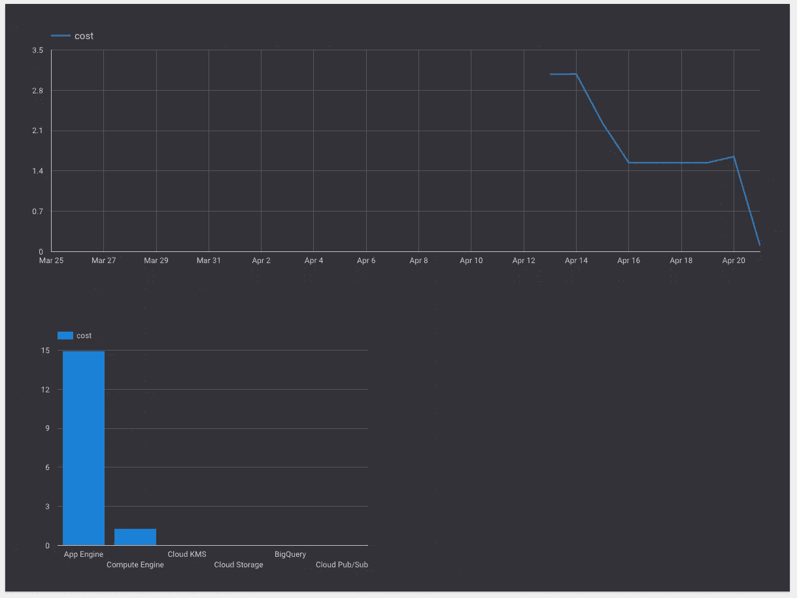
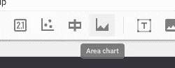
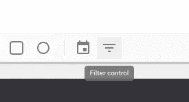
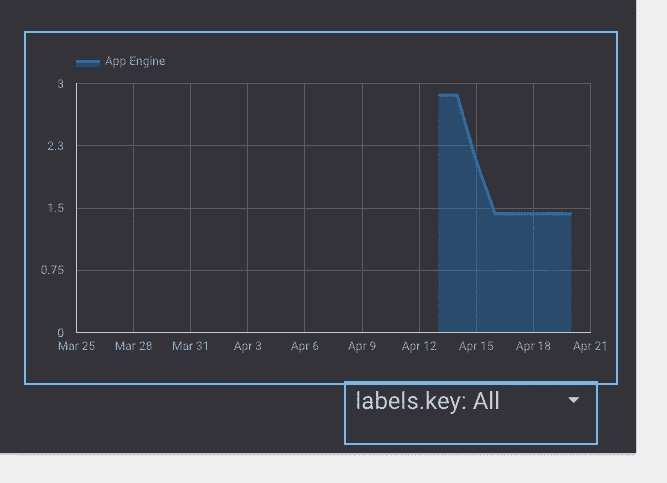
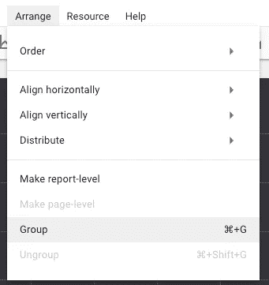

# 使用 BigQuery & Data Studio 分析您的 Google 云平台账单

> 原文：<https://medium.com/google-cloud/analyze-your-google-cloud-platform-bills-w-bigquery-data-studio-7c9ebeb31b56?source=collection_archive---------0----------------------->

至少可以说，目前谷歌云平台(GCP)的详细账单交易视图还处于起步阶段。它可以使用一些改进来帮助你了解你的钱去了哪里，这个指南告诉你如何解决这个问题。

我们将构建这个(或更好的东西):

谷歌数据工作室成本分析

由此可知:

详细交易视图

如果你读过我以前在 GCP 的帖子(这里是和[这里是](/@mediocrity/scaling-google-app-engine-to-no-instances-or-maybe-just-1-37be4e8d4230))，你会注意到我已经开始在他们的服务上花一些小额美元了。如果你选择做同样的事情(或者花大笔的钱)，你可能会想要比你收到的账单所提供的更多的数据，而当前的界面可以提供更多的数据。本操作指南将引导您设置 Data Studio，开始用 BigQuery 中导出的数据分析您的账单。

# 费用

在我们进入 BigQuery 和 Data Studio 之前，先简单说一下成本。*数据工作室*的费用目前**免费**，甜！ *BigQuery* 的成本稍微复杂一点(见[此处](https://cloud.google.com/bigquery/pricing))。

截至撰写本文时，BigQuery 存储了 0.02 美元/克，插入了 0.05 美元/克的流，查询了 5 美元/吨。我目前的 GCP 账单大约是 MB/m，这将使我每月花费几分钱(如果不是免费的话)。即使您运行数千个实例，并利用 GCP 的几个产品，您的账单仍可能只是低阶 GB/m(但请计算一下！).在这种情况下，存储数据、检索数据、甚至查询数据仍然非常便宜(假设您不是每秒都在查询，只是每天或每周查看报告)。

# 演员表

在**计费** > **交易**下，您将可以访问所使用的资源类型、时间段总计(到目前为止的第一个月)、总使用量以及总成本。从下面的截图中，您可以立即看到如何限制您的账单视图。

例如，如果您运行*多个* App Engine 应用程序，您将无法进一步分解它。

在 GCP 界面中，您可以看到的最详细的账单是详细交易视图:

详细交易视图

那么接下来该怎么办呢？有几个选择。大多数人会希望启用**账单导出**，这样他们就可以获得每日的详细账单(文件),可以像在 MS Excel 或他们熟悉的任何工具中进行传统分析那样进行更详细的分析。要启用，只需从计费菜单跳到**计费导出**项，点击对话框。

还有一个 **BigQuery 导出**，这是我们将关注的地方，因为它更容易/更简单，更可持续，并且有了 Data Studio，更符合逻辑。

对于**文件导出**，需要一天时间才能出现在您设置/指定的存储桶中(必须提前创建)。一旦有了，你就可以下载来查看。

对于 **BigQuery 导出**，您需要首先创建一个数据集。遵循对话框，在 BigQuery UI 中，单击您的**项目名称** > **右侧的小向下箭头，创建新数据集**。给它一个名称、位置和数据有效期。

创建新数据集

创建数据集

完成后，返回计费界面并**启用 BigQuery 导出**。

> 当您启用这两个选项中的任何一个时，显然会有与 GCS(存储)和 BigQuery 相关联的成本，并且您可能希望在启用之前查看这些成本，如上面的成本一节中所讨论的。

几个小时后，您将开始看到 BigQuery 表，而对于文件导出，您可能需要等待一夜。两个导出都没有回填，因为这是**严格前移**。如果你想分析以前的成本，不幸的是你无能为力。

# 分析成本:BigQuery w/Data Studio

在 BigQuery 中，你可以对你的成本数据做很多事情，我相信大公司有一套他们在某个时间间隔参考的视图。至于我的用例，我想了解两个项目:

1.  我一天的费用是多少？
2.  每个 GAE 应用程序的成本是多少？

> 这些问题大部分的副文是“你能在哪里省钱？你能关什么？”我不打算在这个指南中讨论这个问题。

在查看工具来回答这个问题以确保我没有重新创建轮子时，我遇到了 Google Data Studio ( [链接](https://www.google.com/analytics/data-studio/))。这看起来像是一个测试版产品，有一个用于可视化数据的 BigQuery 连接器。本教程的开头也很好地记录在谷歌的例子([链接](https://cloud.google.com/bigquery/docs/visualize-data-studio))中，你更喜欢在那里跟随它。

点击**注册**按钮后，你会进入一个有点熟悉的 Google Drive 界面，尽管还有一些选项。

Google Data Studio 登录页面

要创建我们的第一个报告，请单击右下角的+按钮，并回答入门提示。完成后，您必须再次单击它。

右下方:**新建数据源> BigQuery >授权>我的项目>YOUR _ PROJECT>YOUR _ DATASET(billing)>GCP _ billing _ export _ FOO>Connect**。

创建新数据源

一旦选择了 Connect，字段名应该以正确的*类型*和*聚合*显示出来。选择右上角的**添加到报告**，您应该不需要做任何更改。

连接编辑屏幕

你需要授权 **Google Drive** ，然后它会让你继续。

此时你的面前将会出现一张空白的画布，多么令人兴奋！

空白画布

让我们从做三件事开始:

1.  给报表起一个名字: **GCP 成本汇总**
2.  将主题更改为**简单暗**
3.  创建您的第一个元素，一个**按天计算的成本时间序列**

对于名称，点击左上方的**无标题报告**并将其更新为 **GCP 成本汇总**。

报表名称

对于主题，在右边栏中选择主题，并将其从**简单**更改为**简单暗**。

主题选择

对于第一个元素，单击菜单栏中的**时间序列**按钮，然后单击报告画布的左上角，并拖动到中间偏右的位置，在画布的上半部分创建一个图表。

时间序列

第一时间序列

如果你跟我有点像，你的脑子可能刚刚爆炸了一点点[插入烦人的 GIF]。正如你所看到的，刚刚发生了很多奇迹。不知何故，选择了正确的**尺寸**和**公制**来绘制该元素。这显然是未来。哇哦。印象深刻。</end 赞>

在右边的栏中，注意已经为您选择了时间维度和成本指标/字段！

右侧栏

这里没有太多需要修改的地方，因为您现在有了一个按天计算的**成本时间序列**。您可以浏览右边栏上的选项，将日期范围调整为自定义或以前的时间段，添加额外的过滤，如果您愿意，还可以在 Style 选项卡上疯狂一点。对我来说，我会让它保持原样，因为这对我来说已经足够好了。

现在我们已经实现了第一个目标，让我们添加一个每项服务的成本图表，以便直观地显示我们在 GAE 和 GCE 上的花费。为此，我们将选择一个条形图，因为我认为这样看起来最好。并单击/拖动以在左下四分之一面板中创建它。

条形图

完整条形图

喔，刚刚发生了什么？它是否完全按照我的意图选择了维度和度量，而不必手动选择它们？魔法。绝对神奇。

同样，您可以使用“样式”选项卡对此进行进一步的更改，但此时这对我来说没问题。

我们的画布/报告在这一点上看起来非常棒:

帆布

但是现在我们看到我们在 GAE 的花费是 GCE 的 5 倍，所以我们需要更多关于 GAE 的信息，让我们对我们的钱的去向感到温暖和模糊。要做到这一点，还需要一个要素。

# 通过 GAE 应用程序过滤

如果您在单个项目和单个计费协议下运行多个 GAE 应用程序，您最终会希望将它们拆分到您的账单上。这可能最容易通过使用单独的项目和/或计费协议来完成，但是最终，由于各种原因(网络配置、开发人员的易用性等)，将它们移动到单独的项目可能没有意义或者可能太困难。

为了能够按应用程序进行过滤，我们需要查看哪些数据可用于过滤。这需要查看自动导出的字段中的数据。

前往 BigQuery 界面(看起来像 2010 年，不要害怕):[https://bigquery.cloud.google.com](https://bigquery.cloud.google.com)。

在左侧选择您的**账单**表和**数据集**:

左栏

在页面顶部，选择**预览**:

试映

您现在看到的原始表格是您的账单数据。您将看到以 1 小时开始/结束时间为增量的每项服务的条目。因为我们只关注 App Engine，所以让我们编写一个查询来过滤这些条目。您可能已经注意到，字段名是**产品**。

在右上角，选择**查询表**并尝试如下查询:

由于成本和结束时间没有同时排序，因此可能有点难以理解，所以让我们添加更多排序:

非常酷，所以您现在可以以某种易于理解的方式查看原始账单数据。对我来说，可能还有其他人，这有点启发性。

费用数据

如 **labels_key** 列所示，我最大的成本是单个应用的灵活实例核心小时数。成本减半的原因是因为我在这里[写的帖子](/@mediocrity/scaling-google-app-engine-to-no-instances-or-maybe-just-1-37be4e8d4230)，我将它从两个实例缩减为一个实例，因为这是这个应用程序所需要的。

如果您使用底部的“下一步”按钮向前滚动您的账单，如果您运行标准环境实例，您会注意到一些有趣的事情..没有**标签 _ 键值**。这似乎是个问题。我已经向[谷歌云](https://medium.com/u/4f3f4ee0f977?source=post_page-----7c9ebeb31b56--------------------------------)评论了这件事([推特](https://twitter.com/mediocrity/status/855839890105188352))。我们现在不会解决这个问题。

即使没有标准环境标签，我们的大部分成本也是在灵活实例核心时间内，所以(对我来说)没多大关系。

现在我们已经了解了这些列，我们可以回到画布上再构建一个图表，给出每个 GAE 灵活环境应用程序的成本。因为我们还没有使用面积图，所以让我们使用它(稍后当我们想要堆叠每个应用程序的成本时，它可能也会有所帮助)。

对比图

在右下方的剩余空间绘制图表，但在图表下方留出约 1 英寸，因为我们将添加一个控件。

全面积图

让我们首先添加一个过滤器，只显示应用引擎成本。选择图表后，选择右边栏中的**添加过滤器**按钮。

添加过滤器

**在底部创建一个过滤器**按钮。为过滤器创建一个名称(仅应用引擎)，设置为**包含**、**产品**、**等于**和**应用引擎**。

创建过滤器

完成后，单击右下角的保存。它会自动将过滤器应用到图表中，您现在只会看到每天的**应用引擎**成本。

每天的应用引擎成本

那么每个 GAE 应用程序的查看呢？为此，我们将添加一个**滤镜控件**。从菜单栏中选择它(一直到右边)，并将其放在画布的右下角。

过滤控制

过滤器控制放置

选择过滤器控件，取消选择右边栏中的**显示值**，将尺寸从**产品**更改为**标签。另外，在样式选项卡中，选择**可展开**。**

此时，它应该看起来像这样:

过滤控制

此时，您可能会注意到，到目前为止，您一直处于**编辑**视图中。我们将切换到非编辑视图，看看这个控件是如何工作的。在右上角，选择**视图**。

视角

视角

如果您单击右下角的可扩展过滤器控件，您可以选择/取消选择您的灵活环境 GAE 应用程序。

过滤控制

但是你会很快注意到一个问题，它改变了所有的图表，而不仅仅是右下角。要解决这个问题，我们需要将控件设置为*only* control 右下角的图形。为此，返回到**编辑**视图。

选择**和**过滤控件和右下方的面积图。进入菜单栏中的**排列**菜单，选择**组**。

选择两者

排列>群组

现在回到**视图**模式，注意它现在像预期的那样*只*控制右下角的面积图。

> 如果您想对面积图进行任何样式更改，这有点烦人，您需要**取消** / **组**的组合。一开始就选择你的风格来避免这种烦恼。

# 总结

您可以非常容易、快速、廉价地从 GCP 账单中的详细交易视图转到对您个人或您的企业更有用、更有价值的视图。只需点击几次，每月花费几便士，你就可以创建一份人们可以查看的报告。我希望这是有趣的、有见地的和/或有帮助的，请随时在 [Twitter](https://twitter.com/mediocrity) 上告诉我。

疯狂的颜色

# 可选评论

> *对我来说，公共云提供商花在计费界面、可见性和数据可用性上的时间如此之少，实在令人震惊。这显然不是他们的核心产品，而且显然存在反向激励(想想吧:邪恶)，但更道德的做法是提供更好的可见性，让人们知道你的钱去了哪里:如何去以及为什么去。*
> 
> *当您购买物理服务器时，成本是显而易见的。运输、机架安装/堆叠及其插入的设备都有明确的成本。另外，电力、暖通等等也给你发账单。*
> 
> *AWS Cost Explorer 于 2014 年左右在 IIRC 推出，此前几年毫无用处，不幸的是，GCP 在没有初始成本探索工具的情况下延续了这一趋势。*
> 
> *你可以为每个项目建立一个单独的计费协议，但这在一个到处都有数百个 node.js 和 mongos 的微服务架构中没有意义。从逻辑上来说，如果一个人(或团队)有几个组成单个堆栈的服务，他们想在一个地方查看，这几乎是不可能的。*

**</自以为是的公有云计费评论>**